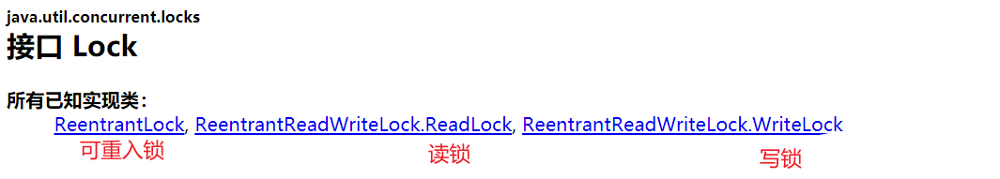
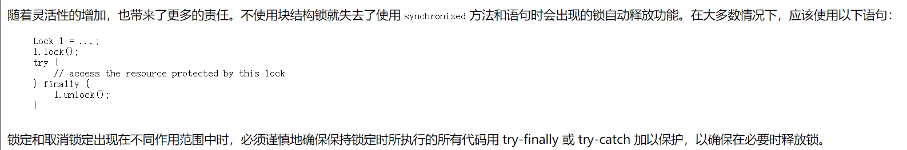

## 1、简介

官方文档地址：https://tool.oschina.net/apidocs/apidoc?api=jdk-zh

**使用方法**：`创建锁`、`加锁`、`业务代码`、`解锁`

## 2、和Synchronized的区别

* `Synchronized`是内置的关键字，`Lock`是一个Java类

* `Synchronized`无法判断锁的状态，`Lock`可以判断是否获取到了锁

* `Synchronized`会自动释放锁，`Lock`需要手动释放锁（如果不释放锁，会造成死锁）

* 假如有两个线程：线程1、线程2；线程1获得了锁

    1. `Synchronized`：如果线程1阻塞了，线程2就会一直等待，造成死锁

    2. `Lock`：如果线程1阻塞了，线程2不会一直等待，可以通过`trylock()`方法尝试获取锁

* 两者都是可重入锁，但是`Synchronized`不可中断，为非公平锁；而`Lock`锁可判断锁状态，并且可以设置为公平锁/非公平锁

* `Synchronized`适合锁少量代码同步代码，`Lock`适合锁大量代码同步代码