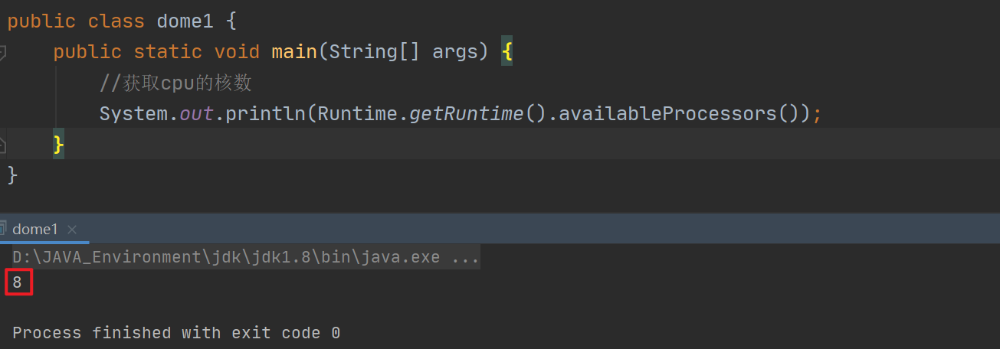
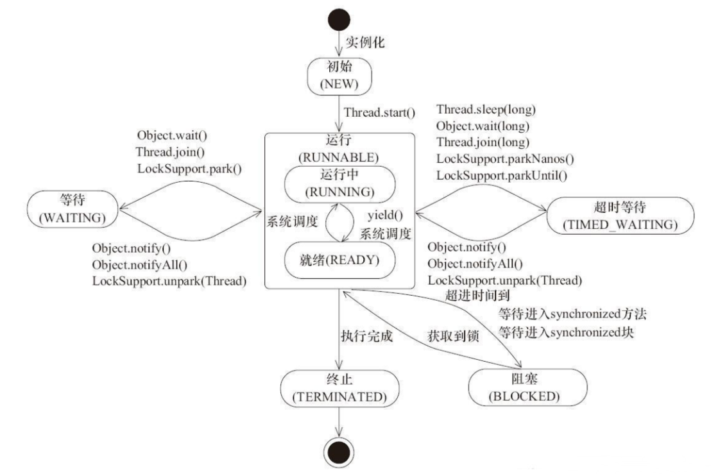
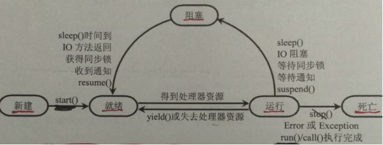

## 1、进程和线程

**进程是程序的一次执行过程，包含进程控制块、程序段、数据三部分**

**动态性**

* 动态性是进程最基本的特征，表现为：由创建而产生，由调度而执行，得不到资源而暂停执行，由撤销而消亡；有一定的生命周期
* 程序只是一组有序的指令集合

**并发性**

* 引入进程的目的就是和其他进程能并发执行
* 程序不能并发执行

**独立性**

* 进程实体是一个能独立运行的基本单位，是系统中独立获得资源和独立调度的基本单位
* 程序不能作为一个独立的单位进行运行

## 2、Java默认有两个进程

`Main`和`GC`

## 3、Java能够开启线程吗？

不行，Java是通过`native`本地方法调底层C++写的方法，Java无法直接操作硬件

## 4、并发和并行

* **并发**：多个事件在同一时间间隔内发生（cpu一核，模拟出来多条线程快速交替运行）
* **并行**：多个事件在同一时刻发生（cpu多核，多个线程可以同时执行）



## 5、Java线程的状态

| 状态                       | 	描述                                  |
|--------------------------|--------------------------------------|
| **初始**`NEW`              | 	尚未启动的线程处于此状态                        |
| **运行**`RUNNABLE`	        | 在Java虚拟机中执行的线程处于此状态                  |
| **阻塞**`BLOCKED`          | 	被阻塞等待监视器锁定的线程处于此状态（IO操作，wait，juc锁定） |
| **等待**`WAITING`	         | 进入该状态的线程需要等待其他线程做出一些特定动作（通知或中断）。     |
| **超时等待**`TIMED_WAITING`	 | 该状态不同于WAITING，它可以在指定的时间后自行返回。        |
| **终止**`TERMINATED`	      | 表示该线程已经执行完毕。                         |



:::warning 注意

与Java线程状态不同的是，操作系统的线程状态为5种：

| 状态                  | 	描述                                                                                    |
|---------------------|----------------------------------------------------------------------------------------|
| **新建**`NEW`         | 	 当用new操作符创建一个线程时， 例如new Thread(r)，线程还没有开始运行，此时线程处在新建状态。                               |
| **就绪**`RUNNABLE`	   | 当start()方法返回后，线程就处于就绪状态。 处于就绪状态的线程并不一定立即运行run()方法，线程还必须同其他线程竞争CPU时间片，只有获得CPU时间片才可以运行线程。 |
| **运行**`RUNNING`     | 	当线程获得CPU时间后，它才进入运行状态，真正开始执行run()方法。                          |
| **阻塞**`BLOCKED`     | 	被阻塞等待监视器锁定的线程处于此状态                             |
| **死亡**`Dead`	 | 表示该线程已经执行完毕。        |



:::

## 6、wait和sleep的区别

* `sleep`不释放锁，`wait`释放锁
* 来自不同的类：`sleep()`函数在Thread类中，`wait()`函数属于Object类
* 使用范围不同：`sleep`可以在任何地方使用，`wait`只能使用在同步代码块中

详情移步：[wait和sleep的区别](/Java/JUC/并发编程/wait和sleep的区别)

## 7、什么是可重入锁

可重入，就是可以重复获取相同的锁而不会出现死锁；`synchronized`和`ReentrantLock`都是可重入的

```java
// 演示可重入锁是什么意思，可重入，就是可以重复获取相同的锁
// synchronized和ReentrantLock都是可重入的
// 可重入降低了编程复杂性
public class WhatReentrant {
    public static void main(String[] args) {
        new Thread(new Runnable() {
            @Override
            public void run() {
                synchronized (this) {
                    System.out.println("第1次获取锁，这个锁是：" + this);
                    int index = 1;
                    while (true) {
                        synchronized (this) {
                            System.out.println("第" + (++index) + "次获取锁，这个锁是：" + this);
                        }
                        if (index == 10) {
                            break;
                        }
                    }
                }
            }
        }).start();
    }
}
```


