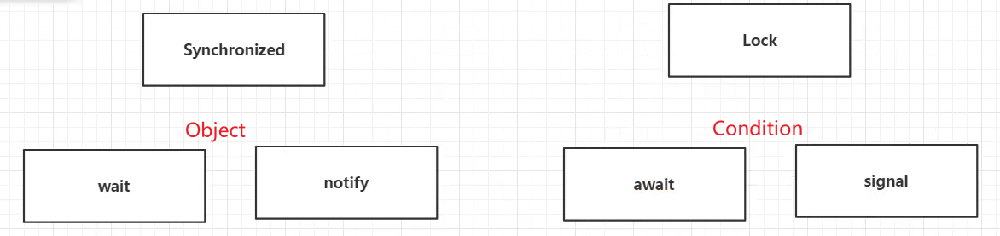
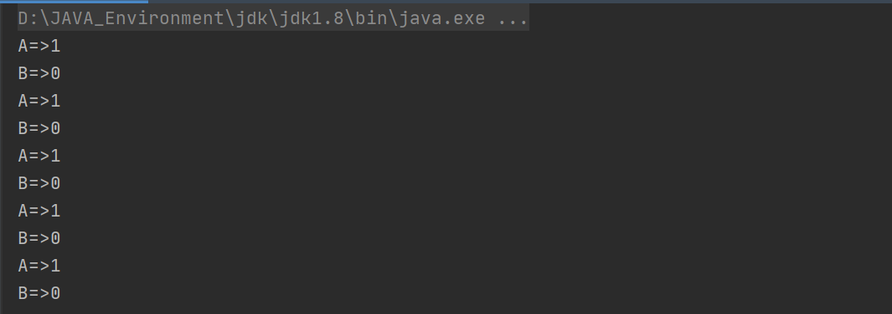
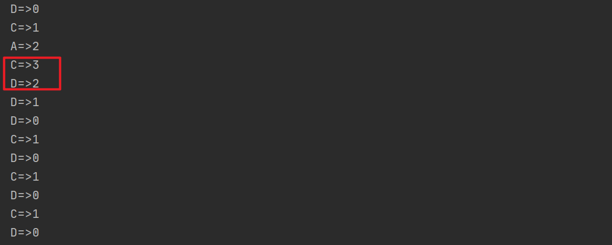
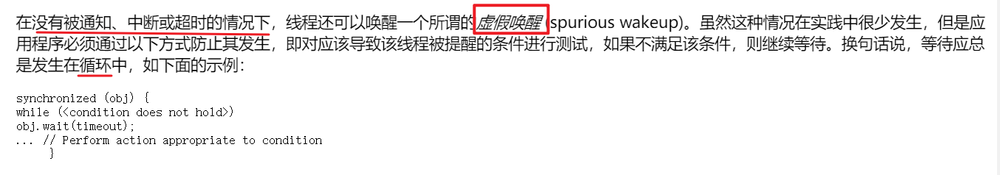
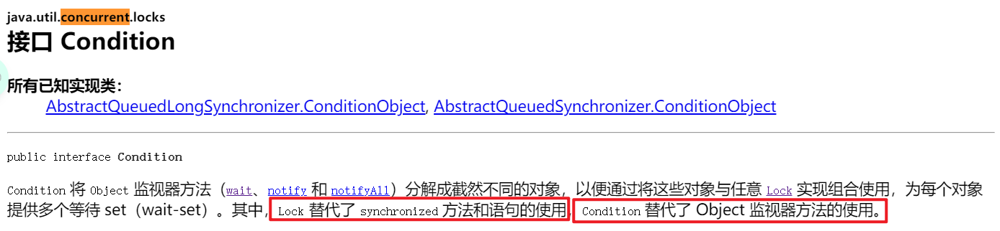
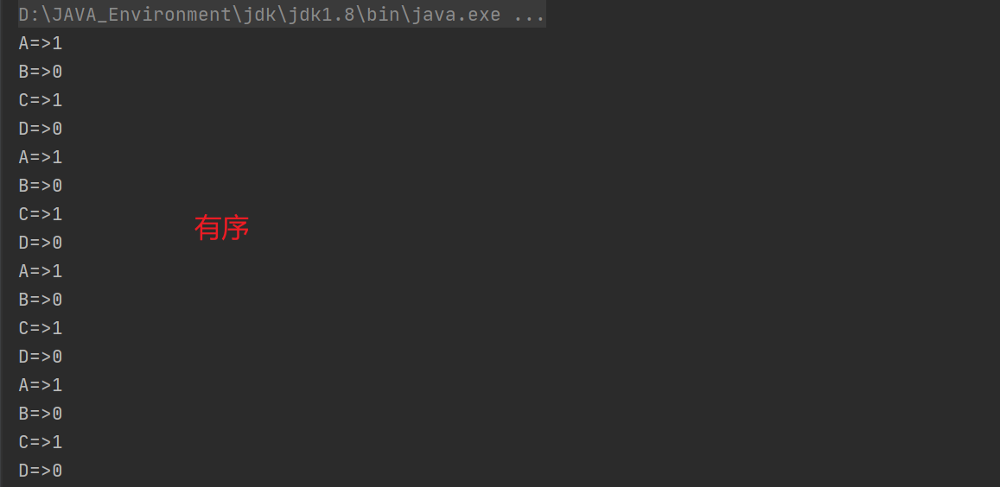

生产者消费者——线程之间的通信问题

* 通过`Synchronized`实现，我们常用 `object.wait() + Object.notify()`
* 通过`Lock`怎么实现呢，用 `condition.await() + condition.signal()`



## 1、Synchronized实现

两个线程A、B实现： 如果number不等于0，则number-1；如果number等于0，则number+1

```java
public class communicate {
    public static void main(String[] args) {
        Data data = new Data();
        new Thread(() -> {
            for (int i = 0; i < 5; i++) {
                try {
                    data.plus();
                } catch (InterruptedException e) {
                    e.printStackTrace();
                }
            }
        }, "A").start();
        new Thread(() -> {
            for (int i = 0; i < 5; i++) {
                try {
                    data.minor();
                } catch (InterruptedException e) {
                    e.printStackTrace();
                }
            }
        }, "B").start();
    }
}

class Data {
    private int number = 0;

    //如果number=0,则number+1
    public synchronized void plus() throws InterruptedException {
        if (number != 0)
            this.wait();//等待
        number++;
        System.out.println(Thread.currentThread().getName() + "=>" + number);
        this.notifyAll();//唤醒其他线程
    }

    //如果number!=0,则number-1
    public synchronized void minor() throws InterruptedException {
        if (number == 0)
            this.wait();
        number--;
        System.out.println(Thread.currentThread().getName() + "=>" + number);
        this.notifyAll();//唤醒其他线程
    }
}
```

结果：



### 虚假唤醒问题

如果再加两个线程呢？

```java
public static void main(String[] args) {
    Data data = new Data();
    new Thread(() -> {
        for (int i = 0; i < 5; i++) {
            try {
                data.plus();
            } catch (InterruptedException e) {
                e.printStackTrace();
            }
        }
    }, "A").start();
    new Thread(() -> {
        for (int i = 0; i < 5; i++) {
            try {
                data.minor();
            } catch (InterruptedException e) {
                e.printStackTrace();
            }
        }
    }, "B").start();
    new Thread(() -> {
        for (int i = 0; i < 5; i++) {
            try {
                data.plus();
            } catch (InterruptedException e) {
                e.printStackTrace();
            }
        }
    }, "C").start();
    new Thread(() -> {
        for (int i = 0; i < 5; i++) {
            try {
                data.minor();
            } catch (InterruptedException e) {
                e.printStackTrace();
            }
        }
    }, "D").start();
}
}
```

看结果，会出现2、3的情况；这就是因为if判断只判断一次，两个线程可能同时+1；造成了**虚假唤醒**的问题





修改代码：if判断改成while判断

```java
class Data {
    private int number = 0;

    //如果number=0,则number+1
    public synchronized void plus() throws InterruptedException {
        while (number != 0)
            this.wait();//等待
        number++;
        System.out.println(Thread.currentThread().getName() + "=>" + number);
        this.notifyAll();//唤醒其他线程
    }

    //如果number!=0,则number-1
    public synchronized void minor() throws InterruptedException {
        while (number == 0)
            this.wait();
        number--;
        System.out.println(Thread.currentThread().getName() + "=>" + number);
        this.notifyAll();//唤醒其他线程
    }
}
```

## 2、Lock实现



修改代码：

```java
import java.util.concurrent.locks.Condition;
import java.util.concurrent.locks.Lock;
import java.util.concurrent.locks.ReentrantLock;

public class communicate2 {
    public static void main(String[] args) {
        Data2 data = new Data2();
        new Thread(() -> {
            for (int i = 0; i < 10; i++) {
                try {
                    data.plus();
                } catch (InterruptedException e) {
                    e.printStackTrace();
                }
            }
        }, "A").start();
        new Thread(() -> {
            for (int i = 0; i < 10; i++) {
                try {
                    data.minor();
                } catch (InterruptedException e) {
                    e.printStackTrace();
                }
            }
        }, "B").start();
        new Thread(() -> {
            for (int i = 0; i < 10; i++) {
                try {
                    data.plus();
                } catch (InterruptedException e) {
                    e.printStackTrace();
                }
            }
        }, "C").start();
        new Thread(() -> {
            for (int i = 0; i < 10; i++) {
                try {
                    data.minor();
                } catch (InterruptedException e) {
                    e.printStackTrace();
                }
            }
        }, "D").start();
    }
}

class Data2 {
    private int number = 0;
    //创建Lock锁
    private Lock lock = new ReentrantLock();
    //获得condition
    Condition condition = lock.newCondition();

    //如果number=0,则number+1
    public void plus() throws InterruptedException {
        lock.lock();//加锁
        try {
            while (number != 0)
                condition.await();//等待
            number++;
            System.out.println(Thread.currentThread().getName() + "=>" + number);
            condition.signalAll();//唤醒其他线程
        } catch (InterruptedException e) {
            e.printStackTrace();
        } finally {
            lock.unlock();//解锁
        }
    }

    //如果number!=0,则number-1
    public void minor() throws InterruptedException {
        lock.lock();
        try {
            while (number == 0)
                condition.await();
            number--;
            System.out.println(Thread.currentThread().getName() + "=>" + number);
            condition.signalAll();//唤醒其他线程
        } catch (InterruptedException e) {
            e.printStackTrace();
        } finally {
            lock.unlock();
        }
    }
}
```


根据结果，成功实现！但是发现一个问题，线程的执行都是随机的，怎么进行有序的实现呢？A=>B=>C=>D

### Condition精准通知唤醒

可以设置多个`condition`监视器，每个监视器监视一个线程，精确等待唤醒某个线程

```java
import java.util.concurrent.locks.Condition;
import java.util.concurrent.locks.Lock;
import java.util.concurrent.locks.ReentrantLock;

public class communicate3 {
    public static void main(String[] args) {
        Data3 data = new Data3();
        new Thread(() -> {
            for (int i = 0; i < 10; i++) {
                try {
                    data.plus();
                } catch (InterruptedException e) {
                    e.printStackTrace();
                }
            }
        }, "A").start();
        new Thread(() -> {
            for (int i = 0; i < 10; i++) {
                try {
                    data.minor();
                } catch (InterruptedException e) {
                    e.printStackTrace();
                }
            }
        }, "B").start();
        new Thread(() -> {
            for (int i = 0; i < 10; i++) {
                try {
                    data.plus();
                } catch (InterruptedException e) {
                    e.printStackTrace();
                }
            }
        }, "C").start();
        new Thread(() -> {
            for (int i = 0; i < 10; i++) {
                try {
                    data.minor();
                } catch (InterruptedException e) {
                    e.printStackTrace();
                }
            }
        }, "D").start();
    }
}

class Data3 {
    private int number = 0;
    //创建Lock锁
    private Lock lock = new ReentrantLock();
    //获得condition
    Condition conditionA = lock.newCondition();
    Condition conditionB = lock.newCondition();
    Condition conditionC = lock.newCondition();
    Condition conditionD = lock.newCondition();

    //如果number=0,则number+1
    public void plus() throws InterruptedException {
        lock.lock();//加锁
        try {
            if (Thread.currentThread().getName()=="A") {
                while (number != 0)
                    conditionA.await();//A等待
                number++;
                System.out.println(Thread.currentThread().getName() + "=>" + number);
                conditionB.signal();//唤醒B线程
            }
            if (Thread.currentThread().getName()=="C") {
                while (number != 0)
                    conditionC.await();//C等待
                number++;
                System.out.println(Thread.currentThread().getName() + "=>" + number);
                conditionD.signal();//唤醒D线程
            }
        } catch (InterruptedException e) {
            e.printStackTrace();
        } finally {
            lock.unlock();//解锁
        }
    }

    //如果number!=0,则number-1
    public void minor() throws InterruptedException {
        lock.lock();
        try {
            if (Thread.currentThread().getName()=="B") {
                while (number == 0)
                    conditionB.await();//B等待
                number--;
                System.out.println(Thread.currentThread().getName() + "=>" + number);
                conditionC.signal();//唤醒C线程
            }
            if (Thread.currentThread().getName()=="D") {
                while (number == 0)
                    conditionD.await();//D等待
                number--;
                System.out.println(Thread.currentThread().getName() + "=>" + number);
                conditionA.signal();//唤醒A线程
            }
        } catch (InterruptedException e) {
            e.printStackTrace();
        } finally {
            lock.unlock();
        }
    }
}
```

结果：

