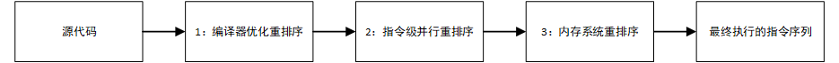

# 并发理论（一）：指令重排序和数据依赖性

## 为什么需要指令重排序？

现在的CPU一般采用流水线来执行指令。一个指令的执行被分成：`取指`、`译码`、`访存`、`执行`、`写回`等若干个阶段。然后，多条指令可以同时存在于流水线中，同时被执行。

指令流水线并不是串行的，并不会因为一个耗时很长的指令在“执行”阶段耗时很长时间，而导致后续的指令都卡在“执行”之前的阶段上。我们编写的程序都要经过优化后（编译器和处理器会对我们的程序进行优化以提高运行效率）才会被运行，
优化分为很多种，其中有一种优化叫做**重排序**，重排序需要遵守`as-if-serial`规则和`happens-before`规则，**重排序的目的是为了提升性能**。

## 重排序的分类

* 编译器优化的重排序。编译器在不改变单线程程序语义的前提下，可以重新安排语句的执行顺序；

* 指令级并行的重排序。现代处理器采用了指令级并行技术来将多条指令重叠执行。如果不存在数据依赖性，处理器可以改变语句对应机器指令的执行顺序；

* 内存系统的重排序。由于处理器使用缓存和读/写缓冲区，这使得加载和存储操作看上去可能是在乱序执行的。

## 重排序的过程



如图，1属于编译器重排序，而2和3统称为处理器重排序。这些重排序会导致线程安全的问题，一个很经典的例子就是DCL（双重检验锁）问题，这个在以后的文章中会具体去聊。

* 针对编译器重排序，Java内存模型（JMM）的编译器重排序规则会**禁止一些特定类型的编译器重排序**；
* 针对处理器重排序，编译器在生成指令序列的时候会**通过插入内存屏障指令来禁止某些特殊的处理器重排序**。

## 重排序对多线程的影响

先看以下一段代码：

```java
public class ReorderService {
    private static ThreadFactory namedThreadFactory = new ThreadFactoryBuilder().setNameFormat("ReorderService-%d").build();

    private static ExecutorService executorService = new ThreadPoolExecutor(5, 20, 1000L, TimeUnit.MILLISECONDS,
            new LinkedBlockingQueue<Runnable>(1024), namedThreadFactory, new ThreadPoolExecutor.DiscardOldestPolicy());

    public static void main(String[] args) {
        final ReorderModel model = new ReorderModel();
        int counter=5;
        for (int i = 0; i < counter; i++) {
            executorService.submit(new Runnable() {
                @Override
                public void run() {
                    model.writer();
                }
            });
            executorService.submit(new Runnable() {
                @Override
                public void run() {
                    model.reader();
                }
            });
        }
    }
}

class ReorderModel {
    private int a = 0;
    private boolean flag = false;

    void writer() {
        //操作1
        a = 1;
        //操作2
        flag = true;
    }

    void reader() {
        //操作3
        if (flag) {
            //操作4
            int i = a * a;
            System.out.println(i);
        } else {
            System.out.println("少侠露飞");
        }
    }
}
```

`flag`为标志位，表示a有没有被写入，当A线程执行 `writer` 方法，B线程执行 `reader` 方法，线程B在执行4操作的时候，能否看到线程A对a的写入操作？实践才是检验真理的唯一标准，让我们跑起代码看看结果。

我们进行了五次循环输出，结果每次都不尽相同，这里贴出其中一次的运行结果：

```text
1
1
1
少侠露飞
1
```

所以对于上述问题，答案已经很明显了。但这是为什么呢？

实际上**由于操作1和操作2没有数据依赖关系，编译器和处理器可以对这两个操作重排序。**

如果操作1和操作2做了重排序，程序执行时，线程A首先写标记变量 `flag`，随后线程 B 读这个变量。由于条件判断为真，线程 B 将读取变量a。此时，变量 a 还根本没有被线程 A 写入，
在这里多线程程序的语义被重排序破坏了！

## 数据依赖性

如果两个操作访问同一个变量，且这两个操作中有一个为写操作，此时这两个操作之间就存在数据依赖性。数据依赖分下列三种类型：

|名称	|代码示例	|说明|
|:--|:--|:--|
|读后写	|a = b;b = 1;	|读一个变量之后，再写这个变量。|
|写后读	|a = 1;b = a;	|写一个变量之后，再读这个变量。|
|写后写	|a = 1;a = 2;	|写一个变量之后，再写这个变量。|

**注意，这里所说的数据依赖性仅针对单个处理器中执行的指令序列和单个线程中执行的操作，不同处理器之间和不同线程之间的数据依赖性不被编译器和处理器考虑。**