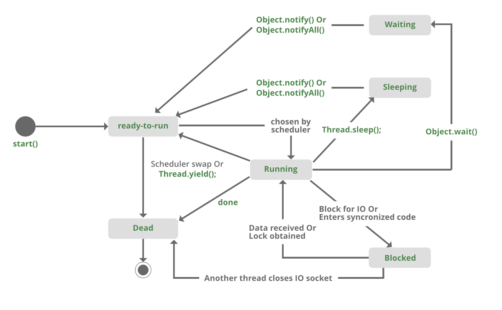

**Sleep()**：该方法用于将当前线程的执行暂停指定的时间（以毫秒为单位）。在这里，线程不会失去其对监视器的所有权并恢复其执行

**Wait()**：该方法在对象类中定义。它告诉调用线程（又名当前线程）等待，直到另一个线程调用该对象的`notify()`或`notifyAll()`
方法，该线程等待，直到它重新获得监视器的所有权并恢复执行。

|       Sleep()       |       Wait()        |
|:-------------------:|:-------------------:|
| Wait()方法属于Object类。	 | Sleep()方法属于Thread类。 |
|Wait() 方法在同步期间释放锁。	|Sleep() 方法在同步期间不会释放对象上的锁。|
|Wait() 只能从同步上下文中调用。	|无需从同步上下文中调用 Sleep()。|
|Wait() 不是静态方法。 |	Sleep() 是一个静态方法。|

> 至于wait()方法为什么要放在同步块中？详情移步：[wait()方法为什么要放在同步块中](/Java/JUC/并发编程/wait方法为什么要放在同步块中)

## sleep方法示例

```java
synchronized(monitor){
    Thread.sleep(1000);  //这里锁由当前线程持有
    //1000毫秒后，当前线程将被唤醒，或者在我们调用interrupt()方法之后
}
```

## wait方法示例

```java
synchronized(monitor){
    monitor.wait()  //这里锁被当前线程释放
}
```



```java
// Java program to demonstrate the difference 
// between wait and sleep 
 
class GfG{
   
    private static Object LOCK = new Object();
     
    public static void main(String[] args) throws InterruptedException {
      
        Thread.sleep(1000);
       
        System.out.println("Thread '" + Thread.currentThread().getName() +
          "' is woken after sleeping for 1 second");
      
        synchronized (LOCK) {
            LOCK.wait(1000);
           
            System.out.println("Object '" + LOCK + "' is woken after" +
              " waiting for 1 second");
        }
    }
}
```

Output:

```shell
Thread 'main' is woken after sleeping for 1 second
Object 'java.lang.Object@1d81eb93' is woken after waiting for 1 second
```