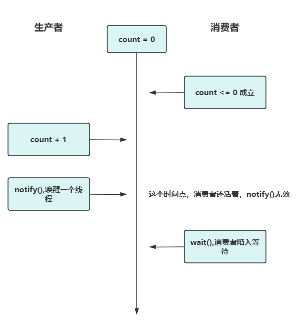

# Java中wait()方法为什么要放在同步块中？

## 关于问题

如果`wait()`方法不在同步块中，代码的确会抛出`IllegalMonitorStateException`:

```java
@Test
public void test() {
    try {
        new Object().wait();
    } catch (InterruptedException e) {
        e.printStackTrace();
    }
}
```

```shell
java.lang.IllegalMonitorStateException: current thread is not owner

	at java.base/java.lang.Object.wait(Native Method)
	at java.base/java.lang.Object.wait(Object.java:338)
	at com.zzz.springbootdemos.SpringbootDemosApplicationTests.contextLoads(SpringbootDemosApplicationTests.java:12)
	at java.base/java.lang.reflect.Method.invoke(Method.java:568)
	at java.base/java.util.ArrayList.forEach(ArrayList.java:1511)
	at java.base/java.util.ArrayList.forEach(ArrayList.java:1511)
```

## 说法一

### Lost Wake-Up Problem

事情得从一个多线程编程里面臭名昭著的问题`"Lost wake-up problem"`说起。

这个问题并不是说只在Java语言中会出现，而是会在所有的多线程环境下出现。

假如我们有两个线程，一个消费者线程，一个生产者线程。生产者线程的任务可以简化成先将count加一，而后唤醒消费者；消费者则是先将count减一，而后在减到0的时候陷入睡眠：

生产者伪代码：

```java
count+1;
notify();
```

消费者伪代码：

```java
while(count<=0)
   wait()

count--
```

这里面有问题。什么问题呢？

生产者是两个步骤：

1. `count+1;`
2. `notify();`

消费者也是两个步骤：

1. 检查count值；
2. 睡眠或者减一；

如果这些步骤混在一起会怎样呢？

比如说，初始的时候count等于0，这个时候消费者检查count的值，发现count小于等于0的条件成立；就在这个时候，发生了上下文切换，生产者进来了，噼噼啪啪一顿操作，把两个步骤都执行完了，
也就是发出了通知，准备唤醒一个线程。这个时候消费者刚决定睡觉，还没睡呢，所以这个通知就会被丢掉。紧接着，消费者就睡过去了，消费者成睡美人了。



这就是所谓的`lost wake up`问题。

### 尝试解决

问题的根源在于，消费者在检查count到调用`wait()`之间，count就可能被改掉了。

常见的解决方式是加锁，让消费者和生产者竞争一把锁，竞争到了的，才能够修改count的值。

我这里将两者的两个操作都放进去了同步块中，于是生产者的代码是:

```java
tryLock()

count+1

notify()

releaseLock()
```

消费者的代码是:

```java
tryLock()

while(count <= 0)
  wait()
  
count-1

releaseLock()
```

但是这样改后依旧会出现`lost wake up`问题，而且和无锁的表现是一样的。

### 最终解决

为了避免出现这种`lost wake up`问题，在这种模型之下，应该将我们的代码放进去的同步块中。

Java强制我们的`wait()/notify()`调用必须要在一个同步块中，就是不想让我们在不经意间出现这种`lost wake up`问题。

不仅仅是这两个方法，包括`java.util.concurrent.locks.Condition`的`await()/signal()`也必须要在同步块中：

```java
private ReentrantLock lock = new ReentrantLock();
private Condition condition = lock.newCondition();    

@Test
public void test2() {
    try {
        condition.signal();
    } catch (Exception e) {
        e.printStackTrace();
    }
}
```

```shell
java.lang.IllegalMonitorStateException
	at java.base/java.util.concurrent.locks.AbstractQueuedSynchronizer$ConditionObject.signal(AbstractQueuedSynchronizer.java:1473)
	at com.zzz.springbootdemos.SpringbootDemosApplicationTests.test2(SpringbootDemosApplicationTests.java:18)
	at java.base/jdk.internal.reflect.NativeMethodAccessorImpl.invoke0(Native Method)
```

准确的来说，即便是我们自己在实现自己的锁机制的时候，也应该要确保类似于`wait()`和`notify()`这种调用，要在同步块内，防止使用者出现`lost wake up`问题。

Java的这种检测是很严格的。它要求的是，一定要处于锁对象的同步块中。举例来说：

```java
private Object obj = new Object();
private Object anotherObj = new Object();
@Test
public void test3() {
    synchronized (obj) {
        try {
            anotherObj.notify();
        } catch (Exception e) {
            e.printStackTrace();
        }
    }
}
```
这样也是没什么用的。一样出现`IllegalMonitorStateException`。

```shell
java.lang.IllegalMonitorStateException: current thread is not owner
	at java.base/java.lang.Object.notify(Native Method)
```

## 说法二

规定`“把wait方法放在同步代码块中”`的原因，是因为调用`wait`方法时，会将线程放入**管程**的条件变量的等待队列中，Java的同步代码块中才会有管程存在，线程才能放入条件变量的等待队列中，
而同步代码块之外，不存在管程。