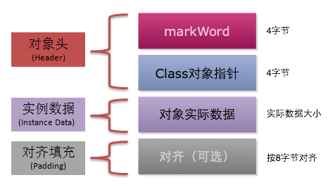
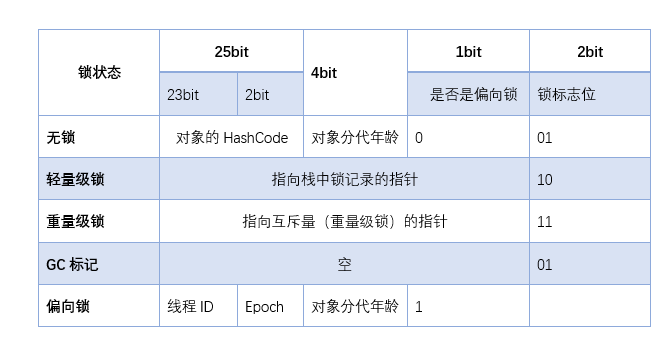
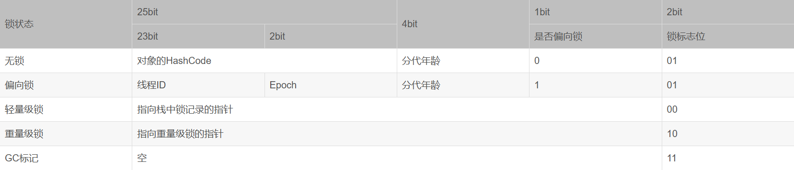
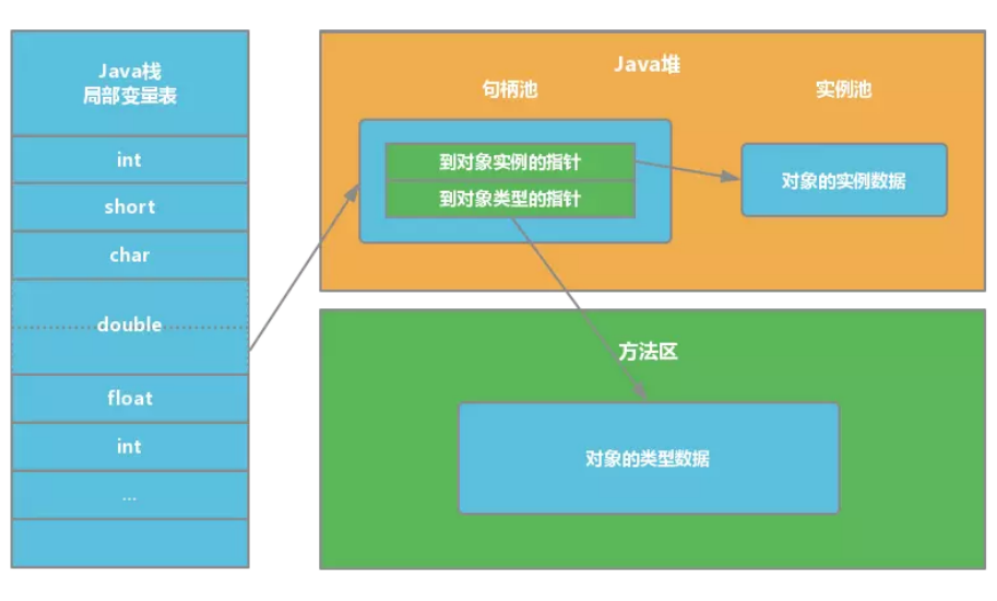
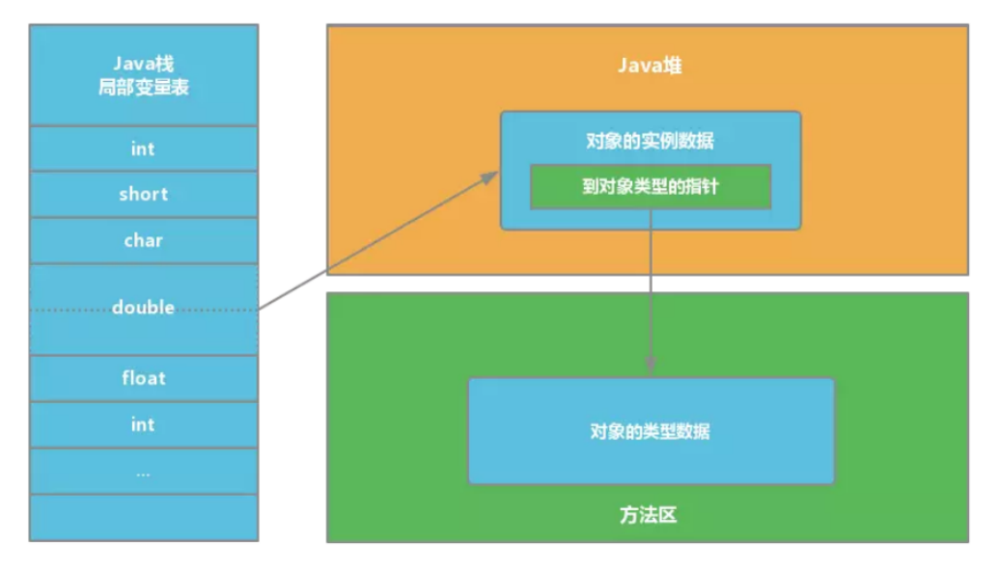
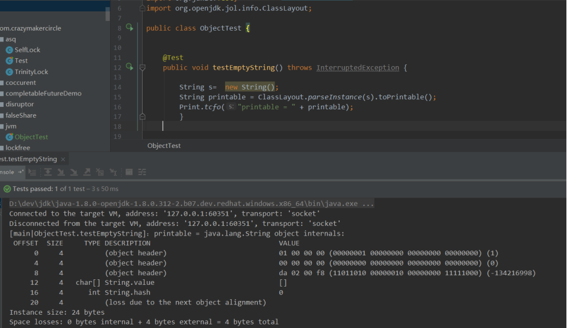
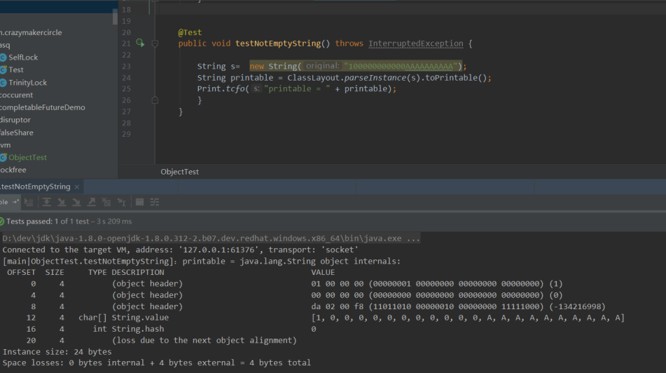

## 1、怎么计算出来一个对象的内存占用?



详情移步：[HotSpot虚拟机对象探秘](/Java/JVM/深入浅出JVM/HotSpot虚拟机对象探秘)

## 2、对象头中包含哪些部分？

对象头是java中对象都具有的属性，是jvm在编译和运行阶段读取的信息。对象头包含三个部分：

1. mark word
2. 指针向类的指针
3. 数组的长度（只有数组的对象用到）

这3个中最复杂的是`MarkWord`，`MarkWord`用于存储对象自身的运行时数据,如`哈希码（HashCode）`、`GC分代年龄`、`锁状态标志`、`线程持有的锁`、`偏向线程ID`、`偏向时间戳`等等。
在`32bit`的环境中，java头存储的信息如下:


或者另一张图：


JVM一般是这样使用锁和Mark Word的：

1. 当没有被当成锁时，这就是一个普通的对象，`Mark Word`记录对象的`HashCode`，锁标志位是`01`，是否偏向锁那一位是`0`。

2. 当对象被当做同步锁并有一个线程A抢到了锁时，锁标志位还是`01`，但是否偏向锁那一位改成`1`，前`23bit`记录抢到锁的线程`id`，表示进入`偏向锁状态`。

3. 当线程A再次试图来获得锁时，`JVM`发现同步锁对象的标志位是`01`，是否偏向锁是`1`，也就是`偏向状态`，`Mark Word`中记录的`线程id`就是线程A自己的`id`，表示线程A已经获得了这个偏向锁，可以执行同步锁的代码。

4. 当线程B试图获得这个锁时，`JVM`发现同步锁处于`偏向状态`，但是`Mark Word`中的线程id记录的不是B，那么线程B会先用`CAS`操作试图获得锁，这里的获得锁操作是有可能成功的，因为线程A一般不会自动释放偏向锁。如果抢锁成功，
就把`Mark Word`里的线程id改为线程B的id，代表线程B获得了这个偏向锁，可以执行同步锁代码。如果抢锁失败，则继续执行步骤5。

5. 偏向锁状态抢锁失败，代表当前锁有一定的竞争，偏向锁将升级为`轻量级锁`。`JVM`会在当前线程的线程栈中开辟一块单独的空间，里面保存指向对象锁`Mark Word`的指针，
同时在对象锁`Mark Word`中保存指向这片空间的指针。上述两个保存操作都是`CAS`操作，如果保存成功，代表线程抢到了同步锁，就把`Mark Word`中的锁标志位改成`00`，可以执行同步锁代码。
如果保存失败，表示抢锁失败，竞争太激烈，继续执行步骤6。

6. 轻量级锁抢锁失败，`JVM`会使用`自旋锁`，自旋锁不是一个锁状态，只是代表不断的重试，尝试抢锁。从`JDK1.7`开始，自旋锁默认启用，自旋次数由JVM决定。如果抢锁成功则执行同步锁代码，如果失败则继续执行步骤7。

7. 自旋锁重试之后如果抢锁依然失败，同步锁会升级至`重量级锁`，锁标志位改为`10`。在这个状态下，未抢到锁的线程都会被阻塞。

## 3、对象的访问定位?

Java 程序需要通过 JVM 栈上的引用访问堆中的具体对象。对象的访问方式取决于 JVM 虚拟机的实现。目前主流的访问方式有 `句柄` 和 `直接指针` 两种方式。

> 指针： 指向对象，代表一个对象在内存中的起始地址。
> 
> 句柄： 可以理解为指向指针的指针，维护着对象的指针。句柄不直接指向对象，而是指向对象的指针（句柄不发生变化，指向固定内存地址），再由对象的指针指向对象的真实内存地址。

### 句柄访问

Java 堆中划分出一块内存来作为`句柄池`，引用中存储对象的`句柄地址`，而句柄中包含了`对象实例数据`与`对象类型数据`各自的具体`地址信息`，具体构造如下图所示：



**优势**：引用中存储的是`稳定`的句柄地址，在对象被移动（垃圾收集时移动对象是非常普遍的行为）时只会改变句柄中的实例数据指针，而引用本身不需要修改。

### 直接指针

如果使用`直接指针`访问，`引用`中存储的直接就是`对象地址`，那么 Java 堆对象内部的布局中就必须考虑如何放置访问`类型数据`的相关信息。



**优势**：速度更快，节省了一次指针定位的时间开销。由于对象的访问在 Java 中非常频繁，因此这类开销积少成多后也是非常可观的执行成本。HotSpot 中采用的就是这种方式。

## 4、64位JVM中，int的长度是多数？

32 位和 64 位的 JVM 中，`int`类型变量的长度是相同的，都是`32位`或者`4个字节`。

## 5、Java中的String对象的大小

### 空String占用的空间



**当前内存大小是在默认开启压缩指针的条件下:**

* 对象头 `12`
* char[]数组引用 `4`
* int 类型 hash数据大小 `4`
* loss due to the next object alignment 对齐填充 `4`

**总结**：`24`

**我们来看看String类中的成员变量:**

```java
/** The value is used for character storage. */
private final char value[];
/** Cache the hash code for the string */
private int hash; // Default to 0
/** use serialVersionUID from JDK 1.0.2 for interoperability */
private static final long serialVersionUID = -6849794470754667710L;
```

### 非空String占用的空间



**当前内存大小是在默认开启压缩指针的条件下:**

* 对象头 `12`
* char[]数组引用 `4`
* int 类型 hash数据大小 `4`
* loss due to the next object alignment 对齐填充 `4`

**总结**：`24`

## 6、怎样通过Java程序来判断JVM是32位还是64位？

你可以检查某些系统属性如 `sun.arch.data.model` 或 `os.arch` 来获取该信息。

## 7、32位JVM和64位JVM的最大堆内存分别是多数？

理论上说上`32位`的`JVM堆内存`可以到达 `2^32`， 即 `4GB`，但实际上会比这个小很多。不同操作系统之间不同，如`Windows`系统大约`1.5GB`，`Solaris`大约`3GB`。

`64`位`JVM`允许指定最大的堆内存，理论上可以达到 `2^64`，这是一个非常大的数字，实际上你可以指定堆内存大小到`100GB`。甚至有的 `JVM`，如`Azul`，堆内存到`1000G`都是可能的。

## 8、JRE、JDK、JVM及JIT之间有什么不同？

* `JRE` 代表 Java 运行时（`Java run-time`），是运行 Java 引用所必须的。

* `JDK` 代表 Java 开发工具（`Java development kit`），是 Java 程序的开发工具，如 `Java编译器`，它也包含 `JRE`。

* `JVM` 代表 Java 虚拟机（`Java virtual machine`），它的责任是运行 Java 应用。

* `JIT` 代表即时编译（`Just In Time compilation`），当代码执行的次数超过一定的阈值时，会将 Java 字节码转换为本地代码，如，主要的热点代码会被准换为本地代码，这样有利大幅度提高 Java 应用的性能。