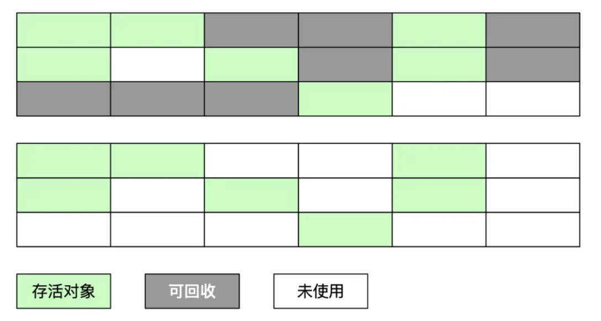
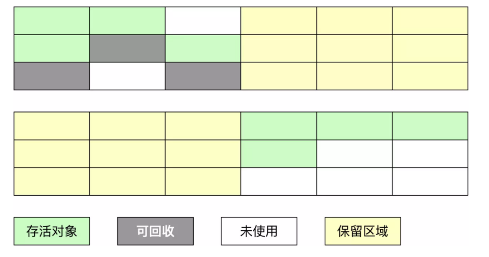
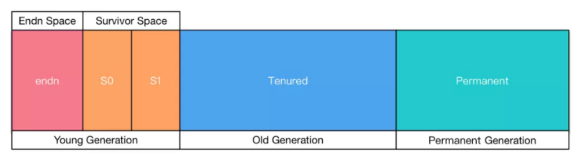

* **标记-清除算法**：标记无用对象，然后进行清除回收。缺点：效率不高，无法清除垃圾碎片。
* **复制算法**：按照容量划分二个大小相等的内存区域，当一块用完的时候将活着的对象复制到另一块上，然后再把已使用的内存空间一次清理掉。缺点：内存使用率不高，只有原来的一半。
* **标记-整理算法**：标记无用对象，让所有存活的对象都向一端移动，然后直接清除掉端边界以外的内存。
* **分代算法**：根据对象存活周期的不同将内存划分为几块，一般是新生代和老年代，**新生代基本采用复制算法，老年代采用标记整理算法**。

## 标记-清除算法

算法分为`“标记”`和`“清除”`阶段：首先标记出所有不需要回收的对象，在标记完成后统一回收掉所有没有被标记的对象。适用场合：存活对象较多的情况、`适用于年老代`。
标记-清除算法（`Mark-Sweep`）是一种常见的基础垃圾收集算法，它将垃圾收集分为两个阶段：

* 标记阶段：标记出可以回收的对象。
* 清除阶段：回收被标记的对象所占用的空间。

标记-清除算法的执行的过程如下图所示:

**优点**：实现简单，不需要对象进行移动。

**缺点**：

1. 空间问题，易产生内存碎片，当为一个大对象分配空间时可能会提前触发垃圾回收（例如，对象的大小大于空闲表中的每一块儿大小但是小于其中两块儿的和）。
2. 效率问题，扫描了整个空间两次（第一次：标记存活对象；第二次：清除没有标记的对象）。标记、清除过程效率低，产生大量不连续的内存碎片，提高了垃圾回收的频率。

**总之**：标记-清除算法之所以是基础的，是因为后面讲到的垃圾收集算法都是在此算法的基础上进行改进的。

## 标记-复制算法

为了解决标记-清除算法的效率不高的问题，产生了标记-复制算法。

**它把内存空间划为两个相等的区域，每次只使用其中一个区域**。垃圾收集时，遍历当前使用的区域，把存活对象复制到另外一个区域中，最后将当前使用的区域的可回收的对象进行回收。

复制算法的执行过程如下图所示:

**优点**：按顺序分配内存即可，实现简单、运行高效，不用考虑内存碎片。

**缺点**：可用的内存大小缩小为原来的一半，对象存活率高时会频繁进行复制。

## 标记-整理算法

在新生代中可以使用复制算法，但是在老年代就不能选择复制算法了，因为老年代的对象存活率会较高，这样会有较多的复制操作，导致效率变低。

标记-清除算法可以应用在老年代中，但是它效率不高，在内存回收后容易产生大量内存碎片。因此就出现了一种标记-整理算法（`Mark-Compact`）算法，与标记-整理算法不同的是，
在标记可回收的对象后将所有存活的对象压缩到内存的一端，使他们紧凑地排列在一起，然后对端边界以外的内存进行回收。回收后，已用和未用的内存都各自一边。

标记-整理算法的执行过程如下图所示:

**优点**：解决了标记-清理算法存在的内存碎片问题。

**缺点**：仍需要进行局部对象移动，一定程度上降低了效率。

**标记-整理算法适用场合**：存活对象较少的情况下比较高效、用于年轻代（即新生代）。

## 分代收集算法

分代收集法是目前大部分 JVM 所采用的方法，其核心思想是根据对象存活的不同生命周期将内存划分为不同的域，一般情况下将 GC 堆划分为老生代(`Tenured/Old Generation`)和新生代(`YoungGeneration`)。

`老生代`的特点是**每次垃圾回收时只有少量对象需要被回收**，`新生代`的特点是**每次垃圾回收时都有大量垃圾需要被回收**，因此可以根据不同区域选择不同的算法。

当前商业虚拟机都采用分代收集的垃圾收集算法。分代收集算法，顾名思义是根据对象的存活周期将内存划分为几块。一般包括`年轻代`、`老年代`和`永久代`，如图所示：

当前主流 VM 垃圾收集都采用”分代收集” (`Generational Collection`)算法, 这种算法会根据对象存活周期的不同将内存划分为几块, 如 JVM 中的 新生代、老年代、永久代， 
这样就可以根据各年代特点分别采用最适当的 GC 算法