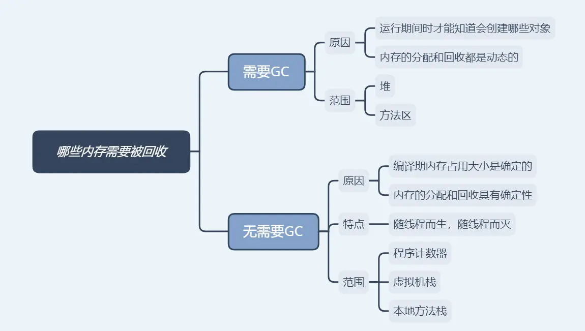

## 一、创建对象时触发GC的流程

这里重新回顾一下精美图文带你掌握 JVM 内存布局里面JVM创建一个新对象的内存分配流程图。这张图也描述了GC的流程。

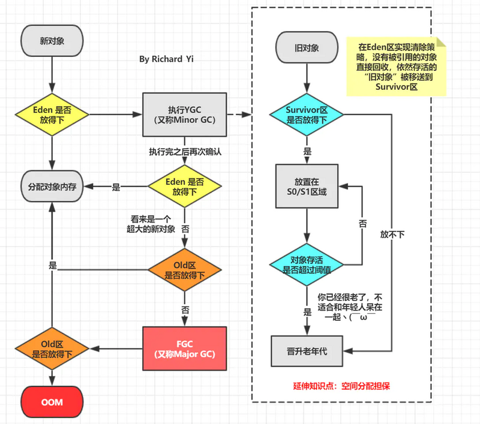

## 二、GC 术语

在学习垃圾收集器知识点之前，需要向读者们科普一些GC的术语，方便你们后面理解。

* **部分收集（Partial GC）**：指目标不是完整收集整个Java堆的垃圾收集，其中又分为：
* **新生代收集（Minor GC/Young GC）**：指目标只是新生代的垃圾收集。
* **老年代收集（Major GC/Old GC）**：指目标只是老年代的垃圾收集。目前只有CMS收集器会有单独收集老年代的行为。另外请注意`“Major GC”`这个说法现在有点混淆，在不同资料上常有不同所指，读者需按上下文区分到底是指老年代的收集还是整堆收集。
* **混合收集（Mixed GC）**：指目标是收集整个新生代以及部分老年代的垃圾收集。目前只有`G1收集器`会有这种行为。
* **整堆收集（Full GC）**：收集整个Java堆和方法区的垃圾收集。
* **并行（Parallel）**：在JVM运行时，同时存在应用程序线程和垃圾收集器线程。并行阶段是由多个 GC 线程执行，即 GC 工作在它们之间分配。串行（`Serial`）：串行阶段仅在单个 GC 线程上执行。
* **STW** ：`Stop The World` 阶段，应用程序线程被暂停，以便GC线程 执行其工作。当应用程序因为GC 暂停时，这通常是由于 `Stop The World` 阶段。
* **并发（Concurrent）**：用户线程与垃圾收集器线程同时执行，不一定是并行执行，可能是交替执行（竞争）
* **增量**：如果一个阶段是增量的，那么它可以运行一段时间之后由于某些条件提前终止，例如需要执行更高优先级的 GC 阶段，同时仍然完成生产性工作。增量阶段与需要完全完成的阶段形成鲜明对比。

## 三、垃圾收集器

知道了算法之后，自然而然我们到了JVM中对这些算法的实现和应用，即各种垃圾收集器（`Garbage Collector`）。

首先要认识到的一个重要方面是，对于大多数JVM，需要两种不同的GC算法，一种用于清理新生代，另一种用于清理老年代。

意思就是说，在JVM中你通常会看到两种收集器组合使用。下图是JVM 中所有的收集器（Java 8 ），其中有连线的就是可以组合的。

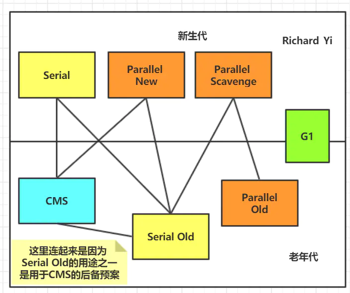

为了减小复杂性，快速记忆，我这边直接给出比较常用的几种组合。其他的要么是已经废弃了要么就是在现实情况下不实用的。

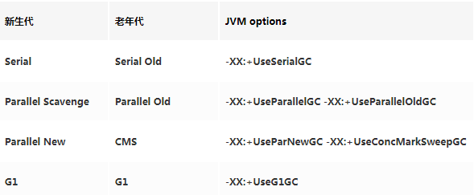

## 四、串行收集器

`Serial` 翻译过来可以理解成`单线程`。单线程收集器有 `Serial` 和 `Serial Old` 两种，它们的唯一区别就是：**Serial 工作在新生代，使用“复制”算法，Serial Old 工作在老年代，使用“标志-整理”算法**。所以这里将它们放在一起讲。

串行收集器收集器是最经典、最基础，也是最好理解的。它们的特点就是单线程运行及独占式运行，因此会带来很不好的用户体验。虽然它的收集方式对程序的运行并不友好，但由于它的单线程执行特性，应用于单个CPU硬件平台的性能可以超过其他的并行或并发处理器。

“单线程”的意义并不仅仅是说明它只会使用一个处理器或一条收集线程去完成垃圾收集工作，更重要的是强调在它进行垃圾收集时，必须暂停其他所有工作线程，直到它收集结束（STW阶段）。

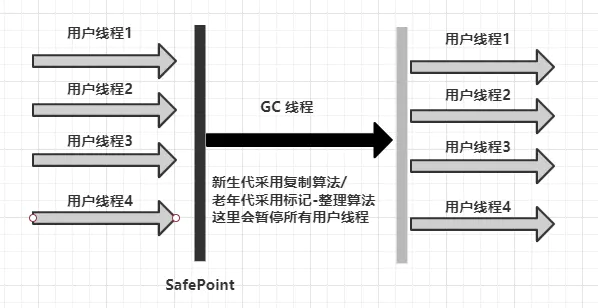

STW 会带给用户恶劣的体验，所以从JDK 1.3开始，HotSpot虚拟机开发团队为消除或者降低用户线程因垃圾收集而导致停顿的努力一直持续进行着，从`Serial`收集器到`Parallel`收集器，再到`Concurrent Mark Sweep（CMS）`和`Garbage First（G1）`收集器，
最终至现在垃圾收集器的最前沿成果`Shenandoah`和`ZGC`等。

虽然新的收集器很多，但是串行收集器仍有其适合的场景。迄今为止，它依然是HotSpot虚拟机运行在客户端模式下的默认新生代收集器，有着优于其他收集器的地方，那就是简单而高效。对于内存资源受限的环境，
它是所有收集器里额外内存消耗最小的，单线程没有线程交互开销。（这里实际上也是一个时间换空间的概念）

通过JVM参数 `-XX:+UseSerialGC` 可以使用串行垃圾回收器（上面表格也有说明）

## 五、并行收集器

按照程序发展的思路，单线程处理之后，下一步很自然就到了多核处理器时代，程序多线程并行处理的时代。并行收集器是多线程的收集器，在多核CPU下能够很好的提高收集性能。

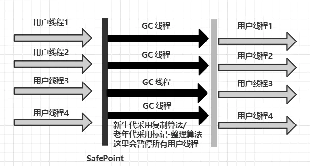

这里我们会介绍：

* **ParNew** : `Serial`收集器的多线程版本，基于“复制”算法，其他方面完全一样，在JDK9之后差不多退出历史舞台，只能配合CMS在JVM中发挥作用。
* **Parallel Scavenge** : 和`ParNew`收集器类似，基于“复制”算法，但前者更关注可控制的吞吐量，并且能够通过`-XX：+UseAdaptiveSizePolicy`打开垃圾收集自适应调节策略的开关。
* **Parallel Old** : `Parallel Scavenge` 收集器的老年代版本，基于“标记-整理”算法实现。

### 1、ParNew收集器

`ParNew`收集器除了支持多线程并行收集之外，其他与`Serial`收集器相比并没有太多创新之处，但它却是不少运行在服务端模式下的HotSpot虚拟机，尤其是JDK 7之前的遗留系统中首选的新生代收集器，
其中有一个与功能、性能无关但其实很重要的原因是：除了`Serial`收集器外，目前只有它能与CMS收集器配合工作。

但是从 `G1` 出来之后呢，`ParNew`的地位就变得微妙起来，自JDK 9开始，`ParNew`加`CMS`收集器的组合就不再是官方推荐的服务端模式下的收集器解决方案了。官方希望它能完全被`G1`所取代，
甚至还取消了`『ParNew + Serial Old』` 以及`『Serial + CMS』`这两组收集器组合的支持（其实原本也很少人这样使用），并直接取消了`-XX：+UseParNewGC`参数，
这意味着 `ParNew` 和 `CMS` 从此只能互相搭配使用，再也没有其他收集器能够和它们配合了。可以理解为从此以后，`ParNew` 合并入`CMS`，成为它专门处理新生代的组成部分。

### 2、Parallel Scavenge收集器

`Parallel Scavenge`收集器与`ParNew`收集器类似，也是使用`复制算法`的并行的多线程新生代收集器。但`Parallel Scavenge`收集器关注可控制的吞吐量（`Throughput`）

注：吞吐量是指CPU用于运行用户代码的时间与CPU总消耗时间的比值，即**吞吐量 = 运行用户代码时间 /（ 运行用户代码时间 + 垃圾收集时间 ）**

`Parallel Scavenge`收集器提供了几个参数用于精确控制吞吐量和停顿时间：

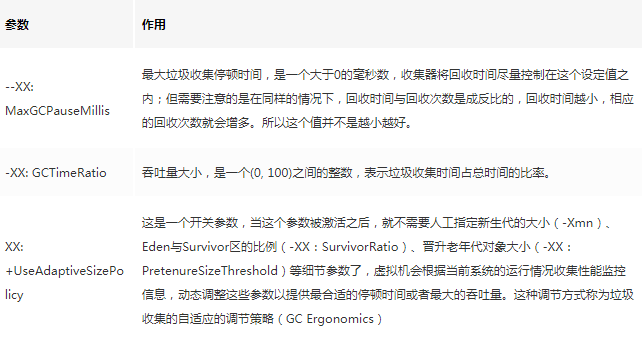

### 3、Parallel Old收集器

`Parallel Old`是`Parallel Scavenge`收集器的`老年代版本`，多线程，基于`“标记-整理”`算法。这个收集器是在JDK 1.6中才开始提供的。

由于如果新生代选择了`Parallel Scavenge`收集器，老年代除了`Serial Old（PS MarkSweep）`收集器外别无选择(`Parallel Scavenge`无法与`CMS`收集器配合工作)，
`Parallel Old`收集器的出现就是为了解决这个问题。`Parallel Scavenge`和`Parallel Old`收集器的组合更适用于注重吞吐量以及CPU资源敏感的场合。

## 六、Concurrent Mark and Sweep (CMS)

**CMS(Concurrent Mark Sweep，并发标记清除) 收集器**是以获取最短回收停顿时间为目标的收集器（追求低停顿），它在垃圾收集时使得用户线程和 GC 线程并发执行，
因此在垃圾收集过程中用户也不会感到明显的卡顿。

从名字就可以知道，CMS是基于`“标记-清除”`算法实现的。它的工作过程相对于上面几种收集器来说，就会复杂一点。整个过程分为以下四步：

1) **初始标记 (CMS initial mark)**：主要是标记 `GC Root` 开始的下级（注：仅下一级）对象，这个过程会 `STW`，但是跟 `GC Root` 直接关联的下级对象不会很多，因此这个过程其实很快。

2) **并发标记 (CMS concurrent mark)**：根据上一步的结果，继续向下标识所有关联的对象，直到这条链上的最尽头。这个过程是多线程的，虽然耗时理论上会比较长，但是其它工作线程并不会阻塞，没有`STW`。

3) **重新标记 (CMS remark)**：顾名思义，就是要再标记一次。为啥还要再标记一次？因为第 2 步并没有阻塞其它工作线程，其它线程在标识过程中，很有可能会产生新的垃圾。

这里举一个很形象的例子：

就比如你和你的小伙伴（多个GC线程）给一条长走廊打算卫生，从一头打扫到另一头。当你们打扫到走廊另一头的时候，可能有同学（用户线程）丢了新的垃圾。所以，为了打扫干净走廊，
需要你示意所有的同学（用户线程）别再丢了（进入STW阶段），然后你和小伙伴迅速把刚刚的新垃圾收走。当然，因为刚才已经收过一遍垃圾，所以这次收集新产生的垃圾，
用不了多长时间（即：`STW` 时间不会很长）。

4) **并发清除 (CMS concurrent sweep)**：


**❔❔❔ 提问环节**：

为什么CMS要使用`“标记-清除”`算法呢？刚才我们不是提到过`“标记-清除”`算法，会留下很多内存碎片吗？

确实，但是也没办法，如果换成`“标记 - 整理”`算法，把垃圾清理后，剩下的对象也顺便整理，会导致这些对象的内存地址发生变化，别忘了，此时其它线程还在工作，如果引用的对象地址变了，就天下大乱了。

对于上述的问题JVM提供了两个参数：

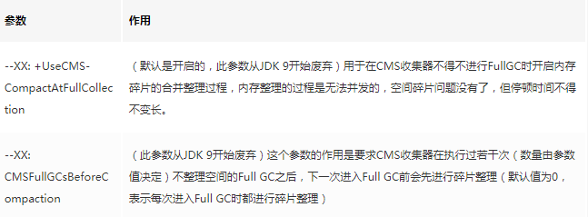

另外，由于最后一步并发清除时，并不阻塞其它线程，所以还有一个副作用，在清理的过程中，仍然可能会有新垃圾对象产生，只能等到下一轮 GC，才会被清理掉。

## 七、Garbage First (G1)

**JDK 9发布之日，G1宣告取代Parallel Scavenge加Parallel Old组合，成为服务端模式下的默认垃圾收集器。**

鉴于 CMS 的一些不足之外，比如: 老年代内存碎片化，STW 时间虽然已经改善了很多，但是仍然有提升空间。

G1 就横空出世了，它对于堆区的内存划思路很新颖，有点算法中分治法`“分而治之”`的味道。具体什么意思呢，让我们继续看下去。

G1 将连续的Java堆划分为多个大小相等的`独立区域（Region）`，每一个`Region`都可以根据需要，扮演新生代的`Eden空间`、`Survivor空间`，或者`老年代空间`。
每个`Region`的大小可以通过参数`-XX：G1HeapRegionSize`设定，取值范围为`1MB～32MB`，且应为`2的N次幂`。

`Region`中还有一类特殊的`Humongous`区域，专门用来存储大对象。G1认为只要大小超过了一个`Region`容量一半的对象即可判定为大对象。对于那些超过了整个`Region`容量的超级大对象，
将会被存放在`N`个连续的`Humongous Region`之中。

`Humongous`，简称 `H 区`，是专用于存放超大对象的区域，通常 `>= 1/2 Region Size`，**G1的大多数行为都把Humongous Region作为老年代的一部分来进行看待**。

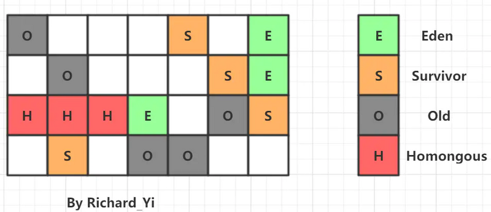

认识了G1中的内存规划之后，我们就可以理解为什么它叫做`"Garbage First"`。所有的垃圾回收，都是基于 `region` 的。

G1根据各个`Region`回收所获得的空间大小以及回收所需时间等指标在后台维护一个**优先列表**，每次根据允许的收集时间，优先回收价值最大（垃圾）的`Region`，
从而可以有计划地避免在整个Java堆中进行全区域的垃圾收集。这也是 `"Garbage First"` 得名的由来。

G1从整体来看是基于`“标记-整理”`算法实现的收集器，但从局部（两个`Region`之间）上看又是基于`“标记-复制”`算法实现，无论如何，这两种算法都意味着**G1运作期间不会产生内存空间碎片，
垃圾收集完成之后能提供规整的可用内存**。这种特性有利于程序长时间运行，在程序为大对象分配内存时不容易因无法找到连续内存空间而提前触发下一次GC。

**❔❔❔ 提问环节**：

一个对象和它内部所引用的对象可能不在同一个 `Region` 中，那么当垃圾回收时，是否需要扫描整个堆内存才能完整地进行一次可达性分析？

这里就需要引入 `Remembered Set` 的概念了。

答案是不需要，每个 `Region` 都有一个 `Remembered Set （记忆集）`，用于记录本区域中所有对象引用的对象所在的区域，进行可达性分析时，只要在 `GC Roots` 中再加上 `Remembered Set` 即可防止对整个堆内存进行遍历。

再提一个概念，`Collection Set` ：简称 `CSet`，记录了等待回收的 `Region` 集合，GC 时这些 `Region` 中的对象会被回收（`copied or moved`）。

### 1、G1 运作步骤

如果不计算维护 `Remembered Set` 的操作，G1 收集器的工作过程分为以下几个步骤：

* **初始标记（Initial Marking）**：`Stop The World`，仅使用一条初始标记线程对所有与 `GC Roots` 直接关联的对象进行标记。
* **并发标记（Concurrent Marking）**：使用一条标记线程与用户线程并发执行。此过程进行可达性分析，速度很慢。
* **最终标记（Final Marking）**：`Stop The World`，使用多条标记线程并发执行。
* **筛选回收（Live Data Counting and Evacuation）**：回收废弃对象，此时也要 `Stop The World`，并使用多条筛选回收线程并发执行。
（还会更新`Region`的统计数据，对各个`Region`的回收价值和成本进行排序）

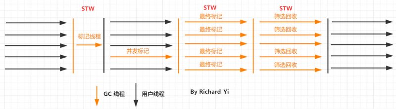

从上述阶段的描述可以看出，G1收集器除了并发标记外，其余阶段也是要完全暂停用户线程的，换言之，它并非纯粹地追求低延迟，官方给它设定的目标是在延迟可控的情况下获得尽可能高的吞吐量

### 2、G1 的 Minor GC/Young GC

在分配一般对象时，当所有`eden region`使用达到最大阈值并且无法申请足够内存时，会触发一次`YGC`。每次YGC会回收所有`Eden`以及`Survivor`区，并且将存活对象复制到`Old`区以及另一部分的`Survivor`区。

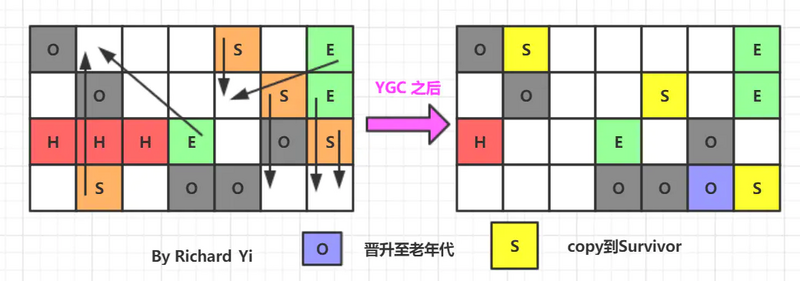

下面是一段经过抽取的GC日志：

```text
GC pause (G1 Evacuation Pause) (young)  ├── Parallel Time    ├── GC Worker Start    ├── Ext Root Scanning    ├── Update RS    ├── Scan RS    ├── Code Root Scanning    ├── Object Copy  ├── Code Root Fixup  ├── Code Root Purge  ├── Clear CT  ├── Other    ├── Choose CSet    ├── Ref Proc    ├── Ref Enq    ├── Redirty Cards    ├── Humongous Register    ├── Humongous Reclaim    ├── Free CSet
```

由这段GC日志我们可知，整个YGC由多个子任务以及嵌套子任务组成，且一些核心任务为：`Root Scanning`，`Update/Scan RS`，`Object Copy`，`CleanCT`，`Choose CSet`，`Ref Proc`，
`Humongous Reclaim`，`Free CSet`。

### 3、G1 的 Mixed GC

当越来越多的对象晋升到老年代`Old Region`时，为了避免堆内存被耗尽，虚拟机会触发一个混合的垃圾收集器，即`Mixed GC`，是收集整个新生代以及部分老年代的垃圾收集。
除了回收整个`Young Region`，还会回收一部分的`Old Region` ，这里需要注意：**是一部分老年代，而不是全部老年代**，可以选择哪些 `Old Region` 进行收集，从而可以对垃圾回收的耗时时间进行控制。

`Mixed GC`的整个子任务和YGC完全一样，只是回收的范围不一样。

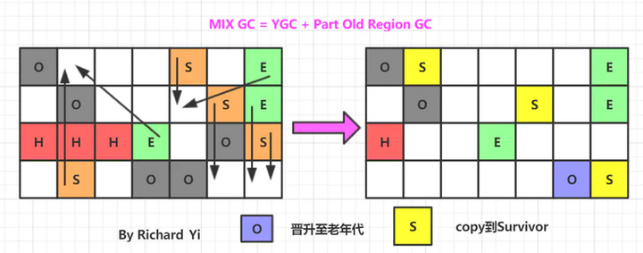

注：G1 一般来说是没有FGC的概念的。因为它本身不提供FGC的功能。

如果 `Mixed GC` 仍然效果不理想，跟不上新对象分配内存的需求，会使用 `Serial Old GC` 进行`Full GC`强制收集整个 `Heap`。

相比CMS，G1总结有以下优点：

* G1运作期间不会产生内存空间碎片，垃圾收集完成之后能提供规整的可用内存。这种特性有利于程序长时间运行。

* G1 能预测 GC 停顿时间， STW 时间可控（G1 uses a pause prediction model to meet a user-defined pause time target and selects the number of regions to collect based on the specified pause time target.）

关于G1实际上还有很多的细节可以讲，这里希望读者去阅读《深入理解Java虚拟机》或者其他资料来延伸学习，查漏补缺。

相关参数：

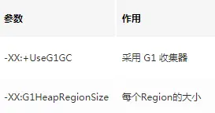


