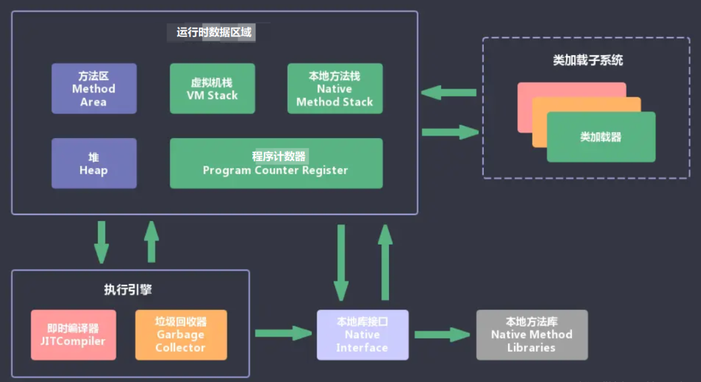
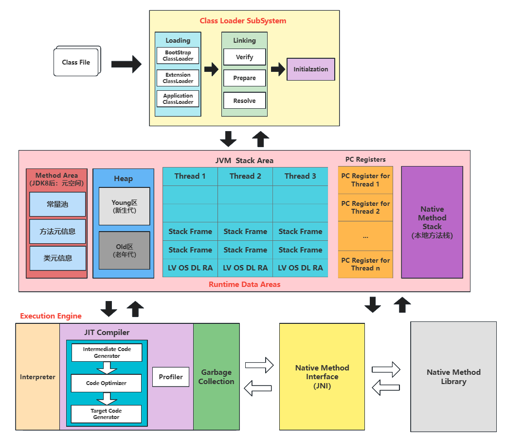
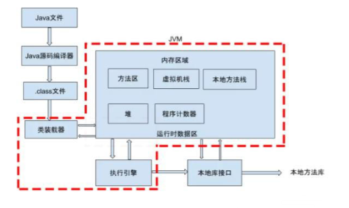

`JVM`包含两个子系统和两个组件，两个子系统为`Class loader`(类装载器)、`Execution engine`(执行引擎)；两个组件为`Runtime data area`(运行时数据区)、`Native Interface`(本地接口)。

* **Class loader(类装载器)**：根据给定的全限定名类名(如：`java.lang.Object`)来装载`class`文件到`Runtime data area`中的`method area`。

* **Execution engine（执行引擎）**：执行`classes`中的指令。

* **Native Interface(本地接口)**：与`native libraries`交互，是其它编程语言交互的接口。

* **Runtime data area(运行时数据区域)**：这就是我们常说的`JVM`的内存。

**作用** ：首先通过编译器把 `Java` 代码转换成`字节码`，类加载器（`ClassLoader`）再把字节码加载到内存中，将其放在运行时数据区（`Runtime data area`）的方法区内，而字节码文件只是 `JVM` 的一套指令集规范，并不能直接交给底层操作系统去执行，
因此需要特定的命令解析器执行引擎（`Execution Engine`），将字节码翻译成底层系统指令，再交由 `CPU` 去执行，而这个过程中需要调用其他语言的本地库接口（`Native Interface`）来实现整个程序的功能。

## Java程序运行机制详细说明

* 首先利用`IDE`集成开发工具编写`Java`源代码，源文件的后缀为`.java`。

* 再利用编译器(`javac`命令)将源代码编译成字节码文件，字节码文件的后缀名为`.class`。

* 运行字节码的工作是由解释器(`java`命令)来完成的。

从上图可以看，`java`文件通过编译器变成了`.class`文件，接下来类加载器又将这些`.class`文件加载到`JVM`中。

其实可以一句话来解释：**类的加载指的是将类的.class文件中的二进制数据读入到内存中，将其放在运行时数据区的方法区内，然后在堆区创建一个 java.lang.Class对象，用来封装类在方法区内的数据结构。**