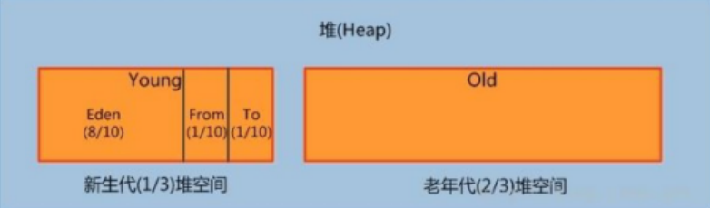
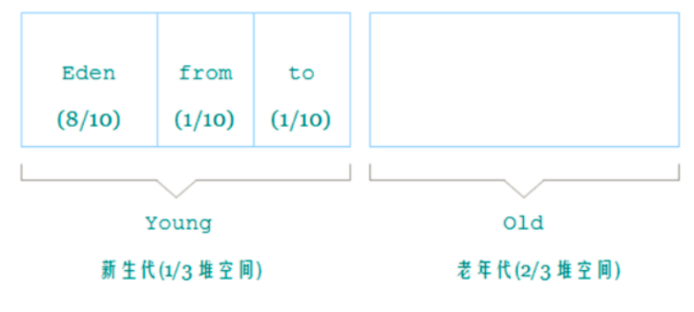

Java 堆从 GC 的角度还可以细分为: `新生代(Eden 区、 From Survivor 区和 To Survivor 区)`和`老年代`。

从图中可以看出： `堆大小 = 新生代 + 老年代`。其中，堆的大小可以通过参数 `–Xms`、`-Xmx` 来指定。

默认的，新生代 ( `Young` ) 与老年代 ( `Old` ) 的比例的值为 `1:2 `( 该值可以通过参数 `–XX:NewRatio` 来指定 )，即：**新生代 ( Young ) = 1/3 的堆空间大小。老年代 ( Old ) = 2/3 的堆空间大小**。

其中，新生代 ( `Young` ) 被细分为 `Eden` 和 两个 `Survivor` 区域，这两个 `Survivor` 区域分别被命名为 `from` 和 `to`，以示区分。默认的，`Eden: from : to = 8 :1 : 1` ( 可以通过参数`–XX:SurvivorRatio` 来设定 )，即： `Eden = 8/10` 的新生代空间大小，
`from = to = 1/10` 的新生代空间大小。

JVM 每次只会使用 `Eden` 和其中的一块 `Survivor` 区域来为对象服务，**所以无论什么时候，总是有一块 Survivor区域是空闲着的**。因此，新生代实际可用的内存空间为 9/10 ( 即90% )的新生代空间。

## 新生代

是用来存放`新生的对象`。一般占据`堆的 1/3 空间`。由于频繁创建对象，所以新生代会`频繁`触发 `MinorGC` 进行垃圾回收。新生代又分为 `Eden区`、 `ServivorFrom`、 `ServivorTo` 三个区。

### Eden 区

Java 新对象的`出生地`（**如果新创建的对象占用内存很大，则直接分配到老年代**）。当 `Eden` 区内存不够的时候就会触发 `MinorGC`，对新生代区进行一次垃圾回收。

### Servivor from 区

上一次 GC 的幸存者，作为这一次 GC 的被扫描者。

### Servivor to 区

保留了一次 `MinorGC` 过程中的幸存者。

### MinorGC 的过程（复制->清空->互换）

`MinorGC` 采用`复制算法`:

1. `eden`、 `servicorFrom` 复制到 `ServicorTo`，年龄`+1`。
   首先，把 `Eden` 和 `ServivorFrom` 区域中存活的对象复制到 `ServicorTo` 区域（如果有对象的年龄以及达到了老年的标准，则赋值到老年代区），同时把这些对象的年龄`+1`（如果 `ServicorTo` 不够位置了就放到老年区）；
2. 清空 `eden`、 `servicorFrom`。
   然后，清空 `Eden` 和 `ServicorFrom` 中的对象；
3. `ServicorTo` 和 `ServicorFrom` 互换。
   最后， `ServicorTo` 和 `ServicorFrom` 互换，原 `ServicorTo` 成为下一次 GC 时的 `ServicorFrom` 区。

## 老年代

主要存放应用程序中`生命周期长`的内存对象。

老年代的对象比较稳定，所以 `MajorGC` 不会频繁执行。在进行 `FULL GC` 前一般都先进行了一次 `MinorGC`，使得有新生代的对象晋身入老年代，导致空间不够用时才触发。
当无法找到足够大的连续空间分配给新创建的较大对象时也会提前触发一次 `MajorGC` 进行垃圾回收腾出空间。

`FULL GC` 采用`标记清除算法`：首先扫描一次所有老年代，标记出存活的对象，然后回收没有标记的对象。 `MajorGC` 的耗时比较长，因为要扫描再回收。 `FULL GC` 会产生内存碎片，为了减少内存损耗，我们一般需要进行合并或者标记出来方便下次直接分配。当老年代也满了装不下的时候，
就会抛出 `OOM（Out of Memory）`异常。

## 永久代 （或者 jdk1.8元空间）

指内存的永久保存区域，主要存放 `Class` 和 `Meta`（元数据）的信息,`Class` 在被加载的时候被放入永久区域， 它和存放实例的区域不同, GC 不会在主程序运行期对永久区域进行清理。所以这也导致了永久代的区域会随着加载的 `Class` 的增多而胀满，最终抛出 `OOM` 异常。