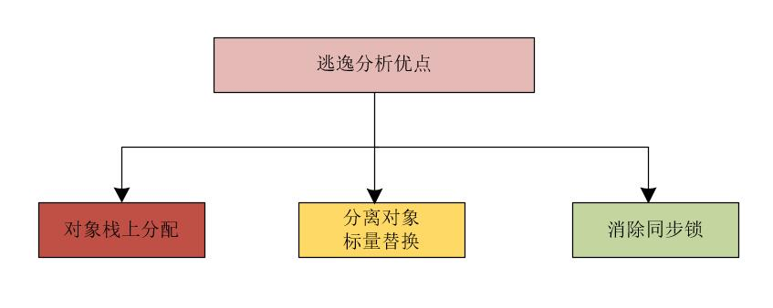

一般情况下JVM运行时的数据都是存在栈和堆上的。
* 栈用来存放一些基本变量和对象的引用，
* 堆用来存放数组和对象，也就是说new出来的实例。

**但是：凡事都有例外**

随着JIT编译器的发展和逃逸分析的技术成熟，栈上分配、标量替换等优化技术，使对象不一定全都分配在堆中。

**so，重点来了：对象不一定全都分配在堆中**

在JVM的实现中，为了提高JVM的性能和节省内存空间，JVM提供了一种叫做 `“逃逸分析”`的特性，逃逸分析是目前Java虚拟机中比较前沿的优化技术，也是JIT中一个很重要的优化技术。

## 一、逃逸分析的直观认知

“逃逸分析” 的本质：**主要就是分析对象的动态作用域，分析一个对象的动态作用域是否会逃逸出方法范围、或者线程范围。**

简单的说：如果一个对象在一个方法内定义，如果被方法外部的引用所指向，那认为它逃逸了。否者，这个对象，没有发生逃逸。

## 二、逃逸分析的概念

一种确定指针动态范围的静态分析，它可以分析在程序的哪些地方可以访问到指针。

在JVM的即时编译语境下，逃逸分析将判断新建的对象是否逃逸。即时编译判断对象是否逃逸的依据：一种是对象是否被存入堆中（静态字段或者堆中对象的实例字段），另一种就是对象是否被传入未知代码。

## 三、逃逸分析的类型

逃逸分析的类型有两种：

* **方法逃逸**(对象逃出当前方法)：当一个对象在方法里面被定义后，它可能被外部方法所引用，例如作为调用参数传递到其它方法中。
* **线程逃逸**(对象逃出当前线程)：这个对象甚至可能被其它线程访问到，例如赋值给类变量或可以在其它线程中访问的实例变量。

### 1、方法逃逸

当一个对象在方法里面被定义后，它可能被外部方法所引用，这种称为方法逃逸。方法逃逸包括：

* 通过调用参数，将对象地址传递到其他方法中，
* 对象通过return语句将对象指针，返回给其他方法
* 等等

我们可以用下面的代码来表示这个现象:

```java
//StringBuffer对象发生了方法逃逸
public static StringBuffer createStringBuffer(String s1, String s2) {
    StringBuffer sb = new StringBuffer();
    sb.append(s1);
    sb.append(s2);
    return sb;
}
```

上面的例子中，`StringBuffer` 对象通过`return语句返回`。`StringBuffer sb`是一个方法内部变量，上述代码中直接将`sb`返回，这样这个`StringBuffer`有可能被其他方法所改变，
这样它的作用域就不只是在方法内部，虽然它是一个局部变量，称其逃逸到了方法外部。

甚至还有可能被外部线程访问到，譬如赋值给类变量或可以在其他线程中访问的实例变量，称为线程逃逸。

不直接返回 StringBuffer，那么StringBuffer将不会逃逸出方法。具体的代码如下：

```java
// 非方法逃逸
public static String createString(String s1, String s2) {
    StringBuffer sb = new StringBuffer();
    sb.append(s1);
    sb.append(s2);
    return sb.toString();
}
```

可以看出，想要逃逸方法的话，需要让对象本身被外部调用，或者说，对象的指针，传递到了 方法之外。

### 2、线程逃逸

当一个对象可能被外部线程访问到，这种称为线程逃逸。例如赋值给类变量或可以在其它线程中访问的实例变量

## 四、逃逸分析后的代码优化

从不逃逸、方法逃逸到线程逃逸，称为对象由低到高的不同逃逸程度。如果能证明一个对象不会逃逸到方法或线程之外（换句话说是别的方法或线程无法通过任何途径访问到这个对象），或者逃逸程度比较低（只逃逸出方法而不会逃逸出线程），
则可能为这个对象实例采取不同程度的优化。通过逃逸分析，编译器会对代码进行优化。

如果能够证明一个对象不会逃逸到方法外或者线程外，或者说逃逸程度比较低，则可以对这个对象采用不同程度的优化：

* 栈上分配
* 标量替换
* 消除同步锁



### 1、栈上分配

**对象不分配在堆上，而是分配在栈内存上。**

前提是：**对象没有逃逸**，很老实的话。具体而言：完全不会逃逸的`局部变量`和不会逃逸出的`线程对象`，采用栈上分配，对于发生逃逸的、不老实的对象，才使用堆上分配。

栈上分配可以快速地在栈帧上创建和销毁对象，不用再将对象分配到堆空间，可以有效地减少 JVM 垃圾回收的压力。

### 2、标量替换

一个对象可能不需要作为一个连续的存储空间，也能被访问到，那么对象的部分可以不存储的在连续的内存，而是存可以打散存储，甚至部分存储或者打散在CPU寄存器中。

通过逃逸分析确定该对象不会被外部访问后，JVM判断对象是否可以被进一步分解，如果对象可以打散为变量，则JVM不会创建该对象，而是化整为零， 将该对象成员变量分解若干个被这个方法使用的成员变量，
JVM将一个大的对象打散成若干变量的过程，叫做`标量替换`，也称之为`分离对象`。比如如下代码：

```java
public static void main(String[] args) {
    alloc();
}
private static void alloc() {
    Point point = new Point（1,2）;
    System.out.println("point.x="+point.x+"; point.y="+point.y);
}
class Point{
    private int x;
    private int y;
}
```

从以上代码可以看出，`Point`对象并没有逃逸出`alloc`方法，并且`Point`对象是可以拆解成标量的。此时，JIT就会不会直接创建`Point`对象，而是直接使用两个标量`int x`,`int y`来替代`Point`对象。

为啥要 `化整为零` 呢？

因为**栈空间是非常有限的**，很多的场景下，一个线程的栈空间就是1M的大小。标量替换之后的成员变量，可以选择在栈帧分配，也可以就近在寄存器上分配空间，这样就不会因为没有一大块连续空间导致对象内存不够分配。
开启标量替换参数`-XX:+EliminateAllocations`，JDK7之后默认开启。

**总之：**

当JVM通过逃逸分析，确定要将对象分配到栈上时，即时编译可以将对象打散，将对象替换为一个个很小的局部变量，我们将这个打散的过程叫做`标量替换`。将对象替换为一个个局部变量后，就可以非常方便的在栈上进行分配了。

### 3、同步锁消除

如果JVM通过逃逸分析，发现一个对象只能从一个线程被访问到，则访问这个对象时，可以不加同步锁。

如果同步块所使用的锁对象通过这种分析后，发现只能够被一个线程访问，根本用不着同步，那么，JIT编译器在编译这个同步块的时候就会取消对这部分代码的同步锁。

所以：如果程序中使用了`synchronized`内置锁锁，则JVM会将`synchronized`内置锁消除。

注意：**这种情况针对的是`synchronized`锁，而对于非内置锁，比如 `Lock显示锁`、`CAS乐观锁`等等，则JVM并不能消除**。要开启同步消除，需要加上两个JVM启动选项：

```shell
-XX:+EliminateLocks # 启动选项，表示启动同步锁消除
-XX:+DoEscapeAnalysis # 选项，表示启动逃逸分析
```

因为同步锁消除依赖逃逸分析，所以同时要打开 `-XX:+DoEscapeAnalysis` 选项。

## 五、逃逸分析相关JVM参数

```shell
-XX:+DoEscapeAnalysis #开启逃逸分析
-XX:+PrintEscapeAnalysis #开启逃逸分析后，可通过此参数查看分析结果
-XX:+EliminateAllocations #开启标量替换
-XX:+EliminateLocks #开启同步消除
-XX:+PrintEliminateAllocations #开启标量替换后，查看标量替换情况
```

## 六、逃逸分析的底层原理是什么呢？

在Java的编译体系中，一个Java的源代码文件变成计算机可执行的机器指令的过程中，需要经过两段编译：

* 第一段编译，指前端编译器把`.java`文件转换成`.class`文件(字节码文件)。前端编译器产品可以是JDK的`Javac`、`Eclipse JDT`中的增量式编译器。
* 第二编译阶段，JVM 通过解释字节码将其翻译成对应的机器指令，逐条读入字节码，逐条解释翻译成机器码。

很显然，由于有一个解释的中间过程，其执行速度必然会比可执行的二进制字节码程序慢很多。这就是传统的JVM的解释器（`Interpreter`）的功能。

**如何去掉中间商，提升效率？**

为了解决这种效率问题，引入了JIT（即时编译器，`Just In Time Compiler`）技术。引入了 JIT 技术后，Java程序还是通过解释器进行解释执行，也就是说，主体还是解释执行，
只是局部去掉中间环节。

**怎么做局部去掉中间环节呢？**

当JVM发现某个方法或代码块运行特别频繁的时候，就会认为这是`“热点代码”（Hot Spot Code)`。然后JIT会把部分`“热点代码”`翻译成本地机器相关的机器码，并进行优化，
然后再把翻译后的机器码缓存起来，以备下次使用。 

**把翻译后的机器码缓存在哪里呢？** 

这个`缓存`，叫做`Code Cache`。 可见，JVM和WEB应用实现高并发的手段是类似的，还是使用了缓存架构。当JVM下次遇到相同的热点代码时，跳过解释的中间环节，
直接从`Code Cache`加载机器码，直接执行，无需再编译。所以，JIT总的目标是发现热点代码， 热点代码变成了提升性能的关键，hotspot JVM的名字，也就是这么来的，把识别热点代码，
写在名字上，作为毕生的追求。

所以，JVM总的策略为：

* 对于占据大部分的不常用的代码，我们无需耗费时间将其编译成机器码，而是采取解释执行的方式运行；
* 另一方面，对于仅占据小部分的热点代码，我们则可以将其编译成机器码，以达到理想的运行速度。

### 1、JIT(即时编译)的出现与解释器的区别

（1）解释器是将字节码解释为机器码，下次即使遇到相同的字节码，仍会执行重复的解释。

（2）JIT 是将一些字节码编译为机器码，并存入 Code Cache，下次遇到相同的代码，直接执行，无需再编译。

（3）解释器是将字节码解释为针对所有平台都通用的机器码。

（4）JIT 会根据平台类型，生成平台特定的机器码。

JVM包含多个即时编译器，主要有`C1`和`C2`，还有个`Graal` (实验性的)。多个即时编译器, 都会对字节码进行优化并生成机器码。

* `C1`会对字节码进行简单可靠的优化，包括方法内联、去虚拟化、冗余消除等，编译速度较快，可以通过`-client`强制指定`C1`编译；
* `C2`会对字节码进行激进优化，包括分支频率预测、同步擦除等，可以通过`-server`强制指定`C2`编译；

JVM 将执行状态分成了 5 个层次：

* 0 层，解释执行（`Interpreter`）
* 1 层，使用 C1 即时编译器编译执行（不带 `profiling`）
* 2 层，使用 C1 即时编译器编译执行（带基本的 `profiling`）
* 3 层，使用 C1 即时编译器编译执行（带完全的 `profiling`）
* 4 层，使用 C2 即时编译器编译执行

JVM不会直接启用`C2`，而是先通过`C1`编译收集程序的运行状态，再根据分析结果判断是否启用`C2`。分层编译模式下, 虚拟机执行状态由简到繁、由快到慢分为5层。在编译期间，JIT 除了对热点代码做缓存提速，
会对代码做很多优化。其中有一部分优化的目的就是减少内存堆分配压力，其中JIT优化中一种重要的技术叫做`逃逸分析`。根据逃逸分析，即时编译器会在编译过程中对代码做如下优化：

* **锁消除**：当一个锁对象只被一个线程加锁时，即时编译器会把锁去掉
* **栈上分配**：当一个对象没有逃逸时，会将对象直接分配在栈上，随着线程回收，由于JVM的大量代码都是堆分配，所以目前JVM不支持栈上分配，而是采用标量替换
* **标量替换**：当一个对象没有逃逸时，会将当前对象打散成若干局部变量，并分配在虚拟机栈的局部变量表中

## 七、总结

Java中的对象一定是在堆上分配的吗？

**不一定。**

如果满足了逃逸分析的条件，一个对象，完全可以在栈上分配。**减少堆内存的分配和GC压力**。

由于栈内存有限，所以，如果对象符合标量替换的条件，**进一步为对象来一次化整为零的手术**。

标量替换具体的做法是：
**JVM会将对象进一步打散，将对象分解为若干个被这个方法使用的成员变量，从而，达到更好的利用栈内存和寄存器的目标**。