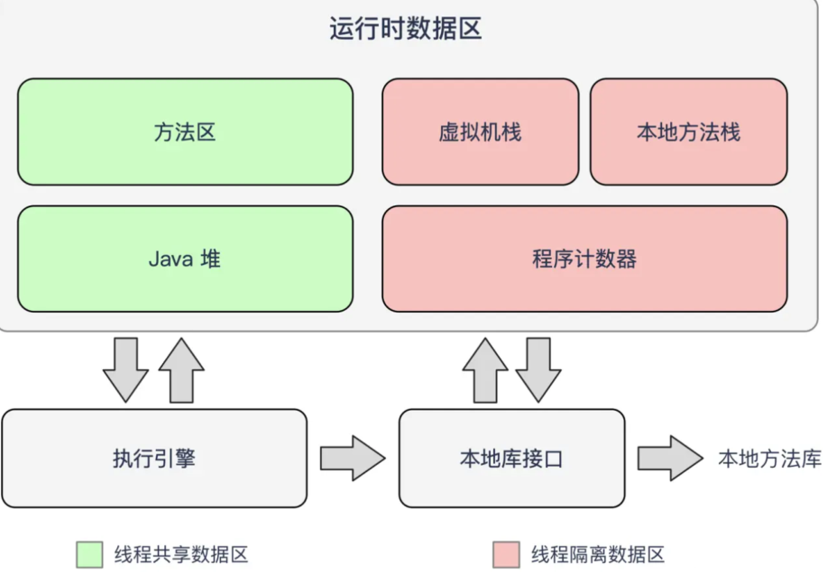
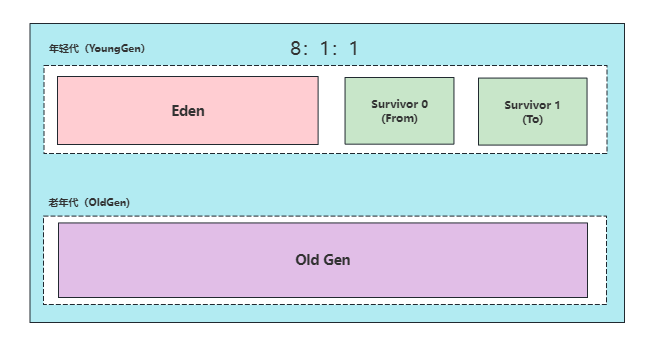
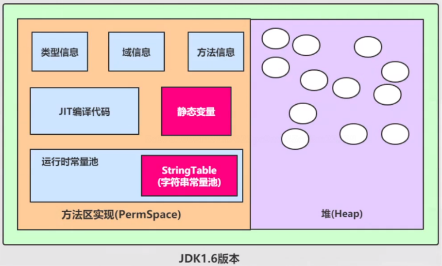
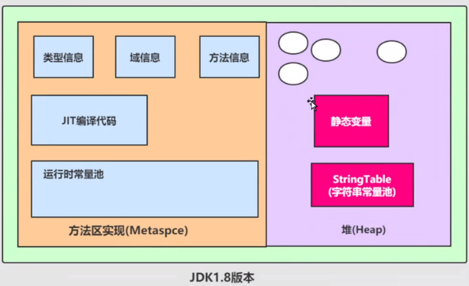
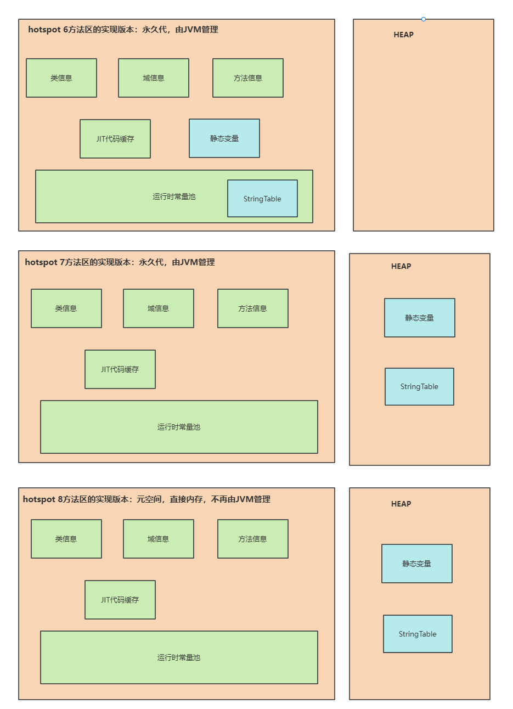
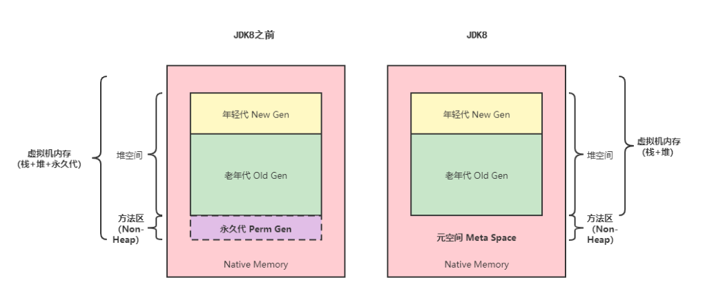

## 1、说一下 Java 堆空间及 GC？

当通过 `Java` 命令启动 `Java` 进程的时候，会为它`分配内存`。

内存的一部分用于创建`堆空间`，当程序中创建对象的时候，就从堆空间中分配内存。

`GC` 是 `JVM` 内部的一个`进程`，回收无效对象的内存用于将来的分配。

## 2、说一下 JVM 的主要组成部分及其作用？

详情移步：[JVM的主要组成部分及其作用](/Java/JVM/常见问题/JVM的主要组成部分及其作用)

## 3、说一下 JVM 运行时数据区？ 或：说一下JVM内存模型？

**思路**： 给面试官画一下`JVM`内存模型图，并描述每个模块的定义，作用，以及可能会存在的问题，如栈溢出等。

`Java` 虚拟机在执行 `Java` 程序的过程中会把它所管理的内存区域划分为若干个不同的数据区域。这些区域都有各自的用途，以及创建和销毁的时间，有些区域随着虚拟机进程的启动而存在，有些区域则是依赖线程的启动和结束而建立和销毁。

`Java` 虚拟机所管理的内存被划分为如下几个区域：



* **程序计数器（Program Counter Register）**：当前线程所执行的字节码的行号指示器，字节码解析器的工作是通过改变这个计数器的值，来选取下一条需要执行的字节码指令，
分支、循环、跳转、异常处理、线程恢复等基础功能，都需要依赖这个计数器来完成；

* **Java 虚拟机栈（Java Virtual Machine Stacks）**：用于存储局部变量表、操作数栈、动态链接、方法出口等信息；

* **本地方法栈（Native Method Stack）**：与虚拟机栈的作用是一样的，只不过虚拟机栈是服务 `Java` 方法的，而本地方法栈是为虚拟机调用 `Native` 方法服务的；

* **Java 堆（Java Heap）**：`Java` 虚拟机中内存最大的一块，是被所有线程共享的，几乎所有的对象实例都在这里分配内存；

* **方法区（Methed Area）**：用于存储已被虚拟机加载的类信息、常量、静态变量、即时编译后的代码等数据。

## 4、JVM内存包括哪些？

详情移步：[JVM内存结构](/Java/JVM/深入浅出JVM/JVM内存结构)

## 5、什么是堆内存?

以`Hotspot`为例，堆内存（`HEAP`）主要由`GC`模块进行分配和管理， 可分为以下部分：

* 新生代(伊甸园区+幸存者区)

* 老年代

其中，1 伊甸园区 + 2 幸存者区 一般称为年轻代。如下图所示:



我们在`jvm`参数中只要使用`-Xms`、`-Xmx`等参数就可以设置堆的大小和最大值， 理解`jvm`的堆还需要知道下面这个公式：

```java
堆内内存 = 新生代+老年代
```

在使用`堆内内存（on-heap memory）`的时候，完全遵守`JVM`虚拟机的内存管理机制，采用`垃圾回收器（GC）`统一进行内存管理，`GC`会在某些特定的时间点进行一次彻底回收，也就是`Full GC`，`GC`会对所有分配的堆内内存进行扫描，
在这个过程中会对`JAVA`应用程序的性能造成一定影响，还可能会产生`Stop The World`。

常见的垃圾回收算法主要有：

* 引用计数器法（Reference Counting）
* 标记清除法（Mark-Sweep）
* 复制算法（Coping）
* 标记压缩法（Mark-Compact）
* 分代算法（Generational Collecting）
* 分区算法（Region）

## 6、什么是非堆内存?

除堆内存之外，`JVM`的内存池还包括非堆（`NON_HEAP`），非堆内存大概包括：

* MetaSpace
* CodeCache
* Compressed Class Space

对应于`JVM`规范中的`方法区`，也就是`jdk1.8`的`元空间`

通常 `Mehtod Area`又称之为`Non-Heap`，与`Heap`进行区分理解(`JDK8`之前的`Method Area`实现是`PermSpace`，`JDK8`及之后的`Method Area`实现叫`Meta Space`)

## 7、什么是堆外内存/直接内存（direct memory）？

堆外内存, 常常又叫做直接内存。 和堆内内存相对应，堆外内存就是把内存对象分配在`Java`虚拟机的堆以外的内存，这些内存直接受操作系统管理（而不是虚拟机），这样做的结果就是能够在一定程度上减少垃圾回收对应用程序造成的影响。

作为`JAVA`开发者我们经常用`java.nio.DirectByteBuffer`对象进行堆外内存的管理和使用，它会在对象创建的时候就分配堆外内存。

`DirectByteBuffer`类是在`Java Heap`外分配内存，对堆外内存的申请主要是通过成员变量`unsafe`来操作，下面介绍构造方法:

```java
DirectByteBuffer(int cap) {
        super(-1, 0, cap, cap);
        //内存是否按页分配对齐
        boolean pa = VM.isDirectMemoryPageAligned();
        //获取每页内存大小
        int ps = Bits.pageSize();
        //分配内存的大小，如果是按页对齐方式，需要再加一页内存的容量
        long size = Math.max(1L, (long)cap + (pa ? ps : 0));
        //用Bits类保存总分配内存(按页分配)的大小和实际内存的大小
        Bits.reserveMemory(size, cap);
        long base = 0;
        try {
            //在堆外内存的基地址，指定内存大小
            base = unsafe.allocateMemory(size);
        } catch (OutOfMemoryError x) {
            Bits.unreserveMemory(size, cap);
            throw x;
        }
        unsafe.setMemory(base, size, (byte) 0);
        //计算堆外内存的基地址
        if (pa && (base % ps != 0)) {
            // Round up to page boundary
            address = base + ps - (base & (ps - 1));
        } else {
            address = base;
        }
            cleaner = Cleaner.create(this, new Deallocator(base, size, cap));
            att = null;
}
```

注：在 `Cleaner` 内部中通过一个列表，维护了一个针对每一个 `directBuffer` 的一个回收堆外内存的线程对象(`Runnable`)，回收操作是发生在 `Cleaner` 的 `clean()` 方法中。

```java
private static class Deallocator implements Runnable {
    
    private static Unsafe unsafe = Unsafe.getUnsafe();
    private long address;
    private long size;
    private int capacity;
    
    private Deallocator(long address, long size, int capacity) {
        assert (address != 0);
        this.address = address;
        this.size = size;
        this.capacity = capacity;
    }
    
    public void run() {
        if (address == 0) {
            // Paranoia
            return;
        }
        unsafe.freeMemory(address);
        address = 0;
        Bits.unreserveMemory(size, capacity);
    }
}
```

## 8、介绍一下方法区和永久代的区别?

### 方法区

方法区属于`JVM`规范的内容，`JVM`规范中，方法区主要用于存储`类的信息`、`常量池`、`方法数据`、`方法代码`等。

方法区是 `JVM` 的规范，所有虚拟机必须遵守的。常见的 JVM 虚拟机 `Hotspot`、`JRockit（Oracle）`、`J9（IBM）`

### PermGen（永久代）

`PermGen`，就是`PermGen space`，全称是`Permanent Generation space`，是指`内存的永久保存区域`。

这块内存主要是被JVM存放`Class`和`Meta`信息的，`Class`在被 `Loader` 时就会被放到`PermGen space`中。绝大部分 Java 程序员应该都见过`java.lang.OutOfMemoryError: PermGen space`这个异常。

这里的 `PermGen space` 其实指的就是方法区。**PermGen space则是 HotSpot 虚拟机基于JVM规范对方法区的一个落地实现**，`PermGen space`是`HotSpot`虚拟机有，而如 `JRockit（Oracle）`、`J9（IBM）`虚拟机有方法区，
但是就没有 `PermGen space`。

**强调：只有HotSpot才有PermGen space。**

`PermGen space`是`JDK7`及之前，HotSpot虚拟机对方法区的一个落地实现`。HotSpot jdk1.6`的`PermGen space`如下：



`HotSpot`也有去永久代的趋势，在 `JDK 1.7` 中`HotSpot`已经开始了`“去永久化”`，把原本放在永久代的`字符串常量池`移出。

`HotSpot 1.7`永久代主要`存放常量`、`类信息`、`静态变量`等数据，与垃圾回收关系不大，新生代和老年代是垃圾回收的主要区域。

永久代在`JDK8`被移除, `JDK1.8`方法区叫做`元空间`：



**Metaspace（元空间）是JDK8及之后， HotSpot虚拟机对方法区的新的实现。**

## 9、说一下 HotSpot 方法区变迁

| 版本 | 演进细节 |
| --- | --- |
| JDK6及之前 | 方法区的实现为永久代，静态变量存放在永久代中，字符串常量池（StringTable）位于运行时常量池中。 |
| JDK7 | 方法区的实现为永久代，但已经逐步“去永久代”，静态变量、字符串常量池移除，保存在堆中 |
| JDK8 | 方法区的实现为本地内存的元空间，字符串常量池、静态变量仍在堆中 |

### JDK1.2 ~ JDK6

在 `JDK1.2 ~ JDK6` 的实现中，`HotSpot` 使用永久代（永久代）实现方法区；`HotSpot` 使用 `GC` 分代实现方法区带来了很大便利；

### JDK7

由于 `GC` 分代技术的影响，使之许多优秀的内存调试工具无法在 `Oracle HotSpot`之上运行，必须单独处理；

并且 `Oracle` 同时收购了 `BEA` 和 `Sun` 公司，同时拥有 `JRockit` 和 `HotSpot`，在将 `JRockit` 许多优秀特性移植到 `HotSpot` 时，由于 `GC` 分代技术遇到了种种困难，所以从 `JDK8` 开始 `Oracle HotSpot` 开始移除永久代。

`JDK7`中符号表被移动到`Native Heap`中， 字符串常量和类引用被移动到 `Java NON_HEAP` 中。

### JDK8

在 `JDK8` 中，永久代已完全被元空间(`Meatspace`)所取代。



## 10、为什么用元空间替换永久代？

1) 永久代设置最大空间大小是难以确定的。

* 在某些场景下，如果动态加载类过多，容易产生`Perm`区的`OOM`：比如某个实际`Web`工程中，因为功能点比较多，在运行过程中，要不断动态加载很多类，经常出现致命错误；而元空间和永久代之间最大的区别在于：
**元空间并不在虚拟机中，而是使用本地内存，因此，默认情况下，元空间的最大大小仅受本地内存限制。**

2) 对永久代进行调优是很困难的。

## 11、为什么调整字符串常量池的位置？

`JDK7`中将字符串常量池放到了堆空间中：因为永久代的回收效率很低，在`Full GC`时才会进行回收

`Full GC`在老年代的空间不足、永久代不足时才会触发，这就导致字符串常量池回收效率不高；而我们开发中会有大量的字符串被创建，回收效率低会导致永久代内存不足。将字符串常量池放到堆里，能及时回收内存。

## 12、什么是执行引擎？

执行引擎是 `java` 虚拟机的最核心组件之一，它负责执行虚拟机的字节码，有即时编译和解释执行，通常采用解释执行方式。解释执行是指解释器通过每次解释并执行一小段代码来完成`.class`程序的所有操作。
即时编译则是将`.class`文件翻译成机器码在执行（比如：经常多次访问的代码可以全部编译）

垃圾回收系统是 `java` 虚拟机的重要组成部分，垃圾回收器可以对`栈堆`进行回收。其中，`java堆`是垃圾收集器的工作重点。有三类：`增量垃圾回收`，`分代复制垃圾回收`，`标记垃圾回收`

和 C/C++不同， java中所有的对象空间释放都是隐式的，也就是说，java中没有类似`free()`或者`delete()`这样的函数释放指定的内存区域。对于不再使用的垃圾对象，垃圾回收系统会在后台默默工
作，默默查找、标识并释放垃圾对象，完成包括 java 堆、方法区和直接内存中的全自动化管理。

## 13、成员变量、局部变量、类变量分别存储在内存的什么地方？

* **类变量**

类变量是用`static`修饰符修饰，定义在方法外的变量，**随着java进程产生和销毁**，在`java8`之前把静态变量存放于`方法区`，在`java8`时存放在`堆`中

* **成员变量**

成员变量是定义在类中，但是没有`static`修饰符修饰的变量，**随着类的实例产生和销毁**，是类实例的一部分由于是实例的一部分，在类初始化的时候，从运行时常量池取出直接引用或者值，与初始化的对象一起放入`堆`中

* **局部变量**

局部变量是定义在类的方法中的变量在所在方法被调用时放入虚拟机栈的栈帧中，方法执行结束后从虚拟机栈中弹出，所以存放在`虚拟机栈`中

## 14、类常量池、运行时常量池、字符串常量池有什么关系？有什么区别？

`类常量池`与`运行时常量池`都存储在`方法区`，而`字符串常量池`在`jdk7`时就已经从方法区迁移到了`java堆`中。在类编译过程中，会把`类元信息`放到方法区，`类元信息`的其中一部分便是`类常量池`，主要存放字面量和
符号引用，而字面量的一部分便是文本字符，在类加载时将字面量和符号引用解析为直接引用存储在运行时常量池；

对于文本字符来说，它们会在解析时查找`字符串常量池`，查出这个文本字符对应的字符串对象的直接引用，将直接引用存储在`运行时常量池`；**字符串常量池存储的是字符串对象的引用，而不是字符串本身**。

## 15、使用堆外内存的优点

* 减少了垃圾回收。因为垃圾回收会暂停其他的工作。 

* 加快了复制的速度。堆内在`flush`到远程时，会先复制到直接内存（非堆内存），然后在发送；而堆外内存相当于省略掉了这个工作。

## 16、说说方法区和堆的区别？

**逻辑上，方法区是属于堆的一部分，**

但实现上，一些简单的jvm实现，可能不会对方法区选择进行垃圾收集或者进行压缩。 HotSpot虚拟机的方法区还有一个别名，叫做 `Non-Heap`（非堆） ，目的就是要和堆分开。
所以， **方法区看作是一块独立于Java堆的内存空间**。

1. 方法区是各线程**共享的内存区域**。
2. 方法区在JVM启动的时候被创建，它的实例的物理内存空间可以是不连续的。
3. 方法区的大小，可以选择固定大小或者可扩展。如果方法区无法满足新的内存分配需求时，将抛出OOM异常。
4. 方法区的大小决定了系统可以保存多少个类，如果系统定义了太多的类，会导致方法区溢出，虚拟机会抛出内存溢出错误：

```java
java.lang.OutOfMemoryError: PermGen space
```

或者

```java
java.lang.OutOfMemoryError: Metaspace
```

比如，以下情况：
* 加载大量的第三方的jar包；
* Tomcat部署的工程过多（30-50个）；
* 大量动态的生成反射类。

5. 关闭JVM就会释放该区域的内存。

方法区是虚拟机规范中提出的，不同的虚拟机可以有不同的实现，在HotSpot不同版本中方法区的演进，如下：

* 在JDK7及以前，习惯上把方法区称为 `永久代（PermGen）` ，从JDK8开始，使用 `元空间（Metaspace）` 作为方法区的实现。

>In JDK 8，classes metadata is now stored in the native heap and this space is called Metaspace.

* 本质上，方法区和永久代并不等价，这两个概念仅是对hotspot而言的。《Java虚拟机规范》对如何实现方法区，不做统一要求，例如：BEA JRockit和IBMJ9中，就不存在永久代的概念。

>现在来看，当年使用永久代，不是好的idea，导致Java程序更容易出现OOM（超过-XX:MaxPermsize上限）。

* 元空间的本质和永久代类似，都是对JVM规范中方法区的实现。两者的最大区别是：元空间不在虚拟机设置的内存中，而是使用**本地内存**。



## 17、如何解决方法区的OOM？

要解决OOM异常或heap space的异常，一般手段是通过内存映像分析工具（如 `Eclipse Memory Analyzer`）对`dump`出来的`堆转储快照文件`进行分析，
重点是确认内存中的对象是否还都是必要存活的，即要先分清楚到底是出现了 内存泄漏（`Memory Leak`） 还是 内存溢出（`Memory Overflow`）。

* 如果是内存泄漏，可进一步通过工具查看泄漏对象到`GC Roots`的`引用链`，就能找到泄漏对象是通过怎样的路径与 GC Roots相关联，并导致垃圾收集器无法自动回收它们的。
掌握泄漏对象的类型信息，以及 GC Roots引用链的信息后，就可以比较准确地定位出泄漏代码的位置。

* 如果不存在内存泄漏，即内存中的对象确实都还必须存活着，就应当根据机器物理内存，检查虚拟机的堆参数（`-Xmx`与`-Xms`），看是否还可以调大；从代码上检査是否存在某些对象生命周期过长、持有状态时间过长的情况（其实也算是内存泄漏），
尝试减少程序运行期的内存消耗。