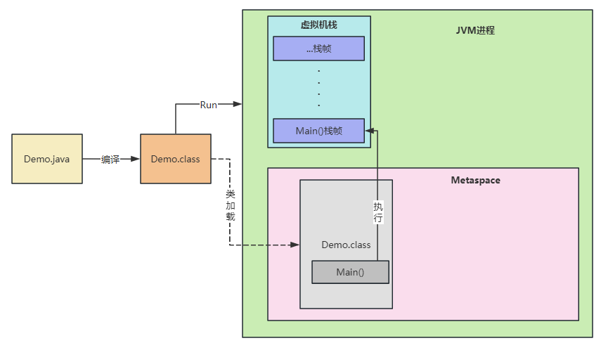

>元空间会产生内存溢出么？在什么情况下会产生内存溢出？


元空间会发生内存溢出，主要原因是加载到内存中的 `class` 数量太多或者体积太大

## 什么是 Metaspace

`Metaspace`元数据空间，专门用来存储`类的元数据`，它是 `JDK8` 中用来替代 `Perm` 的特殊数据结构。

`Metaspace` 空间被分配在`本地内存`中(非堆上)，默认不限制内存使用，可以使用 `MaxMetaspaceSize` 指定最大值。`MetaspaceSize` 指定最小值，默认 `21 M`。
通过 `mmap` 来从操作系统申请内存，申请的内存会分成一个一个 `Metachunk`，以 `Metachunk` 为单位将内存分配给类加载器，**每个 Metachunk 对应唯一一个类加载器，一个类加载器可以有多个 Metachunk** 。

我们的`java`代码都是通过编译后生成 `.class`字节码，然后由类加载器进行加载读取到我们的`JVM`内存中的，存放在`Metaspace`中。因此如果加载的类很多，不停的加载进`Metaspace`，就会导致 `Metaspace` 空间存满，从而发生`OOM`。

**有一点需要注意的是：**

这里并不是说`Metaspace`空间存满了就直接发生`OOM`，而是一旦`Metaspace`区域满了，会先触发`Full GC`，连带着回收`Metaspace`里的类。

如果回收后并没有腾出多少空间，而JVM进程还在不断往里倒对象，那么才会引发`OOM`的问题。

:::tip
类加载器被回收，它所加载的类也会被回收，如果类有被引用，肯定不能被回收
:::

## 什么情况下会发生Metaspace内存溢出？

`Metaspace`区域一般很少发生内存溢出，如果发生了一般无非就以下两个原因：

1. **Metaspace空间太小**

很多程序员并不懂`JVM`的运行原理，在系统上线的时候也未设置过`JVM`参数，而是直接使用默认的`JVM`参数，导致`Metaspace`默认的大小才`几十MB`而已，很容易就不够。

我们可以通过如下两个参数进行`Metaspace`空间大小的设置：

```shell
//指定元空间的初始空间大小， 以字节为单位， 达到该值就会触发垃圾收集进行类型卸载， 同时收集器会对该值进行调整： 如果释放了大量的空间， 就适当降低该值； 如果释放了很少的空间， 那么在不超过`-XX： MaxMetaspaceSize`（如果设置了的话） 的情况下， 适当提高该值。
-XX:MetaspaceSize=512m

//设置元空间最大值，默认是-1，即不限制，或者说只受限于本地内存、大小。
-XX:MaxMetaspaceSize=512m

//作用是在垃圾收集之后控制最小的元空间剩余容量的百分比， 可减少因为元空间不足导致的垃圾收集的频率。 类似的还有-XX： Max-MetaspaceFreeRatio， 用于控制最大的元空间剩余容量的百分比。
-XX： MinMetaspaceFreeRatio：
```

这样我们的`Metaspace`区域的大小初始化以及最大的空间就是`512MB`。

`JVM`默认值依赖于平台，`windows`下，`-XX:MetaspaceSize` 是`21M`，`-XX：MaxMetaspaceSize` 是`-1`，即没有限制。 

默认情况下，如果不指定大小，虚拟机可能会耗尽所有的可用系统内存，并且当`Metaspace`区域的大小达到 `21M`即会触发`Full GC`的发生并卸载没用的类，
当然这是初始的高水位线，一旦触及这个水位线后，高水位线会进行重置，新的高水位线的值取决于`GC`后释放了多少`Metaspace`，如果释放的空间不足，那么在不超过 `MaxMetaspaceSize` 时，会适当提高该值，如果释放空间过多，则适当降低该值。

2. **过多的类被加载进了Metaspace**

当前的很多主流框架， 如`Spring`、 `Hibernate`对类进行增强时， 都会使用到`CGLib`这类字节码技术， 当增强的类越多， 就需要越大的方法区以保证动态生成的新类型可以载入内存 ，如果使用`cglib`过多导致生产的类没控制好过多后导致`Metaspace`区域满了，进而引发内存溢出。

方法区溢出也是一种常见的内存溢出异常， 一个类如果要被垃圾收集器回收， 要达成的条件是比较苛刻的。 在经常运行时生成大量动态类的应用场景里， 就应该特别关注这些类的回收状况。 

这类场景除了之前提到的程序使用了`CGLib`字节码增强和动态语言外， 常见的还有： 大量`JSP`或动态产生`JSP`文件的应用（`JSP`第一次运行时需要编译为`Java`类） 、 基于`OSGi`的应用（即使是同一个类文件， 被不同的加载器加载也会视为不同的类） 等




