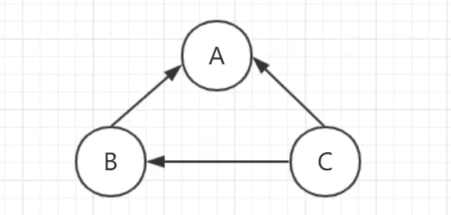
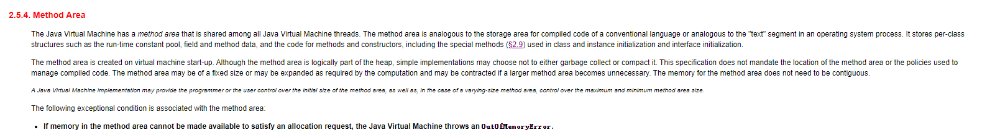
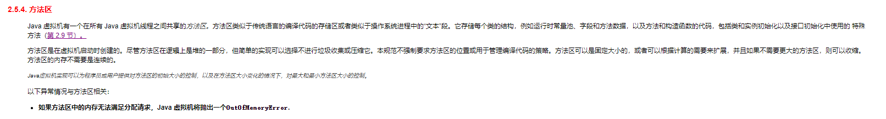
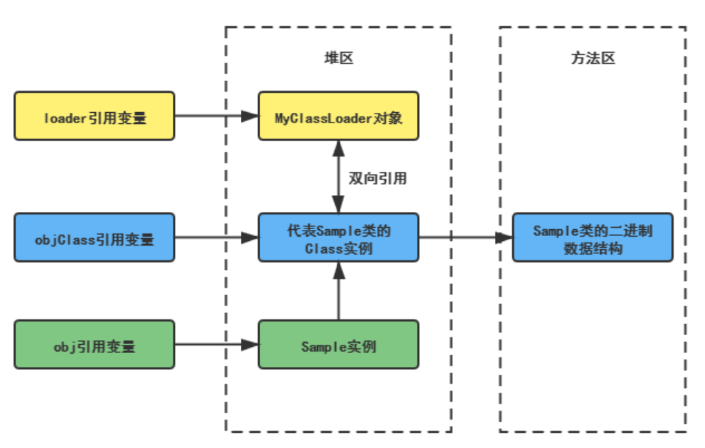
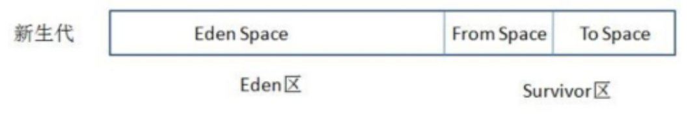
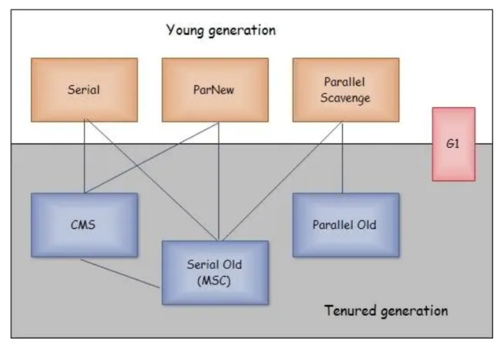

:::tip
垃圾收集器相关知识移步：

[垃圾收集策略与算法](/Java/JVM/深入浅出JVM/垃圾收集策略与算法) 

[HotSpot垃圾收集器](/Java/JVM/深入浅出JVM/HotSpot垃圾收集器)
:::

## 1、简述Java垃圾回收机制?

在JVM中，有一个垃圾回收线程，它是低优先级的，在正常情况下是不会执行的，只有在虚拟机空闲或者当前堆内存不足时，才会触发执行，扫面那些没有被任何引用的对象，并将它们添加到要回收的集合中，进行回收。

## 2、GC是什么？为什么要GC

`GC` 是`垃圾收集`的意思（`Gabage Collection`）,内存处理是编程人员容易出现问题的地方，忘记或者错误的内存回收会导致程序或系统的不稳定甚至崩溃，
Java 提供的 `GC` 功能可以自动监测对象是否超过作用域从而达到`自动回收内存`的目的，Java 语言没有提供释放已分配内存的显示操作方法。

## 3、垃圾回收的优点和原理。并考虑2种回收机制

Java语言最显著的特点就是引入了`垃圾回收机制`，它使java程序员在编写程序时不再考虑内存管理的问题。

由于有这个`垃圾回收机制`，java中的对象不再有`“作用域”`的概念，只有引用的对象才有“作用域”。

垃圾回收机制有效的防止了`内存泄露`，可以有效的使用可使用的内存。垃圾回收器通常作为一个单独的低级别的线程运行，在不可预知的情况下对内存堆中已经死亡的或很长时间没有用过的对象进行清除和回收。

垃圾回收有`分代复制垃圾回收`、`标记垃圾回收`、`增量垃圾回收`。

## 4、垃圾回收器的基本原理是什么？

对于GC来说，当程序员创建对象时，GC就开始监控这个对象的`地址`、`大小`以及`使用情况`。

通常，GC采用`有向图`的方式记录和管理堆(`heap`)中的所有对象。通过这种方式确定哪些对象是`"可达的"`，哪些对象是`"不可达的"`。当GC确定一些对象为`"不可达"`时，GC就有责任回收这些内存空间。

## 5、垃圾回收器可以马上回收内存吗？

可以

## 6、有什么办法主动通知虚拟机进行垃圾回收？

可以手动执行`System.gc()`，通知GC运行，但是Java语言规范并不保证GC一定会执行。

## 7、你能保证 GC 执行吗？

不能，虽然你可以调用 `System.gc()` 或者 `Runtime.gc()`，但是没有办法保证 GC 的执行。

## 8、Java 中都有哪些引用类型？

* **强引用**：发生 gc 的时候不会被回收。
* **软引用**：有用但不是必须的对象，在发生内存溢出之前会被回收。
* **弱引用**：有用但不是必须的对象，在下一次GC时会被回收。
* **虚引用**（幽灵引用/幻影引用）：无法通过虚引用获得对象，用 `PhantomReference` 实现虚引用，虚引用的用途是在 gc 时返回一个通知。

## 9、介绍一下强引用、软引用、弱引用、虚引用的区别？

### 强引用

我们平时`new`了一个对象就是`强引用`，例如 `Object obj = new Object();` 即使在内存不足的情况下，JVM宁愿抛出`OutOfMemory`错误也不会回收这种对象。

### 软引用

如果一个对象只具有软引用，则内存空间足够，垃圾回收器就不会回收它；如果内存空间不足了，就会回收这些对象的内存。

```java
SoftReference<String> softRef=new SoftReference<String>(str); // 软引用
```

**用处**： 软引用在实际中有重要的应用，例如浏览器的后退按钮。按后退时，这个后退时显示的网页内容是重新进行请求还是从缓存中取出呢？这就要看具体的实现策略了。

（1）如果一个网页在浏览结束时就进行内容的回收，则按后退查看前面浏览过的页面时，需要重新构建

（2）如果将浏览过的网页存储到内存中会造成内存的大量浪费，甚至会造成内存溢出

如下代码：

```java
Browser prev = new Browser(); // 获取页面进行浏览
SoftReference sr = new SoftReference(prev); // 浏览完毕后置为软引用
if(sr.get()!=null){
    rev = (Browser) sr.get(); // 还没有被回收器回收，直接获取
}else{
    prev = new Browser(); // 由于内存吃紧，所以对软引用的对象回收了
    sr = new SoftReference(prev); // 重新构建
}
```

### 弱引用

具有弱引用的对象拥有更短暂的生命周期。在垃圾回收器线程扫描它所管辖的内存区域的过程中，一旦发现了只具有弱引用的对象，不管当前内存空间足够与否，都会回收它的内存。

```java
String str=new String("abc");
WeakReference<String> abcWeakRef = new WeakReference<String>(str);
str=null;
等价于
str = null;
System.gc();
```

### 虚引用

如果一个对象仅持有虚引用，那么它就和没有任何引用一样，在任何时候都可能被垃圾回收器回收。虚引用主要用来跟踪对象被垃圾回收器回收的活动。

## 10、怎么判断对象是否可以被回收？

垃圾收集器在做垃圾回收的时候，首先需要判定的就是哪些内存是需要被回收的，哪些对象是`「存活」`的，是不可以被回收的；哪些对象已经`「死掉」`了，需要被回收。

一般有两种方法来判断：

1. **引用计数器法**：

在对象头维护着一个 `counter` 计数器，对象被引用一次则计数器 `+1`；若引用失效则计数器 `-1`。当计数器为 `0` 时，就认为该对象无效了。

主流的Java虚拟机里面没有选用引用计数算法来管理内存，其中最主要的原因是它很难解决对象之间`相互循环引用`的问题。发生循环引用的对象的引用计数永远不会为`0`，结果这些对象就永远不会被释放。



2. **可达性分析算法**：

从 `GC Roots` 开始向下搜索，搜索所走过的路径称为`引用链`。当一个对象到 `GC Roots` 没有任何引用链相连时，则证明此对象是可以被回收的。

Java 中，`GC Roots` 是指：

* Java 虚拟机栈（栈帧中的本地变量表）中引用的对象
* 本地方法栈中引用的对象
* 方法区中常量引用的对象
* 方法区中类静态属性引用的对象


## 11、什么是Full GC?

`Full GC`这个概念是没有官方定义的，而且含义还特别混乱，在不同地方表达的含义是不同的，需要就不同的场景分别进行讨论。`Full GC`为一次`特殊GC行为`的描述，这次GC会回收整个堆的内存，包含老年代，新生代，metaspace等，

## 12、永久代会发生垃圾回收吗？

>方法区是一种规范，永久代，元空间是它的具体实现

在Java虚拟机规范中：



`《Java虚拟机规范》`对方法区的约束是非常宽松的，提到过可以不要求虚拟机在方法区中实现垃圾收集；

事实上也确实有未实现或未能完整实现方法区类型卸载的收集器存在，如JDK11时期的`ZGC`收集器就不支持类卸载。

一般来说，方法区的回收效果比较难令人满意，尤其是**类型的卸载，条件相当苛刻**。

但是这部分区域的回收有时又确实是必要的。以前Sun公司的Bug列表中，曾出现过的若干个严重的Bug就是由于低版本的Hotspot虚拟机对此区域未完全回收而导致内存泄漏。

方法区的垃圾收集主要回收两部分内容：

* 运行时常量池中废弃的常量
* 不再使用的类型。

### A. 运行时常量池中废弃的常量

方法区内运行时常量池之中，主要存放的两大类常量：`字面量`和`符号引用`。

字面量比较接近Java语言层次的常量概念，如`文本字符串`、`被声明为final的常量值`等；

而符号引用则属于编译原理方面的概念，包括下面三类常量：

1）类和接口的全限定名；

2）字段的名称和描述符；

3）方法的名称和描述符。

Hotspot虚拟机对运行时常量池的回收策略是很明确的，只要常量池中的常量没有被任何地方引用，就可以被回收。

### B. 不再使用的类型

判定一个类型是否属于`“不再被使用的类型”`的条件比较苛刻，需要同时满足下面三个条件：

* **该类所有的实例都已经被回收**，也就是Java堆中不存在该类及其任何派生子类的实例。
* **加载该类的类加载器已经被回收**，这个条件除非是经过精心设计的可替换类加载器的场景，如OSGi、JSP的重加载等，否则通常是很难达成的。
* **该类对应的`java.lang.Class`对象没有在任何地方被引用**，无法在任何地方通过反射访问该类的方法。



Java虚拟机被允许对满足上述三个条件的无用类进行回收，这里说的仅仅是`“被允许”`，而并不是和对象一样，没有引用了就必然会回收。

在大量使用`反射`、`动态代理`、`CGLib`等字节码框架，动态生成JSP以及OSGi这类频繁自定义类加载器的场景中，通常都需要Java虚拟机具备`类型卸载`的能力，以保证不会对方法区造成过大的内存压力。

## 13、JVM中一次完整的GC流程是怎样的?

* Java堆 = 老年代 + 新生代
* 新生代 = Eden + S0 + S1
* 当 `Eden` 区的空间满了， Java虚拟机会触发一次 `Minor GC`，以收集新生代的垃圾，存活下来的对象，则会转移到 `Survivor` 区。 
* 大对象（需要大量连续内存空间的Java对象，如那种很长的字符串）直接进入老年态； 
* 如果对象在`Eden`出生，并经过第一次`Minor GC`后仍然存活，并且被`Survivor`容纳的话，年龄设为 `1`，每熬过一次`Minor GC`，年龄`+1`，若年龄超过一定限制（`15`），则被晋升到老年态。即长期存活的对象进入老年态。
* 老年代满了而无法容纳更多的对象，`Minor GC` 之后通常就会进行`Full GC`，`Full GC` 清理整个内存堆 – 包括年轻代和年老代。
* `Major GC` 发生在老年代的GC，清理老年区，经常会伴随至少一次`Minor GC`，比`Minor GC`慢`10`倍以上。

## 14、垃圾收集算法有哪些类型？

GC最基础的算法有三类： `标记 -清除算法`、`复制算法`、`标记-压缩算法`，我们常用的垃圾回收器一般都采用`分代收集算法`。

* **标记-清除算法**: “标记-清除”（`Mark-Sweep`）算法，如它的名字一样，算法分为“标记”和“清除”两个阶段：首先标记出所有需要回收的对象，在标记完成后统一回收掉所有被标记的对象。
* **复制算法**: “复制”（`Copying`）的收集算法，它将可用内存按容量划分为大小相等的两块，每次只使用其中的一块。当这一块的内存用完了，就将还存活着的对象复制到另外一块上面，然后再把已使用过的内存空间一次清理掉。
* **标记-压缩算法**: 标记过程仍然与“标记-清除”算法一样，但后续步骤不是直接对可回收对象进行清理，而是让所有存活的对象都向一端移动，然后直接清理掉端边界以外的内存
* **分代收集算法**: “分代收集”（`Generational Collection`）算法，把Java堆分为新生代和老年代，这样就可以根据各个年代的特点采用最适当的收集算法

## 15、说一下JVM有哪些垃圾回收算法？

详情移步：[JVM有哪些垃圾回收算法](/Java/JVM/常见问题/JVM有哪些垃圾回收算法)

## 16、说一说新生代与复制算法

每次垃圾收集都能发现大批对象已死, 只有少量存活. 因此选用复制算法, 只需要付出少量存活对象的复制成本就可以完成收集。

目前大部分 JVM 的 GC 对于新生代都采取 `Copying` 算法，因为新生代中每次垃圾回收都要回收大部分对象，即要复制的操作比较少，但通常并不是按照 `1： 1` 来划分新生代。

一般将新生代划分为一块较大的 `Eden` 空间和两个较小的 `Survivor` 空间(`From Space, To Space`)，每次使用 `Eden` 空间和其中的一块 `Survivor` 空间，当进行回收时，将该两块空间中还存活的对象复制到另一块 `Survivor` 空间中。



## 17、说一说老年代与标记复制算法

因为老年代对象存活率高、没有额外空间对它进行分配担保, 就必须采用`“标记—清理”`或`“标记—整理”`算法来进行回收, 不必进行内存复制, 且直接腾出空闲内存。因而采用 `Mark-Compact` 算法。

1. JAVA 虚拟机提到过的处于方法区的永生代(`Permanet Generation`)， 它用来存储 `class类`，`常量`，`方法描述`等。对永生代的回收主要包括废弃常量和无用的类。
2. 对象的内存分配主要在新生代的 `Eden Space` 和 `Survivor Space` 的 `From Space`(`Survivor` 目前存放对象的那一块)，少数情况会直接分配到老生代。
3. 当新生代的 `Eden Space `和 `From Space` 空间不足时就会发生一次 GC，进行 GC 后， EdenSpace 和 From Space 区的存活对象会被挪到 To Space，然后将 Eden Space 和 FromSpace 进行清理。
4. 如果 `To Space` 无法足够存储某个对象，则将这个对象存储到老生代。
5. 在进行 GC 后，使用的便是 `Eden Space` 和 `To Space` 了，如此反复循环。
6. 当对象在 `Survivor` 区躲过一次 GC 后，其年龄就会`+1`。 默认情况下年龄到达 `15` 的对象会被移到老生代中。

## 18、说一下JVM有哪些垃圾回收器？

如果说垃圾收集算法是内存回收的方法论，那么垃圾收集器就是内存回收的具体实现。下图展示了7种作用于不同分代的收集器，其中用于回收新生代的收集器包括`Serial`、`PraNew`、`Parallel Scavenge`，
回收老年代的收集器包括`Serial Old`、`Parallel Old`、`CMS`，还有用于回收整个Java堆的`G1`收集器。不同收集器之间的连线表示它们可以搭配使用。



* Serial收集器（复制算法): 新生代单线程收集器，标记和清理都是单线程，优点是简单高效；

* ParNew收集器 (复制算法): 新生代收并行集器，实际上是Serial收集器的多线程版本，在多核CPU环境下有着比Serial更好的表现；

* Parallel Scavenge收集器 (复制算法): 新生代并行收集器，追求高吞吐量，高效利用 CPU。吞吐量 = 用户线程时间/(用户线程时间+GC线程时间)，高吞吐量可以高效率的利用CPU时间，
尽快完成程序的运算任务，适合后台应用等对交互相应要求不高的场景；

* Serial Old收集器 (标记-整理算法): 老年代单线程收集器，Serial收集器的老年代版本；

* Parallel Old收集器 (标记-整理算法)： 老年代并行收集器，吞吐量优先，Parallel Scavenge收集器的老年代版本；

* CMS(Concurrent Mark Sweep)收集器（标记-清除算法）： 老年代并行收集器，以获取最短回收停顿时间为目标的收集器，具有高并发、低停顿的特点，追求最短GC回收停顿时间。

* G1(Garbage First)收集器 (标记-整理算法)： Java堆并行收集器，G1收集器是JDK1.7提供的一个新收集器，G1收集器基于“标记-整理”算法实现，也就是说不会产生内存碎片。
此外，G1收集器不同于之前的收集器的一个重要特点是：G1回收的范围是整个Java堆(包括新生代，老年代)，而前六种收集器回收的范围仅限于新生代或老年代。

## 19、Serial与Parallel GC之间的不同之处？

`Serial` 与 `Parallel` 在 GC 执行的时候都会引起 `stop-the-world`。它们之间主要不同 `serial` 收集器是默认的复制收集器，执行 GC 的时候只有一个线程，而 `parallel` 收集器使用多个 GC 线程来执行。

## 20、垃圾回收器各自的优缺点，重点讲下CMS和G1

**1）几种垃圾收集器：**

* **Serial收集器**： 单线程的收集器，收集垃圾时，必须`stop the world`，使用复制算法。
* **ParNew收集器**： `Serial`收集器的多线程版本，也需要`stop the world`，复制算法。
* **Parallel Scavenge收集器**： 新生代收集器，复制算法的收集器，并发的多线程收集器，目标是达到一个可控的吞吐量。如果虚拟机总共运行`100`分钟，其中垃圾花掉`1`分钟，吞吐量就是`99%`。
* **Serial Old收集器**： 是`Serial`收集器的老年代版本，单线程收集器，使用标记整理算法。
* **Parallel Old收集器**： 是`Parallel Scavenge`收集器的老年代版本，使用多线程，标记-整理算法。
* **CMS(Concurrent Mark Sweep) 收集器**： 是一种以获得`最短回收停顿时间`为目标的收集器，标记清除算法，运作过程：初始标记，并发标记，重新标记，并发清除，收集结束会产生大量空间碎片。
* **G1收集器**： 标记整理算法实现，运作流程主要包括以下：`初始标记`，`并发标记`，`最终标记`，`筛选标记`。不会产生空间碎片，可以精确地控制停顿。

**2）CMS收集器和G1收集器的区别：**

* CMS收集器是老年代的收集器，可以配合新生代的`Serial`和`ParNew`收集器一起使用；
* G1收集器收集范围是`老年代和新生代`，不需要结合其他收集器使用；
* CMS收集器以`最小的停顿时间`为目标的收集器；
* G1收集器`可预测垃圾回收的停顿时间`；
* CMS收集器是使用`“标记-清除”`算法进行的垃圾回收，容易产生内存碎片；
* G1收集器使用的是`“标记-整理”`算法，进行了空间整合，降低了内存空间碎片。

## 21、详细介绍一下各个垃圾回收器？

详情移步：[JVM有哪些垃圾收集器？](/Java/JVM/常见问题/JVM有哪些垃圾收集器)

## 22、新生代垃圾回收器和老年代垃圾回收器都有哪些？有什么区别？

* **新生代回收器**：`Serial`、`ParNew`、`Parallel Scavenge`
* **老年代回收器**：`Serial Old`、`Parallel Old`、`CMS`
* **整堆回收器**：`G1`

新生代垃圾回收器一般采用的是`复制算法`，复制算法的优点是效率高，缺点是内存利用率低；老年代回收器一般采用的是`标记-整理`的算法进行垃圾回收。

## 23、什么时候会触发FullGC？

除直接调用`System.gc`外，触发`Full GC`执行的情况有如下四种。

1. **旧生代空间不足**

老生代空间只有在新生代对象转入及创建为大对象、大数组时才会出现不足的现象，当执行`Full GC`后空间仍然不足，则抛出如下错误：`java.lang.OutOfMemoryError: Java heap space`。

为避免以上两种状况引起的`Full GC`，调优时应尽量做到让对象在`Minor GC`阶段被回收、让对象在新生代多存活一段时间及不要创建过大的对象及数组。

2. **Permanet Generation空间满**

`Permanet Generation`中存放的为一些`class`的信息等，当系统中`要加载的类`、`反射的类`和`调用的方法`较多时，`Permanet Generation`可能会被占满，
在未配置为采用`CMS GC`的情况下会执行`Full GC`。如果经过`Full GC`仍然回收不了，那么JVM会抛出如下错误信息：`java.lang.OutOfMemoryError: PermGen space`。

为避免`Perm Gen`占满造成`Full GC`现象，可采用的方法为增大`Perm Gen`空间或转为使用`CMS GC`。

3. **CMS GC时出现promotion failed和concurrent mode failure**

对于采用`CMS`进行老生代GC的程序而言，尤其要注意GC日志中是否有`promotion failed`和`concurrent mode failure`两种状况，当这两种状况出现时可能会触发`Full GC`。

`promotion failed`是在进行`Minor GC`时，`survivor space`放不下、对象只能放入老生代，而此时老生代也放不下造成的；
`concurrent mode failure`是在执行CMS GC的过程中同时有对象要放入老生代，而此时老生代空间不足造成的。

应对措施为：增大`survivor space`、老生代空间或调低触发并发GC的比率，但在`JDK 5.0+`、`6.0+`的版本中有可能会由于JDK的bug29导致CMS在`remark`完毕后很久才触发`sweeping`动作。
对于这种状况，可通过设置`-XX:CMSMaxAbortablePrecleanTime = 5`（单位为ms）来避免。

4. **统计得到的Minor GC晋升到旧生代的平均大小大于旧生代的剩余空间**

这是一个较为复杂的触发情况，Hotspot为了避免由于新生代对象晋升到旧生代导致旧生代空间不足的现象，在进行Minor GC时，做了一个判断，如果之前统计所得到的`Minor GC`晋升到旧生代的平均大小大于旧生代的剩余空间，
那么就直接触发`Full GC`。

例如程序第一次触发`Minor GC`后，有`6MB`的对象晋升到旧生代，那么当下一次`Minor GC`发生时，首先检查旧生代的剩余空间是否大于`6MB`，如果小于`6MB`，则执行`Full GC`。当新生代采用`PS GC`时，方式稍有不同，
`PS GC`是在`Minor GC`后也会检查，例如上面的例子中第一次`Minor GC`后，`PS GC`会检查此时旧生代的剩余空间是否大于`6MB`，如小于，则触发对旧生代的回收。

除了以上4种状况外，对于使用`RMI`来进行RPC或管理的`Sun JDK`应用而言，默认情况下会一小时执行一次`Full GC`。可通过在启动时通过 `-java-Dsun.rmi.dgc.client.gcInterval=3600000`来设置`Full GC`执行的间
隔时间或通过`-XX:+ DisableExplicitGC`来禁止RMI调用`System.gc`

## 24、什么是增量式垃圾收集?

首先， G1的堆内存不再单纯划分为年轻代和老年代，而是划分为多个（通常是 2048个）可以存放对象的小块堆区域（smaller heap regions）。

每个小块，可能一会被定义成 Eden 区，一会被指定为 Survivor 区或者 Old 区。这样划分之后，使得 G1 不必每次都去回收整个堆空间，而是以增量的方式来进行处理： 每次只处理一部分内存块，称为此次 GC 的回收集（collection set）。

下一次GC时在本次的基础上，再选定一定的区域来进行回收。增量式垃圾收集的好处是大大降低了单次GC暂停的时间。

## 25、什么是GC停顿(GC pause)?

因为GC过程中，有一部分操作需要等所有应用线程都到达安全点，暂停之后才能执行，这时候就叫做GC停顿，或者叫做GC暂停。

## 26、GC停顿与STW停顿有什么区别？

这两者一般可以认为就是同一个意思