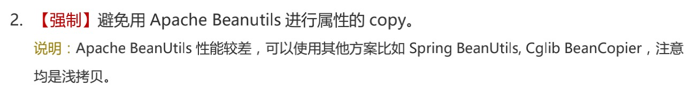

## 一、什么是浅拷贝和深拷贝

### 浅拷贝

对于基本数据类型的成员变量，浅拷贝直接进行值传递，也就是将属性值复制了一份给新的成员变量

对于引用数据类型的成员变量，比如成员变量是数组、某个类的对象等，浅拷贝就是引用的传递，也就是将成员变量的引用（内存地址）复制了一份给新的成员变量，他们指向的是同一个事例。在一个对象修改成员变量的值，会影响到另一个对象中成员变量的值。

### 深拷贝

对于基本数据类型，深拷贝复制所有基本数据类型的成员变量的值

对于引用数据类型的成员变量，深拷贝申请新的存储空间，并复制该引用对象所引用的对象，也就是将整个对象复制下来。所以在一个对象修改成员变量的值，不会影响到另一个对象成员变量的值。

## 二、浅拷贝

### 1、clone

* 实现 `Cloneable`
* 重写 `clone()`方法，并声明为 `public`
* 调用 `super.clone()`

:::code-group
```java [CopyDemo]
@Data
public class CopyDemo implements Cloneable{
    private int age;
    private User user;

    @Override
    public CopyDemo clone() {
        try {
            CopyDemo clone = (CopyDemo) super.clone();
            return clone;
        } catch (CloneNotSupportedException e) {
            throw new AssertionError();
        }
    }
}
```

```java [User]
@Data
public class User {
    private String name;
}
```

```java [使用]
@Service
public class CopyServiceDemo {

    public static void main(String[] args) {
        CopyDemo source=new CopyDemo();
        source.setAge(10);

        User user=new User();
        user.setName("user-旧名字");
        source.setUser(user);

        CopyDemo target = source.clone();
        System.out.println("改变之前");
        System.out.println("source："+source.getAge());
        System.out.println("target："+target.getAge());
        System.out.println("source-user："+source.getUser().getName());
        System.out.println("target-user："+target.getUser().getName());

        source.setAge(20);
        user.setName("user-新名字");

        System.out.println("改变之后");
        System.out.println("source："+source.getAge());
        System.out.println("target："+target.getAge());
        System.out.println("source-user："+source.getUser().getName());
        System.out.println("target-user："+target.getUser().getName());

    }
}
```

```java [结果]
改变之前
source：10
target：10
source-user：user-旧名字
target-user：user-旧名字
改变之后
source：20
target：10
source-user：user-新名字
target-user：user-新名字
```
:::

从以上结果可以看出

* 修改 `source` 的 `age`，并不会影响到拷贝之后的 `target` 的 `age`
* 修改 `source` 的 `user` 的 `name`，会影响到拷贝之后的 `targe` 的 `user` 的 `name`，因为 `target` 的 `user` 跟 `source` 的 `user` 所指向的是同一个 `user` 实例。

### 2、Apache BeanUtils（不推荐）

`Apache BeanUtils` 属于比较古老的工具类，由于存在性能问题，阿里巴巴手册明确禁止使用该工具类

性能差的原因是：力求做得完美, 在代码中增加了非常多的校验、兼容、日志打印等代码，过度的包装导致性能下降严重。



### 3、Spring BeanUtils

`Spring BeanUtils` 和上面所提到的 `apche` 的很像，但是在效率上比 `apache` 的更高

`Spring BeanUtils` 的 `copyProperties()` 方法，第一个是源对象，第二个是目标对象。和 `Apache BeanUtils` 正好相反，要注意避免踩坑。

```java
import org.springframework.beans.BeanUtils;

CopyDemo target=new CopyDemo();
BeanUtils.copyProperties(source, target);
```

### 4、Spring BeanCopier

`Spring` 还为我们提供了一种基于 `Cglib` 的浅拷贝方式 `BeanCopier`，引入 `spring-core` 依赖包后即可使用，它被认为是取代 `BeanUtils` 的存在。

以下是自己封装的工具类：

:::code-group
```java [BeanCopierUtils]
import org.springframework.cglib.beans.BeanCopier;

public static <T> T copyByClass(Object src, Class<T> clazz) {
  BeanCopier copier = BeanCopier.create(src.getClass(), clazz, false);
  T to = newInstance(clazz);
  copier.copy(src, to, null);
  return to;
}

public static <T> T newInstance(Class<?> clazz) {
  try {
      return (T) clazz.newInstance();
    } catch (InstantiationException e) {
        throw new RuntimeException(e);
    } catch (IllegalAccessException e) {
        throw new RuntimeException(e);
    }
}

public static void copyByObj(Object src, Object dist) {
  BeanCopier copier = BeanCopier
    .create(src.getClass(), dist.getClass(), false);
  copier.copy(src, dist, null);
 }
```

```java [使用]
CopyDemo target = copyByClass(source, CopyDemo.class);
```
:::

## 三、深拷贝

### 1、构造方法-new

手动 `new` 新的对象，一个属性一个属性的 `set` 过去，属性多的话，这样非常麻烦:

```java
    public static void main(String[] args) {
        CopyDemo source= new CopyDemo();
        source.setAge(10);

        User user=new User();
        user.setName("user-旧名字");
        source.setUser(user);

        CopyDemo target=new CopyDemo();
        target.setAge(source.getAge());
        User targetUser=new User();
        targetUser.setName(source.getUser().getName());
        target.setUser(targetUser);

        System.out.println("改变之前");
        System.out.println("source："+source.getAge());
        System.out.println("target："+target.getAge());
        System.out.println("source-user："+source.getUser().getName());
        System.out.println("target-user："+target.getUser().getName());

        source.setAge(20);
        user.setName("user-新名字");

        System.out.println("改变之后");
        System.out.println("source："+source.getAge());
        System.out.println("target："+target.getAge());
        System.out.println("source-user："+source.getUser().getName());
        System.out.println("target-user："+target.getUser().getName());
}

改变之前
source：10
target：10
source-user：user-旧名字
target-user：user-旧名字
改变之后
source：20
target：10
source-user：user-新名字
target-user：user-旧名字

Process finished with exit code 0
```

### 2、重载 clone()方法

* 拷贝的对象中还包含其他对象的话，包含的对象也需要重写 `clone` 方法
* `super.clone()`其实是浅拷贝，所以在重写 `CopyDemo` 类的 `clone()` 方法时，`user` 对象需要调用 `user.clone()` 重新赋值

:::code-group
```java [CopyDemo]
@Data
public class CopyDemo implements Cloneable{
    private int age;
    private User user;

    @Override
    public CopyDemo clone() {
        try {
            CopyDemo copyDemo = (CopyDemo) super.clone();
            copyDemo.setUser(this.user.clone());

            return copyDemo;
        } catch (CloneNotSupportedException e) {
            throw new AssertionError();
        }
    }
}
```
```java [User]
@Data
public class User implements Cloneable{
    private String name;

    @Override
    public User clone() {
        try {
            User clone = (User) super.clone();
            return clone;
        } catch (CloneNotSupportedException e) {
            throw new AssertionError();
        }
    }
}
```
```java [使用]
CopyDemo target = source.clone();
```
:::

### 3、Apache Commons Lang 序列化方式

`Java` 提供了序列化的能力，我们可以先将源对象进行序列化，再反序列化生成拷贝对象。但是，使用序列化的前提是拷贝的类（包括其成员变量）需要实现 `Serializable` 接口。
`Apache Commons Lang` 包对 `Java` 序列化进行了封装：`SerializationUtils`，我们可以直接使用它。

```java
@Data
public class CopyDemo implements Serializable {
    private static final long serialVersionUID = -9820808986091860L;
    private int age;
    private User user;
}

@Data
public class User implements Serializable {
    private static final long serialVersionUID = 1900781036567192607L;
    private String name;

}
```

**使用**

```java
import org.apache.commons.lang3.SerializationUtils;

CopyDemo target = SerializationUtils.clone(source);
```

### 4、json 转化方式

利用 `json` 将对象转为 `json`，在将 `json` 转为对象，本质上是反射:

```java
//对象
String jsonString = JSON.toJSONString(source);
CopyDemo target = JSON.parseObject(jsonString, CopyDemo.class);

//集合
List<CopyDemo> sourceList=Lists.newArrayList();
String jsonString = JSON.toJSONString(sourceList);
List<CopyDemo> targetList = JSON.parseArray(json,CopyDemo.class);
```

### 5、Orika

`orika` 是深拷贝，但是遇到多层签到数组，`clone` 会有问题，谨慎使用