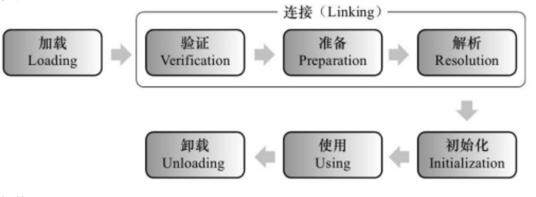
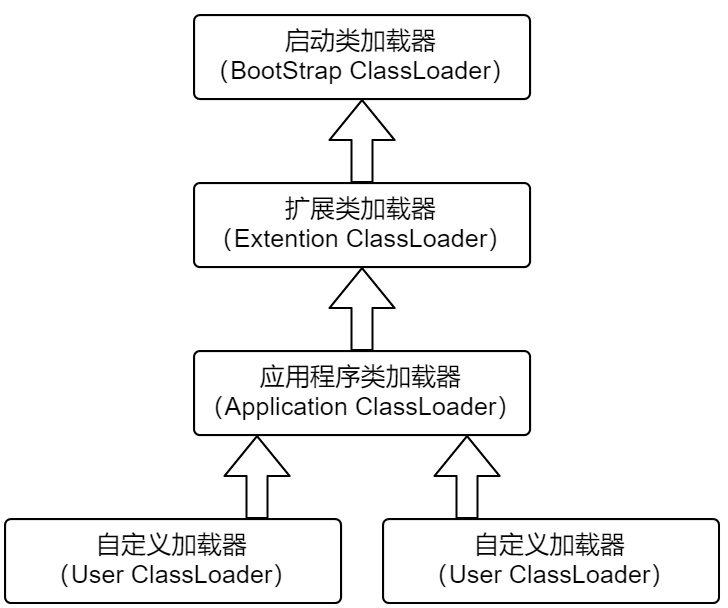
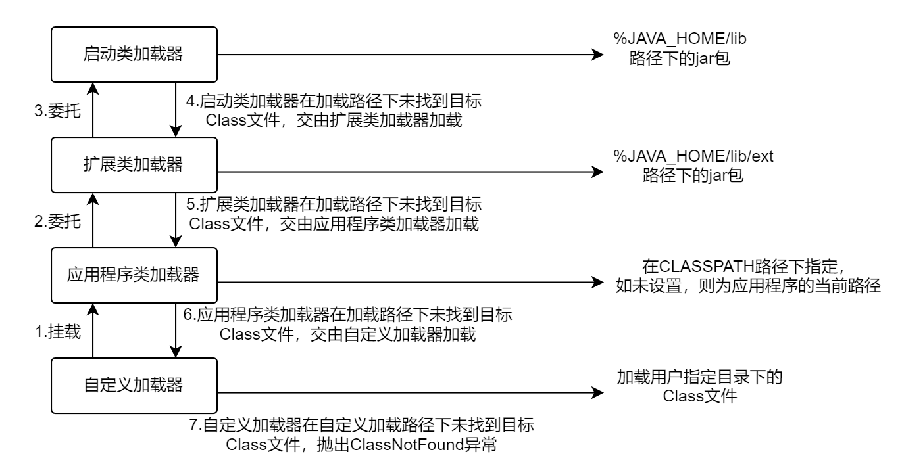

## 1、简述java类加载机制?

虚拟机把描述类的数据从Class文件加载到内存，并对数据进行`校验`，`解析`和`初始化`，最终形成可以被虚拟机直接使用的java类型。

## 2、描述一下JVM加载Class文件的原理机制

Java中的所有类，都需要由类加载器装载到JVM中才能运行。类加载器本身也是一个类，而它的工作就是把class文件从硬盘读取到内存中。在写程序的时候，我们几乎不需要关心类的加载，因为这些都是隐式装载的，除非我们有特殊的用法，像是反射，就需要显式的加载所需要的类。

类装载方式，有两种 ：

1. **隐式装载**， 程序在运行过程中当碰到通过new 等方式生成对象时，隐式调用类装载器加载对应的类到jvm中。
2. **显式装载**， 通过`class.forname()`等方法，显式加载需要的类。

Java类的加载是`动态的`，它并不会一次性将所有类全部加载后再运行，而是保证程序运行的基础类(像是基类)完全加载到jvm中，至于其他类，则在需要的时候才加载。这当然就是为了节省内存开销。

由于 Java 的跨平台性，经过编译的 Java 源程序并不是一个可执行程序，而是一个或多个类文件。当 Java 程序需要使用某个类时，JVM 会确保这个类已经被`加载`、`连接（验证、准备和解析）`和`初始化`。类的加载是指把类的`.class`文件中的数据读入到内存中，
通常是创建一个字节数组读入`.class`文件，然后产生与所加载类对应的 `Class` 对象。

加载完成后，`Class` 对象还不完整，所以此时的类还不可用。当类被加载后就进入连接阶段，这一阶段包括`验证`、`准备`（为静态变量分配内存并设置默认的初始值）和`解析`（将符号引用替换为直接引用）三个步骤。

最后 JVM 对类进行初始化，包括：
1) 如果类存在直接的父类并且这个类还没有被初始化，那么就先初始化父类；
2) 如果类中存在初始化语句，就依次执行这些初始化语句。

类的加载是由类加载器完成的，类加载器包括：根加载器（`BootStrap`）、扩展加载器（`Extension`）、系统加载器（`System`）和用户自定义类加载器（`java.lang.ClassLoader`的子类）。

从 Java 2（JDK 1.2）开始，类加载过程采取了父亲委托机制（`PDM`）。`PDM` 更好的保证了 Java 平台的安全性，在该机制中，JVM 自带的 `Bootstrap` 是根加载器，其他的加载器都有且仅有一个父类加载器。类的加载首先请求父类加载器加载，父类加载器无能为力时才由其子类加载器自行加载。
JVM 不会向 Java 程序提供对 `Bootstrap` 的引用。下面是关于几个类加载器的说明：

1. **Bootstrap**：一般用本地代码实现，负责加载 JVM 基础核心类库（`rt.jar`）；
2. **Extension**：从 `java.ext.dirs` 系统属性所指定的目录中加载类库，它的父加载器是 `Bootstrap`；
3. **System**：又叫应用类加载器，其父类是 `Extension`。它是应用最广泛的类加载器。它从环境变量 `classpath` 或者系统属性 `java.class.path` 所指定的目录中记载类，是用户自定义加载器的默认父加载器。

## 3、JVM 类加载机制

JVM 类加载机制分为五个部分：`加载`，`验证`，`准备`，`解析`，`初始化`，下面我们就分别来看一下这五个过程。

### 加载

加载是类加载过程中的一个阶段， 这个阶段会在内存中生成一个代表这个类的 `java.lang.Class` 对象，作为方法区这个类的各种数据的入口。注意这里不一定非得要从一个 `Class` 文件获取，这里既可以从 `ZIP` 包中读取（比如从 `jar` 包和 `war` 包中读取），
也可以在运行时计算生成（`动态代理`），也可以由其它文件生成（比如将 JSP 文件转换成对应的 Class 类）。

### 验证

这一阶段的主要目的是为了确保 Class 文件的字节流中包含的信息是否符合当前虚拟机的要求，并且不会危害虚拟机自身的安全。

### 准备

准备阶段是**正式为类变量分配内存并设置类变量的初始值阶段，即在方法区中分配这些变量所使用的内存空间**。注意这里所说的初始值概念，比如一个类变量定义为：实际上变量 `v` 在准备阶段过后的初始值为 `0` 而不是 `8080`， 
将 `v` 赋值为 `8080` 的 `put static` 指令是程序被编译后， 存放于类构造器方法之中。但是注意如果声明为：`public static final int v = 8080;` 在编译阶段会为 `v` 生成 `ConstantValue` 属性，在准备阶段虚拟机会根据 `ConstantValue` 属性将 `v` 赋值为 `8080`。

### 解析

解析阶段是指虚拟机将常量池中的符号引用替换为直接引用的过程。符号引用就是 class 文件中的：

1. **CONSTANT_Class_info**
2. **CONSTANT_Field_info**
3. **CONSTANT_Method_info** 等类型的常量。

#### 符号引用

符号引用与虚拟机实现的布局无关， 引用的目标并不一定要已经加载到内存中。 各种虚拟机实现的内存布局可以各不相同，但是它们能接受的符号引用必须是一致的，因为符号引用的字面量形式明确定义在 Java 虚拟机规范的 Class 文件格式中。

#### 直接引用

直接引用可以是指向目标的指针，相对偏移量或是一个能间接定位到目标的句柄。如果有了直接引用，那引用的目标必定已经在内存中存在。

### 初始化

初始化阶段是类加载最后一个阶段，前面的类加载阶段之后，除了在加载阶段可以自定义类加载器以外，其它操作都由 JVM 主导。到了初始阶段，才开始真正执行类中定义的 Java 程序代码。

### 类构造器

初始化阶段是执行类构造器方法的过程。 方法是由编译器自动收集类中的类变量的赋值操作和静态语句块中的语句合并而成的。虚拟机会保证子方法执行之前，父类的方法已经执行完毕， 如果一个类中没有对静态变量赋值也没有静态语句块，那么编译器可以不为这个类生成() 方法。
注意以下几种情况不会执行类初始化：

1. 通过子类引用父类的静态字段，只会触发父类的初始化，而不会触发子类的初始化。
2. 定义对象数组，不会触发该类的初始化。
3. 常量在编译期间会存入调用类的常量池中，本质上并没有直接引用定义常量的类，不会触发定义常量所在的类。
4. 通过类名获取 `Class` 对象，不会触发类的初始化。
5. 通过 `Class.forName` 加载指定类时，如果指定参数 `initialize` 为 `false` 时，也不会触发类初始化，其实这个参数是告诉虚拟机，是否要对类进行初始化。
6. 通过 `ClassLoader` 默认的 `loadClass` 方法，也不会触发初始化动作。

## 4、什么是类加载器，类加载器有哪些?

实现通过类的权限定名获取该类的`二进制字节流`的代码块叫做`类加载器`。

主要有一下四种类加载器:

1. **启动类加载器(Bootstrap ClassLoader)**: 用来加载java核心类库，无法被 java 程序直接引用。
2. **扩展类加载器(extensions class loader)**:它用来加载 Java 的扩展库。Java 虚拟机的实现会提供一个扩展库目录。该类加载器在此目录里面查找并加载 Java 类。
3. **系统类加载器(system class loader)**：它根据 Java 应用的类路径（`CLASSPATH`）来加载 Java 类。一般来说，Java 应用的类都是由它来完成加载的。可以通过 `ClassLoader.getSystemClassLoader()` 来获取它。
4. **用户自定义类加载器**: 通过继承 `java.lang.ClassLoader` 类的方式实现。

## 5、说一下类装载的执行过程？

类装载分为以下 5 个步骤：

* **加载**：根据查找路径找到相应的 class 文件然后导入；
* **验证**：检查加载的 class 文件的正确性；
* **准备**：给类中的静态变量分配内存空间；
* **解析**：虚拟机将常量池中的符号引用替换成直接引用的过程。符号引用就理解为一个标示，而在直接引用直接指向内存中的地址；
* **初始化**：对静态变量和静态代码块执行初始化工作。

## 6、什么是双亲委派模型？

在介绍双亲委派模型之前先说下类加载器。对于任意一个类，都需要由加载它的类加载器和这个类本身一同确立在 JVM 中的唯一性，每一个类加载器，都有一个独立的类名称空间。类加载器就是根据指定全限定名称将 class 文件加载到 JVM 内存，然后再转化为 class 对象。

**类加载器分类**：

* **启动类加载器（Bootstrap ClassLoader）**，是虚拟机自身的一部分，用来加载`Java_HOME/lib/`目录中的，或者被 `-Xbootclasspath` 参数所指定的路径中并且被虚拟机识别的类库；
* **扩展类加载器（Extension ClassLoader）**：负责加载`\lib\ext`目录或`Java.ext.dirs`系统变量指定的路径中的所有类库；
* **应用程序类加载器（Application ClassLoader）**。负责加载用户类路径（`classpath`）上的指定类库，我们可以直接使用这个类加载器。一般情况，如果我们没有自定义类加载器默认就是用这个加载器。

除了上面三种类加载器，我们也可以通过继承`java.lang.ClassLoader`实现自定义的类加载器。

**双亲委派模型**：

如果一个类加载器收到了类加载的请求，它首先不会自己去加载这个类，而是把这个请求委派给父类加载器去完成，每一层的类加载器都是如此，这样所有的加载请求都会被传送到顶层的启动类加载器中，只有当父加载无法完成加载请求（它的搜索范围中没找到所需的类）时，
子加载器才会尝试去加载类。当一个类收到了类加载请求时，不会自己先去加载这个类，而是将其委派给父类，由父类去加载，如果此时父类不能加载，反馈给子类，由子类去完成类的加载。

双亲委派类加载机制的类加载流程如下：

（1）将自定义加载器挂载到应用程序类加载器。

（2）应用程序类加载器将类加载器请求委托给扩展类加载器。

（3）扩展类加载器将类加载请求委托给启动类加载器。

（4）启动类加载器在加载路径下查找并加载Class文件。如果找不到目标Class文件，则交由扩展类加载器加载。

（5）扩展类加载器在加载路径下查找并加载Class文件，如果找不到目标Class文件，则交由应用程序类加载器加载。

（6）应用程序类加载器在加载路径下查找并加载Class文件，如果未找到目标Class文件，则交由自定义类加载器加载。

（7）在自定义加载器下查找并加载用户指定目录下的Class文件，如果在自定义加载路径下未找到目标Class文件，则抛出`ClassNotFound`异常。

## 7、为什么需要双亲委派模型？

在这里，先想一下，如果没有双亲委派，那么用户是不是可以自己定义一个`java.lang.Object`的同名类，`java.lang.String`的同名类，并把它放到`ClassPath`中,那么类之间的比较结果及类的唯一性将无法保证，因此，为什么需要双亲委派模型？**防止内存中出现多份同样的字节码**

## 8、可以打破双亲委派么，怎么打破。

打破双亲委派机制则不仅要继承`ClassLoader`类，还要重写`loadClass`和`findClass方`法。