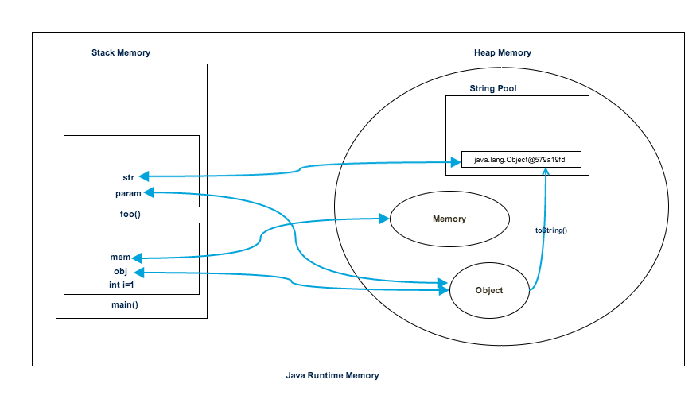

让我们通过一个简单的程序来了解堆和栈内存的使用情况:

```java
public class Memory {

	public static void main(String[] args) { // Line 1
		int i=1; // Line 2
		Object obj = new Object(); // Line 3
		Memory mem = new Memory(); // Line 4
		mem.foo(obj); // Line 5
	} // Line 9

	private void foo(Object param) { // Line 6
		String str = param.toString(); //// Line 7
		System.out.println(str);
	} // Line 8

}
```
下图显示了参考上述程序的栈和堆内存，以及它们如何用于存储基元、对象和引用变量:


我们来看看程序的执行步骤:

* 一旦我们运行程序，它就会将所有运行时类加载到堆空间中。当在第 1 行找到 `main()` 方法时，`Java` 运行时会创建供 `main()` 方法线程使用的栈内存。
* 我们在第 2 行创建原始局部变量，因此它被创建并存储在 `main()` 方法的栈内存中。
* 由于我们在第三行中创建一个对象，因此它是在堆内存中创建的，并且栈内存包含它的引用。当我们在第 4 行创建 `Memory` 对象时，会发生类似的过程。
* 现在，当我们在第 5 行调用 `foo()` 方法时，会在栈顶部创建一个块以供 `foo()` 方法使用。由于 `Java` 是`按值传递的`，因此在第 6 行的 `foo()` 栈块中创建了对 `Object` 的新引用。
* 第 7 行创建了一个字符串，它进入堆空间中的字符串池，并在 foo() 栈空间中为其创建了一个引用。
* `foo()`方法在第8行终止，此时栈中为`foo()`分配的内存块变得空闲。
* 在第 9 行，`main()` 方法终止，为 `main()` 方法创建的栈内存被销毁。此外，程序在这一行结束，因此 Java 运行时释放所有内存并结束程序的执行。

## Java堆空间和栈内存的区别

根据上面的解释，我们可以很容易地得出堆内存和栈内存的以下区别。

1. 堆内存由应用程序的所有部分使用，而栈内存仅由一个执行线程使用。
2. 每当创建一个对象时，它总是存储在堆空间中，并且栈内存包含对其的`引用`。栈内存仅包含`局部原始变量`和`堆空间中对象的引用变量`。
3. 存储在堆中的对象可以全局访问，而栈内存不能被其他线程访问。
4. 栈中的内存管理以 `LIFO` 方式完成，而堆内存中的内存管理更复杂，因为它是全局使用的。堆内存分为`Young-Generation`、`Old-Generation`等
5. 栈内存是短暂的，而堆内存从应用程序执行开始到结束都存在。
6. 我们可以使用`-Xms`和`-Xmx` JVM选项来定义堆内存的启动大小和最大大小。我们可以使用`-Xss`来定义栈内存大小。
7. 当栈内存已满时，`Java` 运行时会抛出错误`java.lang.StackOverFlowError`，而如果堆内存已满，则会抛出`java.lang.OutOfMemoryError: Java Heap Space`错误。
8. 与堆内存相比，栈内存大小非常小。由于内存分配 (`LIFO`) 简单，因此与堆内存相比，栈内存非常快。

## 另一种总结

* **物理地址**

堆的物理地址分配对对象是不连续的。因此性能慢些。在GC的时候也要考虑到不连续的分配，所以有各种算法。比如，标记-消除，复制，标记-压缩，分代（即新生代使用复制算法，老年代使用标记——压缩）

栈使用的是数据结构中的栈，先进后出的原则，物理地址分配是连续的。所以性能快。

* **内存分别**

堆因为是不连续的，所以分配的内存是在 运行期 确认的，因此大小不固定。一般堆大小远远大于栈。

栈是连续的，所以分配的内存大小要在 编译期 就确认，大小是固定的。

* **存放的内容**

堆存放: 对象的实例和数组。因此该区更关注的是数据的存储

栈存放: 局部变量，操作数栈，返回结果。该区更关注的是程序方法的执行。

:::tip PS
1. 静态变量放在方法区
2. 静态的对象还是放在堆。
:::

* **程序的可见度**

堆对于整个应用程序都是共享、可见的。

栈只对于线程是可见的。所以也是线程私有。他的生命周期和线程相同。