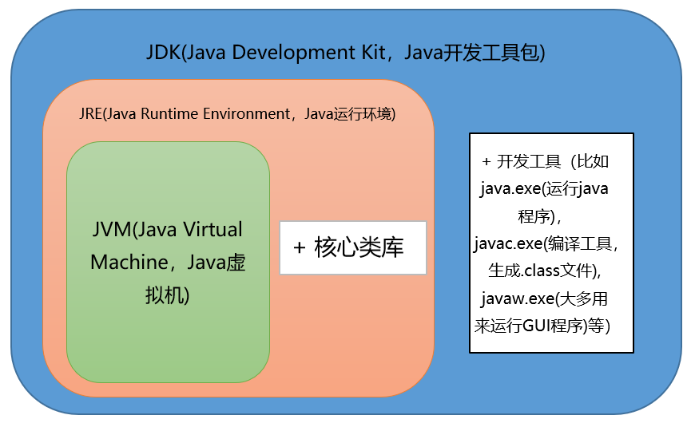

## JVM、JRE和JDK的关系

**JVM**

`Java Virtual Machine`是Java虚拟机，Java程序需要运行在虚拟机上，不同的平台有自己的虚拟机，因此Java语言可以实现跨平台。

**JRE**

`Java Runtime Environment`包括Java虚拟机和Java程序所需的核心类库等。核心类库主要是`java.lang`包：包含了运行Java程序必不可少的系统类，
如基本数据类型、基本数学函数、字符串处理、线程、异常处理类等，系统缺省加载这个包

如果想要运行一个开发好的Java程序，计算机中只需要安装JRE即可。

**JDK**

`Java Development Kit`是提供给Java开发人员使用的，其中包含了Java的开发工具，也包括了JRE。所以安装了JDK，就无需再单独安装JRE了。
其中的开发工具：编译工具(`javac.exe`)，打包工具(`jar.exe`)等

JVM & JRE & JDK关系图

