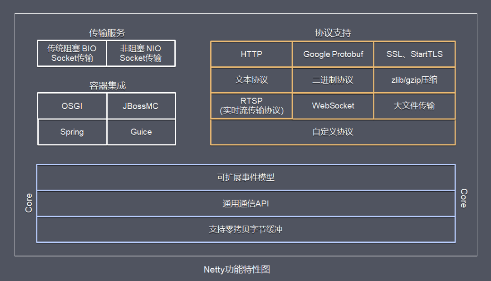
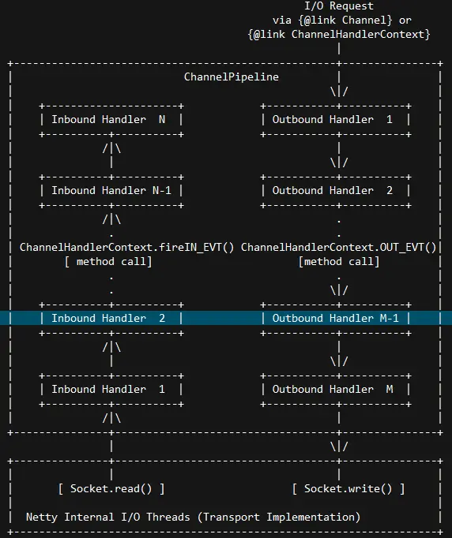

## 一、功能特性

* **传输服务** : 支持`BIO`和`NIO`
* **容器集成** : 支持`OSGI`、`JBossMC`、`Spring`、`Guice`容器
* **协议支持** : `HTTP`、`Protobuf`、`二进制`、`文本`、`WebSocket`等一系列常见协议都支持,还支持通过实行编码解码逻辑来实现自定义协议
* **Core核心** : 可扩展事件模型、通用通信API、支持零拷贝的`ByteBuf`缓冲对象

## 二、模块组件

### Bootstrap、ServerBootstrap

`Bootstrap`意思是引导，一个Netty应用通常由一个`Bootstrap`开始，主要作用是配置整个Netty程序，串联各个组件，Netty中`Bootstrap`类是客户端程序的启动引导类，
`ServerBootstrap`是服务端启动引导类。

### Future、ChannelFuture

正如前面介绍，在Netty中所有的IO操作都是异步的，不能立刻得知消息是否被正确处理，但是可以过一会等它执行完成或者直接注册一个监听，具体的实现就是通过`Future`和`ChannelFutures`，
他们可以注册一个监听，当操作执行成功或失败时监听会自动触发注册的监听事件。

### Channel

Netty网络通信的组件，能够用于执行网络I/O操作。 `Channel`为用户提供：

* 当前网络连接的通道的状态（例如是否打开？是否已连接？）
* 网络连接的配置参数 （例如接收缓冲区大小）
* 提供异步的网络I/O操作(如建立连接，读写，绑定端口)，异步调用意味着任何I/O调用都将立即返回，并且不保证在调用结束时所请求的I/O操作已完成。调用立即返回一个`ChannelFuture`实例，
通过注册监听器到`ChannelFuture`上，可以I/O操作成功、失败或取消时回调通知调用方。
* 支持关联I/O操作与对应的处理程序

不同协议、不同的阻塞类型的连接都有不同的 `Channel` 类型与之对应，下面是一些常用的 `Channel` 类型:

* **NioSocketChannel**，异步的客户端 `TCP Socket` 连接
* **NioServerSocketChannel**，异步的服务器端 `TCP Socket` 连接
* **NioDatagramChannel**，异步的 `UDP` 连接
* **NioSctpChannel**，异步的客户端 `Sctp` 连接
* **NioSctpServerChannel**，异步的 `Sctp` 服务器端连接 这些通道涵盖了`UDP`和`TCP`、`网络IO`以及`文件IO`

### Selector

Netty基于`Selector`对象实现`I/O多路复用`，通过 `Selector`, 一个线程可以监听多个连接的`Channel`事件,当向一个`Selector`中注册 `Channel` 后，
`Selector` 内部的机制就可以自动不断地查询(select) 这些注册的 `Channel` 是否有已就绪的I/O事件(例如可读, 可写, 网络连接完成等)，这样程序就可以很简单地使用一个线程高效地管理多个 `Channel` 。

### NioEventLoop

`NioEventLoop`中维护了一个线程和任务队列，支持异步提交执行任务，线程启动时会调用`NioEventLoop`的`run`方法，执行I/O任务和非I/O任务：

* I/O任务 即selectionKey中ready的事件，如accept、connect、read、write等，由processSelectedKeys方法触发。
* 非IO任务 添加到taskQueue中的任务，如register0、bind0等任务，由runAllTasks方法触发。

两种任务的执行时间比由变量ioRatio控制，默认为50，则表示允许非IO任务执行的时间与IO任务的执行时间相等。

### NioEventLoopGroup

`NioEventLoopGroup`，主要管理`eventLoop`的生命周期，可以理解为一个线程池，内部维护了一组线程，每个线程(`NioEventLoop`)负责处理多个`Channel`上的事件，而一个`Channel`只对应于一个线程。

### ChannelHandler

`ChannelHandler`是一个接口，处理I/O事件或拦截I/O操作，并将其转发到其`ChannelPipeline`(业务处理链)中的下一个处理程序。

`ChannelHandler`本身并没有提供很多方法，因为这个接口有许多的方法需要实现，方便使用期间，可以继承它的子类：

* `ChannelInboundHandler`用于处理入站I/O事件
* `ChannelOutboundHandler`用于处理出站I/O操作

或者使用以下适配器类：

* `ChannelInboundHandlerAdapter`用于处理入站I/O事件
* `ChannelOutboundHandlerAdapter`用于处理出站I/O操作
* `ChannelDuplexHandler`用于处理入站和出站事件

### ChannelHandlerContext

保存`Channel`相关的所有上下文信息，同时关联一个`ChannelHandler`对象

### ChannelPipeline

保存`ChannelHandler`的`List`，用于处理或拦截`Channel`的入站事件和出站操作。 `ChannelPipeline`实现了一种高级形式的拦截过滤器模式，使用户可以完全控制事件的处理方式，
以及`Channel`中各个的`ChannelHandler`如何相互交互。

下图引用Netty的Javadoc4.1中`ChannelPipeline`的说明，描述了`ChannelPipeline`中`ChannelHandler`通常如何处理I/O事件。 I/O事件由`ChannelInboundHandler`或`ChannelOutboundHandler`处理，
并通过调用`ChannelHandlerContext`中定义的事件传播方法（例如`ChannelHandlerContext.fireChannelRead（Object）`和 `ChannelOutboundInvoker.write（Object）`）转发到其最近的处理程序。

入站事件由自下而上方向的入站处理程序处理，如图左侧所示。 入站`Handler`处理程序通常处理由图底部的I/O线程生成的入站数据。 通常通过实际输入操作（例如`SocketChannel.read（ByteBuffer）`）从远程读取入站数据。

出站事件由上下方向处理，如图右侧所示。 出站`Handler`处理程序通常会生成或转换出站传输，例如`write`请求。 I/O线程通常执行实际的输出操作，例如`SocketChannel.write（ByteBuffer）`。

在 Netty 中每个 `Channel` 都有且仅有一个 `ChannelPipeline` 与之对应, 它们的组成关系如下:

一个 `Channel` 包含了一个 `ChannelPipeline`, 而 `ChannelPipeline` 中又维护了一个由 `ChannelHandlerContext` 组成的双向链表, 
并且每个 `ChannelHandlerContext` 中又关联着一个`ChannelHandler`。入站事件和出站事件在一个双向链表中，入站事件会从链表`head`往后传递到最后一个入站的`handler`，
出站事件会从链表`tail`往前传递到最前一个出站的`handler`，两种类型的`handler`互不干扰。

