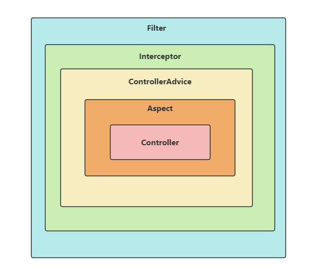

## 一. @ControllerAdvice注解作用

`@ControllerAdvice`，是Spring3.2提供的新注解，它是一个`Controller`增强器，可对`Controller`进行增强处理。

* 配合`@ExceptionHandler`注解，进行全局异常处理。
* 配合`@InitBinder`注解，用来设置`WebDataBinder`，用于自动绑定前台请求参数到Model中，全局数据预处理，多用于表单提交数据或者url传参。
* 配合`@ModelAttribute`注解，让`Controller`类中所有的方法都可以获取到通过`@ModelAttribute`注解设置的值，进行全局数据绑定。

❗❗❗注意：`@ControllerAdvice`注解将作用在所有`Controller`层的方法上。

