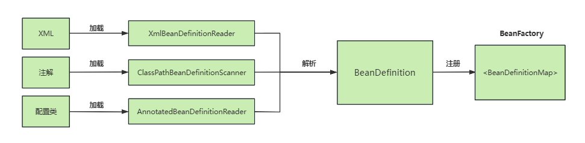
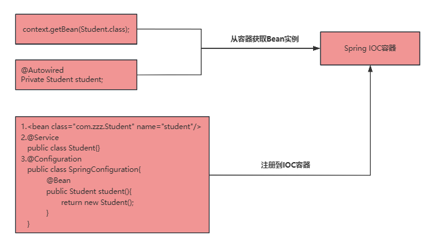

Spring IOC的工作流程大致可以分为三个阶段。

## 第一个阶段，就是IOC容器的初始化

这个阶段主要是根据程序中定义的XML或者注解等Bean的声明方式

通过解析和加载后生成`BeanDefinition`，然后把`BeanDefinition`注册到`IOC`容器。



通过`注解`或者`xml`声明的`bean`都会解析得到一个`BeanDefinition`实体，实体中包含这个`bean`中定义的基本属性。

最后把这个`BeanDefinition`保存到一个`Map`集合里面，从而完成了`IOC`的初始化。

`IOC`容器的作用就是对这些注册的`Bean`的定义信息进行处理和维护，它`IOC`容器控制反转的核心。

## 第二个阶段，完成Bean初始化及依赖注入

然后进入到第二个阶段，这个阶段会做两个事情:

1. 通过反射针对没有设置`lazy-init`属性的单例`bean`进行初始化。
2. 完成`Bean`的依赖注入。


## 第三个阶段，Bean的使用

通常我们会通过`@Autowired`或者`BeanFactory.getBean()`从`IOC`容器中获取指定的`bean`实例。

另外，针对设置`lazy-init`属性以及非单例`bean`的实例化，是在每次获取`bean`对象的时候，调用`bean`的初始化方法来完成实例化的，并且Spring IOC容器不会去管理这些`Bean`。



## 源码解释

```java
public abstract class AbstractApplicationContext extends DefaultResourceLoader
		implements ConfigurableApplicationContext {
    
	... 
	
	@Override
	public void refresh() throws BeansException, IllegalStateException {
		synchronized (this.startupShutdownMonitor) {
			//1 刷新前的预处理
			prepareRefresh();
            //2 获取BeanFactory；刚创建的默认DefaultListableBeanFactory
			ConfigurableListableBeanFactory beanFactory = obtainFreshBeanFactory();
            //3 BeanFactory的预准备工作（BeanFactory进行一些设置）
			prepareBeanFactory(beanFactory);

			try {
		    	// 4 BeanFactory准备工作完成后进行的后置处理工作；
				postProcessBeanFactory(beanFactory);
 /**************************以上是BeanFactory的创建及预准备工作  ****************/
 
                // 5 执行BeanFactoryPostProcessor的方法；
				invokeBeanFactoryPostProcessors(beanFactory);
               
                //6 注册BeanPostProcessor（Bean的后置处理器）
				registerBeanPostProcessors(beanFactory);
                
                 // 7 initMessageSource();初始化MessageSource组件（做国际化功能；消息绑定，消息解析）；
				initMessageSource();
                
                 // 8 初始化事件派发器
				initApplicationEventMulticaster();
               
                // 9 子类重写这个方法，在容器刷新的时候可以自定义逻辑；
				onRefresh();
               
                // 10 给容器中将所有项目里面的ApplicationListener注册进来
				registerListeners();

                // 11.初始化所有剩下的单实例bean；
				finishBeanFactoryInitialization(beanFactory);

                 // 12.完成BeanFactory的初始化创建工作；IOC容器就创建完成；
				finishRefresh();
			}
			catch (BeansException ex) {
				if (logger.isWarnEnabled()) {
					logger.warn("Exception encountered during context initialization - " +
							"cancelling refresh attempt: " + ex);
				}

				destroyBeans();

				cancelRefresh(ex);

				throw ex;
			}
            finally {
				resetCommonCaches();
			}
		}
	}
    
	...
    
}
```

1. 首先是一个`synchronized`加锁，当然要加锁，不然你先调一次`refresh()`然后这次还没处理完又调一次，就会乱套了；

2. 接着往下看`prepareRefresh();`这个方法是做准备工作的，记录容器的启动时间、标记`“已启动”`状态、处理配置文件中的占位符，可以点进去看看，这里就不多说了。

3. 下一步`ConfigurableListableBeanFactory beanFactory = obtainFreshBeanFactory();`这个就很重要了，这一步是把配置文件解析成一个个Bean，并且注册到`BeanFactory`中，注意这里只是注册进去，并没有初始化。先继续往下看

4. 然后是`prepareBeanFactory(beanFactory);`这个方法的作用是：设置 `BeanFactory` 的类加载器，添加几个 `BeanPostProcessor`，手动注册几个特殊的 bean，这里都是spring里面的特殊处理，然后继续往下看

5. `postProcessBeanFactory(beanFactory);`方法是提供给子类的扩展点，到这里的时候，所有的 Bean 都加载、注册完成了，但是都还没有初始化，具体的子类可以在这步的时候添加一些特殊的 `BeanFactoryPostProcessor` 的实现类，来完成一些其他的操作。

6. 接下来是`invokeBeanFactoryPostProcessors(beanFactory);`这个方法是调用 `BeanFactoryPostProcessor` 各个实现类的 `postProcessBeanFactory(factory)` 方法；

7. 然后是`registerBeanPostProcessors(beanFactory);`这个方法注册 `BeanPostProcessor` 的实现类，和上面的 `BeanFactoryPostProcessor` 是有区别的，这个方法调用的其实是`PostProcessorRegistrationDelegate`类的`registerBeanPostProcessors`方法；
这个类里面有个内部类`BeanPostProcessorChecker`，`BeanPostProcessorChecker`里面有两个方法`postProcessBeforeInitialization`和`postProcessAfterInitialization`，这两个方法分别在 Bean 初始化之前和初始化之后得到执行。
然后回到`refresh()`方法中继续往下看

8. `initMessageSource();`方法是初始化当前 `ApplicationContext` 的 `MessageSource`，国际化处理，继续往下

9. `initApplicationEventMulticaster();`方法初始化当前 `ApplicationContext` 的事件广播器继续往下

10. `onRefresh();`方法初始化一些特殊的 Bean（在初始化 `singleton beans` 之前）；继续往下

11. `registerListeners();`方法注册事件监听器，监听器需要实现 `ApplicationListener` 接口；继续往下

12. 重点到了：`finishBeanFactoryInitialization(beanFactory);`初始化所有的 `singleton beans`（单例bean），懒加载（`non-lazy-init`）的除外

13. `finishRefresh();`方法是最后一步，广播事件，`ApplicationContext` 初始化完成

https://www.jianshu.com/p/a0b553529fb9