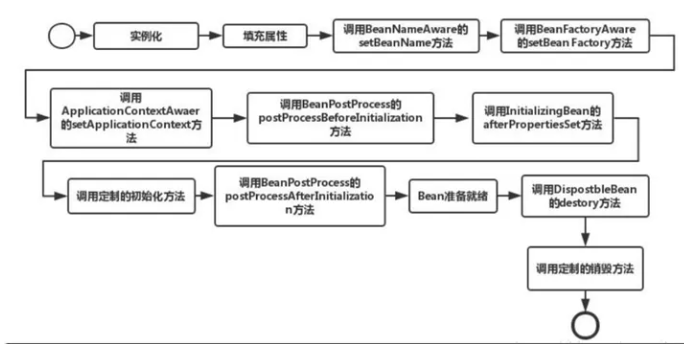

1. 使用`xml`的方式来声明Bean的定义，Spring容器在启动的时候会加载并解析这个`xml`，把bean装载到ioc容器中。

2. 使用`@ComponentScan`注解来扫描声明了`@Controller`、`@Service`、`@Repository`、`@Component`注解的类。

3. 使用`@Configuration`注解声明配置类，并使用`@Bean`注解实现Bean的定义，这种方式其实是`xml`配置方式的一种演变。

4. 使用`@Import`注解，导入配置类或者普通的Bean。

5. 使用`FactoryBean`工厂bean，动态构建一个Bean实例，Spring Cloud OpenFeign里面的动态代理实例就是使用`FactoryBean`来实现的。

6. 实现`ImportBeanDefinitionRegistrar`接口，可以动态注入Bean实例。这个在spring boot里面的启动注解有用到。

7. 实现`ImportSelector`接口，动态批量注入配置类或者Bean对象，这个在spring boot里面的自动装配机制里面有用到。

