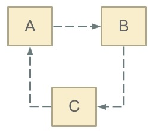
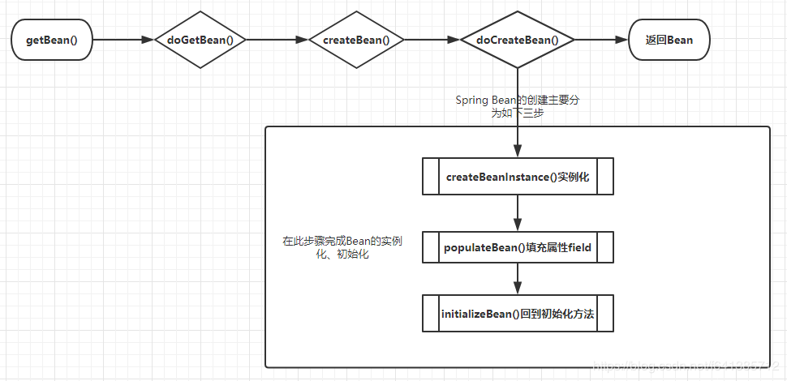
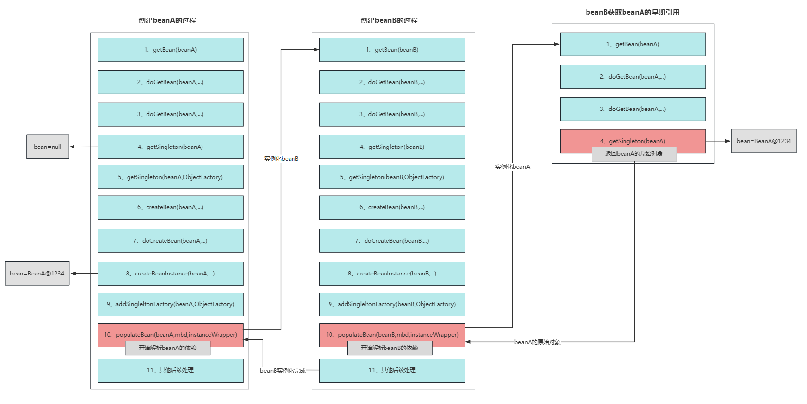

**循环依赖：就是N个类循环(嵌套)引用。**

通俗的讲就是N个Bean互相引用对方，最终形成闭环。用一副经典的图示可以表示成这样（`A`、`B`、`C`都代表对象，虚线代表引用关系）：



>注意：其实可以N=1，也就是极限情况的循环依赖：自己依赖自己 
> 
> 另需注意：这里指的循环引用不是方法之间的循环调用，而是对象的相互依赖关系。（方法之间循环调用若有出口也是能够正常work的）

可以设想一下这个场景：如果在日常开发中我们用`new`对象的方式，若构造函数之间发生这种循环依赖的话，程序会在运行时一直循环调用最终导致内存溢出，示例代码如下：

```java
public class Main {

    public static void main(String[] args) throws Exception {
        System.out.println(new A());
    }

}

class A {
    public A() {
        new B();
    }
}

class B {
    public B() {
        new A();
    }
}
```

运行报错：

```shell
Exception in thread "main" java.lang.StackOverflowError
```

这是一个典型的循环依赖问题。本文说一下Spring是如果巧妙的解决平时我们会遇到的三大循环依赖问题的

## 一、Spring Bean的循环依赖

```java
@Service
public class AServiceImpl implements AService {
    @Autowired
    private BService bService;
    ...
}
@Service
public class BServiceImpl implements BService {
    @Autowired
    private AService aService;
    ...
}
```

这其实就是Spring环境下典型的循环依赖场景。但是很显然，这种循环依赖场景，Spring已经完美的帮我们解决和规避了问题。所以即使平时我们这样循环引用，也能够整成进行我们的coding之旅~

## 二、Spring中三大循环依赖场景演示

Spring环境中，因为我们的Bean的实例化、初始化都是交给了容器，因此它的循环依赖主要表现为下面三种场景。为了方便演示，我准备了如下两个类：


### 1、构造器注入循环依赖

```java
@Service
public class A {
    public A(B b) {
    }
}
@Service
public class B {
    public B(A a) {
    }
}
```

结果：项目启动失败抛出异常`BeanCurrentlyInCreationException`

```shell
Caused by: org.springframework.beans.factory.BeanCurrentlyInCreationException: Error creating bean with name 'a': Requested bean is currently in creation: Is there an unresolvable circular reference?
	at org.springframework.beans.factory.support.DefaultSingletonBeanRegistry.beforeSingletonCreation(DefaultSingletonBeanRegistry.java:339)
	at org.springframework.beans.factory.support.DefaultSingletonBeanRegistry.getSingleton(DefaultSingletonBeanRegistry.java:215)
	at org.springframework.beans.factory.support.AbstractBeanFactory.doGetBean(AbstractBeanFactory.java:318)
	at org.springframework.beans.factory.support.AbstractBeanFactory.getBean(AbstractBeanFactory.java:199)
```

:::tip
构造器注入构成的循环依赖，此种循环依赖方式是无法解决的，只能抛出`BeanCurrentlyInCreationException`异常表示循环依赖。这也是构造器注入的最大劣势

**根本原因**：Spring解决循环依赖依靠的是Bean的`“中间态”`这个概念，而这个中间态指的是已经实例化，但还没初始化的状态。而构造器是完成实例化的东东，所以构造器的循环依赖无法解决
:::

### 2、field属性注入（setter方法注入）循环依赖

这种方式是我们最最最最为常用的依赖注入方式（所以猜都能猜到它肯定不会有问题啦）：

```java
@Service
public class A {
    @Autowired
    private B b;
}

@Service
public class B {
    @Autowired
    private A a;
}
```

结果：项目启动成功，能够正常work

setter方法注入方式因为原理和字段注入方式类似，此处不多加演示

### 3、prototype field属性注入循环依赖

`prototype`在平时使用情况较少，但是也并不是不会使用到，因此此种方式也需要引起重视。

```java
@Scope(ConfigurableBeanFactory.SCOPE_PROTOTYPE)
@Service
public class A {
    @Autowired
    private B b;
}

@Scope(ConfigurableBeanFactory.SCOPE_PROTOTYPE)
@Service
public class B {
    @Autowired
    private A a;
}
```

结果：需要注意的是本例中启动时是不会报错的（因为非单例Bean默认不会初始化，而是使用时才会初始化），所以很简单咱们只需要手动`getBean()`或者在一个单例Bean内`@Autowired`一下它即可

```java
// 在单例Bean内注入
    @Autowired
    private A a;
```

这样子启动就报错：

```shell
org.springframework.beans.factory.UnsatisfiedDependencyException: Error creating bean with name 'mytest.TestSpringBean': Unsatisfied dependency expressed through field 'a'; nested exception is org.springframework.beans.factory.UnsatisfiedDependencyException: Error creating bean with name 'a': Unsatisfied dependency expressed through field 'b'; nested exception is org.springframework.beans.factory.UnsatisfiedDependencyException: Error creating bean with name 'b': Unsatisfied dependency expressed through field 'a'; nested exception is org.springframework.beans.factory.BeanCurrentlyInCreationException: Error creating bean with name 'a': Requested bean is currently in creation: Is there an unresolvable circular reference?

	at org.springframework.beans.factory.annotation.AutowiredAnnotationBeanPostProcessor$AutowiredFieldElement.inject(AutowiredAnnotationBeanPostProcessor.java:596)
	at org.springframework.beans.factory.annotation.InjectionMetadata.inject(InjectionMetadata.java:90)
	at org.springframework.beans.factory.annotation.AutowiredAnnotationBeanPostProcessor.postProcessProperties(AutowiredAnnotationBeanPostProcessor.java:374)
```

可能有的小伙伴看到网上有说使用`@Lazy`注解解决：

```java
    @Lazy
    @Autowired
    private A a;
```

此处负责任的告诉你这样是解决不了问题的(可能会掩盖问题)，`@Lazy`只是延迟初始化而已，当你真正使用到它（初始化）的时候，依旧会报如上异常。

### 4、总结

对于Spring循环依赖的情况总结如下：

**不能解决的情况：**

1. 构造器注入循环依赖
2. `prototype field`属性注入循环依赖

**能解决的情况：**

1. `field`属性注入（`setter`方法注入）循环依赖

## 四、Spring解决循环依赖的原理分析

在这之前需要明白java中所谓的`引用传递`和`值传递`的区别。

:::tip 说明
看到这句话可能有小伙伴就想喷我了。java中明明都是值传递啊，这是我初学java时背了100遍的面试题，怎么可能有错？？？

这就是我做这个申明的必要性：伙计，你的说法是正确的，java中只有值传递。但是本文借用引用传递来辅助讲解，希望小伙伴明白我想表达的意思~
:::

Spring的循环依赖的理论依据基于Java的引用传递，当获得对象的引用时，对象的属性是可以延后设置的。（但是构造器必须是在获取引用之前，毕竟你的引用是靠构造器给你生成的）

### 1、Spring创建Bean的流程

首先需要了解是Spring它创建Bean的流程，我把它的大致调用栈绘图如下：



对Bean的创建最为核心三个方法解释如下：

* `createBeanInstance`：例化，其实也就是调用对象的`构造方法`实例化对象
* `populateBean`：填充属性，这一步主要是对bean的依赖属性进行注入(`@Autowired`)
* `initializeBean`：回到一些形如`initMethod`、`InitializingBean`等方法

从对单例Bean的初始化可以看出，循环依赖主要发生在第二步（`populateBean`），也就是`field`属性注入的处理。

### 2、Spring容器的'三级缓存'

在Spring容器的整个声明周期中，**单例Bean有且仅有一个对象**。这很容易让人想到可以用缓存来加速访问。

从源码中也可以看出Spring大量运用了`Cache`的手段，在循环依赖问题的解决过程中甚至不惜使用了`“三级缓存”`，这也便是它设计的精妙之处~

三级缓存其实它更像是Spring容器工厂的内的术语，采用三级缓存模式来解决循环依赖问题，这三级缓存分别指：

```java
public class DefaultSingletonBeanRegistry extends SimpleAliasRegistry implements SingletonBeanRegistry {
	...
	// 从上至下 分表代表这“三级缓存”
	private final Map<String, Object> singletonObjects = new ConcurrentHashMap<>(256); //一级缓存
	private final Map<String, Object> earlySingletonObjects = new HashMap<>(16); // 二级缓存
	private final Map<String, ObjectFactory<?>> singletonFactories = new HashMap<>(16); // 三级缓存
	...
	
	/** Names of beans that are currently in creation. */
	// 这个缓存也十分重要：它表示bean创建过程中都会在里面呆着~
	// 它在Bean开始创建时放值，创建完成时会将其移出~
	private final Set<String> singletonsCurrentlyInCreation = Collections.newSetFromMap(new ConcurrentHashMap<>(16));

	/** Names of beans that have already been created at least once. */
	// 当这个Bean被创建完成后，会标记为这个 注意：这里是set集合 不会重复
	// 至少被创建了一次的  都会放进这里~~~~
	private final Set<String> alreadyCreated = Collections.newSetFromMap(new ConcurrentHashMap<>(256));
}
```

注：`AbstractBeanFactory`继承自`DefaultSingletonBeanRegistry`

* `singletonObjects`：用于存放完全初始化好的 bean，从该缓存中取出的 bean 可以直接使用
* `earlySingletonObjects`：提前曝光的单例对象的`cache`，存放原始的 bean 对象（尚未填充属性），用于解决循环依赖
* `singletonFactories`：单例对象工厂的`cache`，存放 bean 工厂对象，用于解决循环依赖

获取单例Bean的源码如下：

```java
public class DefaultSingletonBeanRegistry extends SimpleAliasRegistry implements SingletonBeanRegistry {
	...
	@Override
	@Nullable
	public Object getSingleton(String beanName) {
		return getSingleton(beanName, true);
	}
	@Nullable
	protected Object getSingleton(String beanName, boolean allowEarlyReference) {
		Object singletonObject = this.singletonObjects.get(beanName);
		if (singletonObject == null && isSingletonCurrentlyInCreation(beanName)) {
			synchronized (this.singletonObjects) {
				singletonObject = this.earlySingletonObjects.get(beanName);
				if (singletonObject == null && allowEarlyReference) {
					ObjectFactory<?> singletonFactory = this.singletonFactories.get(beanName);
					if (singletonFactory != null) {
						singletonObject = singletonFactory.getObject();
						this.earlySingletonObjects.put(beanName, singletonObject);
						this.singletonFactories.remove(beanName);
					}
				}
			}
		}
		return singletonObject;
	}
	...
	public boolean isSingletonCurrentlyInCreation(String beanName) {
		return this.singletonsCurrentlyInCreation.contains(beanName);
	}
	protected boolean isActuallyInCreation(String beanName) {
		return isSingletonCurrentlyInCreation(beanName);
	}
	...
}
```

1. 先从一级缓存`singletonObjects`中去获取。（如果获取到就直接return）
2. 如果获取不到或者对象正在创建中（`isSingletonCurrentlyInCreation()`），那就再从二级缓存`earlySingletonObjects`中获取。（如果获取到就直接return）
3. 如果还是获取不到，且允许`singletonFactories（allowEarlyReference=true）`通过`getObject()`获取。就从三级缓存`singletonFactory.getObject()`获取。
（如果获取到了就从`singletonFactories`中移除，并且放进`earlySingletonObjects`。其实也就是从三级缓存`移动`（是剪切、不是复制哦~）到了二级缓存）

> 加入`singletonFactories`三级缓存的前提是执行了构造器，所以构造器的循环依赖没法解决   

### 3、流程总结

此处以如上的A、B类的互相依赖注入为例，在这里表达出关键代码的走势：

1、入口处即是实例化、初始化A这个单例Bean。`AbstractBeanFactory.doGetBean("a")`

```java
protected <T> T doGetBean(...){
	... 
	// 标记beanName a是已经创建过至少一次的~~~ 它会一直存留在缓存里不会被移除（除非抛出了异常）
	// 参见缓存Set<String> alreadyCreated = Collections.newSetFromMap(new ConcurrentHashMap<>(256))
	if (!typeCheckOnly) {
		markBeanAsCreated(beanName);
	}

	// 此时a不存在任何一级缓存中，且不是在创建中  所以此处返回null
	// 此处若不为null，然后从缓存里拿就可以了(主要处理FactoryBean和BeanFactory情况吧)
	Object beanInstance = getSingleton(beanName, false);
	...
	// 这个getSingleton方法非常关键。
	//1、标注a正在创建中~
	//2、调用singletonObject = singletonFactory.getObject();（实际上调用的是createBean()方法）  因此这一步最为关键
	//3、此时实例已经创建完成  会把a移除整整创建的缓存中
	//4、执行addSingleton()添加进去。（备注：注册bean的接口方法为registerSingleton，它依赖于addSingleton方法）
	sharedInstance = getSingleton(beanName, () -> { ... return createBean(beanName, mbd, args); });
}
```

2、下面进入到最为复杂的`AbstractAutowireCapableBeanFactory.createBean/doCreateBean()`环节，创建A的实例:

```java
protected Object doCreateBean(){
	...
	// 使用构造器/工厂方法   instanceWrapper是一个BeanWrapper
	instanceWrapper = createBeanInstance(beanName, mbd, args);
	// 此处bean为"原始Bean"   也就是这里的A实例对象：A@1234
	final Object bean = instanceWrapper.getWrappedInstance();
	...
	// 是否要提前暴露（允许循环依赖）  现在此处A是被允许的
	boolean earlySingletonExposure = (mbd.isSingleton() && this.allowCircularReferences && isSingletonCurrentlyInCreation(beanName));
	
	// 允许暴露，就把A绑定在ObjectFactory上，注册到三级缓存`singletonFactories`里面去保存着
	// Tips:这里后置处理器的getEarlyBeanReference方法会被促发，自动代理创建器在此处创建代理对象（注意执行时机 为执行三级缓存的时候）
	if (earlySingletonExposure) {
		addSingletonFactory(beanName, () -> getEarlyBeanReference(beanName, mbd, bean));
	}
	...
	// exposedObject 为最终返回的对象，此处为原始对象bean也就是A@1234,下面会有用处
	Object exposedObject = bean; 
	// 给A@1234属性完成赋值，@Autowired在此处起作用~
	// 因此此处会调用getBean("b")，so 会重复上面步骤创建B类的实例
	// 此处我们假设B已经创建好了 为B@5678
	
	// 需要注意的是在populateBean("b")的时候依赖有beanA，所以此时候调用getBean("a")最终会调用getSingleton("a")，
	//此时候上面说到的getEarlyBeanReference方法就会被执行。这也解释为何我们@Autowired是个代理对象，而不是普通对象的根本原因
	
	populateBean(beanName, mbd, instanceWrapper);
	// 实例化。这里会执行后置处理器BeanPostProcessor的两个方法
	// 此处注意：postProcessAfterInitialization()是有可能返回一个代理对象的，这样exposedObject 就不再是原始对象了  特备注意哦~~~
	// 比如处理@Aysnc的AsyncAnnotationBeanPostProcessor它就是在这个时间里生成代理对象的（有坑，请小心使用@Aysnc）
	exposedObject = initializeBean(beanName, exposedObject, mbd);

	... // 至此，相当于A@1234已经实例化完成、初始化完成（属性也全部赋值了~）
	// 这一步我把它理解为校验：校验：校验是否有循环引用问题~~~~~

	if (earlySingletonExposure) {
		// 注意此处第二个参数传的false，表示不去三级缓存里singletonFactories再去调用一次getObject()方法了~~~
		// 上面建讲到了由于B在初始化的时候，会触发A的ObjectFactory.getObject()  所以a此处已经在二级缓存earlySingletonObjects里了
		// 因此此处返回A的实例：A@1234
		Object earlySingletonReference = getSingleton(beanName, false);
		if (earlySingletonReference != null) {
		
			// 这个等式表示，exposedObject若没有再被代理过，这里就是相等的
			// 显然此处我们的a对象的exposedObject它是没有被代理过的  所以if会进去~
			// 这种情况至此，就全部结束了~~~
			if (exposedObject == bean) {
				exposedObject = earlySingletonReference;
			}
	
			// 继续以A为例，比如方法标注了@Aysnc注解，exposedObject此时候就是一个代理对象，因此就会进到这里来
			//hasDependentBean(beanName)是肯定为true，因为getDependentBeans(beanName)得到的是["b"]这个依赖
			else if (!this.allowRawInjectionDespiteWrapping && hasDependentBean(beanName)) {
				String[] dependentBeans = getDependentBeans(beanName);
				Set<String> actualDependentBeans = new LinkedHashSet<>(dependentBeans.length);

				// A@1234依赖的是["b"]，所以此处去检查b
				// 如果最终存在实际依赖的bean：actualDependentBeans不为空 那就抛出异常  证明循环引用了~
				for (String dependentBean : dependentBeans) {
					// 这个判断原则是：如果此时候b并还没有创建好，this.alreadyCreated.contains(beanName)=true表示此bean已经被创建过，就返回false
					// 若该bean没有在alreadyCreated缓存里，就是说没被创建过(其实只有CreatedForTypeCheckOnly才会是此仓库)
					if (!removeSingletonIfCreatedForTypeCheckOnly(dependentBean)) {
						actualDependentBeans.add(dependentBean);
					}
				}
				if (!actualDependentBeans.isEmpty()) {
					throw new BeanCurrentlyInCreationException(beanName,
							"Bean with name '" + beanName + "' has been injected into other beans [" +
							StringUtils.collectionToCommaDelimitedString(actualDependentBeans) +
							"] in its raw version as part of a circular reference, but has eventually been " +
							"wrapped. This means that said other beans do not use the final version of the " +
							"bean. This is often the result of over-eager type matching - consider using " +
							"'getBeanNamesOfType' with the 'allowEagerInit' flag turned off, for example.");
				}
			}
		}
	}
}
```

由于关键代码部分的步骤不太好拆分，为了更具象表达，那么使用下面一副图示帮助小伙伴们理解：



依旧以上面A、B类使用属性field注入循环依赖的例子为例，对整个流程做文字步骤总结如下：

1. 使用`context.getBean(A.class)`，旨在获取容器内的单例A(若A不存在，就会走A这个Bean的创建流程)，显然初次获取A是不存在的，因此走A的创建之路
2. 实例化A（注意此处仅仅是实例化），并将它放进缓存（此时A已经实例化完成，已经可以被引用了）
3. 初始化A：`@Autowired`依赖注入B（此时需要去容器内获取B）
4. 为了完成依赖注入B，会通过`getBean(B)`去容器内找B。但此时B在容器内不存在，就走向B的创建之路
5. 实例化B，并将其放入缓存。（此时B也能够被引用了）
6. 初始化B，`@Autowired`依赖注入A（此时需要去容器内获取A）
7. 此处重要：初始化B时会调用`getBean(A)`去容器内找到A，上面我们已经说过了此时候因为A已经实例化完成了并且放进了缓存里，所以这个时候去看缓存里是已经存在A的引用了的，所以`getBean(A)`能够正常返回
8. B初始化成功（此时已经注入A成功了，已成功持有A的引用了），`return`（注意此处`return`相当于是返回最上面的`getBean(B)`这句代码，回到了初始化A的流程中）。
9. 因为B实例已经成功返回了，因此最终A也初始化成功
10. 到此，B持有的已经是初始化完成的A，A持有的也是初始化完成的B

## 五、循环依赖对AOP代理对象创建流程和结果的影响

我们都知道`Spring AOP`、`事务`等都是通过`代理对象`来实现的，而事务的代理对象是由自动代理创建器来自动完成的。也就是说Spring最终给我们放进容器里面的是一个代理对象，而非原始对象。

本文结合循环依赖，回头再看AOP代理对象的创建过程，和最终放进容器内的动作，非常有意思。

```java
@Service
public class HelloServiceImpl implements HelloService {
    @Autowired
    private HelloService helloService;
    
    @Transactional
    @Override
    public Object hello(Integer id) {
        return "service hello";
    }
}
```

此`Service`类使用到了事务，所以最终会生成一个`JDK`动态代理对象`Proxy`。刚好它又存在自己引用自己的循环依赖。看看这个Bean的创建概要描述如下：

```java
protected Object doCreateBean( ... ){
	...
	
	// 这段告诉我们：如果允许循环依赖的话，此处会添加一个ObjectFactory到三级缓存里面，以备创建对象并且提前暴露引用~
	// 此处Tips：getEarlyBeanReference是后置处理器SmartInstantiationAwareBeanPostProcessor的一个方法，它的功效为：
	// 保证自己被循环依赖的时候，即使被别的Bean @Autowire进去的也是代理对象~~~~  AOP自动代理创建器此方法里会创建的代理对象~~~
	// Eagerly cache singletons to be able to resolve circular references
	// even when triggered by lifecycle interfaces like BeanFactoryAware.
	boolean earlySingletonExposure = (mbd.isSingleton() && this.allowCircularReferences && isSingletonCurrentlyInCreation(beanName));
	if (earlySingletonExposure) { // 需要提前暴露（支持循环依赖），就注册一个ObjectFactory到三级缓存
		addSingletonFactory(beanName, () -> getEarlyBeanReference(beanName, mbd, bean));
	}

	// 此处注意：如果此处自己被循环依赖了  那它会走上面的getEarlyBeanReference，从而创建一个代理对象从三级缓存转移到二级缓存里
	// 注意此时候对象还在二级缓存里，并没有在一级缓存。并且此时可以知道exposedObject仍旧是原始对象~~~
	populateBean(beanName, mbd, instanceWrapper);
	exposedObject = initializeBean(beanName, exposedObject, mbd);
	
	// 经过这两大步后，exposedObject还是原始对象（注意此处以事务的AOP为例子的，
	// 因为事务的AOP自动代理创建器在getEarlyBeanReference创建代理后，initializeBean就不会再重复创建了，二选一的，下面会有描述~~~）
	
	...
	
	// 循环依赖校验（非常重要）~~~~
	if (earlySingletonExposure) {
		// 前面说了因为自己被循环依赖了，所以此时候代理对象还在二级缓存里~~~（备注：本利讲解的是自己被循环依赖了的情况）
		// so，此处getSingleton，就会把里面的对象拿出来，我们知道此时候它已经是个Proxy代理对象~~~
		// 最后赋值给exposedObject  然后return出去，进而最终被addSingleton()添加进一级缓存里面去  
		// 这样就保证了我们容器里**最终实际上是代理对象**，而非原始对象~~~~~
		Object earlySingletonReference = getSingleton(beanName, false);
		if (earlySingletonReference != null) {
			if (exposedObject == bean) { // 这个判断不可少（因为如果initializeBean改变了exposedObject ，就不能这么玩了，否则就是两个对象了~~~）
				exposedObject = earlySingletonReference;
			}
		}
		...
	}
}
```

上演示的是代理对象+自己存在循环依赖的case：Spring用三级缓存很巧妙的进行解决了。

若是这种case：代理对象，但是自己并不存在循环依赖，过程稍微有点不一样儿了，如下描述：

```java
protected Object doCreateBean( ... ) {
		...
		// 这些语句依旧会执行，三级缓存里是会加入的  表示它支持被循环引用嘛~~~
		addSingletonFactory(beanName, () -> getEarlyBeanReference(beanName, mbd, bean));
	...
	
	// 此处注意，因为它没有被其它Bean循环引用（注意是循环引用，而不是直接引用~）,所以上面getEarlyBeanReference不会执行~
	// 也就是说此时二级缓存里并不会存在它~~~ 知晓这点特别的重要
	populateBean(beanName, mbd, instanceWrapper);
	// 重点在这：AnnotationAwareAspectJAutoProxyCreator自动代理创建器此处的postProcessAfterInitialization方法里，会给创建一个代理对象返回
	// 所以此部分执行完成后，exposedObject **已经是个代理对象**而不再是个原始对象了~~~~ 此时二级缓存里依旧无它，更别提一级缓存了
	exposedObject = initializeBean(beanName, exposedObject, mbd);

	...
	
	// 循环依赖校验
	if (earlySingletonExposure) {
		// 前面说了一级、二级缓存里都木有它，然后这里传的又是false（表示不看三级缓存~~）
		// 所以毋庸置疑earlySingletonReference = null  so下面的逻辑就不用看了，直接return出去~~
		// 然后执行addSingleton()方法，由此可知  容器里最终存在的也还是代理对象~~~~~~
		Object earlySingletonReference = getSingleton(beanName, false);
		if (earlySingletonReference != null) {
			if (exposedObject == bean) { // 这个判断不可少（因为如果initializeBean改变了exposedObject ，就不能这么玩了，否则就是两个对象了~~~）
				exposedObject = earlySingletonReference;
			}
		}...
		...
		...
	}
}
```

分析可知，即使自己只需要代理，并不被循环引用，最终存在Spring容器里的仍旧是代理对象。（so此时别人直接`@Autowired`进去的也是代理对象）

终极case：如果我关闭Spring容器的循环依赖能力，也就是把`allowCircularReferences`设值为`false`，那么会不会造成什么问题呢？

```java
// 它用于关闭循环引用（关闭后只要有循环引用现象就直接报错~~）
@Component
public class MyBeanFactoryPostProcessor implements BeanFactoryPostProcessor {
    @Override
    public void postProcessBeanFactory(ConfigurableListableBeanFactory beanFactory) throws BeansException {
        ((AbstractAutowireCapableBeanFactory) beanFactory).setAllowCircularReferences(false);
    }
}
```

若关闭了循环依赖后，还存在上面A、B的循环依赖现象，启动便会报错如下：

```shell
Caused by: org.springframework.beans.factory.BeanCurrentlyInCreationException: Error creating bean with name 'a': Requested bean is currently in creation: Is there an unresolvable circular reference?
	at org.springframework.beans.factory.support.DefaultSingletonBeanRegistry.beforeSingletonCreation(DefaultSingletonBeanRegistry.java:339)
	at org.springframework.beans.factory.support.DefaultSingletonBeanRegistry.getSingleton(DefaultSingletonBeanRegistry.java:215)
```

**报错浅析**：在实例化A后给其属性赋值时，会去实例化B。B实例化完成后会继续给B属性赋值，这时由于此时我们关闭了循环依赖，所以不存在提前暴露引用这么一说来给实用。因此B无法直接拿到A的引用地址，因此只能又去创建A的实例。而此时我们知道A其实已经正在创建中了，不能再创建了。

```java
@Service
public class HelloServiceImpl implements HelloService {

	// 因为管理了循环依赖，所以此处不能再依赖自己的
	// 但是：我们的此bean还是需要AOP代理的~~~
    //@Autowired
    //private HelloService helloService;
    
    @Transactional
    @Override
    public Object hello(Integer id) {
        return "service hello";
    }
}
```

这样它的大致运行如下：

```java
protected Object doCreateBean( ... ) {
	// 毫无疑问此时候earlySingletonExposure = false  也就是Bean都不会提前暴露引用了  显然就不能被循环依赖了~
	boolean earlySingletonExposure = (mbd.isSingleton() && this.allowCircularReferences && isSingletonCurrentlyInCreation(beanName));
	...
	populateBean(beanName, mbd, instanceWrapper);
	// 若是事务的AOP  在这里会为源生Bean创建代理对象（因为上面没有提前暴露这个代理）
	exposedObject = initializeBean(beanName, exposedObject, mbd);

	if (earlySingletonExposure) {
		... 这里更不用说，因为earlySingletonExposure=false  所以上面的代理对象exposedObject 直接return了~
	}
}
```

可以看到即使把这个开关给关了，最终放进容器了的仍旧是代理对象，显然`@Autowired`给属性赋值的也一定是代理对象。

最后，以`AbstractAutoProxyCreator`为例看看自动代理创建器是怎么配合实现：循环依赖+创建代理

该抽象类实现了创建代理的动作：

```java
// @since 13.10.2003  它实现代理创建的方法有如下两个
// 实现了SmartInstantiationAwareBeanPostProcessor 所以有方法getEarlyBeanReference来只能的解决循环引用问题：提前把代理对象暴露出去~
public abstract class AbstractAutoProxyCreator extends ProxyProcessorSupport implements SmartInstantiationAwareBeanPostProcessor, BeanFactoryAware {
	...
	// 下面两个方法是自动代理创建器创建代理对象的唯二的两个节点~

	// 提前暴露代理对象的引用  它肯定在postProcessAfterInitialization之前执行
	// 所以它并不需要判断啥的~~~~  创建好后放进缓存earlyProxyReferences里  注意此处value是原始Bean
	@Override
	public Object getEarlyBeanReference(Object bean, String beanName) {
		Object cacheKey = getCacheKey(bean.getClass(), beanName);
		this.earlyProxyReferences.put(cacheKey, bean);
		return wrapIfNecessary(bean, beanName, cacheKey);
	}

	// 因为它会在getEarlyBeanReference之后执行，所以此处的重要逻辑是下面的判断
	@Override
	public Object postProcessAfterInitialization(@Nullable Object bean, String beanName) {
		if (bean != null) {
			Object cacheKey = getCacheKey(bean.getClass(), beanName);
			// remove方法返回被移除的value，上面说了它记录的是原始bean
			// 若被循环引用了，那就是执行了上面的`getEarlyBeanReference`方法，所以此时remove返回值肯定是==bean的（注意此时方法入参的bean还是原始对象）
			// 若没有被循环引用，getEarlyBeanReference()不执行 所以remove方法返回null，所以就进入if执行此处的创建代理对象方法~~~
			if (this.earlyProxyReferences.remove(cacheKey) != bean) {
				return wrapIfNecessary(bean, beanName, cacheKey);
			}
		}
		return bean;
	}
	...
}
```

由上可知，自动代理创建器它保证了代理对象只会被创建一次，而且支持循环依赖的自动注入的依旧是代理对象。