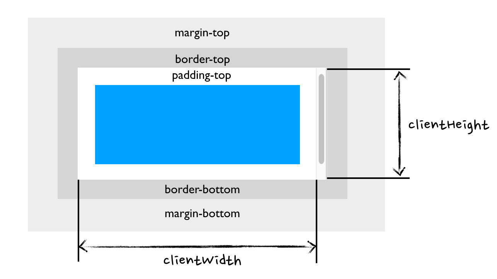
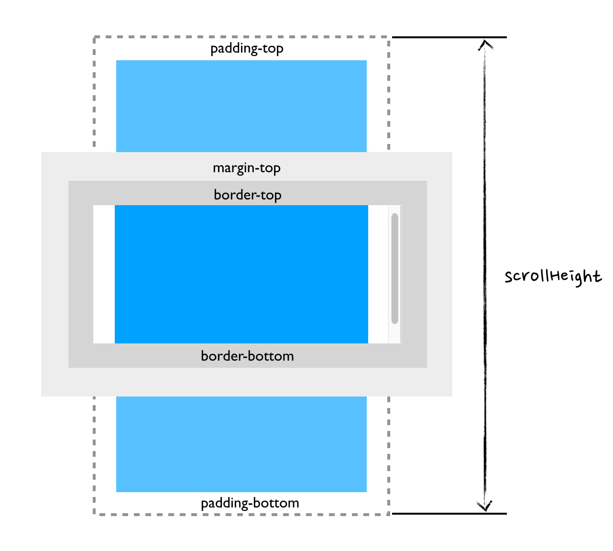

# Bom 属性

## client

### clientWidth/ clientHeight

-   只读，返回元素像素宽度/高度。
-   包含 `padding`，不包含 `border`、 `margin` 和滚动条



### clientLeft/clientTop

-   表示一个元素的边框 border 的宽度

## offset

### offsetWidth/ offsetHeight

-   只读，返回元素像素宽度/高度。
-   包含 `padding`、 `border` ，不包含 `margin`


### offsetTop/offsetLeft

-   相对于 `offsetParent` 节点边界的偏移像素值
-   与 `border` 无关, 主要看` padding`, `margin`, `top/left `

```css
.wrap {
	height: 200px;
	width: 200px;
	border: 10px solid #d5d5d5;
	position: relative;
	padding: 10px;
}
.inner {
	width: 100px;
	height: 100px;
	background-color: #00a2ff;
	border: 10px solid #d5d5d5;
	position: absolute;
	top: 20px;
	margin: 10px;
}
```

```html
<div class="wrap">
	<div class="inner" id="inner"></div>
</div>
```

-   offsetTop = top(20px) + margin(10px) = 30px
-   offsetLeft = padding(10px) + margin(10px) = 20px

## scroll

### scrollHeight/ scrollWidth

-   只读，返回元素像素宽度/高度。
-   包含 `padding`，不包含 `border`、 `margin`
-   没有滚动条时, 和 `clientWidth`/`clientHeight` 相等



### scrollLeft/scrollTop

-   元素的内容顶部/左部（卷起来的）到它的视口可见内容（的顶部/左部）的距离的度量

### 时间

::: timeline 2023-05-24
- **do some thing1**
- do some thing2
  :::

::: timeline 2023-05-23
do some thing3
do some thing4
:::
