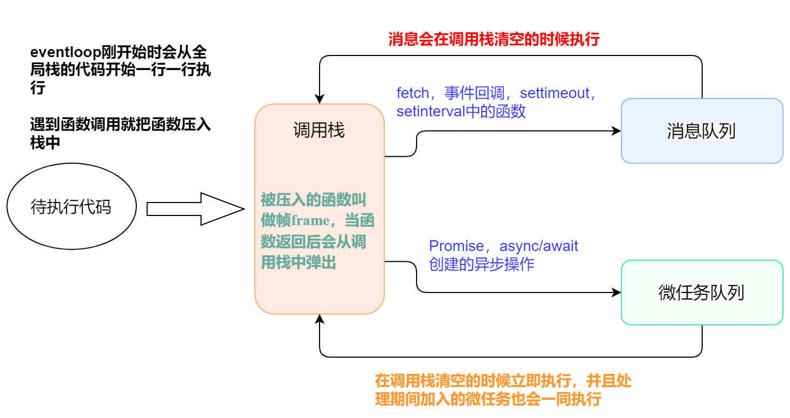

# 常用方法属性

## 防抖&节流

### 防抖

触发高频事件后 n 秒内函数只会执行一次，如果 n 秒内高频事件再次被触发，则重新计算时间

-   应用场景:
    -   search 搜索联想，用户在不断输入时，用防抖来节约请求资源
    -   浏览器的 resize 事件

```html
<input type="text" id="inputEl" />
```

```js
// 防抖函数
let debounce = function (fn, delay) {
	let timer
	return function () {
		if (timer) clearTimeout(timer)
		timer = setTimeout(() => {
			fn()
		}, delay)
	}
}
// 要执行的事件
let search = () => {
	console.log('发送请求')
}
const inputEl = document.getElementById('inputEl')
inputEl.addEventListener('input', debounce(search, 500))
```

### 节流

在特定时间内只执行一次, 稀释函数执行频率

-   应用场景:
    -   监听滚动事件，比如滑到底部加载更多, 减少触发频率
    -   鼠标不断点击触发

```html
<button id="btn">点击</button>
```

```js
// 节流函数
let throttle = function (fn, delay) {
	let flag = true
	return function () {
		if (!flag) return
		flag = false
		setTimeout(() => {
			fn()
			flag = true
		}, delay)
	}
}
// 触发函数
let scrollFn = function () {
	console.log('scroll~')
}
document.getElementById('btn').onclick = throttle(scrollFn, 1000)
```

## this 指向

### 1. 普通函数 this

在调用的时候确定, 谁调用 this 就指向谁

```js
function fn() {
	console.log(this)
}
fn() //Window
```

### 2. 箭头函数 this

-   箭头函数没有自己的 this, 它的 this 是**继承**而来;
-   在**声明**的时候就已经确定 ,默认指向在定义它时所处对象的父级

```js
let obj = {
	name: 'Tom',
	fn: () => {
		console.log(this)
	},
}
obj.fn() //Window
```

```js
var obj = {
	name: 'Tom',
	getName: function () {
		console.log(this, 'getName') //普通函数, obj调用时确定this指向
		var fn = () => {
			console.log(this, 'fn') //内部没有this,继承父级函数的this
		}
		return fn()
	},
}
obj.getName()
//{name: 'Tom', getName: ƒ},'getName'
//{name: 'Tom', getName: ƒ},'fn'
```

### 3. 构造函数 this

指向**实例对象**

```js
function Person(name) {
	this.name = name
	console.log(this) //{name:Tom}
}
let person = new Person('Tom')
```

### 4. 对象中的 this

指向该方法所属的对象

```js
let obj = {
	name: 'Tom',
	fn: function () {
		console.log(this)
	},
}
obj.fn() //{name: 'Tom', fn: ƒ}
```

### 5. 事件中的 this

指向当前绑定的元素

```js
document.getElementById('btn').onclick = function () {
	console.log(this) // <button id="btn">click</button>
}
```

### 6. 定时器中的 this

普通函数形式指向 Window, 如果箭头函数形式指向会改变

```js
setTimeout(function () {
	console.log(this) //Window
}, 500)
```

### 7. 代码 demo 巩固

```js
var obj = {
	fn: function () {
		function a() {
			console.log(this) // a函数单独调用, this指向window
			const b = () => {
				//箭头函数没有自己的this, 向父级函数作用域查找并继承
				console.log(this) //Window
			}
			b()
		}
		a()
	},
}
obj.fn()
```

```js
var obj = {
	fn: function () {
		//普通函数 this -> obj
		const a = () => {
			//向父级作用域查找
			setTimeout(() => {
				//向父级作用域查找
				console.log(this) //-> obj
			}, 200)
		}
		a()
	},
}
obj.fn()
```

## 改变 this 指向

共有 `call`、`apply`、`bind` 三种方法，第一个参数都为绑定 this 的指向，如果传 `null` 或 `undefined`，this 默认指向 window

### call

改变 this 指向,并立即执行该函数,可以传多个参数

```js
var obj = {
	name: 'Jack',
	fn: function () {
		console.log(this.name)
	},
	fn2: function (sex, age) {
		console.log(this.name, sex, age)
	},
}
let a = obj.fn
let b = obj.fn2
a() //undefind
a.call(obj) //Jack
b.call(obj, '男', 18) //Jack,"男",18
```

### apply

改变 this 指向,并立即执行该函数,第二个参数为传参数组集合

```js
var obj = {
	name: 'Jack',
	fn: function (sex, age) {
		console.log(this.name, sex, age)
	},
}
let a = obj.fn
a.apply(obj, ['男', 18])
```

### bind

只返回改变了 this 指向的函数,不会立即执行

```js
var obj = {
	name: 'john',
	fn: function (x, y, z) {
		console.log(this.name, x, y, z)
	},
}
var a = obj.fn
var b = a.bind(obj, 1) //第一次传参
b(2, 3) //'john' 1 2 3
```

:::warning 注意
当 bind 返回的函数作为构造函数使用时, 绑定的 this 值会失效, 指向实例对象, 但传入参数依旧有效
:::

```js
var obj = {
	name: 'jack',
	fn: function (x, y) {
		console.log(this)
		console.log(x, y)
	},
}
let a = obj.fn
let b = a.bind(obj, 1, 2)
b() //此处this -> obj
let c = new b() //此处this -> 实例c
```

## 构造函数返回值

### 返回基本类型或不返回时

`return`不会发生作用，构造函数依旧返回一个实例对象

```js
function Person(name) {
	this.age = 18
	this.name = name
	return 'Mike'
	// return
}

var b = new Person('Lee')
console.log(b) //{age:18, name:"Lee"}
```

### 返回引用类型

`return`会覆盖创建实例，构造函数返回自己手写的引用类型值

```js
function Person(name) {
	this.age = 18
	this.name = name
	return { name: 'Mike' }
}
var a = new Person('Lee')
console.log(a) //{name:"Mike"}
```

## event loop、宏任务&微任务



注意:

-   `new Promise` 在实例化的过程中所执行的代码都是同步进行的，而 `then` 中注册的回调才是异步执行的。
-   `async/await` 底层是基于 Promise 封装的，所以 await 前面的代码相当于 new Promise，是同步进行的，await 后面的代码相当于 then，才是异步进行。

#### 举例分析

```js
var p = new Promise((resolve) => {
	console.log(1)
	resolve(2)
})

function fn1() {
	console.log(3)
}

function fn2() {
	setTimeout(() => {
		console.log(4)
	}, 0)
	fn1()
	console.log(5)
	p.then((result) => {
		console.log(result)
	}).then(() => {
		console.log(6)
	})
}
fn2()

// 最终打印顺序: 1 3 5 2 6 4
```

1. p 放入调用栈, 执行同步任务打印 1
2. fn2 执行放入调用栈, setTimeout 内部函数进入消息队列
3. fn1 进入调用栈执行, 打印 3; 紧跟着打印 5
4. p 后面两个 then 函数进入微任务队列, 至此宏任务执行完毕全部出栈
5. 立即按顺序执行微任务, 依次打印 2 6
6. 消息队列执行打印 4

## 常用操作方法

### 数组

**不改变原始数组:**

1. `toString()` 将数组转化为以逗号分隔的字符串

    ```js
    let str = ['dog', 'cat', 'monkey'].toString()
    console.log(str) //"dog,cat,monkey"
    ```

2. `join()` 将数组转化为指定分隔的字符串

    ```js
    let str = ['dog', 'cat', 'monkey'].join(';')
    console.log(str) //"dog;cat;monkey"
    ```

3. `concat()` 连接两个或多个数组，组成新数组

    ```js
    let arr1 = [1, 2, 3]
    let arr2 = arr1.concat([4, 5], [6, 7]) //[1,2,3,4,5,6,7]
    ```

4. `every()` 检测数组所有元素是否都符合指定条件

    - 有一个元素不满足, 返回 `false` ，且剩余的元素不会再进行检测
    - 所有元素都满足条件，则返回 `true`

    ```js
    let arr = [12, 24, 35, 47]
    arr.every((item) => item > 20) //false
    ```

5. `some()` 检测数组中的元素是否满足指定条件

    - 有一个元素不满足, 返回 `false` ，且**剩余的元素**不会再进行检测
    - 所有元素都满足条件，则返回 `true`

    ```js
    let arr = [12, 24, 35, 47]
    arr.some((item) => item > 40) //true
    ```

6. `indexOf()` 返回数组中某个指定的元素位置

    - 从头到尾地检索数组, 可以指定起始检索 `start` 位置
    - 如果没找到指定元素则返回 `-1`

    ```js
    let arr = ['dog', 'cat', 'monkey']
    arr.indexOf('cat') //1
    arr.indexOf('duck') //-1
    ```

7. `lastIndexOf()` 返回一个指定的元素在数组中最后出现的位置

    ```js
    let arr = ['dog', 'cat', 'monkey', 'dog']
    console.log(arr.lastIndexOf('dog')) //3
    ```

8. `filter()` 创建一个新数组, 其元素是指定数组符合条件的所有元素

    - 不会对空数组进行检测
    - 不改变原始数组

    ```js
    let arr1 = [12, 24, 35, 47]
    let arr2 = arr1.filter((currentVal, index, arr) => currentVal > 20) //[ 24, 35, 47 ]
    ```

9. `slice(start,end)` 从已有的数组中返回选定的元素

    - `start` 指定开始位置, 负数则按倒数开始截取
    - `end` 指定结束位置, 不写则表示切分 `start` 到数组结束的所有元素

    ```js
    let arr = [12, 24, 35, 47]
    arr.slice(1, 3) //[24, 35]
    arr.slice(-2, -1) //[ 35 ]
    ```

10. `map()` 遍历指定数组并返回函数处理后的数组
    ```js
    let arr = [12, 24, 35, 47]
    let res = arr.map((item) => item * 2) //[ 24, 48, 70, 94 ]
    ```

**改变原始数组:**

1. `pop()` 删除数组的**最后一个元素**并返回删除的元素
    ```js
    var fruits = ['Banana', 'Orange', 'Apple', 'Mango']
    console.log(fruits.pop()) //Mango
    console.log(fruits) //[ 'Banana', 'Orange', 'Apple' ]
    ```
2. `shift()` 删除并返回数组的**第一个元素**
    ```js
    var fruits = ['Banana', 'Orange', 'Apple', 'Mango']
    console.log(fruits.shift()) //Banana
    console.log(fruits) //[ 'Orange', 'Apple', 'Mango' ]
    ```
3. `unshift()` 向**数组的开头**添加一个或更多元素，并返回新的长度

    ```js
    var fruits = ['Banana', 'Orange', 'Apple']
    console.log(fruits.unshift('Mango')) //4
    console.log(fruits) //[ 'Mango', 'Banana', 'Orange', 'Apple' ]
    ```

4. `push()` 向**数组的末尾**添加一个或更多元素，并返回新的长度
    ```js
    var fruits = ['Banana', 'Orange', 'Apple']
    console.log(fruits.unshift('Mango')) //4
    console.log(fruits) //[ 'Banana', 'Orange', 'Apple', 'Mango' ]
    ```
5. `splice()` 从数组中添加或删除元素

    语法: `array.splice(index,howmany,item1,...,itemX)`

    - `index` 必需, 规定从何处添加/删除元素。
    - `howmany` 可选, 规定要删除多少元素; 如未定义则从 index 到结尾都删除
    - `item1,...` 可选, 要添加到数组的新元素

    ```js
    var fruits = ['Banana', 'Orange', 'Apple']
    console.log(fruits.splice(1, 0)) //[]
    console.log(fruits.splice(1, 2, 'mango')) //[ 'Orange', 'Apple' ]
    console.log(fruits) //[ 'Banana', 'mango' ]
    ```

6. `reverse()` 反转数组的元素顺序
    ```js
    var fruits = ['Banana', 'Orange', 'Apple']
    console.log(fruits.reverse()) //[ 'Apple', 'Orange', 'Banana' ]
    console.log(fruits) //[ 'Apple', 'Orange', 'Banana' ]
    ```
7. `sort()` 对数组的元素进行排序
    - 可以对字母进行排序, 默认是升序
    - 当对数字排序, 需要通过函数指定排序方式
    ```js
    let fruits = ['Banana', 'Orange', 'Apple']
    fruits.sort() //[ 'Apple', 'Banana', 'Orange' ]
    let arr = [23, 4, 32, 56, 45]
    arr.sort((a, b) => a - b) //[ 4, 23, 32, 45, 56 ]
    ```

### 字符串
