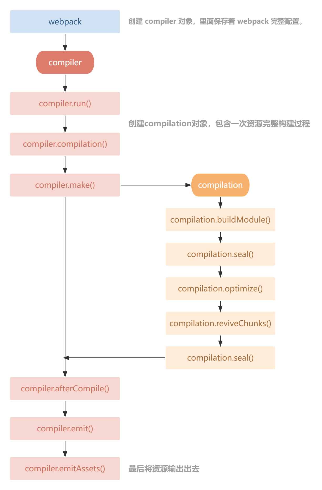

# plugin 原理

插件目的在于解决 loader 无法实现的其他事，是对 webpack 的扩展

> webpack 在编译代码过程中，会触发一系列 Tapable 钩子事件，插件所做的，就是找到相应的钩子，往上面挂上自己的任务，也就是注册事件。当 webpack 构建的时候，插件注册的事件就会随着钩子的触发而执行

## Tabable

是 webpack 内部使用的一个流程管理工具，主要用来串联插件，完善事件流执行

### 常用 hooks

```js
const {
	SyncHook,
	SyncBailHook,
	SyncWaterfallHook,
	SyncLoopHook,
	AsyncParallelHook,
	AsyncParallelBailHook,
	AsyncSeriesHook,
	AsyncSeriesBailHook,
	AsyncSeriesWaterfallHook,
} = require('tapable')
```

### 三种绑定类型类型

-   tap：  
    可以注册同步钩子和异步钩子
-   tapPromise：  
    `promise` 方式注册异步钩子，必须返回一个 `pormise` ，异步任务完成后 `resolve`
-   tapSync：  
    回调方式注册异步钩子，必须调用函数的最后一个参数 `callback` 指定的回调函数

## compiler

每次 `webpack` 构建时创建的唯一对象，包含 `webpack` 的完整配置信息（`loader`、`plugin` 信息等）

#### 主要属性：

-   `compiler.options`可以访问本次启动 webpack 时所有配置文件，包括 loaders 、 entry 、 output 、 plugin 等配置信息
-   `compiler.inputFileSystem` 和 `compiler.outputFileSystem` 可以进行文件操作，相当于 Nodejs 中 fs
-   `compiler.hooks` 可以注册 tapable 的不同种类 Hook，从而可以在 compiler 生命周期中植入不同的逻辑

> [compiler hooks 文档](https://webpack.docschina.org/api/compiler-hooks/)

## complication

由 `Compiler` 来创建的实例对象,能够访问所有的模块和它们的依赖。它也拥有自己的生命周期，每次`compiler`注册都会产生一次`Compilation`  
它会对应用程序的依赖图中所有模块， 进行字面上的编译。 在编译阶段，模块会被加载(load)、封存(seal)、优化(optimize)、 分块(chunk)、哈希(hash)和重新创建(restore)

#### 主要属性

-   `compilation.modules` 可以访问所有模块，打包的每一个文件都是一个模块。
-   `compilation.chunks` chunk 即是多个 modules 组成而来的一个代码块。入口文件引入的资源组成一个 chunk，通过代码分割的模块又是另外的 chunk。
-   ` compilation.assets` 可以访问本次打包生成所有文件的结果。
-   `compilation.hooks` 可以注册 tapable 的不同种类 Hook，用于在 compilation 编译模块阶段进行逻辑添加以及修改

> [compilation hooks 文档](https://webpack.docschina.org/api/compilation-hooks/)

## 生命周期图



## 创建简单 plugin

```js
class simplePlugin {
	constructor() {
		// do something...
	}
	/**
	 * 1. webpack读取配置时，new simplePlugin() ，会执行插件 constructor 方法
	 * 2. webpack创建 compiler 对象
	 * 3. 遍历所有插件，调用插件的 apply 方法
	 */
	apply(compiler) {
		// 同步钩子
		compiler.hooks.compile.tap('simplePlugin', (compilationParams) => {
			// do something...
		})
		// 异步async
		compiler.hooks.emit.tapAsync('simplePlugin', (compilation, callback) => {
			setTimeout(() => {
				// do something....
				callback()
			}, 2000)
		})
		//异步promise
		compiler.hooks.emit.tapPromise('simplePlugin', (compilation) => {
			return new Promise((resolve) => {
				resolve()
			})
		})
	}
}
```

### 调试

用于查看 `compiler` 和 `compilation` 对象数据情况

1. package.json 配置

```json{5}
{
	"name": "source",
	"version": "1.0.0",
	"scripts": {
		"debug": "node --inspect-brk ./node_modules/webpack-cli/bin/cli.js"
	}
}
```

2. 运行指令

```shell
npm run debug
```

3. 在浏览器中点击绿色 *node* 图标，通过代码中设置 `debugger` 断点调试查看

## 开发添加注释 plugin

给输出文件添加自定义注释内容

### 开发流程

1. 使用 `compiler.hooks.emit` 钩子, 在打包输出前触发，添加注释
2. 使用 `compilation.assets` 获取所有即将输出的资源文件

```js
// plugins/banner-webpack-plugin.js
class BannerWebpackPlugin {
	constructor(options = {}) {
		this.options = options
	}

	apply(compiler) {
		// 需要处理文件
		const extensions = ['js', 'css']
		// emit是异步串行钩子
		compiler.hooks.emit.tapAsync('BannerWebpackPlugin', (compilation, callback) => {
			// compilation.assets包含所有即将输出的资源
			// 通过过滤只保留需要处理的文件
			const assetPaths = Object.keys(compilation.assets).filter((path) => {
				const splitted = path.split('.')
				return extensions.includes(splitted[splitted.length - 1])
			})

			assetPaths.forEach((assetPath) => {
				const asset = compilation.assets[assetPath]
				const source = `/*
          * Author: ${this.options.author}
          */\n${asset.source()}`

				// 覆盖资源
				compilation.assets[assetPath] = {
					// 资源内容
					source() {
						return source
					},
					// 资源大小
					size() {
						return source.length
					},
				}
			})
			callback()
		})
	}
}
module.exports = BannerWebpackPlugin
```

## 开发清空打包内容 plugin

在 webpack 打包输出前将上次打包内容清空

### 开发流程

1. 使用 `compiler.hooks.emit` 钩子, 在打包输出前触发
2. 通过 `compiler` 对象,获取打包输出目录
3. 通过 `compiler.outputFileSystem` 操作文件清空内容

```js
// plugins/clean-webpack-plugin.js
class CleanWebpackPlugin {
	apply(compiler) {
		// 获取操作文件的对象
		const fs = compiler.outputFileSystem
		// emit是异步串行钩子
		compiler.hooks.emit.tapAsync('CleanWebpackPlugin', (compilation, callback) => {
			// 获取输出文件目录
			const outputPath = compiler.options.output.path
			// 删除目录所有文件
			const err = this.removeFiles(fs, outputPath)
			// 执行成功err为undefined，执行失败err就是错误原因
			callback(err)
		})
	}

	removeFiles(fs, path) {
		try {
			// 读取当前目录下所有文件
			const files = fs.readdirSync(path)

			// 遍历文件，删除
			files.forEach((file) => {
				// 获取文件完整路径
				const filePath = `${path}/${file}`
				// 分析文件
				const fileStat = fs.statSync(filePath)
				// 判断是否是文件夹
				if (fileStat.isDirectory()) {
					// 是文件夹需要递归遍历删除下面所有文件
					this.removeFiles(fs, filePath)
				} else {
					// 不是文件夹就是文件，直接删除
					fs.unlinkSync(filePath)
				}
			})

			// 最后删除当前目录
			fs.rmdirSync(path)
		} catch (e) {
			// 将产生的错误返回出去
			return e
		}
	}
}

module.exports = CleanWebpackPlugin
```

## 开发资源大小分析 plugin

分析 webpack 打包资源大小，并输出分析文件

### 开发流程

1. 使用 `compiler.hooks.emit` 钩子, 在打包输出前触发
2. 使用 `compilation.assets` 获取所有即将输出的资源文件
3. 获取资源大小后，添加资源分析文件

```js
// plugins/analyze-webpack-plugin.js
class AnalyzeWebpackPlugin {
	apply(compiler) {
		// emit是异步串行钩子
		compiler.hooks.emit.tap('AnalyzeWebpackPlugin', (compilation) => {
			// Object.entries将对象变成二维数组。二维数组中第一项值是key，第二项值是value
			const assets = Object.entries(compilation.assets)

			let source = '# 分析打包资源大小 \n| 名称 | 大小 |\n| --- | --- |'

			assets.forEach(([filename, file]) => {
				source += `\n| ${filename} | ${file.size()} |`
			})

			// 添加资源
			compilation.assets['analyze.md'] = {
				source() {
					return source
				},
				size() {
					return source.length
				},
			}
		})
	}
}

module.exports = AnalyzeWebpackPlugin
```
