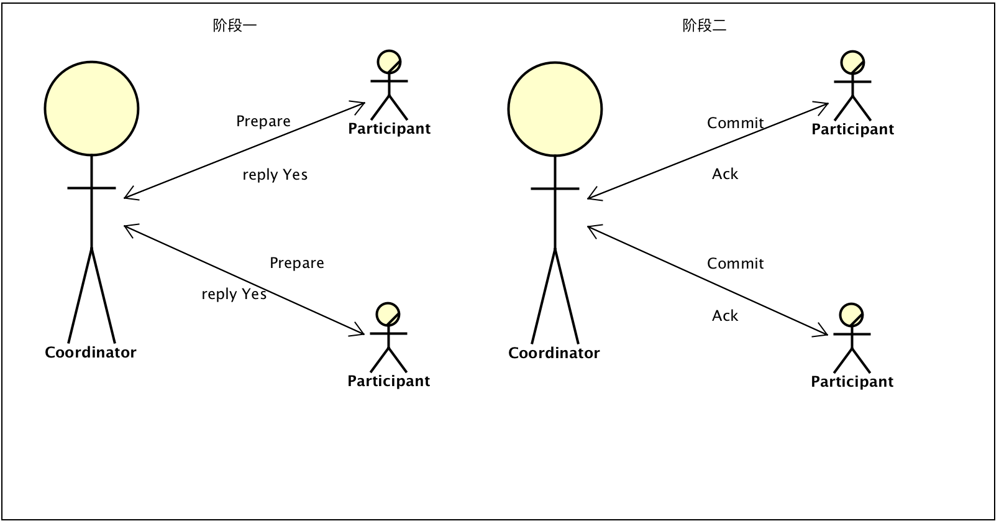
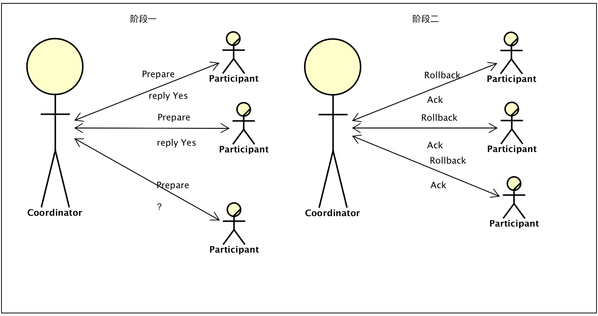
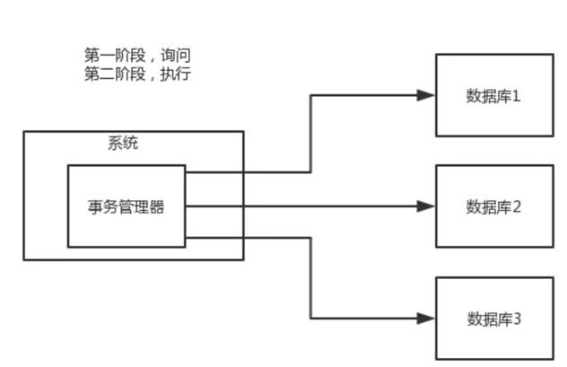
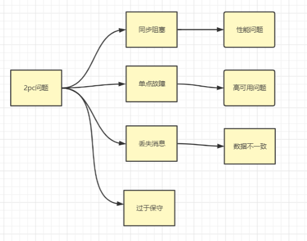

2PC即`Two-Phase Commit`，二阶段提交。

## 2PC节点角色

二阶段提交协议将节点分为：

* **协调者角色(事务管理器Coordinator)**

* **参与者角色(资源管理器Participant)**

2PC角色中:

* 事务管理器的角色，负责协调多个数据库（资源管理器）的事务，

* 协调者角色(事务管理器Coordinator)，负责向参与者发送指令，收集参与者反馈，做出提交或者回滚决策

* 参与者角色(资源管理器Participant)，接收协调者的指令执行事务操作，向协调者反馈操作结果，并继续执行协调者发送的最终指令

## 详解二个阶段

广泛应用在数据库领域，为了使得基于分布式架构的所有节点可以在进行事务处理时能够保持原子性和一致性。

顾名思义，2PC分为两个阶段处理:

* 阶段一：提交事务请求

* 阶段二：执行事务提交，或者执行中断事务;

如果阶段一超时或者出现异常，2PC的阶段二为：执行中断事务

> 说明：绝大部分关系型数据库，都是基于2PC完成分布式的事务处理。

### 阶段一：提交事务请求

1. 事务询问。协调者向所有参与者发送事务内容，询问是否可以执行提交操作，并开始等待各参与者进行响应；
2. 执行事务。各参与者节点，执行事务操作，并将`Undo`和`Redo`操作计入本机事务日志；
3. 各参与者向协调者反馈事务问询的响应。成功执行返回`Yes`，否则返回`No`。

### 阶段二：执行事务提交，或者执行中断事务;

这一阶段包含两种情形：

* 执行事务提交

* 执行中断事务

协调者在阶段二决定是否最终执行事务提交操作。

* 所有参与者`reply Yes`，那么执行事务提交。
* 当存在某一参与者向协调者发送`No`响应，或者等待超时。协调者只要无法收到所有参与者的`Yes`响应，就会中断事务。

### 执行事务提交

所有参与者`reply Yes`，那么执行事务提交。

1. 发送提交请求。协调者向所有参与者发送`Commit`请求；
2. 事务提交。参与者收到`Commit`请求后，会正式执行事务提交操作，并在完成提交操作之后，释放在整个事务执行期间占用的资源；
3. 反馈事务提交结果。参与者在完成事务提交后，写协调者发送`Ack`消息确认；
4. 完成事务。协调者在收到所有参与者的`Ack`后，完成事务。

### 执行事务中断

事情总会出现意外，当存在某一参与者向协调者发送No响应，或者等待超时。协调者只要无法收到所有参与者的`Yes`响应，就会中断事务。

1. 发送回滚请求。协调者向所有参与者发送`Rollback`请求；
2. 回滚。参与者收到请求后，利用本机`Undo`信息，执行`Rollback`操作。并在回滚结束后释放该事务所占用的系统资源；
3. 反馈回滚结果。参与者在完成回滚操作后，向协调者发送`Ack`消息；
4. 中断事务。协调者收到所有参与者的回滚`Ack`消息后，完成事务中断。

## 2PC解决的是分布式数据强一致性问题

顾名思义，两阶段提交在处理分布式事务时分为两个阶段：`voting`（投票阶段，有的地方会叫做`prepare`阶段）和`commit`阶段。

2PC中存在两个角色，**事务协调者**（如 `seata`、`atomikos`、`lcn`）和**事务参与者**，其中，事务参与者通常是指应用的数据库。

## 2PC二阶段提交的特点

### 2PC方案比较适合单体应用

2PC 方案中，有一个事务管理器的角色，负责协调多个数据库（资源管理器）的事务，事务管理器先问问各个数据库你准备好了吗？

* 如果每个数据库都回复 ok，那么就正式提交事务，在各个数据库上执行操作；

* 如果任何其中一个数据库回答不 ok，那么就回滚事务。

2PC 方案比较适合单体应用里，跨多个库的分布式事务，而且因为严重依赖于数据库层面来搞定复杂的事务，效率很低，绝对不适合高并发的场景。

2PC 方案实际很少用，一般来说某个系统内部如果出现跨多个库的这么一个操作，是不合规的。

现在的微服务系统，一个大的系统分成几百个服务，几十个服务。一般来说，我们的规定和规范，是要求每个服务只能操作自己对应的一个数据库。

如果你要操作别的服务对应的库，不允许直连别的服务的库，违反微服务架构的规范，你随便交叉胡乱访问，几百个服务的话，全体乱套，这样的一套服务是没法管理的，没法治理的，可能会出现数据被别人改错，自己的库被别人写挂等情况。

如果你要操作别人的服务的库，你必须是通过调用别的服务的接口来实现，绝对不允许交叉访问别人的数据库。

### 2PC具有明显的优缺点

**优点:**

* 主要体现在实现原理简单；

**缺点比较多：**

* 同步阻塞导致性能问题

    执行过程中，所有参与节点都是事务阻塞型的。所有 `participant` 都处于阻塞状态，各个 `participant` 都在等待其他参与者响应，无法进行其他操作。

    所有分支的资源锁定时间，由最长的分支事务决定。另外当参与者锁定公共资源时，处于事务之外的其他第三方访问者，也不得不处于阻塞状态。

* 单点故障导致高可用（HA）问题

    协调者是个单点，一旦出现问题，各个 `participant` 将无法释放事务资源，也无法完成事务操作；并且，由于协调者的重要性，一旦协调者发生故障，参与者会一直阻塞下去。

    尤其在第二阶段，协调者发生故障，那么所有的参与者还都处于锁定事务资源的状态中，而无法继续完成事务操作。假设，协调者挂掉，可以重新选举一个协调者，但是，还是无法解决因为协调者宕机导致的参与者处于阻塞状态的问题。

* 丢失消息导致的数据不一致问题

    如果协调者向所有参与者发送`Commit`请求后，发生局部网络异常, 或者协调者在尚未给全部的`participant`发送完`Commit`请求即出现崩溃，最终导致只有部分`participant`收到、执行请求。 于是整个系统将会出现数据不一致的情形，why？ 只有一部分参与者接受到了`commit`请求。 
    部分参与者接到`commit`请求之后就会执行`commit`操作。但是其他部分未接到`commit`请求的机器则无法执行事务提交。于是整个分布式系统便出现了数据部一致性的现象。

* 过于保守

    二阶段提交协议没有设计较为完善的容错机制，任意一个节点的失败都会导致整个事务的失败。

**具体来说：**

2PC没有完善的容错机制，当参与者出现故障时，协调者无法快速得知这一失败，只能严格依赖超时设置来决定是否进一步的执行提交还是中断事务。

## 总结

XA-两阶段提交协议（以2PC为参考）中会遇到的一些问题

* **性能问题** : 从流程上我们可以看得出，其最大缺点就在于它的执行过程中间，节点都处于阻塞状态，各个操作数据库的节点此时都占用着数据库资源，只有当所有节点准备完毕，事务协调者才会通知进行全局提交，参与者进行本地事务提交后才会释放资源。这样的过程会比较漫长，对性能影响比较大。

* **协调者单点故障问题** : 事务协调者是整个XA模型的核心，一旦事务协调者节点挂掉，会导致参与者收不到提交或回滚的通知，从而导致参与者节点始终处于事务无法完成的中间状态。

* **丢失消息导致的数据不一致问题** : 在第二个阶段，如果发生局部网络问题，一部分事务参与者收到了提交消息，另一部分事务参与者没收到提交消息，那么就会导致节点间数据的不一致问题。

* **过于保守** : 二阶段提交协议没有设计较为完善的容错机制，任意一个节点的失败都会导致整个事务的失败。