针对2PC的缺点，研究者提出了3PC，即`Three-Phase Commit`。

作为2PC的改进版，3PC将原有的两阶段过程，重新划分为`CanCommit`、`PreCommit`和`DoCommit`三个阶段。

3PC 协议将 2PC 协议的准备阶段一分为二，从而形成了三个阶段：

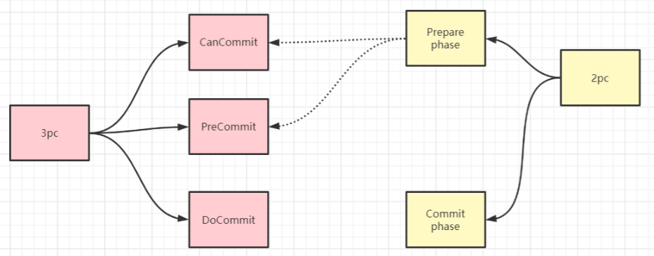

## 详解三个阶段

所谓的三个阶段分别是：询问，然后再锁资源，最后真正提交。

* 第一阶段：`CanCommit`

* 第二阶段：`PreCommit`

* 第三阶段：`DoCommit`

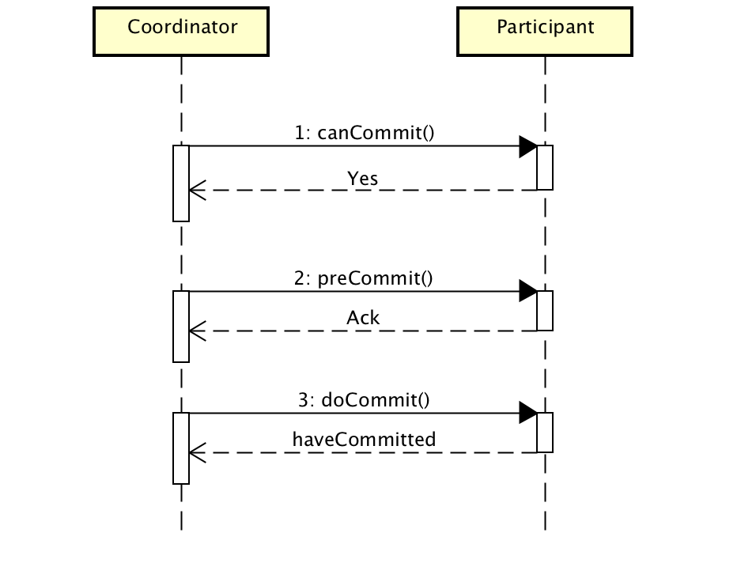

### 阶段一：CanCommit

1. 事务询问。协调者向所有参与者发送包含事务内容的`canCommit`的请求，询问是否可以执行事务提交，并等待应答；
2. 各参与者反馈事务询问。正常情况下，如果参与者认为可以顺利执行事务，则返回`Yes`，否则返回`No`。

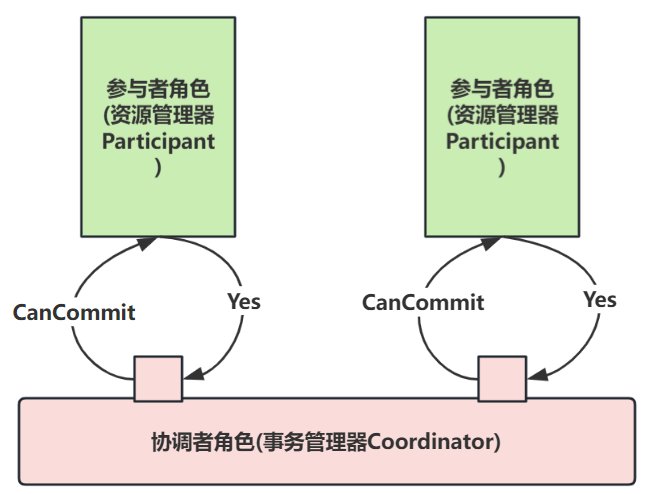

### 阶段二：PreCommit

在本阶段，协调者会根据上一阶段的反馈情况来决定是否可以执行事务的`PreCommit`操作。有以下两种可能：

* 执行事务预提交

* 中断事务

#### 执行事务预提交

1. 发送预提交请求。协调者向所有节点发出`PreCommit`请求，并进入`prepared`阶段；
2. 事务预提交。参与者收到`PreCommit`请求后，会开始事务操作，并将`Undo`和`Redo`日志写入本机事务日志；
3. 各参与者成功执行事务操作，同时将反馈以`Ack`响应形式发送给协调者，同事等待最终的`Commit`或`Abort`指令。

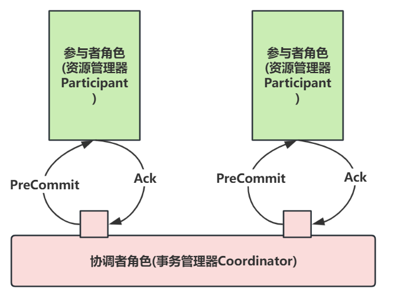

#### 中断事务

如果任意一个参与者向协调者发送`No`响应，或者等待超时，协调者在没有得到所有参与者响应时，即可以中断事务。

中断事务的操作为：

1. 发送中断请求。 协调者向所有参与者发送`Abort`请求；
2. 中断事务。无论是 `participant` 收到协调者的`Abort`请求，还是 `participant` 等待协调者请求过程中出现超时，参与者都会中断事务；

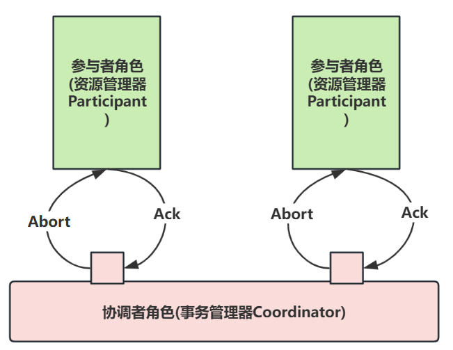

`coordinator`发送`Abort`的两个场景:

**场景1： 任意一个参与者向协调者发送No响应**

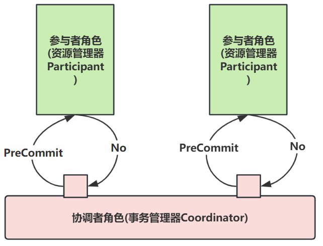

**场景2： 协调者在没有得到所有参与者响应时**

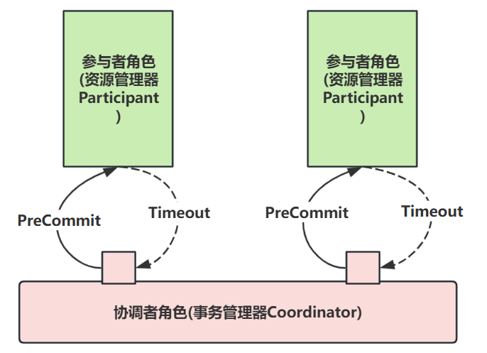

### 阶段三：DoCommit

在这个阶段，会真正的进行事务提交，同样存在两种可能。

* 执行提交

* 回滚事务

#### 执行提交

1. `coordinator`发送提交请求。假如`coordinator`协调者收到了所有参与者的`Ack`响应，那么将从预提交转换到提交状态，并向所有参与者，发送`DoCommit`请求；
2. 事务提交。参与者收到`DoCommit`请求后，会正式执行事务提交操作，并在完成提交操作后释放占用资源；
3. 反馈事务提交结果。参与者将在完成事务提交后，向协调者发送`Ack`消息；
4. 完成事务。协调者接收到所有参与者的`Ack`消息后，完成事务。

#### 回滚事务

在该阶段，假设正常状态的协调者接收到任一个参与者发送的`No`响应，或在超时时间内，仍旧没收到反馈消息，就会回滚事务：

1. 发送中断请求。协调者向所有的参与者发送`rollback`请求；
2. 事务回滚。参与者收到`rollback`请求后，会利用阶段二中的`Undo`消息执行事务回滚，并在完成回滚后释放占用资源；
3. 反馈事务回滚结果。参与者在完成回滚后向协调者发送`Ack`消息；
4. 回滚事务。协调者接收到所有参与者反馈的`Ack`消息后，完成事务回滚。

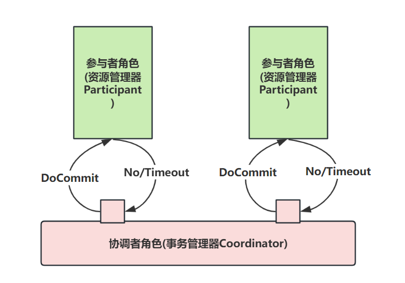

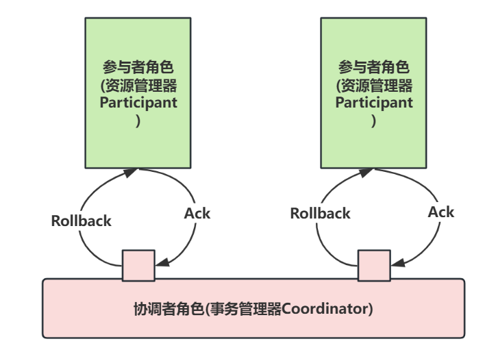

## 2PC和3PC的区别

三阶段提交协议在协调者和参与者中都引入 `超时机制`，并且把两阶段提交协议的第一个阶段拆分成了两步：询问，然后再锁资源，最后真正提交。

三阶段提交的三个阶段分别为：`can_commit`，`pre_commit`，`do_commit`。

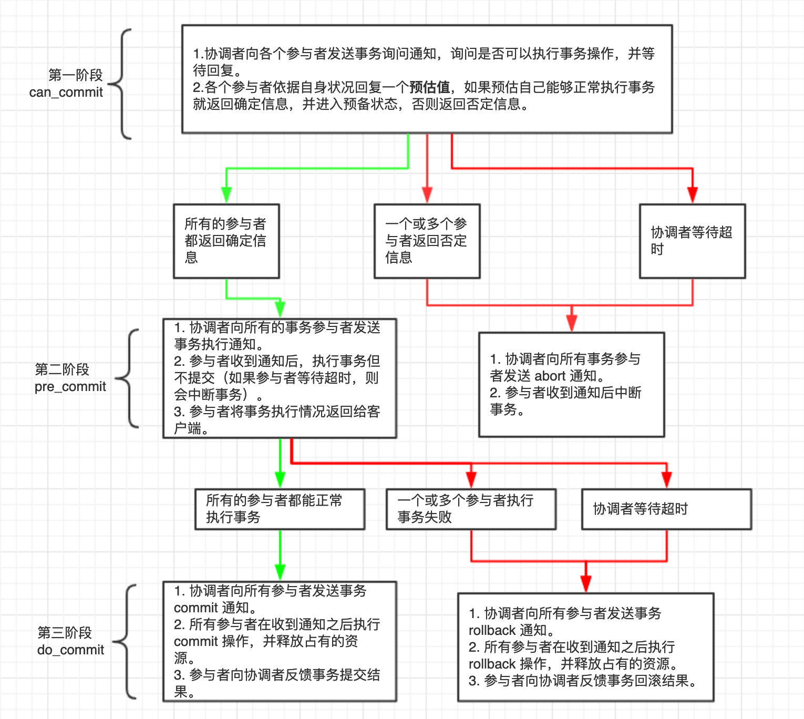

在`DoCommit`阶段，如果参与者无法及时接收到来自协调者的`DoCommit`或者`rollback`请求时，会在等待超时之后，继续进行事务的提交。

其实这个应该是基于概率来决定的，

当进入第三阶段时，说明参与者在第二阶段已经收到了`PreCommit`请求，什么场景会产生`PreCommit`请求呢？

协调者产生`PreCommit`请求的前提条件比较严格：是在第二阶段开始之前，收到所有参与者的`CanCommit`响应都是`Yes`。

> 所以，一旦参与者收到了PreCommit，意味他知道大家其实都同意修改了

一句话概括就是：

**当进入第三阶段时，由于网络超时/网络分区等原因，虽然参与者没有收到commit或者abort响应，但是他有理由相信：成功提交的几率很大。**

### 3PC主要解决的单点故障问题

相对于2PC，3PC主要解决的单点故障问题，并减少阻塞，

因为一旦参与者无法及时收到来自协调者的信息之后，他会默认执行`commit`。而不会一直持有事务资源并处于阻塞状态。

由于在`docommit`阶段，`participant`参与者如果超时，能自己决定提交本地事务，所以，3PC没有2PC那么保守或者说悲观，或者说3PC更加乐观。

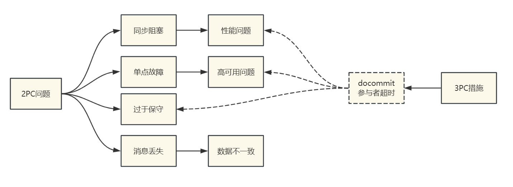

#### 3PC主要没有解决的数据一致性问题

但是这种机制，还是有数据一致性问题，或者说，没有彻底解决数据一致性问题。

因为，由于网络原因，协调者发送的`rollback`命令没有及时被参与者接收到，那么参与者在等待超时之后执行了`commit`操作。

这样就和其他接到`rollback`命令并执行回滚的参与者之间存在数据不一致的情况。

#### 3PC相对于2PC而言到底优化了什么地方

相比较2PC而言，3PC对于协调者（`Coordinator`）和参与者（`Participant`）都设置了超时时间，而2PC只有协调者才拥有超时机制。

这个优化点，主要是避免了 `Participant` 参与者在长时间无法与协调者节点通讯（协调者挂掉了）的情况下，无法释放资源的问题，因为参与者自身拥有超时机制会在超时后，自动进行本地`commit`从而进行释放资源。
而这种机制也侧面降低了整个事务的阻塞时间和范围。

另外，通过`CanCommit`、`PreCommit`、`DoCommit`三个阶段的设计，相较于2PC而言，多设置了一个缓冲阶段保证了在最后提交阶段之前各参与节点的状态是一致的。

以上就是3PC相对于2PC的一个提高（相对缓解了2PC中的前两个问题），但是3PC依然没有完全解决数据不一致的问题。

假如在 `DoCommit` 过程，参与者A无法接收协调者的通信，那么参与者A会自动提交，但是提交失败了，其他参与者成功了，此时数据就会不一致。