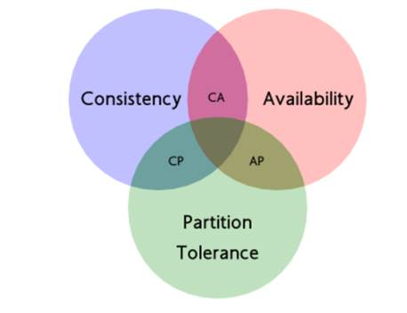

## 一、分布式事务的理论基础

数据库事务 `ACID` 四大特性，无法满足分布式事务的实际需求，这个时候又有一些新的大牛提出一些新的理论。

## 二、CAP定理

`CAP`定理是由加州大学伯克利分校`Eric Brewer`教授提出来的，他指出`WEB`服务无法同时满足一下3个属性：

* **一致性(Consistency)** ： 客户端知道一系列的操作都会同时发生(生效)
* **可用性(Availability)** ： 每个操作都必须以可预期的响应结束
* **分区容错性(Partition tolerance)** ： 即使出现单个组件无法可用，操作依然可以完成

具体地讲在分布式系统中，一个Web应用至多只能同时支持上面的两个属性。因此，设计人员必须在一致性与可用性之间做出选择。

`2000`年`7`月`Eric Brewer`教授仅仅提出来的是一个猜想，2年后，麻省理工学院的`Seth Gilbert`和`Nancy Lynch`从理论上证明了`CAP`理论，并且而一个分布式系统最多只能满足`CAP`中的2项。之后，`CAP`理论正式成为分布式计算领域的公认定理。

所以，`CAP`定理在迄今为止的分布式系统中都是适用的！

`CAP`的`一致性`、`可用性`、`分区容错性`具体如下：

### 1、一致性

数据一致性指`“all nodes see the same data at the same time”`，即更新操作成功并返回客户端完成后，所有节点在同一时间的数据完全一致，不能存在中间状态。

分布式环境中，一致性是指多个副本之间能否保持一致的特性。在一致性的需求下，当一个系统在数据一致的状态下执行更新操作后，应该保证系统的数据仍然处理一致的状态。

例如对于电商系统用户下单操作，库存减少、用户资金账户扣减、积分增加等操作必须在用户下单操作完成后必须是一致的。不能出现类似于库存已经减少，而用户资金账户尚未扣减，积分也未增加的情况。如果出现了这种情况，那么就认为是不一致的。

**数据一致性分为`强一致性`、`弱一致性`、`最终一致性`。**

* 如果的确能像上面描述的那样时刻保证客户端看到的数据都是一致的，那么称之为强一致性。
* 如果允许存在中间状态，只要求经过一段时间后，数据最终是一致的，则称之为最终一致性。
* 此外，如果允许存在部分数据不一致，那么就称之为弱一致性。

### 2、可用性

系统提供的服务必须一直处于可用的状态，对于用户的每一个操作请求总是能够在有限的时间内返回结果。

两个度量的维度：

（1）有限时间内

对于用户的一个操作请求，系统必须能够在指定的时间（响应时间）内返回对应的处理结果，如果超过了这个时间范围，那么系统就被认为是不可用的。即这个响应时间必须在一个合理的值内，不让用户感到失望。

试想，如果一个下单操作，为了保证分布式事务的一致性，需要`10`分钟才能处理完，那么用户显然是无法忍受的。

（2）返回正常结果

要求系统在完成对用户请求的处理后，返回一个正常的响应结果。正常的响应结果通常能够明确地反映出对请求的处理结果，即成功或失败，而不是一个让用户感到困惑的返回结果。比如返回一个系统错误如`OutOfMemory`，则认为系统是不可用的。

**“返回结果”** 是可用性的另一个非常重要的指标，它要求系统在完成对用户请求的处理后，返回一个正常的响应结果，不论这个结果是成功还是失败。

### 3、分区容错性

即分布式系统在遇到任何网络分区故障时，仍然需要能够保证对外提供满足一致性和可用性的服务，除非是整个网络环境都发生了故障。

网络分区，是指分布式系统中，不同的节点分布在不同的子网络（机房/异地网络）中，由于一些特殊的原因导致这些子网络之间出现网络不连通的状态，但各个子网络的内部网络是正常的，从而导致整个系统的网络环境被切分成了若干孤立的区域。
组成一个分布式系统的每个节点的加入与退出都可以看做是一个特殊的网络分区。

## 三、CAP的应用

### 1、放弃P

放弃分区容错性的话，则放弃了分布式，放弃了系统的可扩展性

### 2、放弃A

放弃可用性的话，则在遇到网络分区或其他故障时，受影响的服务需要等待一定的时间，再此期间无法对外提供政策的服务，即不可用

### 3、放弃C

放弃一致性的话（这里指强一致），则系统无法保证数据保持实时的一致性，在数据达到最终一致性时，有个时间窗口，在时间窗口内，数据是不一致的。

**对于分布式系统来说，P是不能放弃的，因此架构师通常是在可用性和一致性之间权衡。**

`CAP` 理论告诉我们:

目前很多大型网站及应用都是分布式部署的，分布式场景中的数据一致性问题一直是一个比较重要的话题。

基于 `CAP` 理论，很多系统在设计之初就要对这三者做出取舍:

任何一个分布式系统都无法同时满足一致性（`Consistency`）、可用性（`Availability`）和分区容错性（`Partition tolerance`），最多只能同时满足两项。在互联网领域的绝大多数的场景中，都需要牺牲强一致性来换取系统的高可用性，系统往往只需要保证最终一致性。

### 为什么分布式系统中无法同时保证一致性和可用性

首先一个前提，对于分布式系统而言，分区容错性是一个最基本的要求，因此基本上我们在设计分布式系统的时候只能从一致性（`C`）和可用性（`A`）之间进行取舍。

如果保证了一致性（`C`）：对于节点`N1`和`N2`，当往`N1`里写数据时，`N2`上的操作必须被暂停，只有当`N1`同步数据到`N2`时才能对`N2`进行读写请求，在`N2`被暂停操作期间客户端提交的请求会收到失败或超时。显然，这与可用性是相悖的。

如果保证了可用性（`A`）：那就不能暂停`N2`的读写操作，但同时`N1`在写数据的话，这就违背了一致性的要求。

## 四、CAP权衡

通过 `CAP` 理论，我们知道无法同时满足一致性、可用性和分区容错性这三个特性，那要舍弃哪个呢？

对于多数大型互联网应用的场景，主机众多、部署分散，而且现在的集群规模越来越大，所以节点故障、网络故障是常态，而且要保证服务可用性达到 `N` 个 `9`，即保证 `P` 和 `A`，舍弃`C`（退而求其次保证最终一致性）。虽然某些地方会影响客户体验，但没达到造成用户流程的严重程度。

对于涉及到钱财这样不能有一丝让步的场景，`C` 必须保证。网络发生故障宁可停止服务，这是保证 `CA`，舍弃 `P`。貌似这几年国内银行业发生了不下 10 起事故，但影响面不大，报道也不多，广大群众知道的少。还有一种是保证 `CP，`舍弃 `A`。例如网络故障是只读不写。

## 五、CAP和ACID中的A和C是完全不一样的

### A的区别

* `ACID`中的`A`指的是原子性(`Atomicity`)，是指事务被视为一个不可分割的最小工作单元，事务中的所有操作要么全部提交成功，要么全部失败回滚；
* `CAP`中的`A`指的是可用性(`Availability`)，是指集群中一部分节点故障后，集群整体是否还能响应客户端的读写请求；

### C的区别

* `ACID`一致性是有关数据库规则，数据库总是从一个一致性的状态转换到另外一个一致性的状态；
* `CAP`的一致性是分布式多服务器之间复制数据令这些服务器拥有同样的数据，由于网速限制，这种复制在不同的服务器上所消耗的时间是不固定的，集群通过组织客户端查看不同节点上还未同步的数据维持逻辑视图，这是一种分布式领域的一致性概念；

**总之**

**ACID里的一致性指的是事务执行前后，数据库完整性，而CAP的一致性，指的是分布式节点的数据的一致性。背景不同，无从可比**