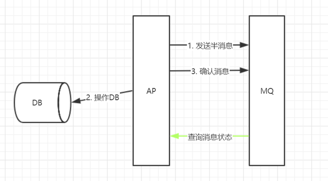
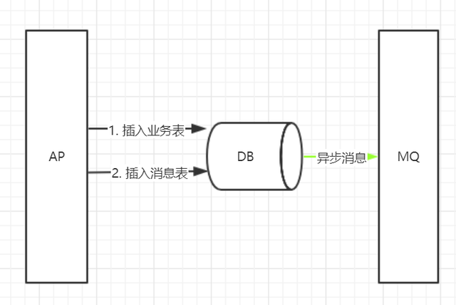

SAGA可以看做一个异步的、利用队列实现的补偿事务。

## Saga相关概念

1987年普林斯顿大学的`Hector Garcia-Molina`和`Kenneth Salem`发表了一篇`Paper Sagas`，讲述的是如何处理`long lived transaction`（长活事务）。Saga是一个长活事务可被分解成可以交错运行的子事务集合。其中每个子事务都是一个保持数据库一致性的真实事务。

Saga模型是把一个分布式事务拆分为多个本地事务，每个本地事务都有相应的执行模块和补偿模块（对应TCC中的`Confirm`和`Cancel`），当Saga事务中任意一个本地事务出错时，可以通过调用相关的补偿方法恢复之前的事务，达到事务最终一致性。

这样的SAGA事务模型，是牺牲了一定的隔离性和一致性的，但是提高了long-running事务的可用性。

### Saga模型

* **LLT（Long Live Transaction）**：由一个个本地事务组成的事务链。
* **本地事务**：事务链由一个个子事务（本地事务）组成，LLT = T1+T2+T3+...+Ti。
* **补偿**：每个本地事务 Ti 有对应的补偿 Ci。

### Saga的执行顺序

* T1, T2, T3, ..., Tn
* T1, T2, ..., Tj, Cj,..., C2, C1，其中0 < j < n

### Saga两种恢复策略

* **向后恢复（Backward Recovery）**：撤销掉之前所有成功子事务。如果任意本地子事务失败，则补偿已完成的事务。如异常情况的执行顺序T1,T2,T3,..Ti,Ci,...C3,C2,C1。


* **向前恢复（Forward Recovery）**：即重试失败的事务，适用于必须要成功的场景，该情况下不需要Ci。执行顺序：T1,T2,...,Tj（失败）,Tj（重试）,...,Ti。

显然，向前恢复没有必要提供补偿事务，如果你的业务中，子事务（最终）总会成功，或补偿事务难以定义或不可能，向前恢复更符合你的需求。

理论上补偿事务永不失败，然而，在分布式世界中，服务器可能会宕机，网络可能会失败，甚至数据中心也可能会停电。在这种情况下我们能做些什么？ 最后的手段是提供回退措施，比如人工干预。

## Saga的使用条件

Saga看起来很有希望满足我们的需求。所有长活事务都可以这样做吗？这里有一些限制：

1. Saga只允许两个层次的嵌套，顶级的Saga和简单子事务
2. 在外层，全原子性不能得到满足。也就是说，sagas可能会看到其他sagas的部分结果
3. 每个子事务应该是独立的原子行为
4. 在我们的业务场景下，各个业务环境（如：航班预订、租车、酒店预订和付款）是自然独立的行为，而且每个事务都可以用对应服务的数据库保证原子操作。

补偿也有需考虑的事项：

* 补偿事务从语义角度撤消了事务Ti的行为，但未必能将数据库返回到执行Ti时的状态。（例如，如果事务触发导弹发射， 则可能无法撤消此操作）

但这对我们的业务来说不是问题。其实难以撤消的行为也有可能被补偿。例如，发送电邮的事务可以通过发送解释问题的另一封电邮来补偿。

## 对于ACID的保证

Saga对于ACID的保证和TCC一样：

* **原子性（Atomicity）**：正常情况下保证。
* **一致性（Consistency）**，在某个时间点，会出现A库和B库的数据违反一致性要求的情况，但是最终是一致的。
* **隔离性（Isolation）**，在某个时间点，A事务能够读到B事务部分提交的结果。
* **持久性（Durability）**，和本地事务一样，只要`commit`则数据被持久。

Saga不提供ACID保证，因为原子性和隔离性不能得到满足。原论文描述如下：

```text
full atomicity is not provided. That is, sagas may view the partial results of other sagas
```

通过saga log，saga可以保证一致性和持久性。

## SAGA模型的解决方案

SAGA模型的核心思想是，通过某种方案，将分布式事务转化为本地事务，从而降低问题的复杂性。

比如以DB和MQ的场景为例，业务逻辑如下：

1. 向DB中插入一条数据。
2. 向MQ中发送一条消息。

由于上述逻辑中，对应了两种存储端，即DB和MQ，所以，简单的通过本地事务是无法解决的。那么，依照SAGA模型，可以有两种解决方案。

### 方案一：半消息模式

`RocketMQ`新版本中，就支持了这种模式。

首先，我们理解什么是半消息。简单来说，就是在消息上加了一个状态。当发送者第一次将消息放入MQ后，该消息为待确认状态。该状态下，该消息是不能被消费者消费的。发送者必须二次和MQ进行交互，将消息从待确认状态变更为确认状态后，消息才能被消费者消费。待确认状态的消息，就称之为半消息。

半消息的完整事务逻辑如下：

1. 向MQ发送半消息。
2. 向DB插入数据。
3. 向MQ发送确认消息。

我们发现，通过半消息的形式，将DB的操作夹在了两个MQ操作的中间。假设，第2步失败了，那么，MQ中的消息就会一直是半消息状态，也就不会被消费者消费。

那么，半消息就一直存在于MQ中吗？或者是说如果第3步失败了呢？

为了解决上面的问题，MQ引入了一个扫描的机制。即MQ会每隔一段时间，对所有的半消息进行扫描，并就扫描到的存在时间过长的半消息，向发送者进行询问，询问如果得到确认回复，则将消息改为确认状态，如得到失败回复，则将消息删除。



如上，半消息机制的一个问题是：要求业务方提供查询消息状态接口，对业务方依然有较大的侵入性。

### 方案二：本地消息表

在DB中，新增一个消息表，用于存放消息。如下：

1. 在DB业务表中插入数据。

2. 在DB消息表中插入数据。

3. 异步将消息表中的消息发送到MQ，收到ack后，删除消息表中的消息。



如上，通过上述逻辑，将一个分布式的事务，拆分成两大步。第1和第2，构成了一个本地的事务，从而解决了分布式事务的问题。

这种解决方案，不需要业务端提供消息查询接口，只需要稍微修改业务逻辑，侵入性是最小的。

## SAGA的案例

SAGA适用于无需马上返回业务发起方最终状态的场景，例如：你的请求已提交，请稍后查询或留意通知之类。

将上述补偿事务的场景用SAGA改写，其流程如下：

1. 订单服务创建最终状态未知的订单记录，并提交事务
2. 现金服务扣除所需的金额，并提交事务
3. 订单服务更新订单状态为成功，并提交事务

以上为成功的流程，若现金服务扣除金额失败，那么，最后一步订单服务将会更新订单状态为失败。

其业务编码工作量比补偿事务多一点，包括以下内容：

* 订单服务创建初始订单的逻辑
* 订单服务确认订单成功的逻辑
* 订单服务确认订单失败的逻辑
* 现金服务扣除现金的逻辑
* 现金服务补偿返回现金的逻辑

但其相对于补偿事务形态有性能上的优势，所有的本地子事务执行过程中，都无需等待其调用的子事务执行，减少了加锁的时间，这在事务流程较多较长的业务中性能优势更为明显。同时，其利用队列进行进行通讯，具有削峰填谷的作用。

因此该形式适用于不需要同步返回发起方执行最终结果、可以进行补偿、对性能要求较高、不介意额外编码的业务场景。

但当然SAGA也可以进行稍微改造，变成与TCC类似、可以进行资源预留的形态

## Saga和TCC对比

Saga相比TCC的缺点是缺少预留动作，导致补偿动作的实现比较麻烦：`Ti`就是`commit`，比如一个业务是发送邮件，在TCC模式下，先保存草稿（`Try`）再发送（`Confirm`），撤销的话直接删除草稿（`Cancel`）就行了。
而Saga则就直接发送邮件了（`Ti`），如果要撤销则得再发送一份邮件说明撤销（`Ci`），实现起来有一些麻烦。

如果把上面的发邮件的例子换成：A服务在完成Ti后立即发送`Event`到`ESB`（企业服务总线，可以认为是一个消息中间件），下游服务监听到这个`Event`做自己的一些工作然后再发送`Event`到`ESB`，如果A服务执行补偿动作`Ci`，那么整个补偿动作的层级就很深。

不过没有预留动作也可以认为是优点：

* 有些业务很简单，套用TCC需要修改原来的业务逻辑，而Saga只需要添加一个补偿动作就行了。
* TCC最少通信次数为2n，而Saga为n（n=sub-transaction的数量）。
* 有些第三方服务没有Try接口，TCC模式实现起来就比较tricky了，而Saga则很简单。
* 没有预留动作就意味着不必担心资源释放的问题，异常处理起来也更简单。

Saga和TCC都是补偿型事务，他们的区别为：

### 劣势

无法保证隔离性；

### 优势

* 一阶段提交本地事务，无锁，高性能；
* 事件驱动模式，参与者可异步执行，高吞吐；
* Saga对业务侵入较小，只需要提供一个逆向操作的`Cancel`即可；而TCC需要对业务进行全局性的流程改造；


