Seata AT模式是最早支持的模式。AT模式是指`Automatic (Branch) Transaction Mode`自动化分支事务。

Seata AT 模式是增强型2PC模式，或者说是增强型的XA模型。

总体来说，**AT 模式**，是 2PC两阶段提交协议的演变，不同的地方，Seata AT 模式不会一直锁表。

## Seata AT模式的使用前提

* 基于支持本地 ACID 事务的关系型数据库。

> 比如，在MySQL 5.1之前的版本中，默认的搜索引擎是MyISAM，从MySQL 5.5之后的版本中，默认的搜索引擎变更为InnoDB。MyISAM存储引擎的特点是：表级锁、不支持事务和全文索引。 所以，基于MyISAM 的表，就不支持Seata AT模式。

* Java 应用，通过 JDBC 访问数据库。

## Seata AT模型图

两阶段提交协议的演变：

1. 一阶段：业务数据和回滚日志记录在同一个本地事务中提交，释放本地锁和连接资源。
2. 二阶段：
   * 提交异步化，非常快速地完成。
   * 或回滚通过一阶段的回滚日志进行反向补偿

完整的AT在Seata所制定的事务模式下的模型图：

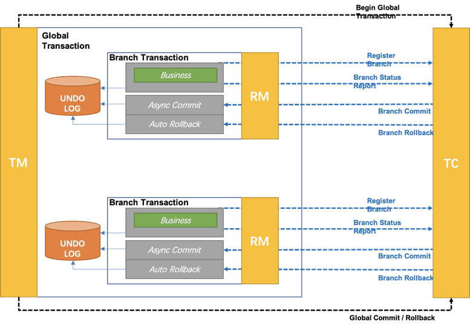

## Seata AT模式的例子

我们用一个比较简单的业务场景来描述一下Seata AT模式的工作过程。

有个充值业务，现在有两个服务，一个负责管理用户的余额，另外一个负责管理用户的积分。

> 当用户充值的时候，首先增加用户账户上的余额，然后增加用户的积分。

Seata AT分为两阶段，主要逻辑全部在第一阶段，第二阶段主要做回滚或日志清理的工作。

### 第一阶段流程

第一阶段流程如:

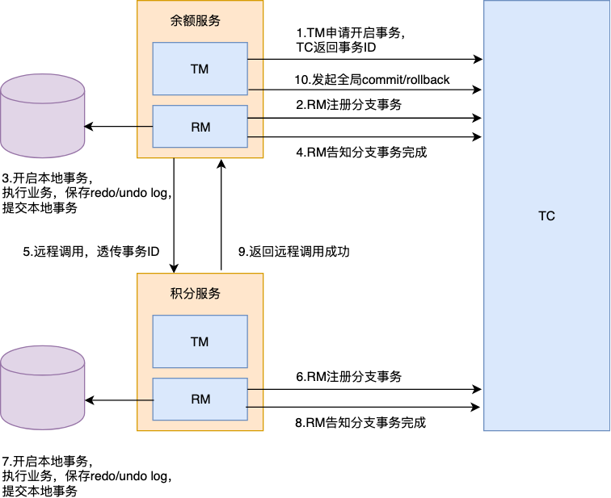

1) 余额服务中的TM，向TC申请开启一个全局事务，TC会返回一个全局的事务ID。

2) 余额服务在执行本地业务之前，RM会先向TC注册分支事务。

3) 余额服务依次生成`undo log`、执行本地事务、生成`redo log`，最后直接提交本地事务。

4) 余额服务的RM向TC汇报，事务状态是成功的。

5) 余额服务发起远程调用，把事务ID传给积分服务。

6) 积分服务在执行本地业务之前，也会先向TC注册分支事务。

7) 积分服务次生成`undo log`、执行本地事务、生成`redo log`，最后直接提交本地事务。

8) 积分服务的RM向TC汇报，事务状态是成功的。

9) 积分服务返回远程调用成功给余额服务。

10) 余额服务的TM向TC申请全局事务的提交/回滚。

> 积分服务中也有TM，但是由于没有用到，因此直接可以忽略。

我们如果使用 `Spring` 框架的注解式事务，远程调用会在本地事务提交之前发生。但是，先发起远程调用还是先提交本地事务，这个其实没有任何影响。

### 第二阶段流程

第二阶段的逻辑就比较简单了。

`Client`和TC之间是有长连接的，如果是正常全局提交，则TC通知多个RM异步清理掉本地的`redo`和`undo log`即可。如果是回滚，则TC通知每个RM回滚数据即可。

这里就会引出一个问题，由于本地事务都是自己直接提交了，后面如何回滚，由于我们在操作本地业务操作的前后，做记录了`undo`和`redo log`，因此可以通过`undo log`进行回滚。由于`undo`和`redo log`和业务操作在同一个事务中，因此肯定会同时成功或同时失败。

但是还会存在一个问题，因为每个事务从本地提交到通知回滚这段时间里，可能这条数据已经被别的事务修改，如果直接用`undo log`回滚，会导致数据不一致的情况。

此时，RM会用`redo log`进行校验，对比数据是否一样，从而得知数据是否有别的事务修改过。**注意：undo log是被修改前的数据，可以用于回滚；redo log是被修改后的数据，用于回滚校验。**

如果数据未被其他事务修改过，则可以直接回滚；如果是脏数据，再根据不同策略处理。

## Seata AT 模式在电商下单场景的使用

下面描述 Seata AT mode 的工作原理使用的电商下单场景的使用

如下图所示：

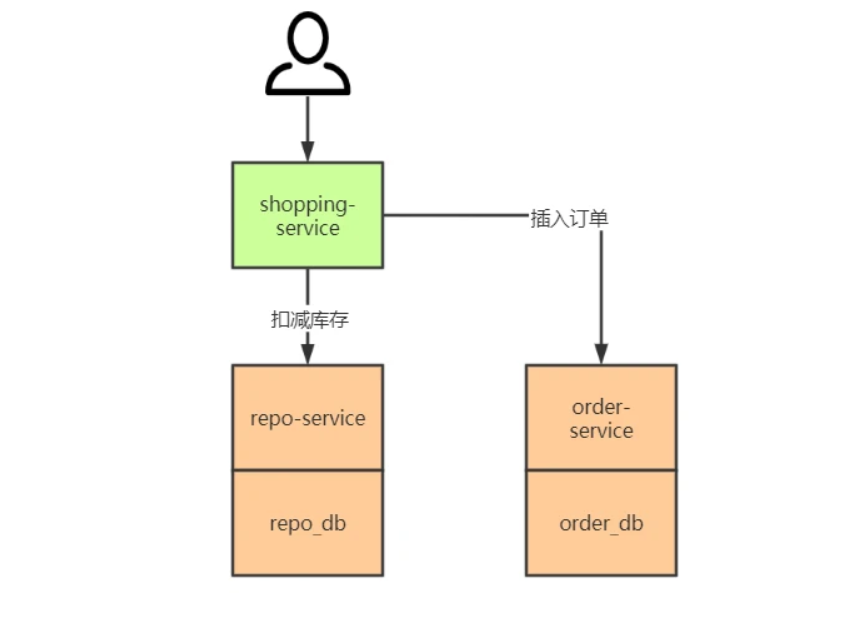

在上图中，协调者 `shopping-service` 先调用参与者 `repo-service` 扣减库存，后调用参与者 `order-service` 生成订单。这个业务流使用 `Seata in XA mode` 后的全局事务流程如下图所示：

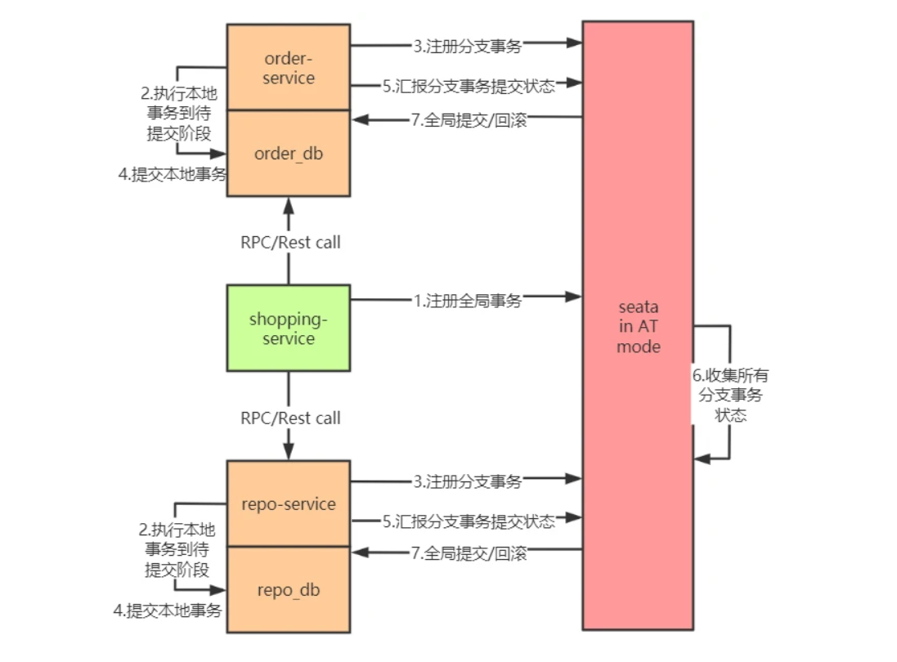

上图描述的全局事务执行流程为：

1) `shopping-service` 向 Seata 注册全局事务，并产生一个全局事务标识 XID

2) 将 `repo-service.repo_db`、`order-service.order_db` 的本地事务执行到待提交阶段，事务内容包含对 `repo-service.repo_db`、`order-service.order_db` 进行的查询操作以及写每个库的 `undo_log` 记录

3) `repo-service.repo_db`、`order-service.order_db` 向 Seata 注册分支事务，并将其纳入该 XID 对应的全局事务范围

4) 提交 `repo-service.repo_db`、`order-service.order_db` 的本地事务

5) `repo-service.repo_db`、`order-service.order_db` 向 Seata 汇报分支事务的提交状态

6) Seata 汇总所有的 DB 的分支事务的提交状态，决定全局事务是该提交还是回滚

7) Seata 通知 `repo-service.repo_db`、`order-service.order_db` 提交/回滚本地事务，若需要回滚，采取的是补偿式方法

其中 1) 2) 3) 4) 5) 属于第一阶段，6) 7) 属于第二阶段。

### 电商业务场景中 Seata in AT mode 工作流程详述

在上面的电商业务场景中，购物服务调用库存服务扣减库存，调用订单服务创建订单，显然这两个调用过程要放在一个事务里面。即：

```sql
start global_trx

 call 库存服务的扣减库存接口

 call 订单服务的创建订单接口

commit global_trx
```

在库存服务的数据库中，存在如下的库存表 `t_repo`：

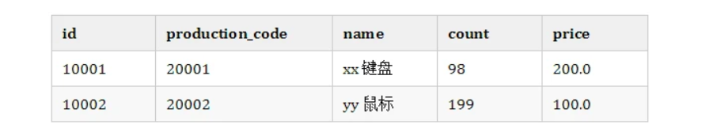

在订单服务的数据库中，存在如下的订单表 `t_order`：

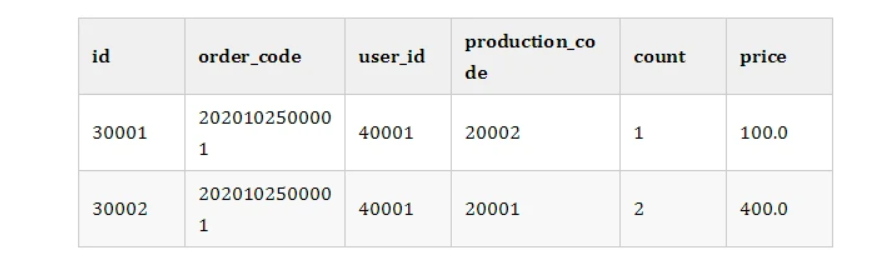

现在，id 为 `40002` 的用户要购买一只商品代码为 `20002` 的鼠标，整个分布式事务的内容为：

1) 在库存服务的库存表中将记录

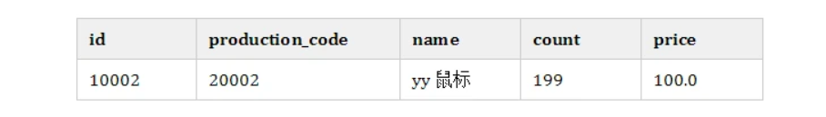

修改为:

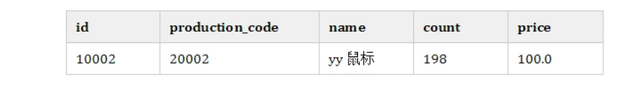

2) 在订单服务的订单表中添加一条记录

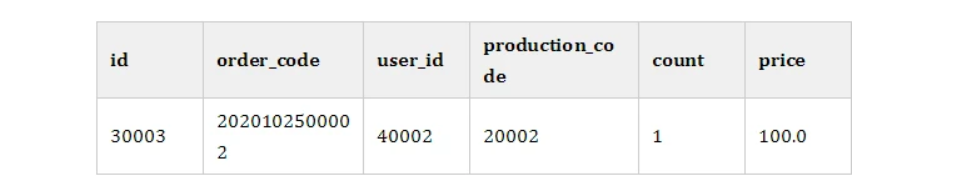

以上操作，在 AT 模式的第一阶段的流程图如下：

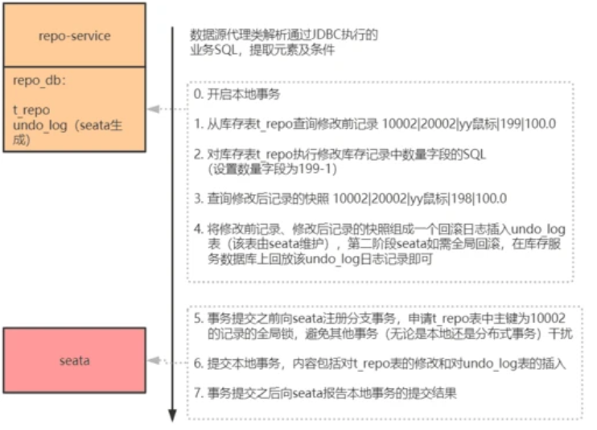
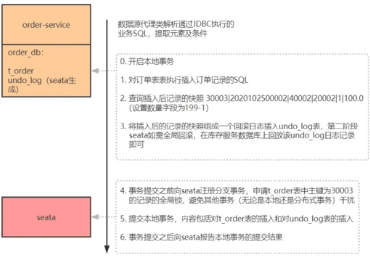

从 AT 模式第一阶段的流程来看，分支的本地事务在第一阶段提交完成之后，就会释放掉本地事务锁定的本地记录。这是 AT 模式和 XA 最大的不同点，在 XA 事务的两阶段提交中，被锁定的记录直到第二阶段结束才会被释放。
所以 AT 模式减少了锁记录的时间，从而提高了分布式事务的处理效率。AT 模式之所以能够实现第一阶段完成就释放被锁定的记录，是因为 Seata 在每个服务的数据库中维护了一张 `undo_log` 表，其中记录了对 `t_order / t_repo` 进行操作前后记录的镜像数据，
即便第二阶段发生异常，只需回放每个服务的 `undo_log` 中的相应记录即可实现全局回滚。

`undo_log` 的表结构：

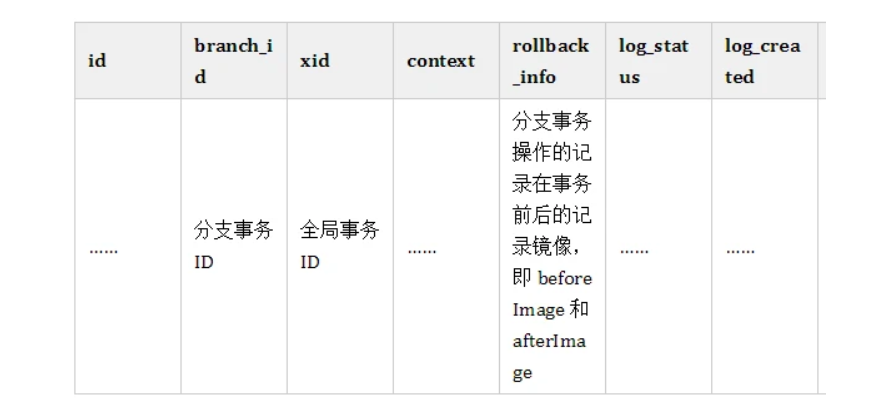

第一阶段结束之后，Seata 会接收到所有分支事务的提交状态，然后决定是提交全局事务还是回滚全局事务。

1) 若所有分支事务本地提交均成功，则 Seata 决定全局提交。Seata 将分支提交的消息发送给各个分支事务，各个分支事务收到分支提交消息后，会将消息放入一个缓冲队列，然后直接向 Seata 返回提交成功。之后，每个本地事务会慢慢处理分支提交消息，
处理的方式为：删除相应分支事务的 `undo_log` 记录。之所以只需删除分支事务的 `undo_log` 记录，而不需要再做其他提交操作，是因为提交操作已经在第一阶段完成了（这也是 AT 和 XA 不同的地方) 。这个过程如下图所示：

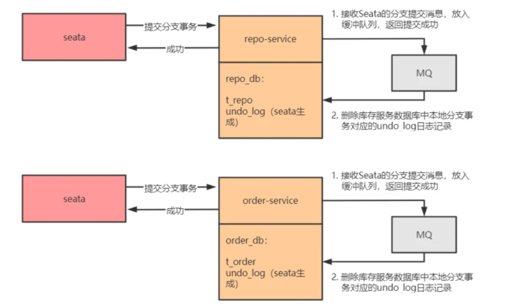

分支事务之所以能够直接返回成功给 Seata，是因为真正关键的提交操作在第一阶段已经完成了，清除 `undo_log` 日志只是收尾工作，即便清除失败了，也对整个分布式事务不产生实质影响。

2) 若任一分支事务本地提交失败，则 Seata 决定全局回滚，将分支事务回滚消息发送给各个分支事务，由于在第一阶段各个服务的数据库上记录了 `undo_log` 记录，分支事务回滚操作只需根据 `undo_log` 记录进行补偿即可。全局事务的回滚流程如下图所示：

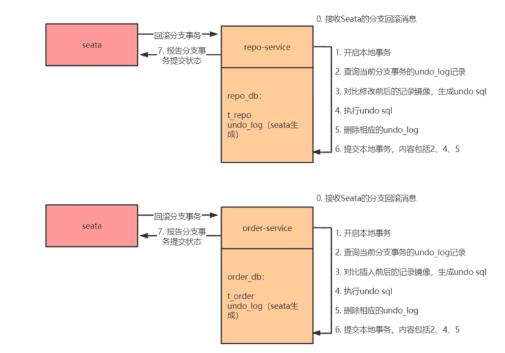

这里对图中的 2、3 步做进一步的说明：

1) 由于上文给出了 `undo_log` 的表结构，所以可以通过 `xid` 和 `branch_id` 来找到当前分支事务的所有 `undo_log` 记录；

2) 拿到当前分支事务的 `undo_log` 记录之后，首先要做数据校验，如果 `afterImage` 中的记录与当前的表记录不一致，说明从第一阶段完成到此刻期间，有别的事务修改了这些记录，这会导致分支事务无法回滚，向 Seata 反馈回滚失败；
如果 `afterImage` 中的记录与当前的表记录一致，说明从第一阶段完成到此刻期间，没有别的事务修改这些记录，分支事务可回滚，进而根据 `beforeImage` 和 `afterImage` 计算出补偿 SQL，执行补偿 SQL 进行回滚，然后删除相应 `undo_log`，向 Seata 反馈回滚成功。

## Seata的数据隔离性

seata的AT模式主要实现逻辑是数据源代理，而数据源代理将基于如`MySQL`和`Oracle`等关系事务型数据库实现，基于数据库的隔离级别为`read committed`。换而言之，本地事务的支持是seata实现at模式的必要条件，这也将限制seata的at模式的使用场景。

### 写隔离

从前面的工作流程，我们可以很容易知道，Seata的写隔离级别是全局独占的。

首先，我们理解一下写隔离的流程:

```markdown

分支事务1-开始
| 
V 获取 本地锁
| 
V 获取 全局锁    分支事务2-开始
|               |
V 释放 本地锁     V 获取 本地锁
|               |
V 释放 全局锁     V 获取 全局锁
                |
                V 释放 本地锁
                |
                V 释放 全局锁
```

如上所示，一个分布式事务的锁获取流程是这样的

1) 先获取到本地锁，这样你已经可以修改本地数据了，只是还不能本地事务提交
2) 而后，能否提交就是看能否获得全局锁
3) 获得了全局锁，意味着可以修改了，那么提交本地事务，释放本地锁
4) 当分布式事务提交，释放全局锁。这样就可以让其它事务获取全局锁，并提交它们对本地数据的修改了。

可以看到，这里有两个关键点:

1) 本地锁获取之前，不会去争抢全局锁
2) 全局锁获取之前，不会提交本地锁

这就意味着，数据的修改将被互斥开来。也就不会造成写入脏数据。全局锁可以让分布式修改中的写数据隔离。

#### 写隔离的原则

* 一阶段本地事务提交前，需要确保先拿到 **全局锁** 。
* 拿不到 **全局锁** ，不能提交本地事务。
* 拿 **全局锁** 的尝试被限制在一定范围内，超出范围将放弃，并回滚本地事务，释放本地锁。

以一个示例来说明：

> 两个全局事务 tx1 和 tx2，分别对 a 表的 m 字段进行更新操作，m 的初始值 1000。

`tx1` 先开始，开启本地事务，拿到本地锁，更新操作 `m = 1000 - 100 = 900`。本地事务提交前，先拿到该记录的 **全局锁** ，本地提交释放本地锁。

`tx2` 后开始，开启本地事务，拿到本地锁，更新操作 `m = 900 - 100 = 800`。本地事务提交前，尝试拿该记录的 **全局锁** ，`tx1` 全局提交前，该记录的全局锁被 `tx1` 持有，`tx2` 需要重试等待 **全局锁** 。

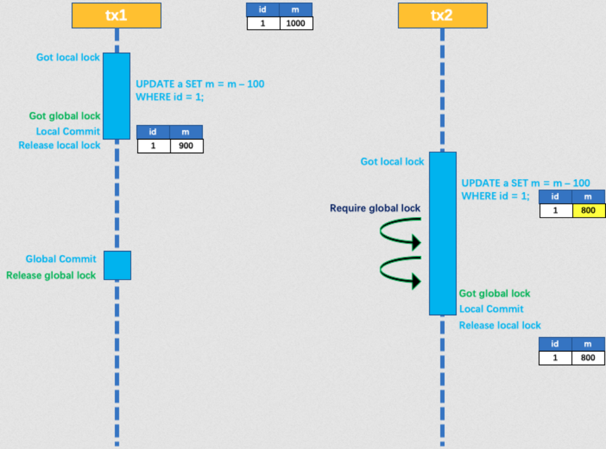

`tx1` 二阶段全局提交，释放 **全局锁** 。`tx2` 拿到 **全局锁** 提交本地事务。

如果 `tx1` 的二阶段全局回滚，则 `tx1` 需要重新获取该数据的本地锁，进行反向补偿的更新操作，实现分支的回滚。

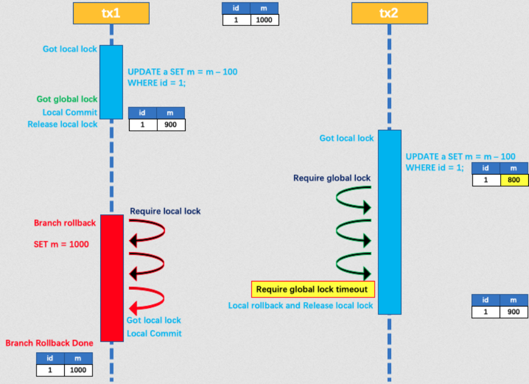

此时，如果 `tx2` 仍在等待该数据的 **全局锁**，同时持有本地锁，则 `tx1` 的分支回滚会失败。分支的回滚会一直重试，直到 `tx2 的` **全局锁** 等锁超时，放弃 **全局锁** 并回滚本地事务释放本地锁，`tx1` 的分支回滚最终成功。

因为整个过程 **全局锁** 在 `tx1` 结束前一直是被 `tx1` 持有的，所以不会发生 **脏写** 的问题。

#### 读的隔离级别

在数据库本地事务隔离级别 读已提交（`Read Committed`） 或以上的基础上，Seata（AT 模式）的默认全局隔离级别是 读未提交（`Read Uncommitted`） 。

如果应用在特定场景下，必需要求全局的 **读已提交** ，目前 Seata 的方式是通过 `SELECT FOR UPDATE` 语句的代理。

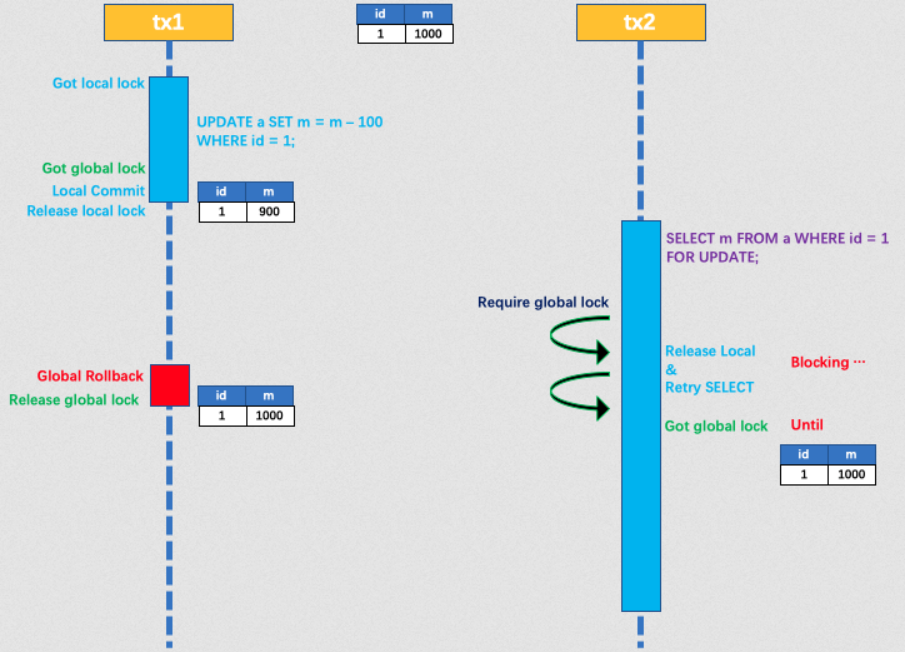

`SELECT FOR UPDATE` 语句的执行会申请 **全局锁** ，如果 **全局锁** 被其他事务持有，则释放本地锁（回滚 `SELECT FOR UPDATE` 语句的本地执行）并重试。这个过程中，查询是被 `block` 住的，直到 **全局锁** 拿到，即读取的相关数据是 **已提交** 的，才返回。

出于总体性能上的考虑，Seata 目前的方案并没有对所有 `SELECT` 语句都进行代理，仅针对 `FOR UPDATE` 的 `SELECT` 语句。

## Spring Cloud集成Seata AT模式

AT模式是指 `Automatic (Branch) Transaction Mode` 自动化分支事务，使用AT模式的前提是

* 基于支持本地 ACID 事务的关系型数据库。

* Java 应用，通过 JDBC 访问数据库。

seata-at的使用步骤

1. 引入seata框架，配置好seata基本配置，建立`undo_log`表

2. 消费者引入全局事务注解`@GlobalTransactional`

3. 生产者引入全局事务注解`@GlobalTransactional`
