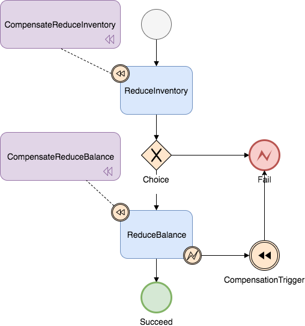

Saga模式是SEATA提供的长事务解决方案，在Saga模式中，业务流程中每个参与者都提交本地事务，当出现某一个参与者失败则补偿前面已经成功的参与者，一阶段正向服务和二阶段补偿服务都由业务开发实现。

## 适用场景

* 业务流程长、业务流程多
* 参与者包含其它公司或遗留系统服务，无法提供 TCC 模式要求的三个接口

## 优势

* 一阶段提交本地事务，无锁，高性能
* 事件驱动架构，参与者可异步执行，高吞吐
* 补偿服务易于实现

## 缺点

* 不保证隔离性

## Saga的实现

### 基于状态机引擎的 Saga 实现

目前SEATA提供的Saga模式是基于状态机引擎来实现的，机制是：

1. 通过状态图来定义服务调用的流程并生成 `json` 状态语言定义文件
2. 状态图中一个节点可以是调用一个服务，节点可以配置它的补偿节点
3. 状态图 `json` 由状态机引擎驱动执行，当出现异常时状态引擎反向执行已成功节点对应的补偿节点将事务回滚

> 注意: 异常发生时是否进行补偿也可由用户自定义决定

1. 可以实现服务编排需求，支持单项选择、并发、子流程、参数转换、参数映射、服务执行状态判断、异常捕获等功能

示例状态图:

