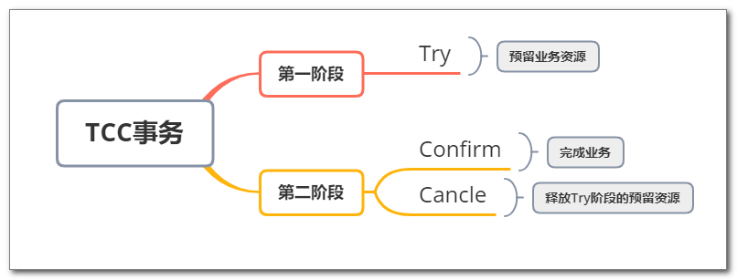
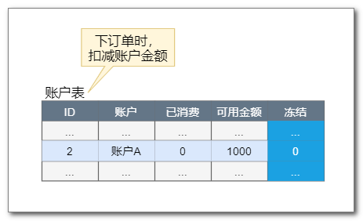
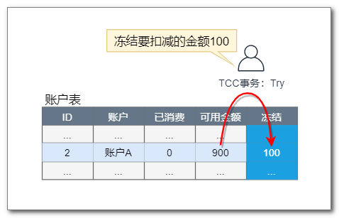
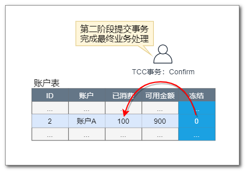
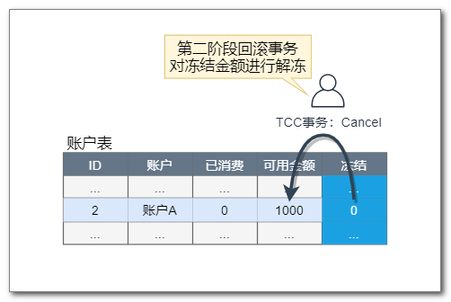
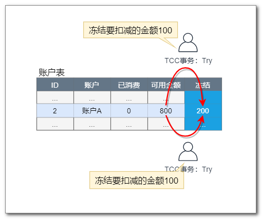

## 简介

TCC 与 Seata AT 事务一样都是两阶段事务，它与 AT 事务的主要区别为：

* **TCC 对业务代码侵入严重**

    每个阶段的数据操作都要自己进行编码来实现，事务框架无法自动处理。

* **TCC 性能更高**

    不必对数据加全局锁，允许多个事务同时操作数据。

Seata TCC 整体是 **两阶段提交** 的模型。一个分布式的全局事务，全局事务是由若干分支事务组成的，分支事务要满足 两阶段提交 的模型要求，即需要每个分支事务都具备自己的：

* 一阶段 `prepare` 行为
* 二阶段 `commit 或` `rollback` 行为

根据两阶段行为模式的不同，我们将分支事务划分为 `Automatic (Branch) Transaction Mode` 和 `TCC (Branch) Transaction Mode`.

AT 模式基于 **支持本地 ACID 事务** 的 **关系型数据库**：

* 一阶段 `prepare` 行为：在本地事务中，一并提交业务数据更新和相应回滚日志记录。
* 二阶段 `commit` 行为：马上成功结束，自动 异步批量清理回滚日志。
* 二阶段 `rollback` 行为：通过回滚日志，自动 生成补偿操作，完成数据回滚。

相应的，TCC 模式，不依赖于底层数据资源的事务支持：

* 一阶段 `prepare` 行为：调用 自定义 的 `prepare` 逻辑。
* 二阶段 `commit` 行为：调用 自定义 的 `commit` 逻辑。
* 二阶段 `rollback` 行为：调用 自定义 的 `rollback` 逻辑。

所谓 TCC 模式，是指支持把 自定义 的分支事务纳入到全局事务的管理中。

### 第一阶段 Try

以账户服务为例，当下订单时要扣减用户账户金额：

假如用户购买 100 元商品，要扣减 100 元。

TCC 事务首先对这100元的扣减金额进行预留，或者说是先冻结这100元：

### 第二阶段 Confirm

如果第一阶段能够顺利完成，那么说明`“扣减金额”`业务(分支事务)最终肯定是可以成功的。当全局事务提交时， TC会控制当前分支事务进行提交，如果提交失败，TC 会反复尝试，直到提交成功为止:

当全局事务提交时，就可以使用冻结的金额来最终实现业务数据操作：

### 第二阶段 Cancel

如果全局事务回滚，就把冻结的金额进行解冻，恢复到以前的状态，TC 会控制当前分支事务回滚，如果回滚失败，TC 会反复尝试，直到回滚完成为止:

### 多个事务并发的情况

多个TCC全局事务允许并发，它们执行扣减金额时，只需要冻结各自的金额即可：

