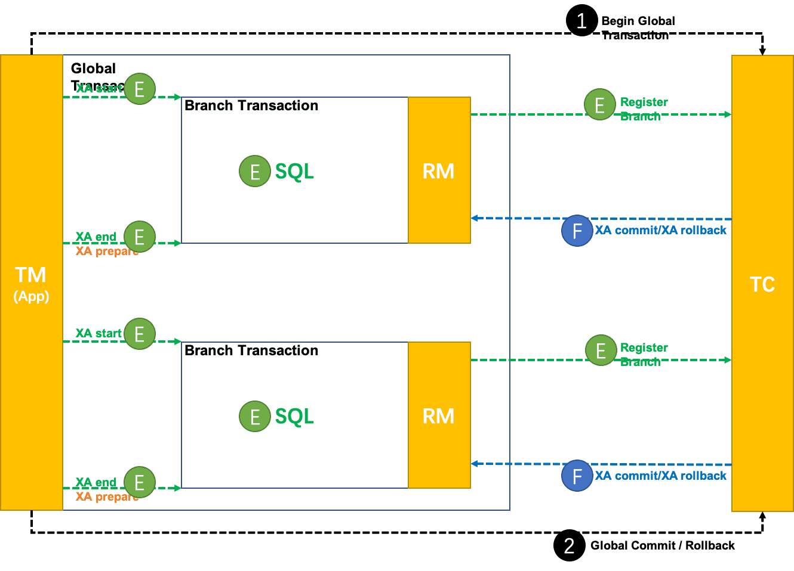

## 使用Seata XA模式的前提

* 支持XA 事务的数据库。
* Java 应用，通过 `JDBC` 访问数据库。

## Seata XA模式的整体机制

在 Seata 定义的分布式事务框架内，利用事务资源（数据库、消息服务等）对 XA 协议的支持，以 XA 协议的机制来管理分支事务的一种 事务模式。

> 注意这里的重点：利用事务资源对 XA 协议的支持，以 XA 协议的机制来管理分支事务。


## Seata XA模式的工作机制

1. **整体运行机制**
   
XA 模式 运行在 Seata 定义的事务框架内：



2. **数据源代理**

XA 模式需要 `XAConnection`。

获取 `XAConnection` 两种方式：

* 方式一：要求开发者配置 `XADataSource`
* 方式二：根据开发者的普通 `DataSource` 来创建

第一种方式，给开发者增加了认知负担，需要为 XA 模式专门去学习和使用 XA 数据源，与 透明化 XA 编程模型的设计目标相违背。

第二种方式，对开发者比较友好，和 AT 模式使用一样，开发者完全不必关心 XA 层面的任何问题，保持本地编程模型即可。

我们优先设计实现第二种方式：数据源代理根据普通数据源中获取的普通 `JDBC` 连接创建出相应的 `XAConnection`。

类比 AT 模式的数据源代理机制，如下：


实际上，这种方法是在做数据库驱动程序要做的事情。不同的厂商、不同版本的数据库驱动实现机制是厂商私有的，我们只能保证在充分测试过的驱动程序上是正确的，开发者使用的驱动程序版本差异很可能造成机制的失效。

综合考虑，XA 模式的数据源代理设计需要同时支持第一种方式：基于 XA 数据源进行代理。

类比 AT 模式的数据源代理机制，如下：


XA `start` 需要 `Xid` 参数。这个 `Xid` 需要和 Seata 全局事务的 `XID` 和 `BranchId` 关联起来，以便由 TC 驱动 XA 分支的提交或回滚。

目前 Seata 的 `BranchId` 是在分支注册过程，由 TC 统一生成的，所以 XA 模式分支注册的时机需要在 XA `start` 之前。

将来一个可能的优化方向：**把分支注册尽量延后。类似 AT 模式在本地事务提交之前才注册分支，避免分支执行失败情况下，没有意义的分支注册。**

这个优化方向需要 `BranchId` 生成机制的变化来配合。`BranchId` 不通过分支注册过程生成，而是生成后再带着 `BranchId` 去注册分支。

## XA 模式的使用

从编程模型上，XA 模式与 AT 模式保持完全一致。

样例场景是 Seata 经典的，涉及库存、订单、账户 3 个微服务的商品订购业务。

在样例中，上层编程模型与 AT 模式完全相同。只需要修改数据源代理，即可实现 XA 模式与 AT 模式之间的切换。

```java
    @Bean("dataSource")
    public DataSource dataSource(DruidDataSource druidDataSource) {
        // DataSourceProxy for AT mode
        // return new DataSourceProxy(druidDataSource);

        // DataSourceProxyXA for XA mode
        return new DataSourceProxyXA(druidDataSource);
    }
```

