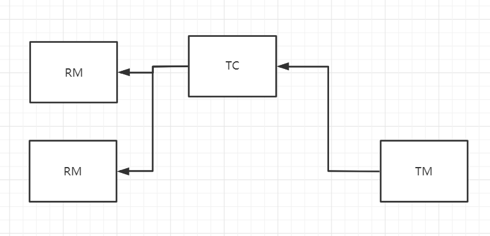
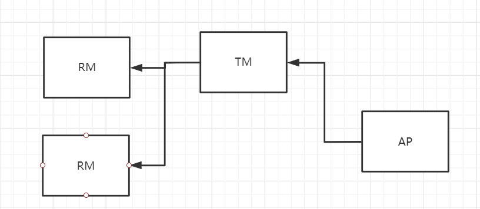

Seata 是一款开源的分布式事务解决方案，致力于提供高性能和简单易用的分布式事务服务。Seata 将为用户提供了 `AT`、`TCC`、`SAGA` 和 `XA` 事务模式，为用户打造一站式的分布式解决方案。

在 Seata 开源之前，Seata 对应的内部版本在阿里经济体内部一直扮演着分布式一致性中间件的角色，帮助经济体平稳的度过历年的双11，对各BU业务进行了有力的支撑。商业化产品GTS 先后在阿里云、金融云进行售卖

什么是seata：https://seata.io/zh-cn/docs/overview/what-is-seata.html

## Seata的三大模块

Seata AT使用了增强型二阶段提交实现。

Seata 分三大模块 :

* **TC** ：事务协调者。负责我们的事务ID的生成，事务注册、提交、回滚等。
* **TM**：事务发起者。定义事务的边界，负责告知 TC，分布式事务的开始，提交，回滚。
* **RM**：资源管理者。管理每个分支事务的资源，每一个 RM 都会作为一个分支事务注册在 TC。

在Seata的AT模式中，TM和RM都作为SDK的一部分和业务服务在一起，我们可以认为是`Client`。TC是一个独立的服务，通过服务的注册、发现将自己暴露给`Client`们。

Seata 中有三大模块中， TM 和 RM 是作为 Seata 的客户端与业务系统集成在一起，TC 作为 Seata 的服务端独立部署。

## Seata的分布式事务的执行流程

在 Seata 中，分布式事务的执行流程：

* TM 开启分布式事务（TM 向 TC 注册全局事务记录）；
* 按业务场景，编排数据库、服务等事务内资源（RM 向 TC 汇报资源准备状态 ）；
* TM 结束分布式事务，事务一阶段结束（TM 通知 TC 提交/回滚分布式事务）；
* TC 汇总事务信息，决定分布式事务是提交还是回滚；
* TC 通知所有 RM 提交/回滚 资源，事务二阶段结束；

Seata的TC、TM、RM三个角色 ， 是不是和XA模型很像. 下图是XA模型的事务大致流程:

在X/Open `DTP(Distributed Transaction Process)`模型里面，有三个角色：

* **AP**: `Application`，应用程序。也就是业务层。哪些操作属于一个事务，就是AP定义的。

* **TM**: `Transaction Manager`，事务管理器。接收AP的事务请求，对全局事务进行管理，管理事务分支状态，协调RM的处理，通知RM哪些操作属于哪些全局事务以及事务分支等等。这个也是整个事务调度模型的核心部分。

* **RM**：`Resource Manager`，资源管理器。一般是数据库，也可以是其他的资源管理器，如消息队列(如JMS数据源)，文件系统等。

## 4种分布式事务解决方案

Seata 会有 4 种分布式事务解决方案，分别是 `AT 模式`、`TCC 模式`、`Saga 模式`和 `XA 模式`。
