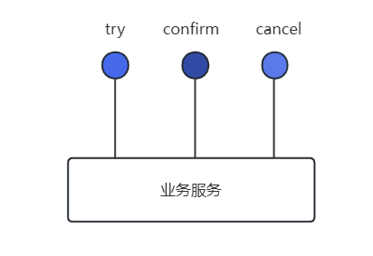
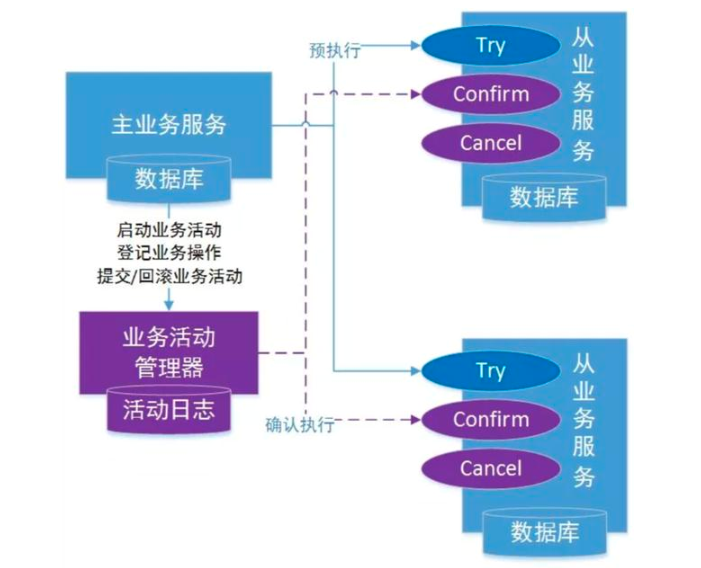
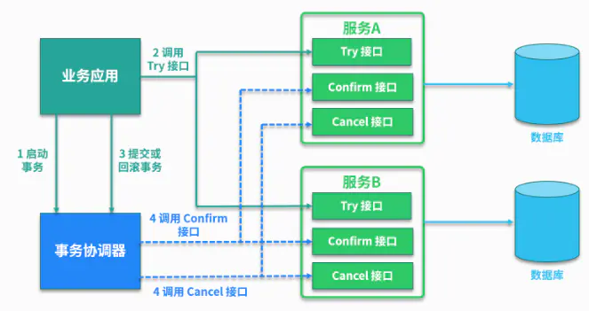
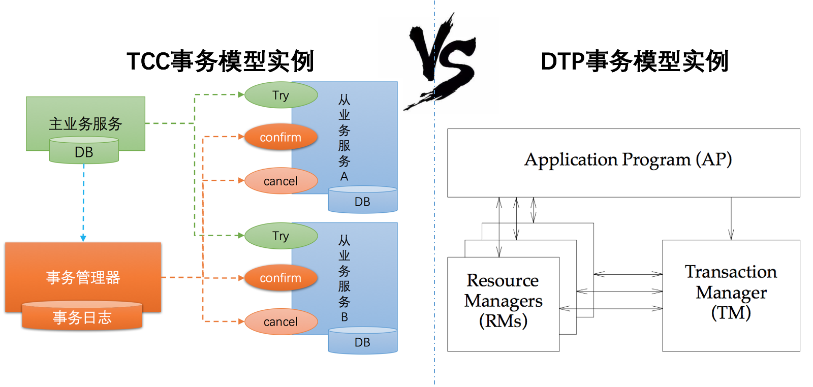
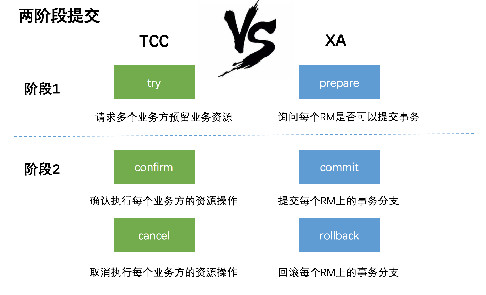
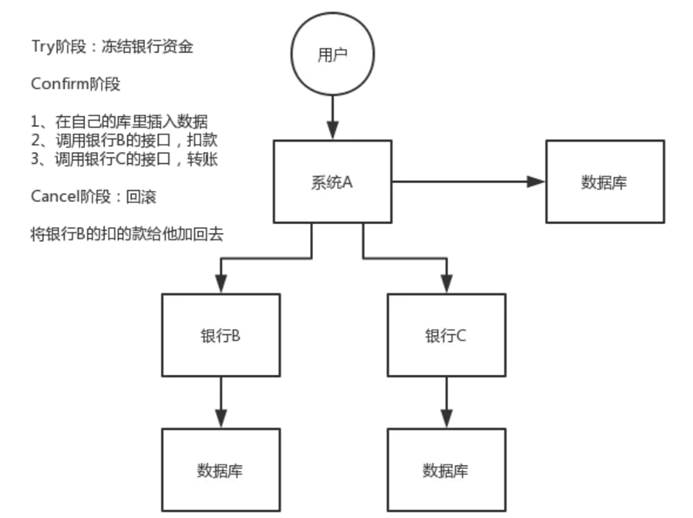

## 什么是TCC事务模型

`TCC（Try-Confirm-Cancel）`的概念来源于 `Pat Helland` 发表的一篇名为`“Life beyond Distributed Transactions:an Apostate’s Opinion”`的论文。

TCC 分布式事务模型包括三部分：

1. **主业务服务**：主业务服务为整个业务活动的发起方，服务的编排者，负责发起并完成整个业务活动。

2. **从业务服务**：从业务服务是整个业务活动的参与方，负责提供 TCC 业务操作，实现初步操作(`Try`)、确认操作(`Confirm`)、取消操作(`Cancel`)三个接口，供主业务服务调用。

3. **业务活动管理器**：业务活动管理器管理控制整个业务活动，包括记录维护 TCC 全局事务的事务状态和每个从业务服务的子事务状态，并在业务活动提交时调用所有从业务服务的 `Confirm` 操作，
在业务活动取消时调用所有从业务服务的 `Cancel` 操作。

> TCC 提出了一种新的事务模型，基于业务层面的事务定义，锁粒度完全由业务自己控制，目的是解决复杂业务中，跨表跨库等大颗粒度资源锁定的问题。
>
> TCC 把事务运行过程分成 Try、Confirm / Cancel 两个阶段，每个阶段的逻辑由业务代码控制，避免了长事务，可以获取更高的性能。

## TCC的工作流程

`TCC(Try-Confirm-Cancel)`分布式事务模型相对于 XA 等传统模型，其特征在于**它不依赖资源管理器(`RM`)对分布式事务的支持，而是通过对业务逻辑的分解来实现分布式事务。**

**TCC 模型认为对于业务系统中一个特定的业务逻辑，其对外提供服务时，必须接受一些不确定性，即对业务逻辑初步操作的调用仅是一个临时性操作，调用它的主业务服务保留了后续的取消权。
如果主业务服务认为全局事务应该回滚，它会要求取消之前的临时性操作，这就对应从业务服务的取消操作。而当主业务服务认为全局事务应该提交时，它会放弃之前临时性操作的取消权，
这对应从业务服务的确认操作。每一个初步操作，最终都会被确认或取消。**

因此，针对一个具体的业务服务，TCC 分布式事务模型需要业务系统提供三段业务逻辑：

* **初步操作 Try**：完成所有业务检查，预留必须的业务资源。

* **确认操作 Confirm**：真正执行的业务逻辑，不作任何业务检查，只使用 `Try` 阶段预留的业务资源。因此，只要 `Try` 操作成功，`Confirm` 必须能成功。另外，`Confirm` 操作需满足幂等性，
保证一笔分布式事务有且只能成功一次。

* **取消操作 Cancel**：释放 `Try` 阶段预留的业务资源。同样的，`Cancel` 操作也需要满足幂等性。

**TCC 分布式事务模型包括三部分：**

* **Try 阶段**： 调用 `Try` 接口，尝试执行业务，完成所有业务检查，预留业务资源。
* **Confirm 或 Cancel 阶段**： 两者是互斥的，只能进入其中一个，并且都满足幂等性，允许失败重试。
* **Confirm 操作**： 对业务系统做确认提交，确认执行业务操作，不做其他业务检查，只使用 `Try` 阶段预留的业务资源。
* **Cancel 操作**： 在业务执行错误，需要回滚的状态下执行业务取消，释放预留资源。

**Try 阶段失败可以 Cancel，如果 Confirm 和 Cancel 阶段失败了怎么办？**

TCC 中会添加事务日志，如果 `Confirm` 或者 `Cancel` 阶段出错，则会进行重试，所以这两个阶段需要支持幂等；如果重试失败，则需要人工介入进行恢复和处理等。

## TCC事务案例

然而基于补偿的事务形态也并非能实现所有的需求，如以下场景：某笔订单完成时，同时扣掉用户的现金，但交易未完成，也未被取消时，不能让客户看到钱变少了。

这时我们可以引入TCC，其流程如下：

* 订单服务创建订单
* 订单服务发送远程调用到现金服务，冻结客户的现金
* 提交订单服务数据
* 订单服务发送远程调用到现金服务，扣除客户冻结的现金

以上是正常完成的流程，若为异常流程，则需要发送远程调用请求到现金服务，撤销冻结的金额。

以上流程比基于补偿实现的事务的流程要复杂，同时开发的工作量也更多：

* 订单服务编写创建订单的逻辑
* 现金服务编写冻结现金的逻辑
* 现金服务编写扣除现金的逻辑
* 现金服务编写解冻现金的逻辑

TCC实际上是最为复杂的一种情况，其能处理所有的业务场景，但无论出于性能上的考虑，还是开发复杂度上的考虑，都应该尽量避免该类事务。

## TCC事务模型的要求

1. **可查询操作**：服务操作具有全局唯一的标识，操作唯一的确定的时间。
2. **幂等操作**：重复调用多次产生的业务结果与调用一次产生的结果相同。一是通过业务操作实现幂等性，二是系统缓存所有请求与处理的结果，最后是检测到重复请求之后，自动返回之前的处理结果。

3. **TCC操作**：`Try`阶段，尝试执行业务，完成所有业务的检查，实现一致性；预留必须的业务资源，实现准隔离性。
   * **Confirm阶段**：真正的去执行业务，不做任何检查，仅适用`Try`阶段预留的业务资源，`Confirm`操作还要满足幂等性。
   * **Cancel阶段**：取消执行业务，释放`Try`阶段预留的业务资源，`Cancel`操作要满足幂等性。
   * **TCC与2PC(两阶段提交)协议的区别**：TCC位于业务服务层而不是资源层，TCC没有单独准备阶段，`Try`操作兼备资源操作与准备的能力，TCC中`Try`操作可以灵活的选择业务资源，锁定粒度。
   TCC的开发成本比2PC高。实际上TCC也属于两阶段操作，但是TCC不等同于2PC操作。

4. **可补偿操作**：
   * **Do阶段**：真正的执行业务处理，业务处理结果外部可见。
   * **Compensate阶段**：抵消或者部分撤销正向业务操作的业务结果，补偿操作满足幂等性。约束：补偿操作在业务上可行，由于业务执行结果未隔离或者补偿不完整带来的风险与成本可控。
   实际上，TCC的`Confirm`和`Cancel`操作可以看做是补偿操作。

## TCC事务模型 VS DTP事务模型

比较一下TCC事务模型和DTP事务模型，如下所示：

这两张图看起来差别较大，实际上很多地方是类似的!

1. TCC模型中的 `主业务服务` 相当于 DTP模型中的AP，TCC模型中的 `从业务服务` 相当于 DTP模型中的RM

   * 在DTP模型中，应用AP操作多个资源管理器RM上的资源；而在TCC模型中，是主业务服务操作多个从业务服务上的资源。例如航班预定案例中，美团App就是主业务服务，而川航和东航就是从业务服务，
   主业务服务需要使用从业务服务上的机票资源。不同的是DTP模型中的资源提供者是类似于Mysql这种关系型数据库，而TCC模型中资源的提供者是其他业务服务。

2. TCC模型中，从业务服务提供的`try`、`confirm`、`cancel`接口相当于DTP模型中RM提供的`prepare`、`commit`、`rollback`接口

   * XA协议中规定了DTP模型中定RM需要提供`prepare`、`commit`、`rollback`接口给TM调用，以实现两阶段提交。

   * 而在TCC模型中，从业务服务相当于RM，提供了类似的`try`、`confirm`、`cancel`接口。

3. 事务管理器

   * DTP模型和TCC模型中都有一个事务管理器。不同的是：

     * 在DTP模型中，阶段1的(`prepare`)和阶段2的(`commit`、`rollback`)，都是由TM进行调用的。

     * 在TCC模型中，阶段1的try接口是主业务服务调用(绿色箭头)，阶段2的(`confirm`、`cancel`接口)是事务管理器TM调用(红色箭头)。这就是 TCC 分布式事务模型的二阶段异步化功能，
     从业务服务的第一阶段执行成功，主业务服务就可以提交完成，然后再由事务管理器框架异步的执行各从业务服务的第二阶段。这里牺牲了一定的隔离性和一致性的，但是提高了长事务的可用性。

## TCC与2PC对比

TCC其实本质和2PC是差不多的：

* T就是`Try`，两个C分别是`Confirm`和`Cancel`。

* `Try`就是尝试，请求链路中每个参与者依次执行`Try`逻辑，如果都成功，就再执行`Confirm`逻辑，如果有失败，就执行`Cancel`逻辑。

TCC与XA两阶段提交有着异曲同工之妙，下图列出了二者之间的对比:

1. 在阶段1：

   * 在XA中，各个RM准备提交各自的事务分支，事实上就是准备提交资源的更新操作(`insert`、`delete`、`update`等)；

   * 而在TCC中，是主业务活动请求(`try`)各个从业务服务预留资源。

2. 在阶段2：

   * XA根据第一阶段每个RM是否都`prepare`成功，判断是要提交还是回滚。如果都`prepare`成功，那么就`commit`每个事务分支，反之则`rollback`每个事务分支。

   * TCC中，如果在第一阶段所有业务资源都预留成功，那么`confirm`各个从业务服务，否则取消(`cancel`)所有从业务服务的资源预留请求。

### TCC和2PC不同的是

* XA是资源层面的分布式事务，强一致性，在两阶段提交的整个过程中，一直会持有资源的锁。基于数据库锁实现，需要数据库支持XA协议，由于在执行事务的全程都需要对相关数据加锁，一般高并发性能会比较差
* TCC是业务层面的分布式事务，最终一致性，不会一直持有资源的锁，性能较好。但是对微服务的侵入性强，微服务的每个事务都必须实现`try`、`confirm`、`cancel`等3个方法，开发成本高，
今后维护改造的成本也高为了达到事务的一致性要求，`try`、`confirm`、`cancel`接口必须实现幂等性操作由于事务管理器要记录事务日志，必定会损耗一定的性能，并使得整个TCC事务时间拉长

> TCC它会弱化每个步骤中对于资源的锁定，以达到一个能承受高并发的目的（基于最终一致性）。

### 具体说明

XA是资源层面的分布式事务，强一致性，在两阶段提交的整个过程中，一直会持有资源的锁。

XA事务中的两阶段提交内部过程是对开发者屏蔽的，开发者从代码层面是感知不到这个过程的。而事务管理器在两阶段提交过程中，从`prepare`到`commit/rollback`过程中，资源实际上一直都是被加锁的。
如果有其他人需要更新这两条记录，那么就必须等待锁释放。

TCC是业务层面的分布式事务，最终一致性，不会一直持有资源的锁。

TCC中的两阶段提交并没有对开发者完全屏蔽，也就是说从代码层面，开发者是可以感受到两阶段提交的存在。`try`、`confirm/cancel`在执行过程中，一般都会开启各自的本地事务， 
来保证方法内部业务逻辑的ACID特性。其中：

1. `try`过程的本地事务，是保证资源预留的业务逻辑的正确性。

2. `confirm/cancel`执行的本地事务逻辑确认/取消预留资源，以保证最终一致性，也就是所谓的补偿型事务(`Compensation-Based Transactions`)。由于是多个独立的本地事务，因此不会对资源一直加锁。

另外，这里提到`confirm/cancel`执行的本地事务是**补偿性事务**：补偿是一个独立的支持ACID特性的本地事务，用于在逻辑上取消服务提供者上一个ACID事务造成的影响，
对于一个长事务(`long-running transaction`)，与其实现一个巨大的分布式ACID事务，不如使用基于补偿性的方案，把每一次服务调用当做一个较短的本地ACID事务来处理，执行完就立即提交

## TCC的使用场景

TCC是可以解决部分场景下的分布式事务的，但是，它的一个问题在于，需要每个参与者都分别实现`Try`，`Confirm`和`Cancel`接口及逻辑，这对于业务的侵入性是巨大的。

TCC 方案严重依赖回滚和补偿代码，最终的结果是：回滚代码逻辑复杂，业务代码很难维护。所以，TCC 方案的使用场景较少，但是也有使用的场景。

比如说跟钱打交道的，支付、交易相关的场景，大家会用 TCC方案，严格保证分布式事务要么全部成功，要么全部自动回滚，严格保证资金的正确性，保证在资金上不会出现问题。

