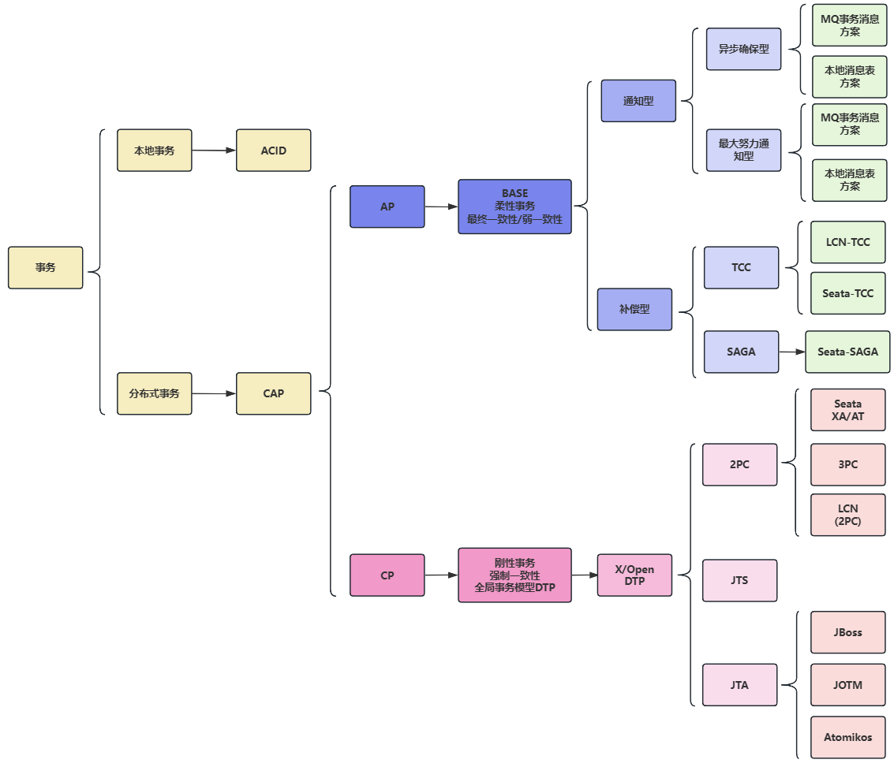

## 名词解释

* **事务**：事务是由一组操作构成的可靠的独立的工作单元，事务具备`ACID`的特性，即原子性、一致性、隔离性和持久性。

* **本地事务**：当事务由资源管理器本地管理时被称作本地事务。本地事务的优点就是支持严格的`ACID`特性，高效，可靠，状态可以只在资源管理器中维护，而且应用编程模型简单。
但是本地事务不具备分布式事务的处理能力，隔离的最小单位受限于资源管理器。

* **全局事务**：当事务由全局事务管理器进行全局管理时成为全局事务，事务管理器负责管理全局的事务状态和参与的资源，协同资源的一致提交回滚。

* **TX协议**：应用或者应用服务器与事务管理器的接口。

* **XA协议**：全局事务管理器与资源管理器的接口。`XA`是由`X/Open`组织提出的分布式事务规范。该规范主要定义了全局事务管理器和局部资源管理器之间的接口。主流的数据库产品都实现了`XA`接口。
`XA`接口是一个双向的系统接口，在事务管理器以及多个资源管理器之间作为通信桥梁。之所以需要`XA`是因为在分布式系统中从理论上讲两台机器是无法达到一致性状态的，
因此引入一个单点进行协调。由全局事务管理器管理和协调的事务可以跨越多个资源和进程。全局事务管理器一般使用`XA`二阶段协议与数据库进行交互。

* **AP**：应用程序，可以理解为使用`DTP（Data Tools Platform）`的程序。

* **RM**：资源管理器，这里可以是一个`DBMS`或者消息服务器管理系统，应用程序通过资源管理器对资源进行控制，资源必须实现`XA`定义的接口。资源管理器负责控制和管理实际的资源。

* **TM**：事务管理器，负责协调和管理事务，提供给`AP`编程接口以及管理资源管理器。事务管理器控制着全局事务，管理事务的生命周期，并且协调资源。

* **两阶段提交协议**：`XA`用于在全局事务中协调多个资源的机制。`TM`和`RM`之间采取两阶段提交的方案来解决一致性问题。
两节点提交需要一个协调者（`TM`）来掌控所有参与者（`RM`）节点的操作结果并且指引这些节点是否需要最终提交。两阶段提交的局限在于协议成本，准备阶段的持久成本，全局事务状态的持久成本，
潜在故障点多带来的脆弱性，准备后，提交前的故障引发一系列隔离与恢复难题。

* **BASE理论**：`BA`指的是基本业务可用性，支持分区失败，`S`表示柔性状态，也就是允许短时间内不同步，`E`表示最终一致性，数据最终是一致的，但是实时是不一致的。
原子性和持久性必须从根本上保障，为了可用性、性能和服务降级的需要，只有降低一致性和隔离性的要求。

* **CAP定理**：对于共享数据系统，最多只能同时拥有`CAP`其中的两个，任意两个都有其适应的场景，真是的业务系统中通常是`ACID`与`CAP`的混合体。分布式系统中最重要的是满足业务需求，
而不是追求高度抽象，绝对的系统特性。`C`表示一致性，也就是所有用户看到的数据是一样的。`A`表示可用性，是指总能找到一个可用的数据副本。`P`表示分区容错性，能够容忍网络中断等故障。

## 分布式事务与分布式锁的区别

分布式锁解决的是分布式资源抢占的问题；

分布式事务和本地事务是解决流程化提交问题。