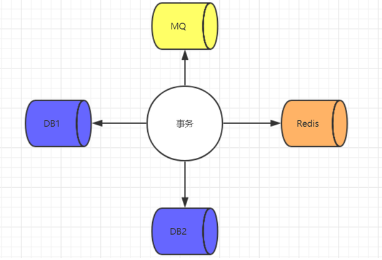
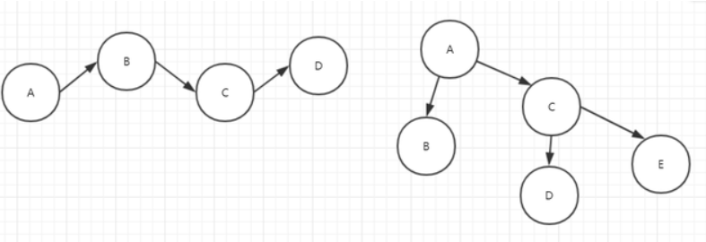
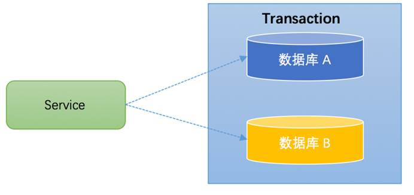
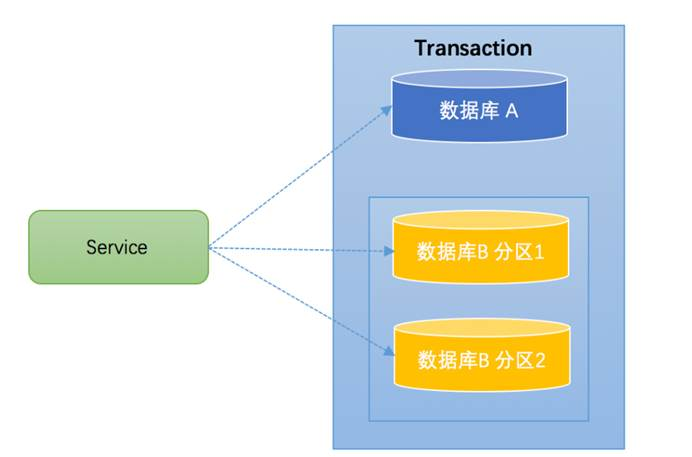
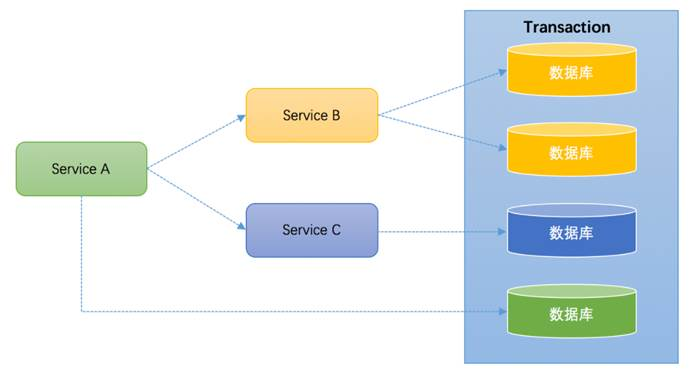

## 分布式环境的事务复杂性

### 存储端的多样性

首先就是存储端的多样性。本地事务的情况下，所有数据都会落到同一个`DB`中，但是，在分布式的情况下，就会出现数据可能要落到多个`DB`，或者还会落到`Redis`，落到`MQ`等中。

存储端多样性, 如下图所示：

### 事务链路的延展性

本地事务的情况下，通常所有事务相关的业务操作，会被我们封装到一个`Service`方法中。而在分布式的情况下，请求链路被延展，拉长，一个操作会被拆分成多个服务，它们呈现线状或网状，
依靠网络通信构建成一个整体。在这种情况下，事务无疑变得更复杂。

事务链路延展性, 如下图所示：

基于上述两个复杂性，期望有一个统一的分布式事务方案，能够像本地事务一样，以几乎无侵入的方式，满足各种存储介质，各种复杂链路，是不现实的。

至少，在当前，还没有一个十分成熟的解决方案。所以，一般情况下，在分布式下，事务会被拆分解决，并根据不同的情况，采用不同的解决方案。

## 什么是分布式事务？

对于分布式系统而言，需要保证分布式系统中的数据一致性，保证数据在子系统中始终保持一致，避免业务出现问题。分布式系统中对数要么一起成功，要么一起失败，必须是一个整体性的事务。

分布式事务指事务的参与者、支持事务的服务器、资源服务器以及事务管理器分别位于不同的分布式系统的不同节点之上。

简单的说，在分布式系统上一次大的操作由不同的小操作组成，这些小的操作分布在不同的服务节点上，且属于不同的应用，分布式事务需要保证这些小操作要么全部成功，要么全部失败。

举个例子：在电商网站中，用户对商品进行下单，需要在订单表中创建一条订单数据，同时需要在库存表中修改当前商品的剩余库存数量，两步操作一个添加，一个修改，我们一定要保证这两步操作一定同时操作成功或失败，否则业务就会出现问题。

任何事务机制在实现时，都应该考虑事务的`ACID`特性，包括：本地事务、分布式事务。对于分布式事务而言，即使不能都很好的满足，也要考虑支持到什么程度。

典型的分布式事务场景：

### 1. 跨库事务
   
跨库事务指的是，一个应用某个功能需要操作多个库，不同的库中存储不同的业务数据。笔者见过一个相对比较复杂的业务，一个业务中同时操作了9个库。

下图演示了一个服务同时操作2个库的情况：

### 2. 分库分表

通常一个库数据量比较大或者预期未来的数据量比较大，都会进行水平拆分，也就是分库分表。

如下图，将数据库B拆分成了2个库：

对于分库分表的情况，一般开发人员都会使用一些数据库中间件来降低`sql`操作的复杂性。

如，对于`sql`：`insert into user(id,name) values (1,"tianshouzhi"),(2,"wangxiaoxiao")`。这条`sql`是操作单库的语法，单库情况下，可以保证事务的一致性。

但是由于现在进行了分库分表，开发人员希望将1号记录插入分库1，2号记录插入分库2。所以数据库中间件要将其改写为2条`sql`，分别插入两个不同的分库，此时要保证两个库要不都成功，要不都失败，
因此基本上所有的数据库中间件都面临着分布式事务的问题。

### 3. 微服务化

微服务架构是目前一个比较一个比较火的概念。例如上面笔者提到的一个案例，某个应用同时操作了9个库，这样的应用业务逻辑必然非常复杂，对于开发人员是极大的挑战，应该拆分成不同的独立服务，
以简化业务逻辑。拆分后，独立服务之间通过`RPC`框架来进行远程调用，实现彼此的通信。下图演示了一个3个服务之间彼此调用的架构：

`Service A`完成某个功能需要直接操作数据库，同时需要调用`Service B`和`Service C`，而`Service B`又同时操作了2个数据库，`Service C`也操作了一个库。
需要保证这些跨服务的对多个数据库的操作要不都成功，要不都失败，实际上这可能是最典型的分布式事务场景。

分布式事务实现方案必须要考虑性能的问题，如果为了严格保证`ACID`特性，导致性能严重下降，那么对于一些要求快速响应的业务，是无法接受的。