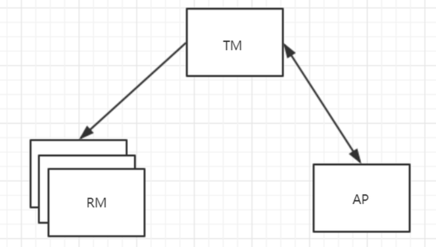
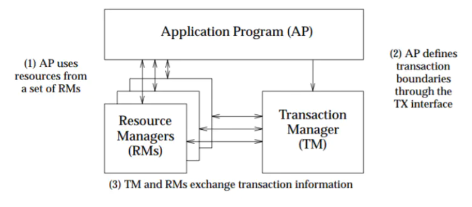
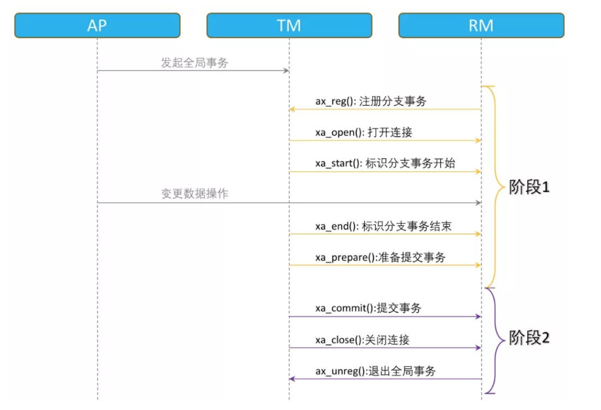
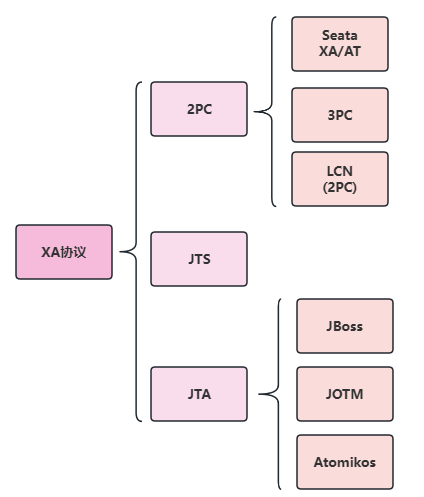
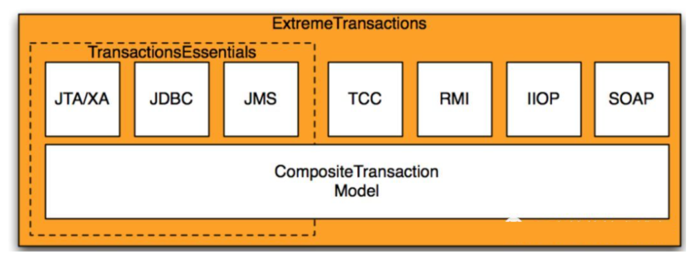

## XA模型或者X/Open DTP模型

`X/OPEN`是一个组织。`X/Open`国际联盟有限公司是一个欧洲基金会，它的建立是为了向`UNIX`环境提供标准。它主要的目标是促进对`UNIX`语言、接口、网络和应用的开放式系统协议的制定。它还促进在不同的`UNIX`环境之间的应用程序的互操作性，
以及支持对电气电子工程师协会（`IEEE`）对`UNIX`的可移植操作系统接口（`POSIX`）规范。

X/Open `DTP(Distributed Transaction Process)` 是一个分布式事务模型。这个模型主要使用了两段提交(`2PC - Two-Phase-Commit`)来保证分布式事务的完整性。

在X/Open `DTP(Distributed Transaction Process)`模型里面，有三个角色：

* **AP** : `Application`，应用程序。也就是业务层。哪些操作属于一个事务，就是`AP`定义的。

* **TM** : `Transaction Manager`，事务管理器。接收`AP`的事务请求，对全局事务进行管理，管理事务分支状态，协调`RM`的处理，通知`RM`哪些操作属于哪些全局事务以及事务分支等等。这个也是整个事务调度模型的核心部分。

* **RM** ：`Resource Manager`，资源管理器。一般是数据库，也可以是其他的资源管理器，如消息队列(如`JMS`数据源)，文件系统等。



`XA`把参与事务的角色分成`AP`，`RM`，`TM`。

`AP`，即应用，也就是我们的业务服务。

`RM`指的是资源管理器，即`DB`，`MQ`等。

`TM`则是事务管理器。

> `AP`自己操作`TM`，当需要事务时，`AP`向`TM`请求发起事务，`TM`负责整个事务的提交，回滚等。

`XA`规范主要定义了(全局)事务管理器(`Transaction Manager`)和(局部)资源管理器(`Resource Manager`)之间的接口。`XA`接口是双向的系统接口，在事务管理器（`Transaction Manager`）以及一个或多个资源管理器（`Resource Manager`）之间形成通信桥梁。

`XA`之所以需要引入事务管理器是因为，在分布式系统中，从理论上讲（参考`Fischer`等的论文），两台机器理论上无法达到一致的状态，需要引入一个单点进行协调。事务管理器控制着全局事务，管理事务生命周期，并协调资源。资源管理器负责控制和管理实际资源（如数据库或`JMS`队列）



## XA规范

### 什么是XA

用非常官方的话来说:

* `XA规范` 是 `X/Open` 组织定义的分布式事务处理（`DTP`，`Distributed Transaction Processing`）标准。

* `XA规范` 描述了全局的事务管理器与局部的资源管理器之间的接口。 `XA规范`的目的是允许的多个资源（如数据库，应用服务器，消息队列等）在同一事务中访问，这样可以使 `ACID` 属性跨越应用程序而保持有效。

* `XA规范` 使用两阶段提交（`2PC`，`Two-Phase Commit`）协议来保证所有资源同时提交或回滚任何特定的事务。

* `XA规范` 在上世纪 `90` 年代初就被提出。目前，几乎所有主流的数据库都对 `XA规范` 提供了支持。

`XA规范(XA Specification)` 是 `X/OPEN` 提出的分布式事务处理规范。`XA`则规范了`TM`与`RM`之间的通信接口，在`TM`与多个`RM`之间形成一个双向通信桥梁，从而在多个数据库资源下保证`ACID`四个特性。目前知名的数据库，如`Oracle`, `DB2`,`mysql`等，
都是实现了`XA`接口的，都可以作为`RM`。

`XA`是数据库的分布式事务，强一致性，在整个过程中，数据一张锁住状态，即从`prepare`到`commit`、`rollback`的整个过程中，`TM`一直把持折数据库的锁，如果有其他人要修改数据库的该条数据，就必须等待锁的释放，存在长事务风险。

以下的函数使事务管理器可以对资源管理器进行的操作：

1) `xa_open`,`xa_close`：建立和关闭与资源管理器的连接。
2) `xa_start`,`xa_end`：开始和结束一个本地事务。
3) `xa_prepare`,`xa_commit`,`xa_rollback`：预提交、提交和回滚一个本地事务。
4) `xa_recover`：回滚一个已进行预提交的事务。
5) `ax_`开头的函数使资源管理器可以动态地在事务管理器中进行注册，并可以对`XID(TRANSACTION IDS)`进行操作。
6) `ax_reg`,`ax_unreg`；允许一个资源管理器在一个`TMS(TRANSACTION MANAGER SERVER)`中动态注册或撤消注册。

### XA各个阶段的处理流程



## XA协议的实现



### 2PC/3PC协议

两阶段提交（`2PC`）协议是XA规范定义的 数据一致性协议。

三阶段提交（3PC`）协议对 `2PC` 协议的一种扩展。

### Seata

Seata 是一款开源的分布式事务解决方案，致力于在微服务架构下提供高性能和简单易用的分布式事务服务。Seata 将为用户提供了 AT、TCC、SAGA 和 XA 事务模式

在 Seata 开源之前，Seata 对应的内部版本在阿里经济体内部一直扮演着分布式一致性中间件的角色，帮助经济体平稳的度过历年的双11，对各BU业务进行了有力的支撑。商业化产品GTS 先后在阿里云、金融云进行售卖

### Jta规范

作为`java`平台上事务规范 `JTA（Java Transaction API）`也定义了对`XA`事务的支持，实际上，`JTA`是基于`XA`架构上建模的，在 `JTA` 中，事务管理器抽象为`javax.transaction.TransactionManager`接口，并通过底层事务服务（即`JTS`）实现。
像很多其他的`java`规范一样，`JTA`仅仅定义了接口，具体的实现则是由供应商(如`J2EE`厂商)负责提供，目前`JTA`的实现主要由以下几种：

1. `J2EE`容器所提供的`JTA`实现(`JBoss`)
2. 独立的`JTA`实现:如`JOTM`，`Atomikos`

这些实现可以应用在那些不使用`J2EE`应用服务器的环境里用以提供分布事事务保证。如`Tomcat`,`Jetty`以及普通的`java`应用。

### JTS规范

事务是编程中必不可少的一项内容，基于此，为了规范事务开发，`Java`增加了关于事务的规范，即`JTA`和`JTS`

`JTA`定义了一套接口，其中约定了几种主要的角色：`TransactionManager`、`UserTransaction`、`Transaction`、`XAResource`，并定义了这些角色之间需要遵守的规范，如`Transaction`的委托给`TransactionManager`等。

`JTS`也是一组规范，上面提到`JTA`中需要角色之间的交互，那应该如何交互？ `JTS`就是约定了交互细节的规范。

总体上来说`JTA`更多的是从框架的角度来约定程序角色的接口，而`JTS`则是从具体实现的角度来约定程序角色之间的接口，两者各司其职。

### Atomikos分布式事务实现

`Atomikos`公司旗下有两款著名的分布事务产品：

* **TransactionEssentials**：开源的免费产品
* **ExtremeTransactions**：商业版，需要收费

这两个产品的关系如下图所示：



可以看到，在开源版本中支持`JTA/XA`、`JDBC`、`JMS`的事务。

#### Atomikos也支持与spring事务整合。

`spring`事务管理器的顶级抽象是`PlatformTransactionManager`接口，其提供了个重要的实现类：

* **DataSourceTransactionManager**：用于实现本地事务
* **JTATransactionManager**：用于实现分布式事务

显然，在这里，我们需要配置的是`JTATransactionManager`:

```java
public class JTAService {  
    @Autowired   
    private UserMapper userMapper;//操作db_user库   
    @Autowired  
    private AccountMapper accountMapper;//操作db_account库  

    @Transactional   
    public void insert() {    
        User user = new User();     
        user.setName("wangxiaoxiao");     
        userMapper.insert(user);  
        //模拟异常，spring回滚后，db_user库中user表中也不会插入记录     
        Account account = new Account();     
        account.setUserId(user.getId());    
        account.setMoney(123456789);    
        accountMapper.insert(account); 
    }
}
```

### XA的主要限制

* 必须要拿到所有数据源，而且数据源还要支持`XA`协议。目前`MySQL`中只有`InnoDB`存储引擎支持`XA`协议。

* 性能比较差，要把所有涉及到的数据都要锁定，是强一致性的，会产生长事务。

### Seata AT模式

`Seata AT`模式是增强型`2PC`模式。

`AT` 模式： 两阶段提交协议的演变，没有一直锁表

* **一阶段**：业务数据和回滚日志记录在同一个本地事务中提交，释放本地锁和连接资源
* **二阶段**：提交异步化，非常快速地完成。或回滚通过一阶段的回滚日志进行反向补偿

### LCN（2PC）

`TX-LCN`，5.0以后由于框架兼容了`LCN（2pc）`、`TCC`、`TXC` 三种事务模式，为了区分`LCN`模式，特此将`LCN`分布式事务改名为`TX-LCN`分布式事务框架。

`TX-LCN`定位于一款事务协调性框架，框架其本身并不生产事务，而是本地事务的协调者，从而达到事务一致性的效果。

`TX-LCN` 主要有两个模块，`Tx-Client(TC)` ，`Tx-Manager™`.

* **TM （Tx-Manager）**：是独立的服务，是分布式事务的控制方，协调分布式事务的提交，回滚
* **TC（Tx-Client）**：由业务系统集成，事务发起方、参与方都由`TxClient`端来控制

## XA规范的问题

但是`XA`规范在`1994`年就出现了，至今没有大规模流行起来，必然有他一定的缺陷：

1. **数据锁定**：数据在事务未结束前，为了保障一致性，根据数据隔离级别进行锁定。

2. **协议阻塞**：本地事务在全局事务 没 `commit` 或 `callback` 前都是阻塞等待的。

3. **性能损耗高**：主要体现在事务协调增加的RT成本，并发事务数据使用锁进行竞争阻塞。

`XA`协议比较简单，而且一旦商业数据库实现了`XA`协议，使用分布式事务的成本也比较低。但是，`XA`也有致命的缺点，那就是**性能不理想**，特别是在交易下单链路，往往并发量很高，`XA`无法满足高并发场景。`XA`目前在商业数据库支持的比较理想，在`mysql`数据库中支持的不太理想，
`mysql`的`XA`实现，没有记录`prepare`阶段日志，主备切换回导致主库与备库数据不一致。许多`nosql`也没有支持`XA`，这让`XA`的应用场景变得非常狭隘。

其实也并非不用，例如在`IBM`大型机上基于`CICS`很多跨资源是基于`XA`协议实现的分布式事务，事实上`XA`也算分布式事务处理的规范了，但在为什么互联网中很少使用，究其原因有以下几个：

* 性能（阻塞性协议，增加响应时间、锁时间、死锁）；
* 数据库支持完善度（MySQL 5.7之前都有缺陷）；
* 协调者依赖独立的J2EE中间件（早期重量级`Weblogic`、`Jboss`、后期轻量级`Atomikos`、`Narayana`和`Bitronix`）；
* 运维复杂，DBA缺少这方面经验；
* 并不是所有资源都支持XA协议；

准确讲XA是一个规范、协议，它只是定义了一系列的接口，只是目前大多数实现XA的都是数据库或者MQ，所以提起XA往往多指基于资源层的底层分布式事务解决方案。其实现在也有些数据分片框架或者中间件也支持XA协议，毕竟它的兼容性、普遍性更好。
