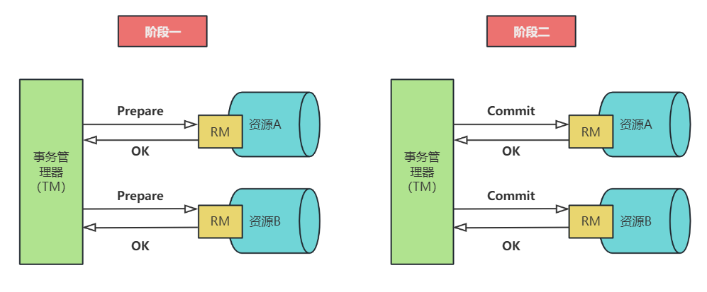

## 一、2PC协议概述

两阶段提交协议（`two phase commit protocol，2PC`）可以保证数据的强一致性，许多分布式关系型数据管理系统采用此协议来完成分布式事务。它是协调所有分布式原子事务参与者，
并决定提交或取消（回滚）的分布式算法。同时也是解决一致性问题的一致性算法。该算法能够解决很多的临时性系统故障（包括进程、网络节点、通信等故障），被广泛地使用。但是，
它并不能够通过配置来解决所有的故障，在某些情况下它还需要人为的参与才能解决问题。**参与者为了能够从故障中恢复，它们都使用日志来记录协议的状态，虽然使用日志降低了性能但是节点能够从故障中恢复。**

### 两个角色

在两阶段提交协议中，分布式系统一般包含两类机器（或节点）：

* 协调者 `coordinator`，通常一个系统中只有一个；
* 事务参与者 `participants`，`cohorts` 或 `workers`，一般包含多个；

### 最终结果

当 `2PC` 的最后一步完成之后，协调器执行协议，参与者根据本地事务能够成功完成回复同意提交事务或者回滚事务。

## 二、执行过程

两阶段提交协议由两个阶段组成。在正常的执行下，这两个阶段的执行过程如下所述：

* **（1）阶段1：请求阶段（prepare 阶段，或称表决阶段）**

在请求阶段，协调者将通知事务参与者准备提交或取消事务，然后进入表决过程。在表决过程中，参与者将告知协调者自己的决策：同意（事务参与者本地作业执行成功）或取消（本地作业执行故障）。

* **（2）阶段2：提交阶段（commit 阶段）**

在该阶段，协调者将基于第一个阶段的投票结果进行决策：提交或取消。当且仅当所有的参与者同意提交事务协调者才通知所有的参与者提交事务，否则协调者将通知所有的参与者取消事务。参与者在接收到协调者发来的消息后将执行响应的操作。

>如果在 prepare 阶段的反馈结果为 yes，而 commit 的过程中出现宕机等异常，则在节点服务重启后，可根据 XA recover 再次进行 commit 补偿，以保证数据的一致性。
> 
>**注意**： 两阶段提交协议与两阶段锁协议不同，两阶段锁协议为一致性控制协议。

### 图解执行过程

先执行请求提交，然后协调者根据参与者反馈的结果决定是提交还是回滚。下面这个图展示的是反馈结果是提交的过程。

失败情况：

## 三、协议的特点

两阶段提交协议最大的劣势是其**通过`阻塞`完成的协议，在节点等待消息的时候处于阻塞状态**，节点中其他进程则需要等待阻塞进程释放资源才能使用。如果协调器发生了故障，那么参与者将无法完成事务则一直等待下去。以下情况可能会导致节点发生永久阻塞：

1) 如果参与者发送同意提交消息给协调者，进程将阻塞直至收到协调器的提交或回滚的消息。如果协调器发生永久故障，参与者将一直等待，这里可以采用备份的协调器，所有参与者将回复发给备份协调器，由它承担协调器的功能。

2) 如果协调器发送`“请求提交”`消息给参与者，它将被阻塞直到所有参与者回复了，如果某个参与者发生永久故障，那么协调器也不会一直阻塞，因为协调器在某一时间内还未收到某参与者的消息，那么它将通知其他参与者回滚事务。

两阶段提交协议没有容错机制，一个参与者节点发生故障整个事务都要回滚，代价比较大。

## 四、协议的缺点

**1. 单点故障**

虽然协调者挂了可以通过一定的选举算法选出一个新的协调者来，但是处于第二个阶段的参与者会锁定资源，导致别人使用这个资源的话会被阻塞。即使你重新换了一个协调者，那参与者还是阻塞的，这怎么解决？

**2. 同步阻塞**
   
`2PC` 中的参与者是阻塞式的。在第一阶段收到请求后就会预先锁定资源，一直到 `commit` 后才会释放。

**3. 数据不一致**

`2PC` 第二阶段 `commit` 时如果协调者挂掉，就会出现部分参与者收到了 `commit` 请求、部分参与者没有收到 `commit` 请求，从而导致数据不一致的情况。比如这种场景：`协调者 A`，参与者 `B`,`C`,`D`。
假设已经执行到了 `2PC` 的第二阶段，`A` 已经给 `B` 发送了 `commit` 请求，但是此时 `A` 挂掉了，那 `C`、`D` 就收不到请求了，这个时候 `B` 的数据是新的，`C`、`D` 还是旧的。

解决方案：协调者宕机，那我们需要使用协调者备份，该协调者备份启动后，通过日志找到未完成的事务，对各参与者发起询问。

## 五、总结

基于 `2PC` 存在的问题，后来有人提出了`三阶段提交协议`，在其中引入超时的机制，将阶段 1 分解为两个阶段：在超时发生以前，系统处于不确定阶段；在超时发生以后，系统则转入确定阶段。

`2PC` 协议包含`协调者`和`参与者`，并且二者都有发生问题的可能性。 假如协调者发生问题，我们可以选出另一个协调者来提交事务。

例如，班长组织活动，如果班长生病了，我们可以请副班长来组织。如果协调者出问题，那么事务将不会取消。例如，班级活动希望每个人都能去，假如有一位同学不能去了，那么直接取消活动即可。或者，如果大多数人去的话那么活动如期举行（`2PC`变种）。
为了能够更好地解决实际的问题，`2PC`协议存在很多的变种，例如：树形`2PC`协议 （或称递归`2PC`协议）、动态2阶段提交协议（`D2PC`）等。