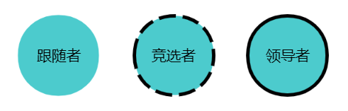
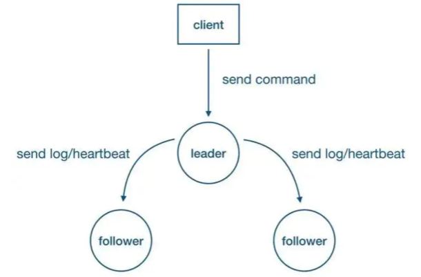
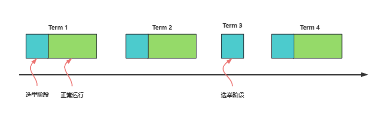
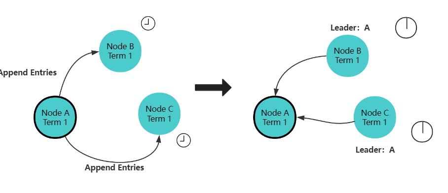
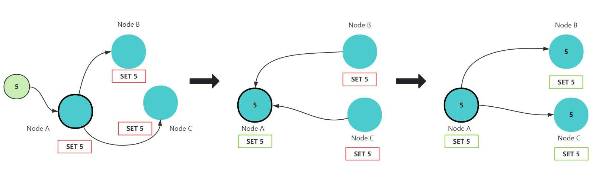
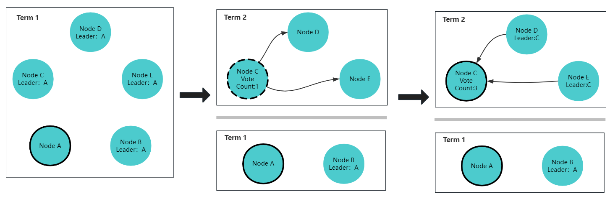
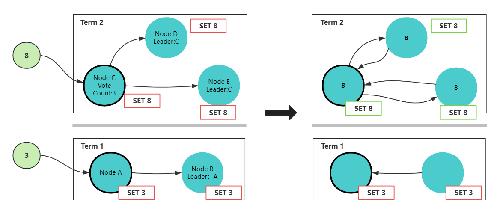
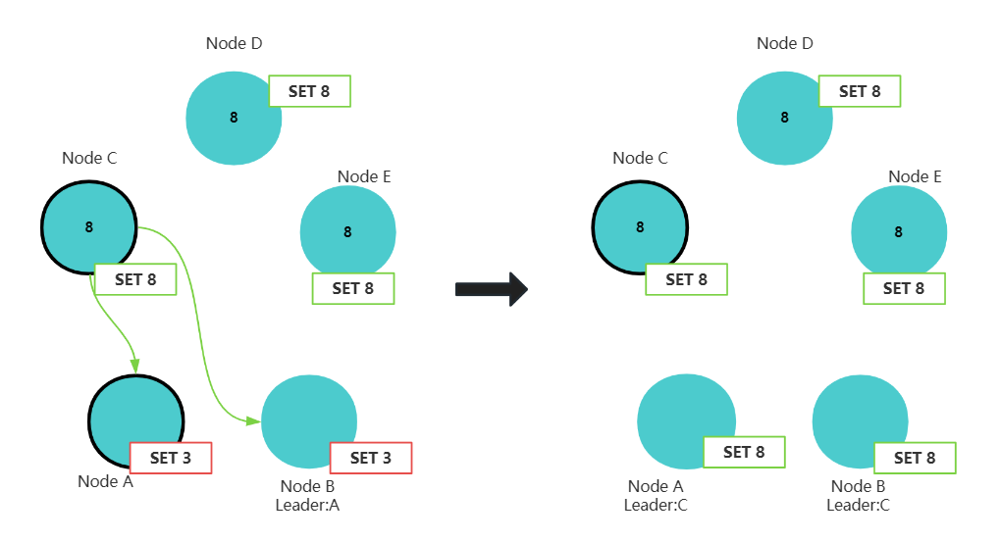

## 一、Raft协议是什么

`Raft`协议是一种分布式一致性算法（共识算法），共识就是多个节点对某一个事件达成一致的算法，即使出现部分节点故障，网络延时等情况，也不影响各节点，进而提高系统的整体可用性。`Raft`是使用较为广泛的分布式协议，我们熟悉的`etcd`注册中心就采用了这个算法；

`Raft`算法将分布式一致性分解为多个子问题，包括`Leader选举（Leader election）`、`日志复制（Log replication）`、`安全性（Safety）`、`日志压缩（Log compaction）`等。

`Raft`将系统中的角色分为:

* **领导者**（`Leader`）: 接受客户端请求，并向`Follower`同步请求日志，当日志同步到大多数节点上后高速`Follower`提交日志。
* **跟随者**（`Follower`）: 接受并持久化`Leader`同步的日志，在`Leader`告知日志可以提交后，提交日志。当`Leader`出现故障时，主动推荐自己为候选人。
* **候选者/竞选者**（`Candidate`）: `Leader`选举过程中的临时角色。向其他节点发送请求投票信息，如果获得大多数选票，则晋升为`Leader`。

`Raft`要求系统在任意时刻最多只有一个`Leader`，正常工作期间只有`Leader`和`Follower`，`Raft`算法将时间划分为任意不同长度的任期(`Term`),每一任期的开始都是一次选举，一个或多个候选人会试图称为`Leader`，在成功选举`Leader`后，`Leader`会在整个任期内管理整个集群，
如果`Leader`选举失败，该任期就会因为没有`Leader`而结束，开始下一任期，并立刻开始下一次选举。

## 二、节点的状态

节点有两个必须属性：

* `currentTerm`：节点当前所处的任期。
* `votedFor` 　：节点当前任期所跟随的其他节点的 `ID`。如果是投票阶段，表示节点所投的候选人。如果已经竞选结束，就是当前的领导人。

## 三、超时计时器

`Raft` 定义了超时计时器来控制选举，分别是`选举超时时间`、`投票超时时间`和`竞选等待超时时间`。

### 1、选举超时时间

领导者会通过周期性地向跟随者发送心跳包来维持自己的统治地位。每个跟随者都会有一个选举超时时间，这个时间是随机的（如 `150-300 ms`），
就是上文所说的随机计时器。每次接收到心跳包之后，跟随者都会重置该超时时间。如果在超时之前没有收到心跳包，跟随者就会判定领导者已下线，此时跟随者就会转变为候选人，开始准备竞选。

选举超时时间的设置让每个节点都有机会能够成为领导者，彷佛每个节点都是蓄势待发的夺权者。超时时间是随机的，超时时间越短，就能越快地变成候选人，野心就越大。一旦当权者失去掌控（断开心跳），
节点的野心无法得到遏制就会马上夺权（展开竞选）。

### 2、投票超时时间

当跟随者变成候选人时，会开启投票超时的倒计时，并邀请所有其他节点为自己投票。在倒计时结束之前如果得票超一半节点数，候选人就竞选成功。如果到了投票超时时间还没攒够票数，
该候选人就会宣告这一轮竞选失败，会等一段时间之后再参与竞选。

其他节点响应投票邀请时，只会回复是否投票给发起者，所有发起投票的候选人是无法得知其他人的得票情况的，只能统计自己的得票数。因此候选人失败时是不知道其他候选人是否成功的，
甚至不知道其他候选人的存在。

### 3、竞选等待超时时间

当候选人选举失败时，会等待一段时间之后再次参与竞选，这段等待时间就是竞选等待超时时间。

此时其他节点可以参加竞选，也可能已经在竞选了，如果候选人在等待投票超时时间或者竞选等待超时时间时其他节点竞选成功，则候选人会马上转变为跟随者跟随该新晋的领导者。

### 4、超时时间重置

只要跟随者收到请求，就会重置自身的选举超时时间，因此领导者会不断地周期性地发送心跳包控制跟随者。同时候选人的投票邀请也会重置跟随者的请求超时时间，
让收到投票但是还没参加竞选的跟随者不参与竞选。

## 四、Leader选举过程

### 1、单个candidate

`Raft`协议种存在两个超时设置用来控制选举过程，第一个超时设置是`选举超时（election timeout）`，选举超时用来设置一个节点从`Follower`变成一个`candidate`所需要等待的时间，这个等待时间控制在`150ms`到`300ms`之间，这个等待时间是随机的，
随机是为了尽量避免产生多个`candidate`，给选主过程制造麻烦。`candidate`产生如下图所示:

当3个节点都设置`election timeout`时，节点`a`跑得比其他其他节点快些成为第一个`candidate`，并开始发起第一轮选举。节点首先给自己先投一票，然后向其他节点发送`Request Vote`消息。

如果其他节点收到消息后发现并没有进行过此次投票，则他就会为`candidate`进行一次投票并重置`election timeout`，一旦`candidate`获得了大多数选票（大多数保证每一轮选举只有一个`candidate`会获胜），则他就会变成`leader`，如下图所示：

节点a成为`leader`后，会间隔指定时间发送`Append Entries`消息给他的`Follower`，间隔时间是由心跳超时控制的（`heartbeat timeout`，即第二种超时类型），`follower`收到消息后会重置等待时间，这样就能阻止`Follower`成为`candidate`。心跳检测过程如下:

这个过程会一直持续下去直到一个`Follower`停止接收`heatbeats`，并且成为`candidate`为止。

以上就是一个常规选主过程。

### 2、多个candidate

上文我们提到在`Follower`转变成`candidate`过程中会随机分配一个`election timeout`给每个节点，这样做可以尽量避免产生多个`candidate`，但并不能`100%`保证不出现2个`candidate`的情况。当出现了2个节点成为`candidate`，此时需要如何确保选主顺畅呢？

当`candidate`从整个集群的大多数（`N/2+1`）节点获得了针对同一 `term` 的选票时，它就赢得了这次选举，立刻将自己的身份转变为 `leader` 并开始向其它节点发送心跳来维持自己的权威。

## 五、日志复制

一旦我们选出了主，那么主就有责任将系统发生的所有变更复制到所有节点。主会使用和心跳相同的`Append Entries`消息用来复制。首先，客户端发起写入值变更，
主会在下一个心跳到来时发送变更日志到`Follower`，当主收到大多数`Follower`确认后，提交变更`entry`，然后向客户端返回成功。这个过程正如我们在概述小节描述的一样。

`Raft`牛逼之处在于网络分区（比如节点部署在不同机房，不同网段）下仍然可以确保节点数据一致。

假设有`5`个节点（`abcde`）组成的网络，`ab`位于一个机房，`cde`唯一一个机房，此时的`leader`是`a`节点。由于网络故障造成2个机房节点通信失败，位于一个机房的`cde`发现`leader`心跳不再了，
则发起了选主过程，节点c获得了多数选票成为了新的`Leader`，此时5个节点同时存在`2 Leader`（老`leader` a节点，新`leader` c节点），如图所示：

接着，我们新增一个客户端节点，该节点尝试修改`a`的值为`3`，由于节点`a`无法与`cde`通信，在做日志复制时无法得到大多数的应答，那么这条`entry`将一直是`uncommited`状态。
而另个客户端尝试修改节点`c`的值为`8`，由于他可以获得大多数的应答，所以这次操作`entry`可以正常提交。

现在网络故障恢复了，节点`a`和`b`都会广播心跳并携带，此时节点`b`发现了更高的`election term`，则自动将自己降级为`follower`，且`a`和`b`同时需要回滚他们为提交的`entries`，
并且匹配`new leader`日志，如下图所示:

## 六、附加-动态图解析

### 1、竞选阶段流程

① 下图表示一个分布式系统的最初阶段，此时只有 `Follower`，没有 `Leader`。`Follower A` 等待一个随机的竞选超时时间之后，没收到 `Leader` 发来的心跳包，因此进入竞选阶段。

② 此时 A 发送投票请求给其它所有节点。

③ 其它节点会对请求进行回复，如果超过一半的节点回复了，那么该 `Candidate` 就会变成 `Leader`。

④ 之后 `Leader` 会周期性地发送心跳包给 `Follower`，`Follower` 接收到心跳包，会重新开始计时。

### 2、多个 Candidate 竞选

① 如果有多个 `Follower` 成为 `Candidate`，并且所获得票数相同，那么就需要重新开始投票，例如下图中 `Candidate B` 和 `Candidate D` 都获得两票，因此需要重新开始投票。

② 当重新开始投票时，由于每个节点设置的随机竞选超时时间不同，因此能下一次再次出现多个 `Candidate` 并获得同样票数的概率很低。

### 3、日志复制

① 来自客户端的修改都会被传入 `Leader`。注意该修改还未被提交，只是写入日志中。

② `Leader` 会把修改复制到所有 `Follower`。

③ `Leader` 会等待大多数的 `Follower` 也进行了修改，然后才将修改提交。

④ 此时 `Leader` 会通知的所有 `Follower` 让它们也提交修改，此时所有节点的值达成一致。

