## 一、Zookeeper的使用场景

`zookeeper`是`Apache`开源的顶级项目，用于提供一个高性能、高可用，且具有严格的顺序访问控制能力（主要是写操作的严格顺序性）的分布式协调服务。可用于在分布式环境中保证数据的一致性，
拥有非常广泛地使用场景。

主要的使用场景如下：

* **实现数据的发布和订阅** ：可以把一些可能变化的配置数据放入`zookeeper`服务器，客户端可以订阅并监听这个配置，一旦配置更新，就可以重新获取配置。

* **命名服务** ：有时分布式系统需要一些命名，比如提供`RPC`服务地址的名称、全局唯一不能重复的主键等，利用`zookeeper`节点不重名的特点可以进行命名服务。

* **master选举**：有时分布式系统中存在多台服务器，必须选出一台`master`来执行特定的计算任务，`master`挂掉后，自动重新选出一台服务器担任`master`执行任务。
这种情况可以使用`zookeeper`来实现，多个客户端创建同一个临时节点，只有一个可以成功，成功的节点就是`master`，其他客户端监听该节点，一旦被删除，说明`master`宕机，重新开始新的选举。

* **负载均衡**：在消息队列的集群中，消息生产者需要比较均衡地将消息投递到不同的消息代理上，这里就涉及到负载均衡的使用。

* **分布式锁**： 后台接口分布式部署了以后，为了避免出现不同服务器的线程同时修改同一个数据引起并发问题，需要进行跨主机跨进程的线程同步，这是就用到分布式锁，
主要基于`zookeeper`的临时有序节点来实现。

* **分布式队列** ：客户端提交的任务信息可以保存到`zookeeper`中，利用`zookeeper`有序节点的特性，实现一个先进先出的队列，`zookeeper`可以记录任务提交的拓扑信息并保持任务的有序调度。

* **分布式协调和通知** ：可以实现不同机器之间心跳监测（临时有序节点是否存在）、数据通信（向节点写入数据并监听变化）等场景。

* **集群元数据管理** ：每个集群的机器可以向`zookeeper`添加一个临时有序节点，只要节点存在表示机器存活。利用这个特点可以完成集群服务器的监控。还可以将主机的状态信息写入`zookeeper`的节点，
监控中心订阅这些节点的数据来获得主机的实时信息。

* **其他的需要分布式协调场景**

## 二、Zookeeper的角色

* » **领导者**（`leader`）: 负责进行投票的发起和决议，更新系统状态
* » **学习者**（`learner`）: 包括跟随者（`follower`）和观察者（`observer`），`follower`用于接受客户端请求并想客户端返回结果，在选主过程中参与投票。`Observer` 可以接受客户端连接，
将写请求转发给`leader`，但`observer`不参加投票过程，只同步`leader`的状态，`observer`的目的是为了扩展系统，提高读取速度
* » **客户端**（`client`）: 请求发起方

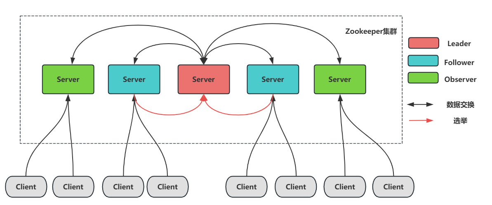

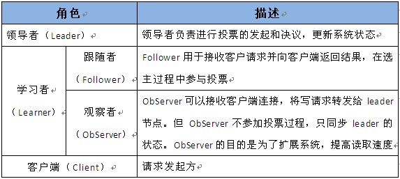

### 1、Server三种状态

每个`Server`在工作过程中有三种状态：

* **LOOKING**：当前`Server`不知道`leader`是谁，正在搜寻
* **LEADING**：当前`Server`即为选举出来的`leader`
* **FOLLOWING**：`leader`已经选举出来，当前`Server`与之同步

### 2、什么是Observer

zk3.3开始引入的角色，观察最新状态，并变更。与`Follower`不同只是不参与投票、选举，只提供非事务服务。

* `Zookeeper`需保证高可用和强一致性；
* 为了支持更多的客户端，需要增加更多`Server`；
* `Server`增多，投票阶段延迟增大，影响性能；
* 权衡伸缩性和高吞吐率，引入`Observer`
* `Observer`不参与投票；
* `Observers`接受客户端的连接，并将写请求转发给`leader`节点；
* 加入更多`Observer`节点，提高伸缩性，同时不影响吞吐率

## 三、ZAB协议

`Zookeeper` 客户端会随机的连接到 `zookeeper` 集群中的一个节点。

> 注意，ZK集群会有很多节点， 客户端在建立连接时，会随机挑选一个节点。

ZK集群对客户端的请求，按照类型（读、写两类）分开处理：

* 读请求

    客户端直接从当前节点（其建立连接的节点）中读取数据；

* 写请求

    这里涉及到了分布式事务。 客户端就会向 `Leader` 提交事务，`Leader` 接收到事务提交，会广播该事务，只要超过半数节点写入成功，该事务就会被提交。

`Zookeeper`的核心是`原子广播`，这个机制保证了各个`Server`之间的同步。实现这个机制的协议叫做`ZAB协议`。**Zab协议** 的全称是 `Zookeeper Atomic Broadcast （Zookeeper原子广播）`。
`Zookeeper` 是通过 `ZAB` 协议来保证分布式事务的最终一致性。

### 1、ZAB与Paxos联系&区别

两者设计目标不一样，`ZAB`主要用于构建高可用分布式系统，`Paxos` 算法用于构建一致性状态机器。所有会有细微差别。但是**ZAB就是在Paxos保证一致性基础上设计出高可用的协议**。

## 四、ZAB的基本概念

* **`epoch`周期值（比喻：年号）**

* **`acceptedEpoch`（比喻：接受的年号）** : `follower`已经接受`leader`更改年号的（`newepoch`）提议。

* **`currentEpoch`（比喻：当前的年号）** : 当前的年号

* **`history`** : 当前节点接受到事务提议的`log`

* **`lastZxid`** : `history`中最近接收到的提议`zxid`(最大的值)

* **`ZXID`** : 事务的`Proposal`（提议） 的`id`，可以简单理解为`事务id`

`ZXID` 是一个64位的数字，其中低32位可看作是计数器，`Leader` 服务器每产生一个新的事务 `Proposal` 的时候，都会该计数器进行加 `1` 操作。

`ZXID` 的高32位表示 `Leader` 周期 `epoch` 的编号，每当选举一个新的 `Leader` 服务器，就会从该服务器本地的事务日志中最大 `Proposal` 的 `ZXID` 中解析出对应的 `epoch` 值，
然后对其加 `1` 操作，这个值就作为新的 `epoch` 值，并将低32位初始化为0来开始生成新的 `ZXID`。

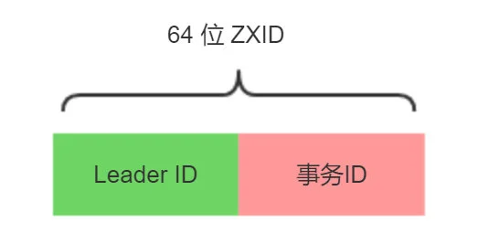

**年号如何递增?**

当产生新`Leader`的时候，就从这个`Leader`服务器上取出本地`log`中最大事务`Zxid`，从里面读出`epoch+1`，作为一个新`epoch`，并将低`32`位置`0`（保证`id`绝对自增）

## 五、Zookeeper集群的模式

`Zookeeper` 集群的模式包括两种基本的模式：**崩溃恢复** 和 **消息广播**

### 1、崩溃恢复模式

当整个集群启动过程中，或者当 `Leader` 服务器出现网络中弄断、崩溃退出或重启等异常时，`ZAB协议`就会进入**崩溃恢复模式**，选举产生新的`Leader`。

一但出现崩溃，会导致数据不一致，`ZAB`的崩溃恢复开始起作用。有如下两个确保：

1. `ZAB协议`需要确保已经在`Leader`提交的事务最终被所有服务器提交。
2. `ZAB协议`需要确保丢弃只在`Leader`服务器上被提出的事务。

针对上两个要求，如果`Leader`选举算法**保证新选举出来的`Leader`服务器拥有集群中所有机器最高编号（`ZXID`最大）的事务`Proposal`，那么就能保证新的`Leader` 一定具有已提交的所有提案**，
更重要是，如果这么做，可以省去`Leader`服务器检查`Proposal`的提交和丢弃工作的这一步。

一旦`Leader`服务器出现崩溃，或者说网络原因导致`Leader`服务器失去了与过半的`Follower`的联系，那么就会进入**崩溃恢复模式**。为了保证程序的正常运行，
整个恢复过程后需要选举一个新的`Leader`服务器。因此，`ZAB`协议需要一个高效可靠的`Leader`选举算法，从而确保能够快速地选举出新的`Leader`。同时，
新的`Leader`选举算法不仅仅需要让`Leader`自己知道其自身已经被选举为`Leader`，同时还需要让集群中所有的其他机器也能够快速的感知选举产生的新的`Leader`服务器。

`ZAB`协议规定了如果一个事务`Proposal`在一台机器上被处理成功，那么应该在所有的机器上都被处理成功，哪怕机器出现崩溃。

### 2、消息广播模式

当新的`Leader`出来了，同时，已有过半机器完成同步之后，`ZAB`协议将退出恢复模式。进入消息广播模式。这时，如果有一台遵守`ZAB`协议的服务器加入集群，
因为此时集群中已经存在一个`Leader`服务器在广播消息，那么该新加入的服务器自动进入恢复模式：**找到`Leader`服务器，并且完成数据同步。同步完成后，作为新的`Follower`一起参与到消息广播流程中**。

如果集群中其他机器收到客户端事务请求后，那么会先转发`Leader`服务器，由`Leader`统一处理。

1. 在`zookeeper`集群中，数据副本的传递策略就是采用**消息广播模式**。`zookeeper`中数据副本的同步方式与二段提交相似，但是却又不同。二段提交要求协调者必须等到所有的参与者全部反馈`ACK`确认消息后，
再发送`commit`消息。要求所有的参与者要么全部成功，要么全部失败。二段提交会产生严重的阻塞问题。

2. `ZAB`协议中 `Leader` 等待 `Follower` 的`ACK`反馈消息是指**“只要半数以上的`Follower`成功反馈即可，不需要收到全部`Follower`反馈”**

3. 整个过程中，`Leader`为每个事务请求生产对应的`Proposal`，在广播前，为这个事务分配一个全局唯一`ID`，为`ZXID`（事务`ID`），必须按照递增的事务顺序进行处理。

4. 具体流程如下图:

    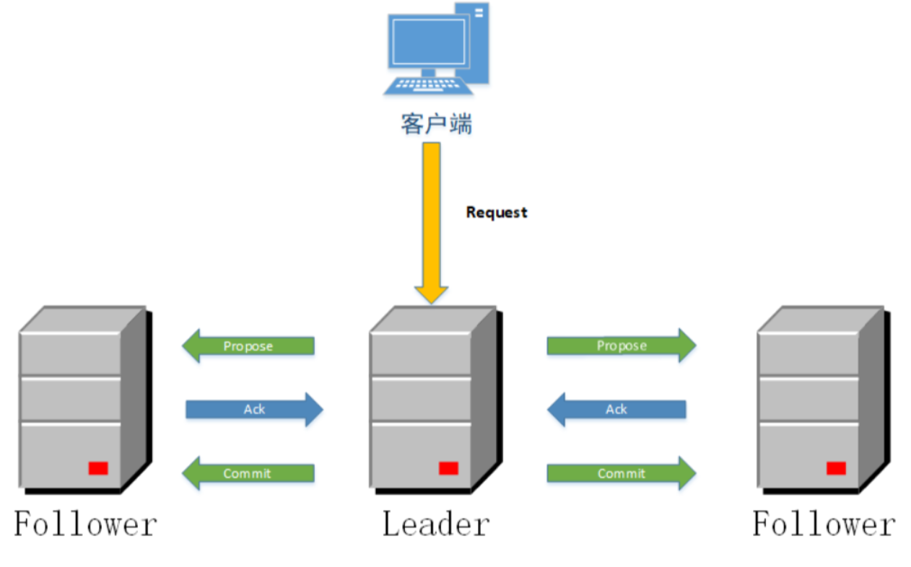

`ZAB`协议中涉及的二阶段提交和`2PC`有所不同。在`ZAB`协议的二阶段提交过程中，移除了中断逻辑，所有`Follower`服务器要么正常反馈`Leader`提出的事务`Proposal`，要么就抛弃`Leader`服务器。
`ZAB`协议中，只要集群中过半的服务器已经反馈`ACK`，就开始提交事务了，不需要等待集群中所有的服务器都反馈响应。这种模型是无法处理`Leader`服务器崩溃退出而带来的数据不一致问题的，
因此在`ZAB`协议中添加了另一个模式，即采用崩溃恢复模式来解决这个问题。此外，整个消息广播协议是基于具有`FIFO`特性的`TCP`协议来进行网络通信的，
因此能够很容易保证消息广播过程中消息接受与发送的顺序性。

在整个消息广播过程中，`Leader`服务器会为每个事务请求生成对应的`Proposal`来进行广播，并且在广播事务`Proposal`之前，`Leader`服务器会首先为这个事务分配一个全局单调递增的唯一`ID`，
我们称之为事务`ID`（即`ZXID`）。由于`ZAB`协议需要保证每一个消息严格的因果关系，因此必须将每一个事务`Proposal`按照其`ZXID`的先后顺序来进行排序与处理。

在消息广播过程中，`Leader`服务器会为每一个`Follower`服务器各自分配一个单独的队列，然后将需要广播的事务`Proposal`依次放入这些队列中，并且根据`FIFO`策略进行消息发送。
每一个`Follower`服务器在接受到这个事务`Proposal`之后，都会首先将其以事务日志的形式写入到本地磁盘中去，并且在成功写入后反馈给`Leader`服务器一个`ACK`响应。
当`Leader`服务器接收到超过半数`Follower`的`ACK`响应后，就会广播一个`Commit`消息给所有`Follower`服务器以通知其将事务进行提交，同时`Leader`自身也会完成事务的提交，
而每一个`Follower`服务器收到`Commit`消息之后，也会完成对事务的提交。

### 3、ZAB的两种基本模式？

**崩溃恢复** : 在正常情况下运行非常良好，一旦`Leader`出现崩溃或者由于网络原因导致`Leader`服务器失去了与过半`Follower`的联系，那么就会进入崩溃恢复模式。为了程序的正确运行，
整个恢复过程后需要选举出一个新的`Leader`,因此需要一个高效可靠的选举方法快速选举出一个`Leader`。

**消息广播** : 类似一个两阶段提交过程，针对客户端的事务请求， `Leader`服务器会为其生成对应的事务`Proposal`,并将其发送给集群中的其余所有机器，再分别收集各自的选票，最后进行事务提交。

### 4、哪些情况会导致ZAB进入恢复模式并选取新的Leader?

启动过程或`Leader`出现网络中断、崩溃退出与重启等异常情况时。

当选举出新的`Leader`后，同时集群中已有过半的机器与该`Leader`服务器完成了状态同步之后,`ZAB`就会退出恢复模式。

## 六、ZAB协议的选主

`ZAB`协议中存在着三种状态，每个节点都属于以下三种中的一种：

* **Looking /election**：系统刚启动时或者`Leader`崩溃后正处于选举状态

* **Following** ：`Follower`节点所处的状态，`Follower`与`Leader`处于数据同步阶段；

* **Leading** ：`Leader`所处状态，当前集群中有一个`Leader`为主进程；

在`ZooKeeper`的整个生命周期中，每个节点都会在`Looking`、`Following`、`Leading`状态间不断转换。

启动之初，`ZooKeeper`所有节点初始状态为`Looking`，这时集群会尝试选举出一个`Leader`节点，选举出的`Leader`节点切换为`Leading`状态；
当节点发现集群中已经选举出`Leader`则该节点会切换到`Following`状态，然后和`Leader`节点保持同步；当`Follower`节点与`Leader`失去联系时`Follower`节点则会切换到`Looking`状态，
开始新一轮选举；

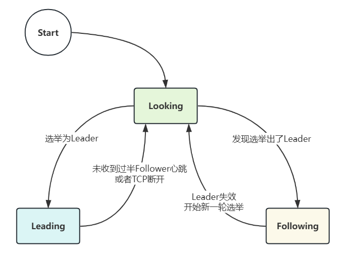

### 1、Leader选举图解

**半数通过**

1. `A`提案说，我要选自己，B你同意吗？C你同意吗？B说，我同意选A；C说，我同意选A。(注意，这里超过半数了，其实在现实世界选举已经成功了。但是计算机世界是很严格，另外要理解算法，要继续模拟下去。)
2. 接着`B`提案说，我要选自己，A你同意吗；A说，我已经超半数同意当选，你的提案无效；C说，A已经超半数同意当选，B提案无效。
3. 接着C提案说，我要选自己，A你同意吗；A说，我已经超半数同意当选，你的提案无效；B说，A已经超半数同意当选，C的提案无效。
4. 选举已经产生了`Leader`，后面的都是`Follower`，只能服从`Leader`的命令。而且这里还有个小细节，就是其实**谁先启动谁当头**。

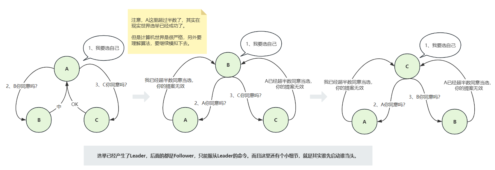

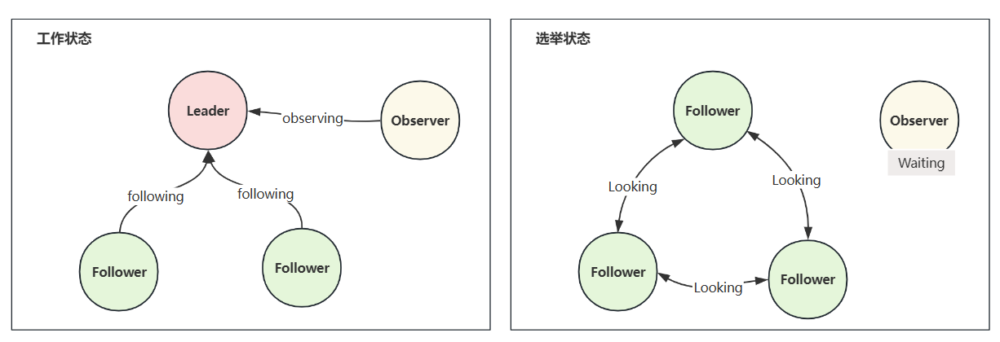

### 2、选主的细分场景

分析以上两种细分场景：

1. **启动时期选举**：
   * 每个`Server`发出一个投票
   
   * 接受来自各个服务器的投票
   
   * 处理投票（优先检查`ZXID`，相同就比较`myid`）
   
   * 统计投票（ 判断是否已经有过半的机器接收到相同的投票信息，所谓**“过半”**就是指大于集群机器数量的一半，即大于或等于 (`n/2+1`)。对于这里由3台机器构成的集群，大于等于2台即为达到“过半”要求。）
   
   * 改变服务器状态：`Leader->LEADING`, `Follower->FOLLOWING`

2. **服务运行期间的`Leader`选举**：
   * 变更状态：`Leader`挂后，剩下的`Follower`都变成`LOOKING`，进入`Leader`选举
   
   * 每个`Server`发出投票，第一轮都投自己，然后将自己投票发给所有机器
   
   * 接收投票，与启动选举相同
   
   * 处理投票，与启动选举相同
   
   * 统计投票，与启动选举相同
   
   * 改变服务器状态，与启动选举相同

### 3、为什么zookeeper集群的数目，一般为奇数个？

* `Leader`选举算法采用了`Paxos`协议；
* `Paxos`核心思想：当多数`Server`写成功，则任务数据写成功如果有3个`Server`，则两个写成功即可；如果有4或5个`Server`，则三个写成功即可。
* `Server`数目一般为奇数（`3`、`5`、`7`）如果有3个`Server`，则最多允许1个`Server`挂掉；如果有4个`Server`，则同样最多允许1个`Server`挂掉由此，
我们看出3台服务器和4台服务器的的容灾能力是一样的，所以为了节省服务器资源，一般我们采用奇数个数，作为服务器部署个数。

### 4、FastLeaderElection选主算法

**（选主算法可在zoo.cfg中配置）**

`ZAB` 默认采用 `TCP` 版本的 `FastLeaderElection` 选举算法。在选举投票消息中包含了两个最基本的信息：所推举的服务器 `SID` 和 `ZXID`，
分别表示被推举服务器的`唯一标识`（每台机器不一样）和`事务ID`。假如投票信息为 （`SID`, `ZXID`）的形式。在第一次投票的时候，由于还无法检测集群其他机器的状态信息，
因此每台机器都将自己作为被推举的对象来进行投票。每次对收到的投票，都是一个对投票信息（`SID`, `ZXID`）对比的过程，规则如下：

1. 逻辑时钟`clock`表示第几轮选举，重启时为`0`，选举时加`1`
2. 启动时处于`looking`状态
3. 选举细节 
   * 先选自己，选票为`“clock(1)、 looking、zxid、myid”`
   
   * 广播选票，收到其他节点选票
   
   * 如果其他节点选票的`clock`大，更新自己的`clock`；
   
   * 如果接收到的投票 `ZXID` 大于自己的 `ZXID`，就认可当前收到的投票，则更新自己选票的相应值为该节点值，表示选举该节点。
   
   * 如果接收到的投票 `ZXID` 小于自己的 `ZXID`，那么就坚持的投票，不做任何变更。
   
   * 如果接收到的投票 `ZXID` 等于自己的 `ZXID`，再对比 `myid`，比自己大，就认可当前收到的投票，表示选举该节点；如果比自己小，那就坚持自己的投票，不做变更。

4. 重新发出选票

经过第二次投票后，集群中每台机器都会再次收到其他机器的投票，然后开始统计，如果一台机器收到超过了半数的相同投票，那么这个投票对应的 `myid`机器即为 `Leader`。

简单来说，通常哪台服务器上的数据越新，那么越有可能成为 `Leader`。原因很简答，数据越新，也就越能够保证数据的恢复。当然，如果集群中有几个服务器具有相同的 `ZXID`，
那么 `myid` 较大的那台服务器成为 `Leader`。

**结束选主之后的进入消息广播模式**

选举出`Leader`节点后`ZAB`进入原子广播阶段，`Leader`与`Follower`使用心跳检测来感知对方的存在：

1. 当`Leader`节点在超时时间内能正常收到来自`Follower`的心跳, 那`Follower`节点会一直与该节点保持连接；

2. 若超时时间内`Leader`没有接收到来自过半`Follower`节点的心跳检测或`TCP`连接断开，那`Leader`会结束当前周期的领导，切换到`Looking`状态，
所有`Follower`节点也会放弃该`Leader`节点切换到`Looking`状态，然后开始新一轮选举；

### 5、选主的过程

#### Phase 0: Leader election（选举阶段）

节点在一开始都处于**选举阶段**，只要有一个节点得到超半数节点的票数，它就可以当选准 `leader`。只有到达 `Phase 3` 准 `leader` 才会成为真正的 `leader`。
这一阶段的目的是就是为了选出一个准 `leader`，然后进入下一个阶段。

协议并没有规定详细的选举算法，后面我们会提到实现中使用的 `Fast Leader Election`。

#### Phase 1: Discovery（发现阶段）

在这个阶段，`followers` 跟准 `leader` 进行通信，同步 `followers` 最近接收的事务提议。这个一阶段的主要目的是发现当前大多数节点接收的最新提议，并且准 `leader` 生成新的 `epoch`，
让 `followers` 接受，更新它们的 `accepted Epoch`:

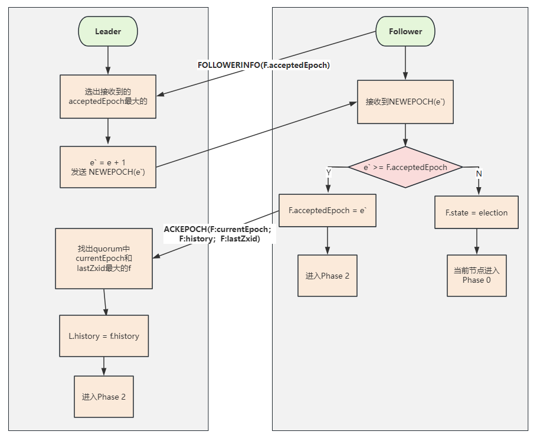

一个 `follower` 只会连接一个 `leader`，如果有一个节点 `f` 认为另一个 `follower p` 是 `leader`，`f` 在尝试连接 `p` 时会被拒绝，`f` 被拒绝之后，就会进入 `Phase 0`。

#### Phase 2: Synchronization（同步阶段）

同步阶段主要是利用 `leader` 前一阶段获得的最新提议历史，同步集群中所有的副本。只有当 `quorum` 都同步完成，准 `leader` 才会成为真正的 `leader`。
`follower` 只会接收 `zxid` 比自己的 `lastZxid` 大的提议。

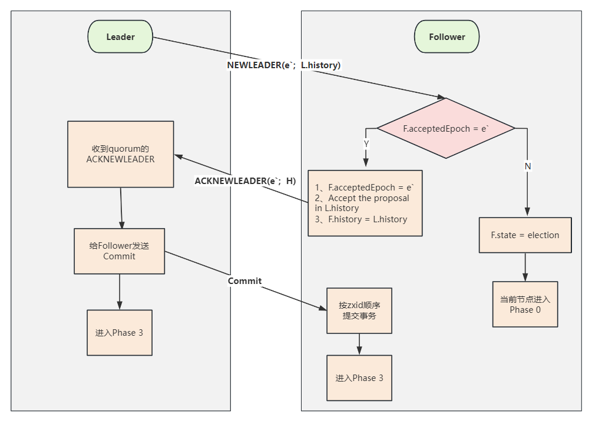

#### Phase 3: Broadcast（广播阶段）

到了这个阶段，`Zookeeper` 集群才能正式对外提供事务服务，并且 `leader` 可以进行消息广播。同时如果有新的节点加入，还需要对新节点进行同步。

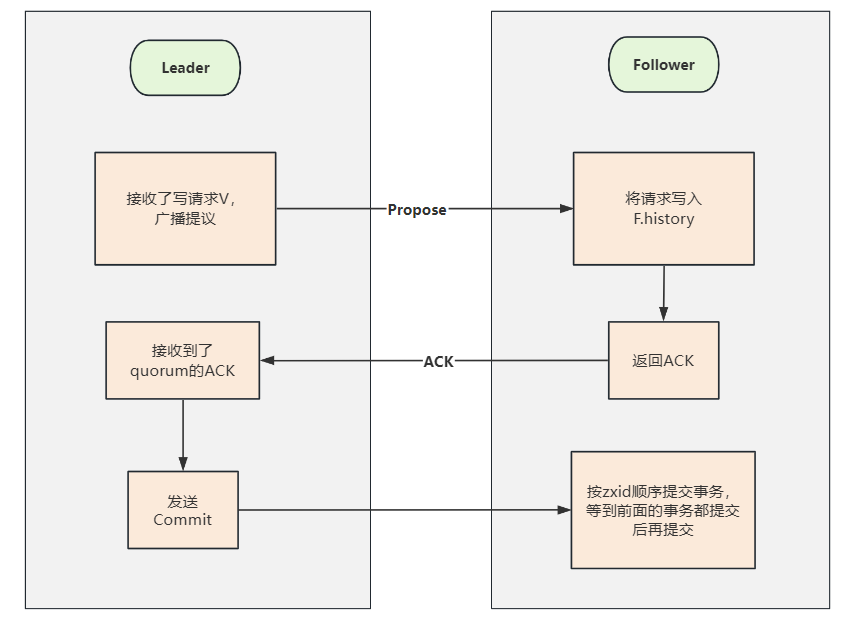

> 值得注意的是，ZAB 提交事务并不像 2PC 一样需要全部 follower 都 ACK，只需要得到 quorum （超过半数的节点）的 ACK 就可以了。

## 七、Zookeeper节点的数据同步

完成`Leader`选举之后，在正式开始工作（即接收客户端的事务请求，然后提出新的提案）之前，`Leader`服务器会首先确认事务日志中的所有`Proposal`都已经被集群中过半的机器提交了，即是否完成数据同步。

集群中所有的正常运行的服务器，要么成为`Leader`，要么成为`Follower`并和`Leader`保持同步。`Leader`服务器需要确保所有的`Follower`服务器能够接收到每一条事务`Proposal`，
并且能够正确地将所有已经提交了的事务`Proposal`应用到内存数据库中。`Leader`服务器会为每一个`Follower`服务器都准备一个队列，
并将没有被各`Follower`服务器同步的事务以`Proposal`消息形式逐个发送到`Follower`服务器，并在每一个`Proposal`消息后紧跟着再发送一个`Commit`消息，以表示这个事务已经被提交。
等到`Follower`服务器将所有尚未同步的事务`Proposal`都从`Leader`服务器上同步过来并成功应用到本地数据库中后，`Leader`服务器就会将该`Follower`服务器加入到真正可用的`Follower`列表中，
并开始之后的其他流程。

### 1、ZAB协议如何处理那些需要被丢弃的事务Proposal的？

在`ZAB`协议的事务编号`ZXID`设计中，`ZXID`是一个64位数字，其中低32位可以看做一个简单的单调递增的计数器，针对客户端的每一个事务请求，`Leader`服务器在产生一个新的事务`Proposal`的时候，
都会对改计数器进行加一操作；而高32位则代表了`leader`周期`epoch`的编号，每当选举产生一个新的`Leader`服务器，就会从这个`Leader`服务器取出本地日志中最大事务`Proposal`的`ZXID`，
并从`ZXID`中解析出对应的`epoch`值，然后再对其进行加`1`操作，之后的编号就会作为新的`epoch`，并将低32位 置`0`来开始生成新的`ZXID`。

`ZAB`协议中的这一通过`epoch`编号来区分`Leader`周期变化的策略，能够有效避免不同的`Leader`服务器错误的使用相同的`ZXID`编号提出不一样的事务的情况。

基于这样的策略，当一个包含了上一个`Leader`周期中尚未提交过的事务服务器启动时，肯定无法成为`leader`。因为当前集群中肯定包含一个`Quorum`集合，
该集合中机器一定包含了更高的`epoch`的事务`Proposal`。

### 2、同步的过程

在选出 `Leader` 之后，`zk` 就进入状态同步的过程。其实就是把最新的 `zxid` 对应的日志数据，应用到其他的节点中。此 `zxid` 包含 `follower` 中写入日志但是未提交的 `zxid` 。
称之为服务器提议缓存队列 `committedLog` 中的 `zxid`。

同步会完成三个 `zxid` 值的初始化。

* **`peerLastZxid`**：该 `learner` 服务器最后处理的 `zxid`。
* **`minCommittedLog`**：`leader`服务器提议缓存队列 `committedLog` 中的最小 `zxid`。 
* **`maxCommittedLog`**：`leader`服务器提议缓存队列 `committedLog` 中的最大 `zxid`。 

系统会根据 `learner` 的`peerLastZxid`和 `leader` 的`minCommittedLog`，`maxCommittedLog`做出比较后做出不同的同步策略

**直接差异化同步**

> 场景：`peerLastZxid`介于`minCommittedLogZxid`和`maxCommittedLogZxid`间

此种场景出现在，上文提到过的，`Leader` 发出了同步请求，但是还没有 `commit` 就 `down` 了。 `leader` 会发送 `Proposal` 数据包，以及 `commit` 指令数据包。
新选出的 `leader` 继续完成上一任 `leader` 未完成的工作。

例如此刻`Leader`提议的缓存队列为 `0x20001`，`0x20002`，`0x20003`，`0x20004`，此处`learn`的`peerLastZxid`为`0x20002`，`Leader`会将`0x20003`和`0x20004`两个提议同步给`learner`

**先回滚在差异化同步/仅回滚同步**

此种场景出现在，上文提到过的，`Leader`写入本地事务日志后，还没发出同步请求，就`down`了，然后在同步日志的时候作为`learner`出现。

例如即将要 `down` 掉的 `leader` 节点 1，已经处理了 `0x20001`，`0x20002`，在处理 `0x20003` 时还没发出提议就 `down` 了。后来节点 2 当选为新 `leader`，同步数据的时候，
节点 1 又神奇复活。如果新 `leader` 还没有处理新事务，新 `leader` 的队列为，`0x20001`, `0x20002`，那么仅让节点 1 回滚到 `0x20002` 节点处，`0x20003` 日志废弃，称之为仅**回滚同步**。
如果新 `leader` 已经处理 `0x30001` , `0x30002` 事务，那么新 `leader` 此处队列为`0x20001`，`0x20002`，`0x30001`，`0x30002`，那么让节点 1 先回滚，到 `0x20002` 处，
再差异化同步`0x30001`，`0x30002`。

**全量同步**

`peerLastZxid`小于`minCommittedLogZxid`或者`leader`上面没有缓存队列。`leader`直接使用`SNAP`命令进行全量同步

## 八、ZAB协议的事务

分布式事务就是指事务的参与者、支持事务的服务器、资源服务器以及事务管理器分别位于不同的分布式系统的不同节点之上。简单的说，就是一次大的操作由不同的小操作组成，这些小的操作分布在不同的服务器上，
且属于不同的应用，分布式事务需要保证这些小操作要么全部成功，要么全部失败。本质上来说，**分布式事务就是为了保证不同数据库的数据一致性**。

为了保证事务的顺序一致性，`zookeeper`采用了递增的事务`id`号（`zxid`）来标识事务。所有的提议（`proposal`）都在被提出的时候加上了`zxid`。实现中`zxid`是一个64位的数字，
它高32位是`epoch`(有点类似年代、年号)用来标识 `leader`关系是否改变，每次一个`leader`被选出来，它都会有一个新的`epoch`，标识当前属于那个`leader`的统治时期。低32位用于递增计数。

### 1、那么什么是zxid

`ZooKeeper`状态的每一次改变, 都对应着一个递增的`Transaction id`, 该`id`称为`zxid`. 由于`zxid`的递增性质, 如果`zxid1`小于`zxid2`, 那么`zxid1`肯定先于`zxid2`发生.

创建任意节点, 或者更新任意节点的数据, 或者删除任意节点, 都会导致`Zookeeper`状态发生改变, 从而导致`zxid`的值增加.

### 2、ZAB协议的核心

`ZAB`协议的核心：**定义了事务请求的处理方式**

1) 所有的事务请求必须由一个全局唯一的服务器来协调处理，这样的服务器被叫做 `Leader服务器`。其他剩余的服务器则是 `Follower服务器`。

2) `Leader服务器` 负责将一个客户端事务请求，转换成一个 `事务Proposal`，并将该 `Proposal` 分发给集群中所有的 `Follower服务器`，也就是向所有 `Follower` 节点发送数据广播请求（或数据复制）

3) 分发之后, `Leader`服务器需要等待所有`Follower`服务器的反馈（`Ack`请求），在`ZAB`协议中，只要超过半数的`Follower`服务器进行了正确的反馈后, 
那么 `Leader` 就会再次向所有的 `Follower` 服务器发送 `Commit` 消息，要求其将上一个 `事务proposal` 进行提交。 (注意：有点像`2PC`）

> 广播模式下只有主节点可以发送广播消息，如果某个从节点需要发送广播信息，也需要通过主节点进行。

### 3、ZAB协议的事务特点

消息广播阶段的数据写入策略，通过事务完成，有以下特点：

1) 在`zookeeper`集群中，数据副本的传递策略就是采用消息广播模式。`zookeeper`中数据副本的同步方式与二段提交相似，但是却又不同。
二段提交要求协调者必须等到所有的参与者全部反馈`ACK`确认消息后，再发送`commit`消息。要求所有的参与者要么全部成功，要么全部失败。二段提交会产生严重的阻塞问题。

2) `ZAB`协议中 `Leader` 等待 `Follower` 的`ACK`反馈消息是指**“只要半数以上的Follower成功反馈即可，不需要收到全部Follower反馈”**

### 4、ZAB协议的事务过程

消息广播具体步骤如下：

1) 客户端发起一个写操作请求。

2) `Leader` 服务器将客户端的请求转化为事务 `Proposal` 提案，同时为每个 `Proposal` 分配一个全局的ID，即`zxid`。

3) `Leader` 服务器为每个 `Follower` 服务器分配一个单独的队列，然后将需要广播的 `Proposal` 依次放到队列中取，并且根据 `FIFO` 策略进行消息发送。

4) `Follower` 接收到 `Proposal` 后，会首先将其以事务日志的方式写入本地磁盘中，写入成功后向 `Leader` 反馈一个 `Ack` 响应消息。

5) `Leader` 接收到超过半数以上 `Follower` 的 `Ack` 响应消息后，即认为消息发送成功，可以发送 `commit` 消息。

6) `Leader` 向所有 `Follower` 广播 `commit` 消息，同时自身也会完成事务提交。`Follower` 接收到 `commit` 消息后，会将上一条事务提交。

**`zookeeper` 采用 `ZAB` 协议的核心，就是只要有一台服务器提交了 `Proposal`，就要确保所有的服务器最终都能正确提交 `Proposal`。这也是 `CAP/BASE` 实现最终一致性的一个体现。**

**`Leader` 服务器与每一个 `Follower` 服务器之间都维护了一个单独的 `FIFO` 消息队列进行收发消息，使用队列消息可以做到异步解耦。 `Leader` 和 `Follower` 之间只需要往队列中发消息即可。
如果使用同步的方式会引起阻塞，性能要下降很多。**

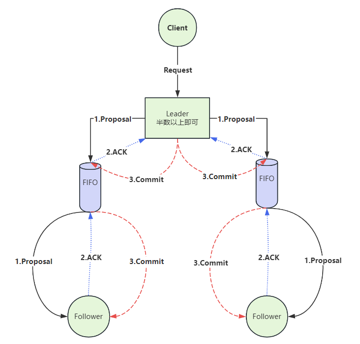

### 5、ZAB协议的事务过程图解

**1、主节点广播发送事务提交提议**

包括以下步骤：

a. 针对客户端的事务请求，`leader`服务器会先将该事务写到本地的`log`文件中

b. 然后，`leader`服务器会为这次请求生成对应的事务`Proposal`并且为这个事务`Proposal`分配一个全局递增的唯一的事务ID，即`Zxid`

c. `leader`服务器会为每一个`follower`服务器都各自分配一个单独的队列，将需要广播的事务`Proposal`依次放入队列中，发送给每一个`follower`

**2、从节点接收到提议后，回复确认信息通知主节点**

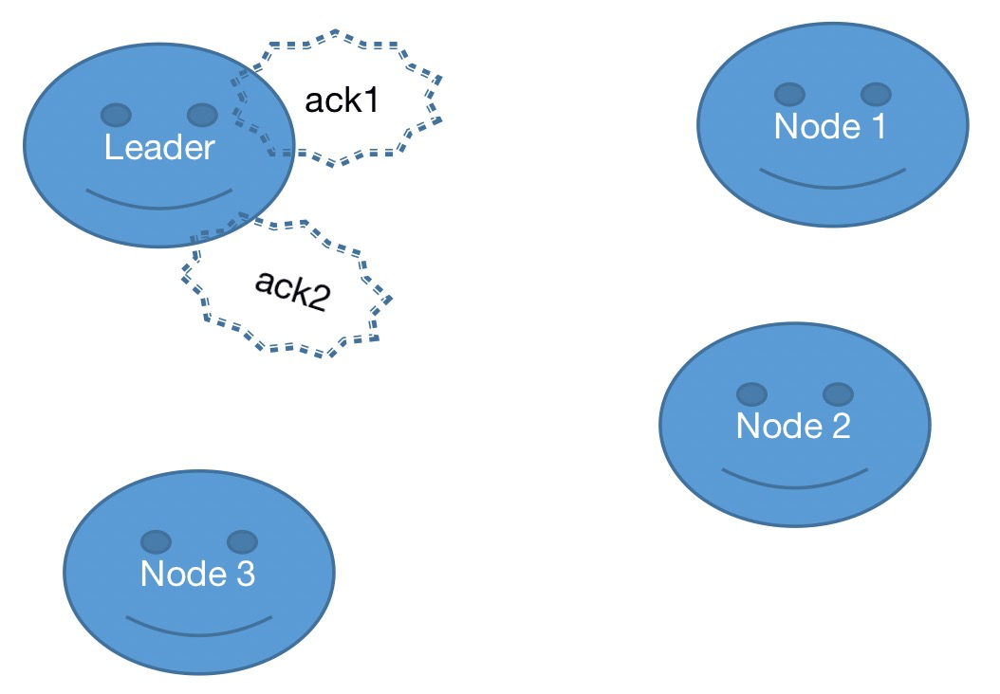

包括以下步骤：

d. 每一个`follower`在收到队列之后，会从队列中依次取出事务`Proposal`，写入本地的事务日志中。如果写成功了，则给`leader`返回一个`ACK`消息

**3、主节点接收到超过法定数量从节点确认信息后，广播发送事务提交命令到从节点**

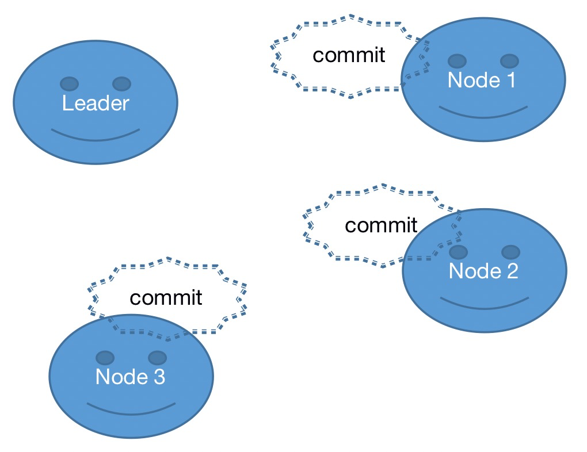

e. 当`leader`服务器接收到半数的`follower`的`ACK`相应之后，就会广播一个`Commit`消息给所有的`follower`以通知其进行事务提交，同时`leader`自身也进行事务提交

当然，在这种简化了的二阶段提交模型下，是无法处理`Leader`服务器崩溃退出而带来的数据不一致问题的，因此在`ZAB`协议中添加了另一个模式，即采用崩溃恢复模式来解决这个问题

整个消息广播协议是基于具有`FIFO`特性的`TCP`协议来进行网络通信的，因此能够很容易地保证消息广播过程中消息接收与发送的顺序性

`zookeeper` 服务实现中很重要的一点：**顺序性**。顺序请求，顺序响应；主节点事务顺序提交，从节点按顺序响应事务等等。

## 九、ZK性能问题

客户端对`ZK`的更新操作都是永久的，不可回退的，也就是说，一旦客户端收到一个来自`server`操作成功的响应，那么这个变更就永久生效了。为做到这点，`ZK`会将每次更新操作以事务日志的形式写入磁盘，
写入成功后才会给予客户端响应。明白这点之后，你就会明白磁盘的吞吐性能对于`ZK`的影响了，磁盘写入速度制约着`ZK`每个更新操作的响应。

事务日志的写性能确实对`ZK`性能，尤其是更新操作的性能影响很大，为了尽量减少`ZK`在读写磁盘上的性能损失，可以考虑使用单独的磁盘作为事务日志的输出（使用单独的挂载点用于事务日志的输出）

`ZK`的事务日志输出是一个顺序写文件的过程，本身性能是很高的，所以尽量保证不要和其它随机写的应用程序共享一块磁盘，尽量避免对磁盘的竞争。

## 十、常见的误区

* 写入节点后的数据，立马就能被读到，这是错误的。`zk` 写入是必须通过 `leader` 串行的写入，而且只要一半以上的节点写入成功即可。而任何节点都可提供读取服务。

   例如：`zk`，有 `1~5` 个节点，写入了一个最新的数据，最新数据写入到节点 `1~3`，会返回成功。然后读取请求过来要读取最新的节点数据，请求可能被分配到节点 `4~5` 。
   而此时最新数据还没有同步到节点`4~5`。会读取不到最近的数据。如果想要读取到最新的数据，可以在读取前使用 `sync` 命令。

* `zk`启动节点不能偶数台，这也是错误的。`zk` 是需要一半以上节点才能正常工作的。例如创建 `4` 个节点，半数以上正常节点数是 `3`。也就是最多只允许一台机器 `down` 掉。而 `3` 台节点，
半数以上正常节点数是 `2`，也是最多允许一台机器 `down` 掉。4 个节点，多了一台机器的成本，但是健壮性和 3 个节点的集群一样。基于成本的考虑是不推荐的

