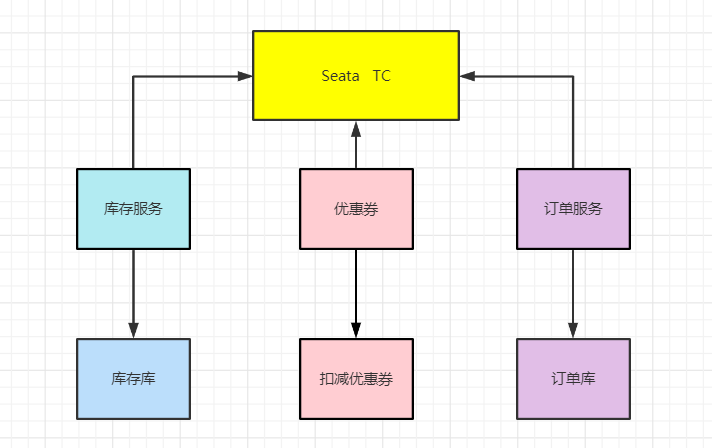
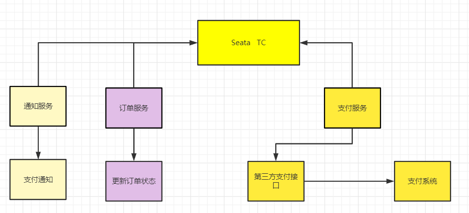

Seata AT模式和Seata TCC是在生产中最常用。

* **强一致性模型**，Seata AT 强一致方案 模式用于强一致主要用于核心模块，例如交易/订单等。

* **弱一致性模型**。Seata TCC 弱一致方案一般用于边缘模块例如库存，通过TC的协调，保证最终一致性，也可以业务解耦。

## 强一致性场景

对于那些特别严格的场景，用的是Seata AT模式来保证强一致性；

准备好例子：你找一个严格要求数据绝对不能错的场景（如电商交易交易中的库存和订单、优惠券），可以回答使用成熟的如中间件Seata AT模式。

是Seata AT模式，保障强一致性，支持跨多个库修改数据；

* 订单库：增加订单

* 商品库：扣减库存

* 优惠券库：预扣优惠券

## 弱一致性场景

对于数据一致性要求没有那些特别严格、或者由不同系统执行子事务的场景，可以回答使用Seata TCC 保障弱一致性方案

准备好例子：一个不是严格对数据一致性要求、或者由不同系统执行子事务的场景，如电商订单支付服务，更新订单状态，发送成功支付成功消息，只需要保障弱一致性即可。

Seata TCC 模式，保障弱一致性，支持跨多个服务和系统修改数据，在上面的场景中，使用Seata TCC 模式事务

* 订单服务：修改订单状态

* 通知服务：发送支付状态

## 最终一致性场景

基于可靠消息的最终一致性，各个子事务可以较长时间内异步，但数据绝对不能丢的场景。可以使用异步确保型事务事。

可以使用基于MQ的异步确保型事务，比如电商平台的通知支付结果：

* 积分服务：增加积分

* 会计服务：生成会计记录

