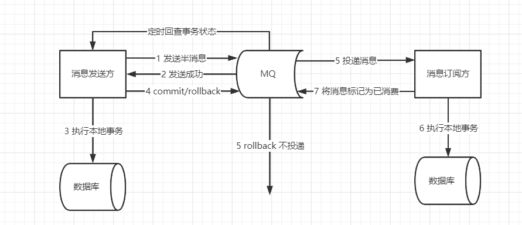
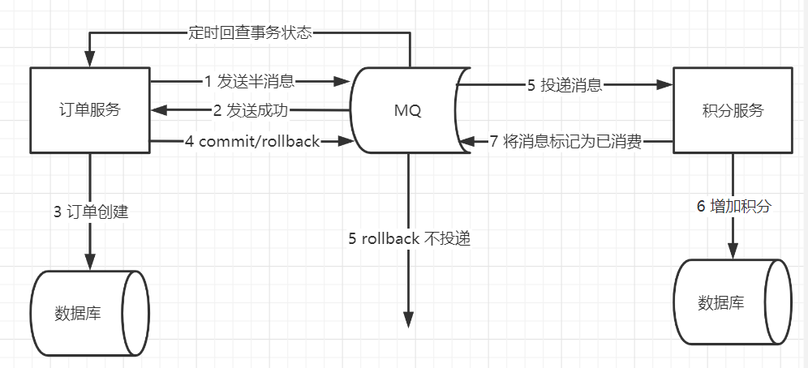
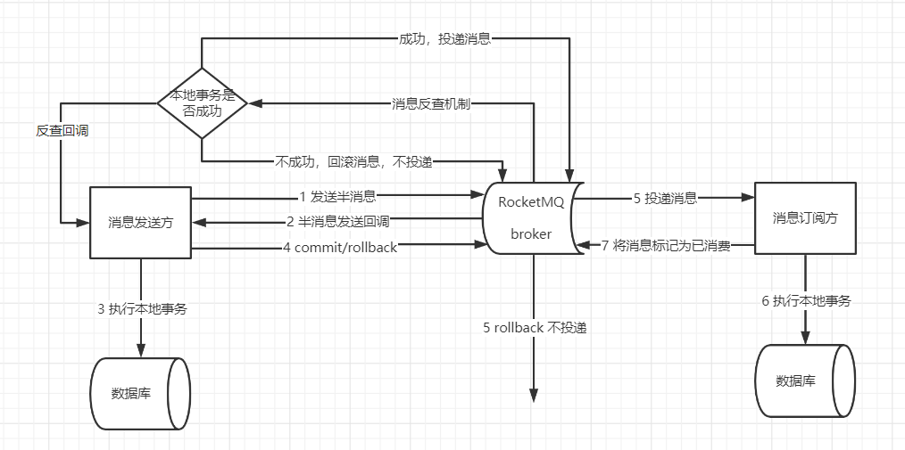
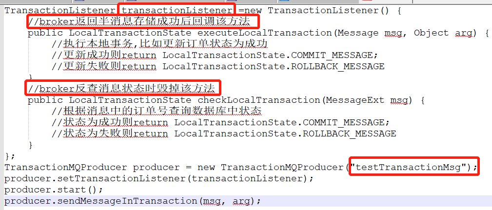
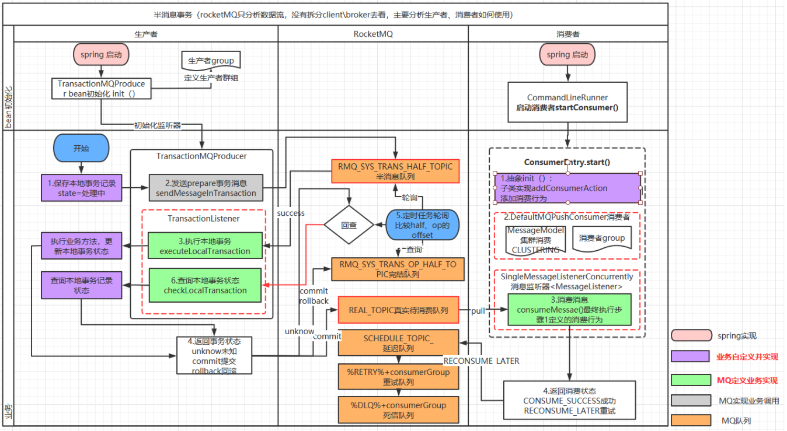
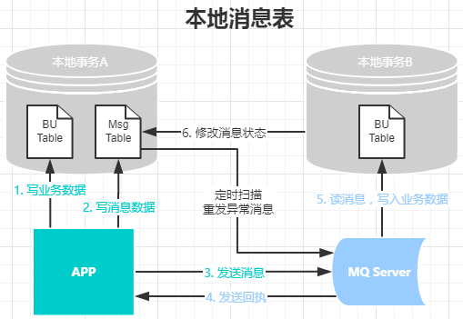

指将一系列同步的事务操作修改为基于消息队列异步执行的操作，来避免分布式事务中同步阻塞带来的数据操作性能的下降。

## MQ事务消息方案

基于MQ的事务消息方案主要依靠MQ的**半消息机制**来实现投递消息和参与者自身本地事务的一致性保障。半消息机制实现原理其实借鉴的2PC的思路，是二阶段提交的广义拓展。

> **半消息**：在原有队列消息执行后的逻辑，如果后面的本地逻辑出错，则不发送该消息，如果通过则告知MQ发送；

1. 事务发起方首先发送半消息到MQ；

2. MQ通知发送方消息发送成功；

3. 在发送半消息成功后执行本地事务；

4. 根据本地事务执行结果返回`commit`或者是`rollback`；

5. 如果消息是`rollback`, MQ将丢弃该消息不投递；如果是`commit`，MQ将会消息发送给消息订阅方；

6. 订阅方根据消息执行本地事务；

7. 订阅方执行本地事务成功后再从MQ中将该消息标记为已消费；

8. 如果执行本地事务过程中，执行端挂掉，或者超时，MQ服务器端将不停的询问`producer`来获取事务状态；

9. `Consumer`端的消费成功机制有MQ保证；

## 异步确保型事务使用示例

举个例子，假设存在业务规则：某笔订单成功后，为用户加一定的积分。

在这条规则里，管理订单数据源的服务为事务发起方，管理积分数据源的服务为事务跟随者。

从这个过程可以看到，基于消息队列实现的事务存在以下操作：

1. 订单服务创建订单，提交本地事务
2. 订单服务发布一条消息
3. 积分服务收到消息后加积分

我们可以看到它的整体流程是比较简单的，同时业务开发工作量也不大：

* 编写订单服务里订单创建的逻辑
* 编写积分服务里增加积分的逻辑

可以看到该事务形态过程简单，性能消耗小，发起方与跟随方之间的流量峰谷可以使用队列填平，同时业务开发工作量也基本与单机事务没有差别，都不需要编写反向的业务逻辑过程

因此基于消息队列实现的事务是我们除了单机事务外最优先考虑使用的形态。

## 基于阿里 RocketMQ实现MQ异步确保型事务

有一些第三方的MQ是支持事务消息的，这些消息队列，支持半消息机制，比如`RocketMQ`，`ActiveMQ`。但是有一些常用的MQ也不支持事务消息，比如 `RabbitMQ` 和 `Kafka` 都不支持。

以阿里的 `RocketMQ` 中间件为例，其思路大致为：

1. `producer`(本例中指A系统)发送半消息到`broker`，这个半消息不是说消息内容不完整， 它包含完整的消息内容， 在`producer`端和普通消息的发送逻辑一致

2. `broker`存储半消息，半消息存储逻辑与普通消息一致，只是属性有所不同，`topic`是固定的`RMQ_SYS_TRANS_HALF_TOPIC`，`queueId`也是固定为`0`，这个`tiopic`中的消息对消费者是不可见的，
所以里面的消息永远不会被消费。这就保证了在半消息提交成功之前，消费者是消费不到这个半消息的

3. `broker`端半消息存储成功并返回后，A系统执行本地事务，并根据本地事务的执行结果来决定半消息的提交状态为提交或者回滚

4. A系统发送结束半消息的请求，并带上提交状态(提交 or 回滚)

5. `broker`端收到请求后，首先从`RMQ_SYS_TRANS_HALF_TOPIC`的`queue`中查出该消息，设置为完成状态。如果消息状态为提交，
则把半消息从`RMQ_SYS_TRANS_HALF_TOPIC`队列中复制到这个消息原始`topic`的`queue`中去(之后这条消息就能被正常消费了)；如果消息状态为回滚，则什么也不做。

6. `producer`发送的半消息结束请求是 `oneway` 的，也就是发送后就不管了，只靠这个是无法保证半消息一定被提交的，`rocketMq`提供了一个兜底方案，这个方案叫消息反查机制，
`Broker`启动时，会启动一个 `TransactionalMessageCheckService` 任务，该任务会定时从半消息队列中读出所有超时未完成的半消息，针对每条未完成的消息，
`Broker`会给对应的`Producer`发送一个消息反查请求，根据反查结果来决定这个半消息是需要提交还是回滚，或者后面继续来反查。

7. `consumer`(本例中指B系统)消费消息，执行本地数据变更(至于B是否能消费成功，消费失败是否重试，这属于正常消息消费需要考虑的问题)。

在`rocketMq`中，不论是`producer`收到`broker`存储半消息成功返回后执行本地事务，还是`broker`向`producer`反查消息状态，都是通过回调机制完成，我把`producer`端的代码贴出来你就明白了：

半消息发送时，会传入一个回调类`TransactionListener`，使用时必须实现其中的两个方法:

* `executeLocalTransaction`方法会在`broker`返回半消息存储成功后执行，我们会在其中执行本地事务；
* `checkLocalTransaction`方法会在`broker`向`producer`发起反查时执行，我们会在其中查询库表状态。两个方法的返回值都是消息状态，就是告诉`broker`应该提交或者回滚半消息

## 本地消息表方案

有时候我们目前的MQ组件并不支持事务消息，或者我们想尽量少的侵入业务方。这时我们需要另外一种方案**“基于DB本地消息表“**。

本地消息表最初由 `eBay` 提出来解决分布式事务的问题。是目前业界使用的比较多的方案之一，它的核心思想就是将分布式事务拆分成本地事务进行处理。

