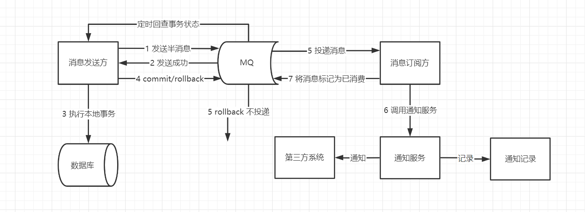
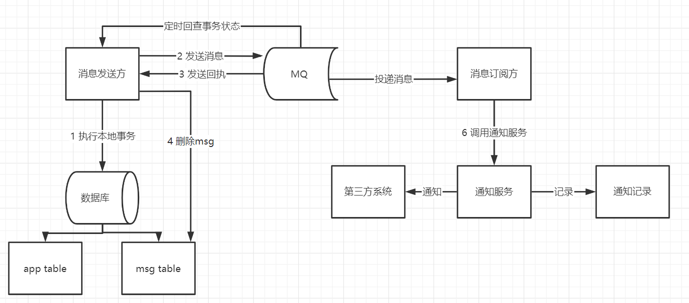

最大努力通知方案的目标，就是发起通知方通过一定的机制，最大努力将业务处理结果通知到接收方。

**最大努力通知型的最终一致性：**

> 本质是通过引入`定期校验机制`实现最终一致性，对业务的侵入性较低，适合于对最终一致性敏感度比较低、业务链路较短的场景。

最大努力通知事务主要用于**外部系统**，因为外部的网络环境更加复杂和不可信，所以只能尽最大努力去通知实现数据最终一致性，**比如充值平台与运营商、支付对接、商户通知等等跨平台、跨企业的系统间业务交互场景；**

而异步确保型事务主要适用于内部系统的数据最终一致性保障，因为内部相对比较可控，比如订单和购物车、收货与清算、支付与结算等等场景。

普通消息是无法解决本地事务执行和消息发送的一致性问题的。因为消息发送是一个网络通信的过程，发送消息的过程就有可能出现发送失败、或者超时的情况。超时有可能发送成功了，有可能发送失败了，消息的发送方是无法确定的，所以此时消息发送方无论是提交事务还是回滚事务，都有可能不一致性出现。

所以，通知型事务的难度在于： **投递消息和参与者本地事务的一致性保障。**

因为核心要点一致，都是为了保证消息的一致性投递，所以，最大努力通知事务在投递流程上跟异步确保型是一样的，因此也有两个分支：

* 基于MQ自身的事务消息方案

* 基于DB的本地事务消息表方案

## MQ事务消息方案

要实现最大努力通知，可以采用 MQ 的 `ACK` 机制。

最大努力通知事务在投递之前，跟异步确保型流程都差不多，关键在于投递后的处理。

因为异步确保型在于内部的事务处理，所以MQ和系统是直连并且无需严格的权限、安全等方面的思路设计。最大努力通知事务在于第三方系统的对接，所以最大努力通知事务有几个特性：

* 业务主动方在完成业务处理后，向业务被动方(第三方系统)发送通知消息，允许存在消息丢失。

* 业务主动方提供递增多挡位时间间隔(`5min`、`10min`、`30min`、`1h`、`24h`)，用于失败重试调用业务被动方的接口；在通知N次之后就不再通知，报警+记日志+人工介入。

* 业务被动方提供幂等的服务接口，防止通知重复消费。

* 业务主动方需要有定期校验机制，对业务数据进行兜底；防止业务被动方无法履行责任时进行业务回滚，确保数据最终一致性。

1. 业务活动的主动方，在完成业务处理之后，向业务活动的被动方发送消息，允许消息丢失。
2. 主动方可以设置时间阶梯型通知规则，在通知失败后按规则重复通知，直到通知N次后不再通知。
3. 主动方提供校对查询接口给被动方按需校对查询，用于恢复丢失的业务消息。
4. 业务活动的被动方如果正常接收了数据，就正常返回响应，并结束事务。
5. 如果被动方没有正常接收，根据定时策略，向业务活动主动方查询，恢复丢失的业务消息。

**特点**

1. 用到的服务模式：可查询操作、幂等操作；
2. 被动方的处理结果不影响主动方的处理结果；
3. 适用于对业务最终一致性的时间敏感度低的系统；
4. 适合跨企业的系统间的操作，或者企业内部比较独立的系统间的操作，比如银行通知、商户通知等；

## 本地消息表方案

要实现最大努力通知，可以采用 定期检查本地消息表的机制。

**发送消息方：**

* 需要有一个消息表，记录着消息状态相关信息。
* 业务数据和消息表在同一个数据库，要保证它俩在同一个本地事务。直接利用本地事务，将业务数据和事务消息直接写入数据库。
* 在本地事务中处理完业务数据和写消息表操作后，通过写消息到 MQ 消息队列。使用专门的投递工作线程进行事务消息投递到MQ，根据投递ACK去删除事务消息表记录
* 消息会发到消息消费方，如果发送失败，即进行重试。
* 生产方定时扫描本地消息表，把还没处理完成的消息或者失败的消息再发送一遍。如果有靠谱的自动对账补账逻辑，这种方案还是非常实用的。

**最大努力通知事务在于第三方系统的对接，所以最大努力通知事务有几个特性：**

* 业务主动方在完成业务处理后，向业务被动方(第三方系统)发送通知消息，允许存在消息丢失。
* 业务主动方提供递增多挡位时间间隔(`5min`、`10min`、`30min`、`1h`、`24h`)，用于失败重试调用业务被动方的接口；在通知N次之后就不再通知，报警+记日志+人工介入。
* 业务被动方提供幂等的服务接口，防止通知重复消费。
* 业务主动方需要有定期校验机制，对业务数据进行兜底；防止业务被动方无法履行责任时进行业务回滚，确保数据最终一致性。

## 最大努力通知事务 VS 异步确保型事务

最大努力通知事务在我认知中，其实是基于异步确保型事务发展而来适用于外部对接的一种业务实现。他们主要有的是业务差别，如下：

* 从参与者来说：最大努力通知事务适用于跨平台、跨企业的系统间业务交互；异步确保型事务更适用于同网络体系的内部服务交付。
* 从消息层面说：最大努力通知事务需要主动推送并提供多档次时间的重试机制来保证数据的通知；而异步确保型事务只需要消息消费者主动去消费。
* 从数据层面说：最大努力通知事务还需额外的定期校验机制对数据进行兜底，保证数据的最终一致性；而异步确保型事务只需保证消息的可靠投递即可，自身无需对数据进行兜底处理。

