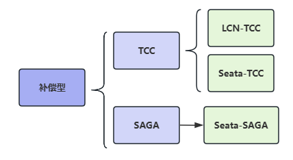

在电商领域等互联网场景下，刚性事务在数据库性能和处理能力上都暴露出了瓶颈。

柔性事务有两个特性：`基本可用`和`柔性状态`。

* 基本可用是指分布式系统出现故障的时候允许损失一部分的可用性。
* 柔性状态是指允许系统存在中间状态，这个中间状态不会影响系统整体的可用性，比如数据库读写分离的主从同步延迟等。柔性事务的一致性指的是最终一致性。

柔性事务主要分为**补偿型**和**通知型**，

补偿型事务又分：`TCC`、`Saga`；

通知型事务分：`MQ事务消息`、`最大努力通知型`。

**补偿型事务都是同步的，通知型事务都是异步的。**

## 通知型事务

通知型事务的主流实现是通过`MQ`（消息队列）来通知其他事务参与者自己事务的执行状态，引入`MQ`组件，有效的将事务参与者进行解耦，各参与者都可以异步执行，所以通知型事务又被称为**异步事务**。

通知型事务主要适用于那些需要异步更新数据，并且对数据的实时性要求较低的场景，主要包含:

**异步确保型事务**和**最大努力通知事务**两种。

* **异步确保型事务**：主要适用于内部系统的数据最终一致性保障，因为内部相对比较可控，如订单和购物车、收货与清算、支付与结算等等场景；

* **最大努力通知**：主要用于外部系统，因为外部的网络环境更加复杂和不可信，所以只能尽最大努力去通知实现数据最终一致性，比如充值平台与运营商、支付对接等等跨网络系统级别对接；

## 通知型事务的问题

**通知型事务，是无法解决本地事务执行和消息发送的一致性问题的。**

因为消息发送是一个网络通信的过程，发送消息的过程就有可能出现发送失败、或者超时的情况。超时有可能发送成功了，有可能发送失败了，消息的发送方是无法确定的，所以此时消息发送方无论是提交事务还是回滚事务，都有可能不一致性出现。

### 消息发送一致性

消息中间件在分布式系统中的核心作用就是异步通讯、应用解耦和并发缓冲（也叫作流量削峰）。在分布式环境下，需要通过网络进行通讯，就引入了数据传输的不确定性，也就是CAP理论中的分区容错性。

消息发送一致性是指**产生消息的业务动作与消息发送动作一致**，也就是说如果业务操作成功，那么由这个业务操作所产生的消息一定要发送出去，否则就丢失。

常规的MQ队列处理流程无法实现消息的一致性。所以，需要借助半消息、本地消息表，保障一致性。

### 消息重复发送问题和业务接口幂等性设计

对于未确认的消息，采用按规则重新投递的方式进行处理。

对于以上流程，消息重复发送会导致业务处理接口出现重复调用的问题。消息消费过程中消息重复发送的主要原因就是消费者成功接收处理完消息后，消息中间件没有及时更新投递状态导致的。如果允许消息重复发送，那么消费方应该实现业务接口的幂等性设计。

## 补偿型事务

但是基于消息实现的事务并不能解决所有的业务场景，例如以下场景：某笔订单完成时，同时扣掉用户的现金。

这里事务发起方是管理订单库的服务，但对整个事务是否提交并不能只由订单服务决定，因为还要确保用户有足够的钱，才能完成这笔交易，而这个信息在管理现金的服务里。这里我们可以引入基于补偿实现的事务，
其流程如下：

* 创建订单数据，但暂不提交本地事务
* 订单服务发送远程调用到现金服务，以扣除对应的金额
* 上述步骤成功后提交订单库的事务

以上这个是正常成功的流程，异常流程需要回滚的话，将额外发送远程调用到现金服务以加上之前扣掉的金额。

以上流程比基于消息队列实现的事务的流程要复杂，同时开发的工作量也更多：

* 编写订单服务里创建订单的逻辑
* 编写现金服务里扣钱的逻辑
* 编写现金服务里补偿返还的逻辑

可以看到，该事务流程相对于基于消息实现的分布式事务更为复杂，需要额外开发相关的业务回滚方法，也失去了服务间流量削峰填谷的功能。但其仅仅只比基于消息的事务复杂多一点，若不能使用基于消息队列的最终一致性事务，那么可以优先考虑使用基于补偿的事务形态。

### 什么是补偿模式？

> 补偿模式使用一个额外的协调服务来协调各个需要保证一致性的业务服务，协调服务按顺序调用各个业务微服务，如果某个业务服务调用异常（包括业务异常和技术异常）就取消之前所有已经调用成功的业务服务。

补偿模式大致有`TCC`，和`SAGA`两种细分的方案:

