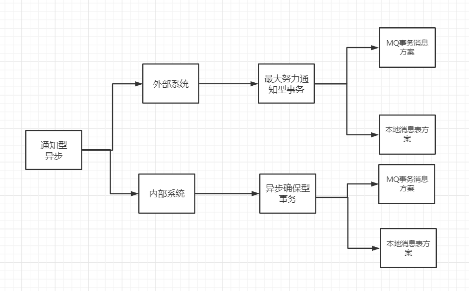

在电商领域等互联网场景下，刚性事务在数据库性能和处理能力上都暴露出了瓶颈。

柔性事务有两个特性：`基本可用`和`柔性状态`。

* 基本可用是指分布式系统出现故障的时候允许损失一部分的可用性。
* 柔性状态是指允许系统存在中间状态，这个中间状态不会影响系统整体的可用性，比如数据库读写分离的主从同步延迟等。柔性事务的一致性指的是最终一致性。

柔性事务主要分为**补偿型**和**通知型**，

补偿型事务又分：`TCC`、`Saga`；

通知型事务分：`MQ事务消息`、`最大努力通知型`。

**补偿型事务都是同步的，通知型事务都是异步的。**

## 通知型事务

通知型事务的主流实现是通过`MQ`（消息队列）来通知其他事务参与者自己事务的执行状态，引入`MQ`组件，有效的将事务参与者进行解耦，各参与者都可以异步执行，所以通知型事务又被称为**异步事务**。

通知型事务主要适用于那些需要异步更新数据，并且对数据的实时性要求较低的场景，主要包含:

**异步确保型事务**和**最大努力通知事务**两种。

* **异步确保型事务**：主要适用于内部系统的数据最终一致性保障，因为内部相对比较可控，如订单和购物车、收货与清算、支付与结算等等场景；

* **最大努力通知**：主要用于外部系统，因为外部的网络环境更加复杂和不可信，所以只能尽最大努力去通知实现数据最终一致性，比如充值平台与运营商、支付对接等等跨网络系统级别对接；

