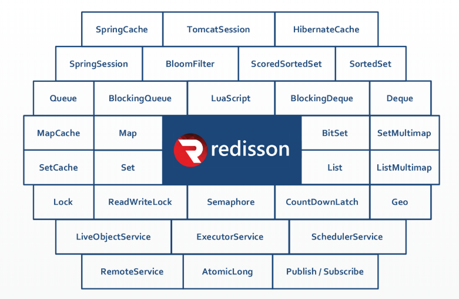
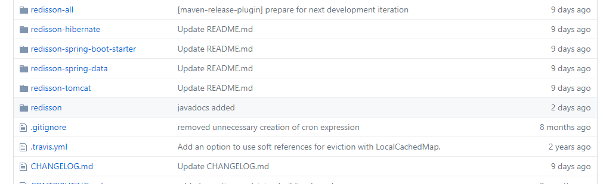

:::tip 说明
[Redisson中文使用文档](https://www.bookstack.cn/read/redisson-wiki-zh/Redisson%E9%A1%B9%E7%9B%AE%E4%BB%8B%E7%BB%8D.md)
:::

Redisson是一个在Redis的基础上实现的Java驻内存数据网格（`In-Memory Data Grid`）。它不仅提供了一系列的分布式的Java常用对象，
还实现了可重入锁（`Reentrant Lock`）、公平锁（`Fair Lock`）、联锁（`MultiLock`）、 红锁（`RedLock`）、 读写锁（`ReadWriteLock`）等，还提供了许多分布式服务。

Redisson提供了使用Redis的最简单和最便捷的方法。Redisson的宗旨是促进使用者对Redis的关注分离（`Separation of Concern`），从而让使用者能够将精力更集中地放在处理业务逻辑上。

## Redisson与Jedis的对比

### 1、概况对比

Jedis是Redis的java实现的客户端，其API提供了比较全面的的Redis命令的支持，Redisson实现了分布式和可扩展的的java数据结构，和Jedis相比，功能较为简单，不支持字符串操作，不支持排序，
事物，管道，分区等Redis特性。Redisson的宗旨是促进使用者对Redis的关注分离，从而让使用者能够将精力更集中的放在处理业务逻辑上。

### 2、可伸缩性

Jedis使用阻塞的I/O，且其方法调用都是同步的，程序流程要等到`sockets`处理完I/O才能执行，不支持异步，Jedis客户端实例不是线程安全的，所以需要通过连接池来使用Jedis。

Redisson使用非阻塞的I/O和基于`Netty`框架的事件驱动的通信层，其方法调用时异步的。Redisson的API是线程安全的，所以操作单个Redisson连接来完成各种操作。

### 3、第三方框架整合

Redisson在Redis的基础上实现了java缓存标准规范；Redisson还提供了`Spring Session`回话管理器的实现。

## Redisson的源码地址

官网： https://redisson.org/

github： https://github.com/redisson/redisson#quick-start

## 特性 & 功能

* 支持 Redis **单节点（`single`）模式**、**哨兵（`sentinel`）模式**、**主从（`Master/Slave`）模式**以及**集群（`Redis Cluster`）模式**

* 程序接口调用方式采用**异步执行**和**异步流执行**两种方式

* 数据序列化，Redisson 的对象编码类是用于将对象进行**序列化**和**反序列化**，以实现对该对象在 Redis 里的读取和存储

* 单个集合数据分片，在集群模式下，Redisson 为单个 Redis 集合类型提供了**自动分片**的功能

* 提供多种分布式对象，如：`Object Bucket`，`Bitset`，`AtomicLong`，`Bloom Filter` 和 `HyperLogLog` 等

* 提供丰富的分布式集合，如：`Map`，`Multimap`，`Set`，`SortedSet`，`List`，`Deque`，`Queue` 等

* 分布式锁和同步器的实现，**可重入锁（`Reentrant Lock`）**，**公平锁（`Fair Lock`）**，**联锁（`MultiLock`）**，**红锁（`Red Lock`）**，**信号量（`semaphore`）**，
**可过期性信号锁（`PermitExpirableSemaphore`）** 等

* 提供先进的分布式服务，如**分布式远程服务（`Remote Service`）**，**分布式实时对象（`Live Object`）服务**，**分布式执行服务（`Executor Service`）**，
**分布式调度任务服务（`Schedule Service`）** 和**分布式映射归纳服务（`MapReduce`）**