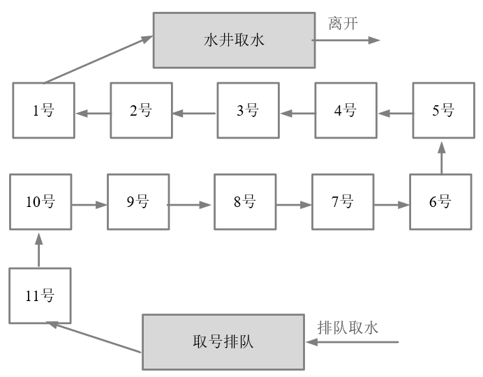
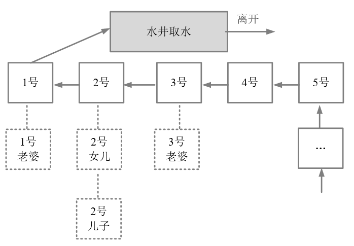

最经典的分布式锁是可重入的公平锁。什么是可重入的公平锁呢？直接讲解的概念和原理，会比较抽象难懂，还是从具体的实例入手吧！这里用一个简单的故事来类比，估计就简单多了。

故事发生在一个没有自来水的古代，在一个村子有一口井，水质非常的好，村民们都抢着取井里的水。井就那么一口，村里的人很多，村民为争抢取水打架斗殴，甚至头破血流。

问题总是要解决，于是村长绞尽脑汁，最终想出了一个凭号取水的方案。井边安排一个看井人，维护取水的秩序。取水秩序很简单：

1. 取水之前，先取号；

2. 号排在前面的，就可以先取水；

3. 先到的排在前面，那些后到的，一个一个挨着，在井边排成一队。

取水示意图，如图所示。

这种排队取水模型，就是一种锁的模型。排在最前面的号，拥有取水权，就是一种典型的独占锁。另外，先到先得，号排在前面的人先取到水，取水之后就轮到下一个号取水，挺公平的，说明它是一种公平锁。

**什么是可重入锁呢？**

假定，取水时以家庭为单位，家庭的某人拿到号，其他的家庭成员过来打水，这时候不用再取号，如图所示。

图中，排在1号的家庭，老公取号，假设其老婆来了，直接排第一个，正所谓妻凭夫贵。再看上图的2号，父亲正在打水，假设其儿子和女儿也到井边了，直接排第二个，
所谓子凭父贵。总之，如果取水时以家庭为单位，则同一个家庭，可以直接复用排号，不用从后面排起重新取号。

以上这个故事模型中，取号一次，可以用来多次取水，其原理为可重入锁的模型。在重入锁模型中，一把独占锁，可以被多次锁定，这就叫做可重入锁。